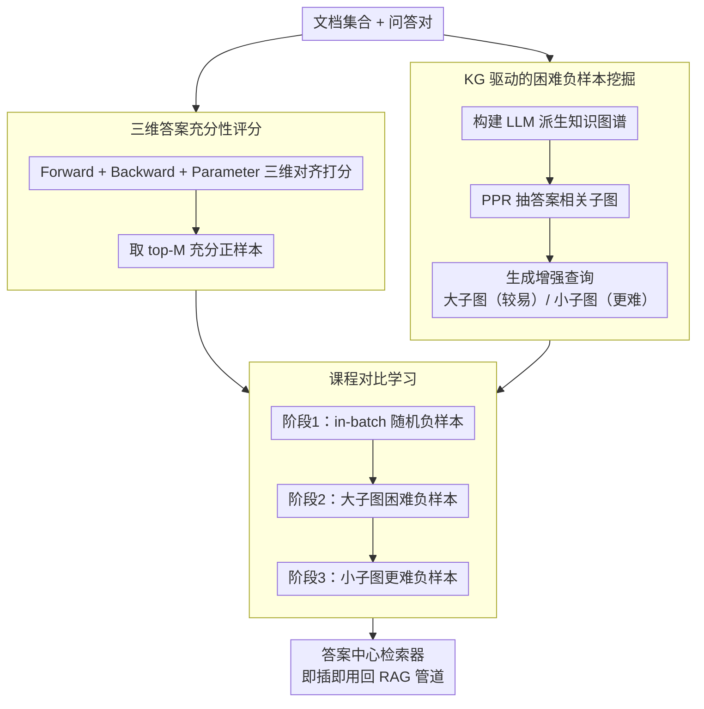

# ARK: Answer-Centric Retriever Tuning via KG-augmented Curriculum Learning

**会议**: ACL 2026  
**arXiv**: [2511.16326](https://arxiv.org/abs/2511.16326)  
**代码**: [GitHub](https://github.com/valleysprings/ARK/)  
**领域**: 图学习  
**关键词**: 答案中心检索, 知识图谱增强, 课程学习, 对比学习, 长上下文RAG

## 一句话总结

提出ARK框架，通过三维答案充分性评分（Forward+Backward+Retriever对齐）筛选正样本，利用LLM构建的知识图谱生成渐进难度的困难负样本进行课程对比学习，在10个数据集上平均提升14.5% F1。

## 研究背景与动机

**领域现状**：RAG通过连接LLM与外部知识源增强生成质量，但长上下文场景下检索器常无法区分稀疏但关键的证据。标准检索器优化查询-文档相似度，未对齐下游答案生成的目标。

**现有痛点**：(1) 检索到的文档可能话题相关但不足以生成正确答案——"相关但不充分"；(2) KG-integrated RAG（如GraphRAG）虽有效但索引成本极高（需大量LLM调用），且社区聚类噪声多；(3) 缺乏针对"答案充分性"优化的检索器训练方法。

**核心矛盾**：检索器的训练目标（查询-文档相似度）与RAG的最终目标（生成正确答案）之间存在gap。

**本文目标**：训练一个真正"答案中心"的检索器——优化的目标是检索到的内容是否足以生成正确答案。

**切入角度**：重新定义KG在RAG中的角色——不作为直接检索源，而是作为课程学习中困难负样本的生成器。

**核心 idea**：用KG子图生成的增强查询来挖掘渐进难度的困难负样本，通过课程对比学习教会检索器区分"充分"和"看似相关但不充分"的证据。

## 方法详解

### 整体框架
ARK 想训出一个真正"答案中心"的检索器——评判检索内容好坏的标准不是它和查询有多像，而是它够不够生成正确答案。为此整个流程分两阶段串起来：先做查询构建，从文档里建知识图谱、抽答案相关子图、生成增强查询，专门用来挖渐进难度的困难负样本；再做对比微调，用三维答案充分性评分挑出真正"足以产出答案"的正样本，配上前一阶段挖到的困难负样本，按课程从易到难训练检索器。训完的检索器不改架构，可直接插回现有 RAG 管道。

### 关键设计

**1. 三维答案充分性评分：把"相关"和"充分"分开判。** 

只用查询-文档相似度选正样本，会把一堆"话题对得上但根本不足以答题"的 chunk 当成正例，污染训练信号。ARK 改用三个互补维度共同打分：Forward 对齐 $S_f$ 看"这个 chunk 在不在场时答案的条件概率差多少"，即它对生成正确答案的实际贡献；Backward 对齐 $S_b$ 反过来问"给定答案加 chunk 能不能反推出原问题"，校验证据与问题的双向一致；Parameter 对齐 $S_v$ 保留原始检索器的余弦相似度作为锚，防止微调跑偏遗忘。三者加权组合后取 top-M 作为正样本，确保入选的都是"既相关又充分"的证据。

**2. KG 驱动的困难负样本挖掘：让子图大小当难度旋钮。** 

最难训的不是随机负样本，而是那些"语义上很近、但答案上是错的"chunk，而知识图谱的社区结构恰好天然暴露了这类"近但不对"的概念。ARK 先从文档构建 LLM 派生的知识图谱，用 Personalized PageRank（PPR）抽出答案相关子图，再据子图生成增强查询。关键在于子图越聚焦、生成的查询越贴近正确答案的"语义邻域"，挖出的负样本就越难骗：大子图 $Q_L^{aug}$ 产较易的负样本，小子图 $Q_S^{aug}$ 产更难的负样本——子图尺寸就成了一个可调的难度旋钮。

**3. 课程对比学习：从随机负样本一路爬到最难。** 

直接拿最难的负样本开训，梯度会剧烈震荡、收敛不稳。ARK 把负样本按难度分成三阶段渐进喂入：第一阶段用 in-batch 随机负样本建立基本辨别力，第二阶段换成大子图 $Q_L^{aug}$ 挖到的困难负样本 $\mathcal{T}_{hard_L}^-$，第三阶段再上小子图 $Q_S^{aug}$ 挖到的更难负样本 $\mathcal{T}_{hard_S}^-$。难度逐级抬升，检索器在每一档站稳后再迎接下一档挑战，最终学会区分"充分"与"看似相关却不充分"的细微差别。

### 损失函数 / 训练策略
训练目标是标准的 InfoNCE 对比损失，区别全在样本构造上：正样本由三维充分性评分挑选，负样本随课程阶段递增难度。整套微调不触碰检索器架构，训完即可无缝集成进现有 RAG 管道。

## 实验关键数据

### 主实验

| 指标 | 值 | 说明 |
|------|------|------|
| 平均F1提升 | +14.5% | 10个数据集平均 |
| SOTA | 8/10数据集 | Ultradomain + LongBench |

### 消融实验

| 配置 | 关键指标 | 说明 |
|------|---------|------|
| 移除Forward对齐 | F1下降 | 答案生成概率是核心信号 |
| 移除KG增强 | 负样本质量降低 | KG提供了结构化的困难负样本 |
| 无课程（直接硬负样本）| 不稳定 | 课程学习对训练稳定性重要 |
| 大vs小子图 | 小子图负样本更难 | 验证了课程难度递增的设计 |

### 关键发现
- 答案充分性评分比纯相似度评分更有效地识别高质量正样本
- KG作为困难负样本生成器比作为直接检索源更高效——大幅减少LLM调用
- 课程学习的渐进难度对最终性能至关重要
- 方法在长上下文场景中特别有效

## 亮点与洞察
- 重新定义KG在RAG中的角色——从"检索索引"到"训练信号生成器"——大幅降低KG的使用成本
- 三维答案充分性评分将"检索什么"与"生成什么"直接对齐
- 方法不改变检索器架构，可即插即用到现有RAG管道

## 局限与展望
- KG构建仍需一定的LLM调用成本
- Forward/Backward评分需要生成器LLM的推理，增加了数据准备开销
- 仅测试了encoder-based检索器
- 未来可扩展到多模态RAG和更多任务类型

## 相关工作与启发
- **vs GraphRAG**: KG不用于检索而用于训练信号，成本大幅降低
- **vs DPR**: 从查询对齐转向答案对齐，更贴合RAG最终目标
- **vs MemoRAG**: MemoRAG压缩记忆，ARK优化检索器本身，可组合

## 评分
- 新颖性: ⭐⭐⭐⭐ 答案充分性评分和KG作为负样本生成器的双重创新
- 实验充分度: ⭐⭐⭐⭐⭐ 10个数据集、8/10 SOTA、全面消融
- 写作质量: ⭐⭐⭐⭐ 方法描述清晰，图示直观
- 价值: ⭐⭐⭐⭐⭐ 对长上下文RAG的检索器优化有直接实用价值

<!-- RELATED:START -->

## 相关论文

- [\[AAAI 2026\] Feature-Centric Unsupervised Node Representation Learning Without Homophily Assumption](../../AAAI2026/graph_learning/feature-centric_unsupervised_node_representation_learning_without_homophily_assu.md)
- [\[ICML 2026\] GILT: An LLM-Free, Tuning-Free Graph Foundational Model for In-Context Learning](../../ICML2026/graph_learning/gilt_an_llm-free_tuning-free_graph_foundational_model_for_in-context_learning.md)
- [\[ICML 2026\] Message Tuning Outshines Graph Prompt Tuning: A Prismatic Space Perspective](../../ICML2026/graph_learning/message_tuning_outshines_graph_prompt_tuning_a_prismatic_space_perspective.md)
- [\[ACL 2026\] AgentGL: Towards Agentic Graph Learning with LLMs via Reinforcement Learning](agentgl_towards_agentic_graph_learning_with_llms_via_reinforcement_learning.md)
- [\[ACL 2026\] MegaRAG: Multimodal Knowledge Graph-Based Retrieval Augmented Generation](megarag_multimodal_knowledge_graph-based_retrieval_augmented_generation.md)

<!-- RELATED:END -->
