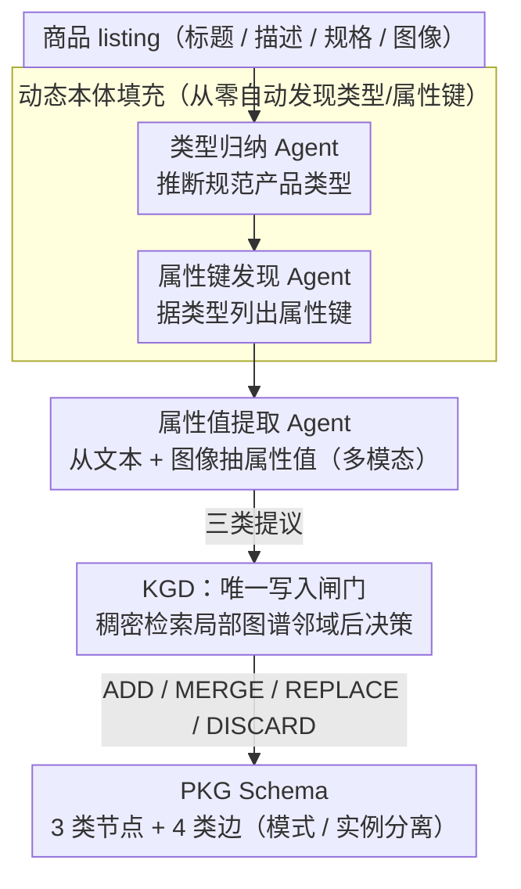

# AutoPKG: An Automated Framework for Dynamic E-commerce Product-Attribute Knowledge Graph Construction

**会议**: ACL 2026  
**arXiv**: [2604.16950](https://arxiv.org/abs/2604.16950)  
**代码**: [GitHub](https://github.com/Product-Understanding-Lazada-Alibaba/AutoPKG)  
**领域**: 知识图谱  
**关键词**: 知识图谱构建, 电商属性提取, 多智能体LLM, 动态本体, 多模态

## 一句话总结
提出 AutoPKG，一个多智能体 LLM 框架，从多模态电商商品内容自动构建 Product-Attribute 知识图谱（PKG），通过类型归纳 Agent、属性键发现 Agent、属性值提取 Agent 和集中式 KGD 决策 Agent 实现动态本体的持续演化和规范化，在 Lazada 数据集上取得 0.953 WKE（类型）和 0.724 WKE（属性键），线上 A/B 测试推荐 GMV 提升 7.89%。

## 研究背景与动机

**领域现状**：产品属性是电商基础设施的核心，支撑着分面导航、搜索排序和推荐系统。工业界的属性提取管道通常依赖人工维护的产品分类法（taxonomy），然后在固定属性列表上做提取。

**现有痛点**：(1) 人工维护的分类法在不同市场间不一致、对长尾商品不完整、在持续的分布漂移下维护成本高；(2) 即使有强力的属性值提取（PAVE）模型，它们也只能在过时或过窄的属性列表上运行，导致覆盖率受限；(3) 现有框架要么不支持自动类型归纳，要么不支持自动属性键发现，要么不支持多模态提取——没有一个框架同时解决这三个问题。

**核心矛盾**：电商产品空间是动态的、长尾的、多模态的，但现有知识图谱构建方法假设固定的、人工管理的模式（schema），无法自适应地演化。

**本文目标**：构建一个无需预定义分类法、能从零开始自动构建和持续演化 PKG 的框架，同时支持文本和图像的多模态属性提取。

**切入角度**：将 PKG 构建分解为四个专职 Agent 的协作，核心创新在于 KGD（Knowledge Graph Decision agent）——所有写操作必须通过这个集中式 Agent，它通过受限的编辑动作（ADD/MERGE/REPLACE/DISCARD）确保图谱的全局一致性。

**核心 idea**：用多智能体 LLM 实现"提议→规范化→写入"的 PKG 增量构建范式，通过集中式 KGD 将所有更新统一为受限编辑决策，实现持续的去重和规范化。

## 方法详解

### 整体框架
AutoPKG 要解决的是"没有现成分类法、商品又长尾又多模态"时如何从零搭起并持续演化产品-属性知识图谱（PKG）。它把构建拆给四个专职 LLM Agent 流水线协作：每来一个商品 listing，类型归纳 Agent 先从文本推断它属于哪个规范产品类型，属性键发现 Agent 据此列出该类型该有的属性键，属性值提取 Agent 再从文本和图像里抽出具体属性值；这三者都只是"提议"，最后由集中式的 KGD（Knowledge Graph Decision）Agent 把所有提议落成一次受限的图谱编辑（ADD/MERGE/REPLACE/DISCARD），维护一张全局去重、规范一致的图。

### 关键设计

**1. PKG Schema：用三类节点 + 四类边把"模式"和"事实"拆开，支撑增量扩展**

图谱要能持续长大又不乱，关键是别把商品级的临时事实和全局复用的结构混在一起。AutoPKG 设三类节点——Product（商品）、ProductType（规范产品类型）、AttributeKey（属性键），四类边分成两条模式边 has_key、has_value（定义"某类型该有哪些键、键能取哪些值"）和两条实例边 of_type、has_attribute（记录"某商品是什么类型、具体取了什么值"）。属性值统一通过 AttributeKey 类型化，于是同一个值（如"红色"）能在不同商品间被规范复用。模式与实例分离让类型检查成为可能（一个值必须被产品类型经由它的键所许可），也让图谱可以按商品逐条增量扩展而不破坏整体结构。

**2. KGD：唯一的写入闸门，把自由文本生成的混乱收敛成受限编辑决策**

上游三个 Agent 都是 LLM 自由生成，若各自直接写图，同义词和重复节点会迅速爆炸。AutoPKG 因此规定上游只能"提议"，KGD 是唯一被允许写图的 Agent。对每一条提议，KGD 拿到候选内容和检索回来的局部图谱邻域（用 Qwen3-Embedding-0.6B 对规范名称做稠密检索），从四个受限动作里选一个：ADD 建新节点/边、MERGE 把候选并入已有规范节点、REPLACE 把候选的表面形式提升为新的规范标签、DISCARD 拒绝无效提议。把写操作压成 4 选 1 的结构化决策，相当于给整张图装了一个去重 + 规范化的 gatekeeper，每次更新都强制过一遍一致性检查。

**3. 动态本体填充：类型和属性键都从零自动发现，彻底甩掉预定义分类法**

传统管道依赖人工维护的 taxonomy，长尾品类既不全又难维护。AutoPKG 让类型归纳 Agent 直接从 listing 文本提出规范产品类型及简要描述，属性键发现 Agent 再根据推断出的类型提出一张属性键表（含定义和示例值）。这些提议同样不直接落地，而是交给 KGD 决定是创建新类型/键还是合并到已有的——于是本体随着商品流持续自我填充和规范，新出现的长尾品类也能被自动覆盖。

**4. WKE：一个防"激进合并刷分"的加权综合指标**

只看单一指标容易被钻空子——比如一味 MERGE 就能把压缩率做得很高却牺牲覆盖。AutoPKG 提出 WKE（Weighted Knowledge Efficiency）来综合评估：对类型归纳取 Acceptance、Compression、Coverage 三者的加权调和平均，对属性键发现取 Acceptance、P-Precision、P-Recall 的加权调和平均。调和平均的特性使任一维度过低都会把总分拉下来，从而逼着策略在"接受率、压缩率、覆盖率"之间同时达标，而不是靠单点高分伪装成高性能。

## 实验关键数据

### 主实验（Product Type Induction, WKE）

| 模型 | Acceptance | Compression | Coverage | WKE |
|------|-----------|-------------|----------|-----|
| Qwen3-4B | 0.952 | 0.948 | 0.960 | **0.953** |
| Qwen3-30B | 0.954 | 0.936 | 0.960 | 0.952 |
| Gemma-3n-E4B | 0.936 | 0.967 | 0.986 | 0.952 |
| SmolLM3-3B | 0.646 | 0.933 | 0.613 | 0.682 |

### KGD 决策准确度

| 模型 | Accuracy |
|------|----------|
| Qwen3-Next-80B-A3B | **0.764** |
| Qwen3-30B-A3B | 0.734 |
| Llama-3.2-3B | 0.384 |
| SmolLM3-3B | 0.123 |

### 线上 A/B 测试（GMV 提升）

| 场景 | GMV 提升 |
|------|---------|
| Badge | +3.81% |
| Search | +5.32% |
| Recommendation | **+7.89%** |
| Filter | +0.26% (不显著) |

### 关键发现
- **KGD 的规范化决策需要强语义辨别力**：小模型（Llama-3.2-3B: 0.384）在 MERGE vs ADD 决策上频繁出错，导致持久下游损失
- **类型归纳中，中等规模模型即可满足需求**（Qwen3-4B 达到最高 WKE 0.953），但 KGD 需要大模型
- **属性键发现的瓶颈在长尾覆盖**：精度高（0.93-0.99）但召回低（0.27-0.47），说明稀有键难以自动发现
- **多模态提取 F1 中等（0.531）**，反映了嘈杂卖家文本和非诊断性图像的现实挑战
- **线上 A/B 测试证明了实际生产价值**，推荐场景 GMV 提升 7.89%

## 亮点与洞察
- **KGD 的"提议→规范化→写入"范式**非常实用——将自由文本生成的混乱性和知识图谱需要的一致性解耦，通过受限动作空间（4个选项）让 LLM 做结构化决策。这个设计模式可以迁移到任何需要持续构建规范化知识库的场景
- **WKE 评估协议**巧妙地平衡了多个维度，防止了单一指标的 gaming（如只合并不添加就能达到高压缩率但覆盖率低）
- **工业落地验证**从离线指标到在线 A/B 测试全链路打通，对学术和工业都有参考价值

## 局限与展望
- 依赖强力 LLM 作为 KGD 骨干，成本高（Qwen3-Next-80B 推理延迟 4:37）
- 属性键的长尾覆盖问题未完全解决（召回最高仅 0.474）
- KGD 的 4 个动作是手工设计的，能否学习更灵活的编辑策略？
- 数据集来自东南亚市场（Lazada），跨市场和跨语言的泛化性待验证
- 缺乏与 AutoKnow、AliCG 等工业系统的直接对比（可能因数据不可用）

## 相关工作与启发
- **vs AutoKnow (Dong et al., 2020)**: AutoKnow 也做电商 KG 构建但假设人工管理的 schema。AutoPKG 实现了 schema 的自动归纳和持续演化
- **vs AutoSchemaKG (Bai et al., 2025)**: AutoSchemaKG 做通用领域的 schema 归纳但非多模态且非电商特化。AutoPKG 专注电商并加入多模态提取
- **vs PAVE 方法**: 传统 PAVE 在固定属性列表上提取值。AutoPKG 将 schema 演化和值提取统一到一个框架中

## 评分
- 新颖性: ⭐⭐⭐⭐ 首个同时支持类型归纳+键发现+多模态提取的开放框架
- 实验充分度: ⭐⭐⭐⭐⭐ 离线+在线+公开基准全面验证，评估协议设计周到
- 写作质量: ⭐⭐⭐⭐ 系统论文结构完整，但信息量大需要仔细阅读
- 价值: ⭐⭐⭐⭐⭐ 工业系统+开源数据+评估协议，对电商 KG 社区贡献突出

<!-- RELATED:START -->

## 相关论文

- [\[ACL 2026\] ComplianceNLP: Knowledge-Graph-Augmented RAG for Multi-Framework Regulatory Gap Detection](compliancenlp_knowledge-graph-augmented_rag_for_multi-framework_regulatory_gap_d.md)
- [\[NeurIPS 2025\] FALCON: An ML Framework for Fully Automated Layout-Constrained Analog Circuit Design](../../NeurIPS2025/graph_learning/falcon_an_ml_framework_for_fully_automated_layout-constrained_analog_circuit_des.md)
- [\[ACL 2025\] mRAKL: Multilingual Retrieval-Augmented Knowledge Graph Construction for Low-Resourced Languages](../../ACL2025/graph_learning/mrakl_multilingual_retrieval-augmented_knowledge_graph_construction_for_low-reso.md)
- [\[ICML 2026\] DTKG: Dual-Track Knowledge Graph-Verified Reasoning Framework for Multi-Hop QA](../../ICML2026/graph_learning/dtkg_dual-track_knowledge_graph-verified_reasoning_framework_for_multi-hop_qa.md)
- [\[AAAI 2026\] PathMind: A Retrieve-Prioritize-Reason Framework for Knowledge Graph Reasoning with Large Language Models](../../AAAI2026/graph_learning/pathmind_a_retrieve-prioritize-reason_framework_for_knowledge_graph_reasoning_wi.md)

<!-- RELATED:END -->
