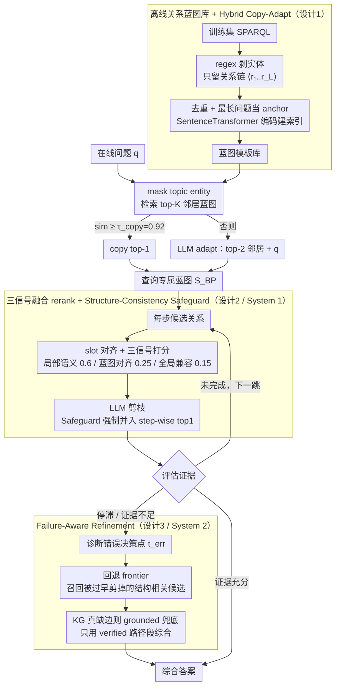

# CoG: Controllable Graph Reasoning via Relational Blueprints and Failure-Aware Refinement over Knowledge Graphs

**会议**: ACL 2026  
**arXiv**: [2601.11047](https://arxiv.org/abs/2601.11047)  
**代码**: https://github.com/zjukg/CoG (有)  
**领域**: 图学习 / KG 推理  
**关键词**: 知识图谱问答, dual-process, 关系蓝图, 失败感知回溯, training-free agent

## 一句话总结
CoG 是一个 training-free 的 KGQA 框架，把 Kahneman 的 Dual-Process Theory 落到 KG 推理上：System 1 离线把训练集 SPARQL 蒸馏成"关系蓝图"模板库，在线作为软结构约束指导 candidate relation 的 rerank 与剪枝；System 2 在搜索停滞时触发证据条件反思和定向回溯，纠正前期错误决策；在 CWQ / WebQSP / GrailQA 三个多跳 KGQA 基准上同时拿到 SOTA 准确率（GPT-4 backbone CWQ 77.8、WebQSP 89.7、GrailQA 86.4）和最低成本（CWQ 比 PoG 少 13% token、少 12% call）。

## 研究背景与动机

**领域现状**：KGQA 主流 LLM-driven agent paradigm（ToG / PoG / KG-Agent）走"plan → retrieve → generate"循环，从 topic entity 出发逐步扩展 evidence chain。但这套方法在复杂多跳设置下表现极不稳定，受 neighborhood noise 严重干扰。

**现有痛点**：作者把这种不稳定归为 cognitive rigidity，具体分两类：(1) Error Cascading from Indiscriminate Exploration —— 早期某次错误关系选择（如错选 contains 而非 adjoins）会把 agent 拽进巨大噪声候选集，错误像滚雪球；(2) Structural Misalignment from Myopic Decisions —— 仅靠局部 semantic match 容易陷入局部最优（如选 actor 而非 director），导致下游约束（runtime 检查、temporal filter）无法满足，trajectory 被迫提前终止。

**核心矛盾**：当前 agent 在"局部语义相关"与"跨 hop 全局结构一致"之间没桥梁 —— 既缺乏经验性的结构先验，又缺乏在 dead-end 时的诊断回溯能力。fine-tune 方法（RoG, KG-Agent）能学到结构先验但成本高，而 zero-shot agent 又过于自由。GCR 这类用 KG-tries 做硬约束的方法在 KG 不完整时一条边缺失就 branch collapse，鲁棒性差。

**本文目标**：(1) 引入"廉价、可解释"的结构先验，约束但不锁死 agent 的搜索方向；(2) 在搜索停滞 / 证据不足时让 agent 知道"我是在哪一步走错的"并能回头；(3) 整套机制 training-free，不依赖参数微调。

**切入角度**：作者把 Kahneman 的 Dual-Process Theory 直接 mapping 到 KG 推理 —— 用 System 1（快、直觉）做 blueprint-guided 候选过滤，用 System 2（慢、分析）做失败诊断与回溯。这种分工天然把"经验"和"反思"区分开。

**核心 idea**：从训练集 SPARQL 离线蒸馏 relation-only 蓝图作为软先验（不存实体只存关系链），在线让 agent 用蓝图 rerank + prune candidate relation，并在失败时启动 evidence-conditioned reflection + targeted backtracking，把"用经验"和"会反思"合在一个 training-free 框架里。

## 方法详解

### 整体框架
CoG 针对的是多跳 KGQA 里 LLM agent 的"认知僵化"：早期一次错误的关系选择会把搜索拽进巨大噪声候选集、错误像滚雪球，而只看局部语义又容易陷在局部最优、走到死胡同。它把 Kahneman 的双过程理论搬到 KG 推理上，整套 training-free：离线先把训练集 SPARQL 蒸馏成只含关系链的"蓝图"模板库；在线时 System 1（快、直觉）用蓝图给每一步候选关系做软约束式的 rerank 与剪枝，System 2（慢、分析）在搜索停滞或证据不足时触发反思，定位走错的那一步并定向回溯，最终在 verified 证据上综合答案，把幻觉风险压到最低。

### 关键设计

**1. 离线 relational blueprint 库 + Hybrid Copy-Adapt：从训练数据里蒸出一个全局可复用的"结构罗盘"**

agent 缺的是廉价、可解释的结构先验。CoG 用确定性规则（regex）把训练集 SPARQL 里所有 Freebase ID 和非结构元素剥掉，只留下关系序列 $\mathcal{S}(q)=\langle r_1,\ldots,r_L\rangle$，按字符串去重，每个唯一模板挑最长 question 当 semantic anchor 用 SentenceTransformer 编码建索引。这一步几乎零成本——WebQSP 3098 条 query 压成 569 个模板（18.4%）、GrailQA 44k 压成 3.7k（8.3%），说明 KG 推理的逻辑结构远比自然语言句式有限。在线查询时先 mask 掉 topic entity 再检索 top-$K$ 邻居蓝图，相似度 ≥ $\tau_{\text{copy}}=0.92$ 就直接 copy top-1，否则把 top-2 邻居 + 原 question 交给 LLM adapt，得到查询专属的 $S_{\text{BP}}=\langle r_1^{\text{BP}},\ldots,r_L^{\text{BP}}\rangle$。$\tau_{\text{copy}}=0.92$ 下只有 8.7% 走 copy、91.3% 走 adapt，既复用经验又不死记训练分布；GrailQA 零样本 split 上 GPT-3.5 仍拿到 83.6%（ToG 72.7、PoG 81.7），佐证蓝图学的是抽象结构而非死记硬背。

**2. 三信号融合 rerank + Structure-Consistency Safeguard：让每步候选同时被局部语义、蓝图对齐和全局兼容性打分，还兜住结构正确的边**

只靠局部语义相关会陷局部最优（PoG 的失败模式），只靠全局结构又会把 KG 稀疏区的正确边过滤掉。CoG 先用单调的 slot-alignment 索引 $\pi(t)=\arg\max_j \text{sim}(h(o_t), h(r_j^{\text{BP}}))$ 找当前子目标对应蓝图的哪个位置（强制非递减，保证逐 hop 推进），再把三类分数融合成 $\text{Score}(r)=\lambda_{\text{loc}}\phi_{\text{loc}}+\lambda_{\text{step}}\phi_{\text{step}}+\lambda_{\text{glob}}\phi_{\text{glob}}$，权重取 $\lambda_{\text{loc}}{=}0.6,\lambda_{\text{step}}{=}0.25,\lambda_{\text{glob}}{=}0.15$（敏感性分析显示这组权重稳健）。LLM 在 shortlist 上 prune 后，最终集合强制并入 step-wise top1——这个 Safeguard 是个 dual-source 选择：把 LLM 当 semantic expert、把 $\phi_{\text{step}}$ 当 structure expert 并联，避免 LLM 漏掉那些结构正确但语义不显眼的关系。

**3. Failure-Aware Refinement（System 2）：用"诊断 + 定向回溯 + grounded 兜底"替代盲目重试**

ToG/PoG 没有显式的失败诊断，卡住了要么死循环、要么提前终止然后 hallucinate（附录 Case 2 里 PoG 在同一节点重试 26 次、烧掉 14k token）。CoG 在检测到 stagnation 或证据不足时切到 correction 模式：让 LLM 在工作记忆 $\mathcal{M}$ 条件下回顾轨迹 $\mathcal{T}=[e_0,r_1,\ldots]$ 和被剪掉的分支摘要，pinpoint 出错误决策点 $t_{\text{err}}$；agent 随即把 frontier 回退到 $t_{\text{err}}$ 之前，召回那些曾被过早 prune、但结构相关的候选，重新扩展。若 KG 真的缺边、无论如何 verify 不出来，就 fallback 到 grounded inference，只拿 verified 的路径段 + 未满足的约束让 LLM 综合答案，把参数化幻觉的风险压到最低。消融显示 System 2 是单一最重要组件：CWQ 上去掉它准确率从 66.9 跌到 58.5（−8.4），跌幅是去掉 System 1 蓝图引导（−5.4）的近 1.6 倍。

### 损失函数 / 训练策略
完全 training-free，无 gradient update：(1) blueprint encoder 用预训练 SentenceTransformer，无 fine-tune；(2) all agents 用 fixed LLM API（GPT-3.5 Turbo / GPT-4 / Qwen2.5-7B），temperature 0.3，max token 1024；(3) exploration depth 上限 4。Hyperparameter 包括 $\tau_{\text{copy}}=0.92$、reranking 权重 $(0.6, 0.25, 0.15)$、retrieval $K$；附录给出敏感性分析。

## 实验关键数据

### 主实验 (Hits@1 / F1, 三 KGQA benchmark)

| 方法 | CWQ Hits@1 | CWQ F1 | WebQSP Hits@1 | WebQSP F1 | GrailQA Hits@1 | GrailQA Zero-shot |
|---|---|---|---|---|---|---|
| ToG (GPT-4) | 67.6 | 47.6 | 82.6 | 58.9 | 81.4 | 86.5 |
| PoG (GPT-4) | 75.0 | 42.1 | 87.3 | 59.8 | 84.7 | 88.6 |
| **CoG (GPT-4)** | **77.8** | **69.2** | **89.7** | **75.5** | **86.4** | **89.1** |
| ToG (GPT-3.5) | 57.1 | 41.9 | 76.2 | 50.9 | 68.7 | 72.7 |
| PoG (GPT-3.5) | 63.2 | 43.7 | 82.0 | 58.1 | 76.5 | 81.7 |
| **CoG (GPT-3.5)** | **66.9** | **59.9** | **86.8** | **74.3** | **79.2** | **83.6** |
| KG-Agent (fine-tuned) | 72.2 | — | 83.3 | — | 86.1 | 86.3 |

CoG (GPT-4) F1 在 CWQ 上比 PoG 高 +27.1 个百分点（69.2 vs 42.1），暗示 CoG 不仅命中答案，还能更完整地把整套答案集合捞出来，避免 premature termination。

### 消融 (CWQ Hits@1)

| 配置 | CWQ | WebQSP | GrailQA | 说明 |
|---|---|---|---|---|
| **Full CoG** | **66.9** | **86.8** | **79.2** | 完整框架 |
| w/o Failure-Aware Refinement | 58.5 | 79.9 | 75.3 | 去掉 System 2（−8.4 CWQ） |
| w/o Blueprint Guidance (System 2 only) | 61.5 | 82.2 | 76.4 | 去掉 System 1（−5.4 CWQ） |
| w/o Blueprint-guided Reranking | 63.5 | 84.0 | 76.8 | 仍有 blueprint adapt 但不参与排序 |
| w/o Blueprint Adaptation | 62.4 | 83.5 | 77.5 | 直接用 retrieved 蓝图 |
| Local relevance only (rerank) | 64.6 | 84.4 | 76.2 | 只 $\phi_{\text{loc}}$ |

### 效率分析（average per query）

| 数据 | 方法 | LLM Calls | Input tokens | Output tokens | Total tokens | Hits@1 |
|---|---|---|---|---|---|---|
| CWQ | ToG | 22.6 | 8,182.9 | 1,486.4 | 9,669.4 | 57.1 |
| CWQ | PoG | 13.3 | 7,803.0 | 353.2 | 8,156.2 | 63.2 |
| **CWQ** | **CoG** | **11.7** | **6,589.0** | 486.8 | **7,075.8** | **66.9** |
| WebQSP | CoG | 8.3 | 4,693.6 | 206.0 | 4,899.6 | 86.8 |
| GrailQA | CoG | 5.5 | 3,122.0 | 166.1 | 3,288.1 | 79.2 |

CoG 在 CWQ 上比 PoG 少 1.6 个 LLM call、少 1080 token，却高 3.7 个百分点 —— 显然的 Pareto 改进。

### 关键发现
- **System 2 是单一最重要组件**：去掉 Failure-Aware Refinement 在 CWQ 上掉 8.4 个点，远超去掉 blueprint guidance 的 5.4 点 —— 说明在多跳 KGQA 里"会回头"比"有蓝图"更值钱。
- **Zero-shot generalization 强劲**：GrailQA Zero-shot split 上 GPT-3.5 backbone 拿到 83.6%（vs ToG 72.7%、PoG 81.7%），证明 blueprint 是抽象结构先验而非死记硬背。
- **F1 大幅领先暗示答案集合完整性**：CWQ 上 CoG F1 比 PoG 高 27 个点（69.2 vs 42.1），意味着 CoG 不会因为找到第一个答案就停。
- **Wikidata 跨 KG 迁移仍有效**：把 entity 从 Freebase MID 映射到 Wikidata QID 后，CoG 在 WebQSP 上仍领先 PoG 2.7、CWQ 上 2.1 —— blueprint 学的是抽象 reasoning pattern 而非 Freebase schema。
- **结构 vs 语义内部权重敏感**：把 $\lambda_{\text{step}}$ 调成小于 $\lambda_{\text{glob}}$（如 0.2 vs 0.2）反而掉点，说明 step-wise alignment 提供的"逐 hop 验证"比 global compatibility 的"整体路径形状"更重要。

## 亮点与洞察
- **把 Dual-Process Theory 落到 KG agent 上是个很合身的隐喻**：用 System 1 fast intuition 解决 cognitive rigidity 中的"早期错误放大"，用 System 2 slow analysis 解决"局部最优 dead-end"，两套机制天然互补，比单纯加约束或加重试都更系统。
- **离线蓝图蒸馏几乎零成本**：纯 rule-based extraction + encoder forward，不要 LLM call、不要 fine-tune。一次预处理 + 18.4%/8.3% 的压缩率，让"训练数据"以最廉价方式参与 agent。
- **三信号 rerank + Safeguard 是个可复用 pattern**：dual-source 选择（LLM as semantic expert ∪ structural top1）是处理"LLM 漏选结构正确但语义低分"问题的通用解法，可以迁到 RAG / tool selection 等场景。
- **Failure-Aware Refinement 用"诊断 + 定向"替代盲目重试**：附录 Case 2 显示 PoG 在同节点 26 次重试 14k tokens 浪费，CoG 用 1 次诊断就 re-route 成功，效率与可解释性双赢。

## 局限与展望
- 作者承认：(1) KG 完整性硬天花板，refinement 缓解不了完全缺失的边；(2) blueprint 库覆盖度依赖训练集，niche domain query 稀疏时检索不到合适模板；(3) 复杂级联失败时多次 backtrack 增加 latency。
- 自己看到的局限：blueprint 只是线性关系链，对树状 / 图状 query 表达力有限（作者也提到可与 KG-tries 这种树结构混合）；offline 蓝图不能 online evolve，长期部署可能 stale；GrailQA Zero-shot 虽然好但跨完全不同 schema（如从 Freebase 直接迁到生物医学 KG）能否泛化未测；System 2 触发条件是 LLM 判断"insufficient evidence"，本身可能漏触发或乱触发。
- 改进思路：把线性 blueprint 升级成 typed graph template；引入 online learning 让 blueprint library 增量演化；refinement 触发改用学习的 detector；探索"对 niche domain 用 few-shot LLM 生成 blueprint"。

## 相关工作与启发
- **vs ToG (Sun et al. 2024)**：ToG 是 LLM-driven beam search，每步靠 LLM 评估候选 relation；CoG 用结构 blueprint 给 search 加 soft guidance，并增 System 2 自纠错，CWQ Hits@1 +9.8、tokens 少 27%。
- **vs PoG (Chen et al. 2024)**：PoG 用 adaptive plan + self-correction，但 self-correction 是启发式 retry，无结构反思；CoG 的 Failure-Aware Refinement 用 evidence-conditioned reflection 定点修复，case study 中显著优于 PoG 的死循环行为。
- **vs GCR / KG-Tries (Luo et al. 2025)**：GCR 用 KG-tries 做硬分支约束，KG 缺边时整 branch 崩塌；CoG 蓝图是 soft constraint，缺边可触发 refinement，鲁棒得多。
- **vs RoG (Luo et al. 2024) / KG-Agent (Jiang et al. 2025)**：这些 fine-tuned KG-augmented LLM 在 in-domain 上很强，但 CoG (GPT-4, training-free) 在 CWQ 上超过 RoG、在 WebQSP / GrailQA 上和 KG-Agent 持平甚至超过，证明结构 + 反思可以替代昂贵的 fine-tune。

## 评分
- 新颖性: ⭐⭐⭐⭐ Dual-Process Theory 框架在 KGQA agent 上是首次的系统落地；离线 blueprint + 三信号 rerank + 失败回溯的组合很完整。
- 实验充分度: ⭐⭐⭐⭐⭐ 3 数据集 × 3 backbone × 多 baseline，外加 Wikidata 跨 KG 迁移、零样本 split、效率分析、超参敏感性、案例分析，几乎挑不出实验缺口。
- 写作质量: ⭐⭐⭐⭐ "cognitive rigidity → 两类具体 challenge"的动机层次清楚；Dual-Process 隐喻贯穿全文；公式与图配合好，附录非常厚实。
- 价值: ⭐⭐⭐⭐ training-free + 显著 Pareto 改进，对工业 KGQA 系统直接可用；blueprint 思想可迁移到其他 retrieval-then-reason 场景。

<!-- RELATED:START -->

## 相关论文

- [\[ICML 2025\] Graph-constrained Reasoning: Faithful Reasoning on Knowledge Graphs with Large Language Models](../../ICML2025/graph_learning/graph-constrained_reasoning_faithful_reasoning_on_knowledge_graphs_with_large_la.md)
- [\[AAAI 2026\] PCoKG: Personality-aware Commonsense Reasoning with Debate](../../AAAI2026/graph_learning/pcokg_personality-aware_commonsense_reasoning_with_debate.md)
- [\[ICML 2026\] Generative Representation Learning on Hyper-relational Knowledge Graphs via Masked Discrete Diffusion](../../ICML2026/graph_learning/generative_representation_learning_on_hyper-relational_knowledge_graphs_via_mask.md)
- [\[ACL 2026\] Which bird does not have wings: Negative-constrained KGQA with Schema-guided Semantic Matching and Self-directed Refinement](which_bird_does_not_have_wings_negative-constrained_kgqa_with_schema-guided_sema.md)
- [\[ICLR 2026\] Relational Graph Transformer](../../ICLR2026/graph_learning/relational_graph_transformer.md)

<!-- RELATED:END -->
