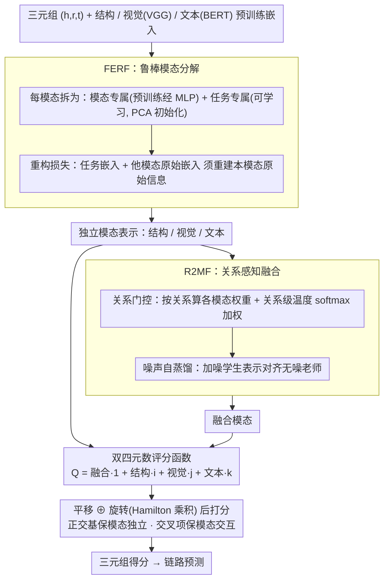

# Collaboration of Fusion and Independence: Hypercomplex-driven Robust Multi-Modal Knowledge Graph Completion

**会议**: ACL 2026  
**arXiv**: [2509.23714](https://arxiv.org/abs/2509.23714)  
**代码**: https://github.com/zjukg/M-Hyper (有)  
**领域**: 多模态融合 / 知识图谱补全 / 表示学习  
**关键词**: 多模态知识图谱, 超复数空间, 双四元数, 模态融合, 链路预测

## 一句话总结
M-Hyper 把多模态知识图谱实体编码为双四元数（biquaternion）的四个正交基，分别承载结构 / 视觉 / 文本三个独立模态以及一个融合模态，通过 Hamilton 乘积同时实现"模态独立保留"和"成对充分交互"，在 DB15K / MKG-W / MKG-Y 三个数据集上以最低显存、最短训练时间打败 18 个 baseline。

## 研究背景与动机
**领域现状**：多模态知识图谱补全（MMKGC）目前两条主流路线：fusion-based（IKRL / OTKGE / AdaMF / MyGO 等）用显式融合模块或跨模态损失把多模态压成一个统一表示；ensemble-based（MoSE / IMF / MoMoK 等）为每个模态训独立子模型，最后联合决策。

**现有痛点**：融合派依赖固定融合策略，融合过程不可避免地丢失模态独有信息，并且无法根据不同关系动态调整模态权重；集成派保留了模态独立性但缺少跨模态深度交互机制，难以建模复杂关系下模态间的细微依赖。

**核心矛盾**：MMKG 中模态贡献是动态、上下文相关、任务相关的——既需要保持模态独立（避免融合损失），又需要充分跨模态交互（捕捉模态协同）。这两个需求在传统欧氏向量空间里几乎不可能同时满足。

**本文目标**：设计一种表示空间，让"独立模态"与"融合模态"共存，并自然支持成对模态交互，同时具备关系建模的平移 + 旋转能力。

**切入角度**：作者注意到四元数代数有 4 个线性独立的正交基 $\{\mathbf{1}, \mathbf{i}, \mathbf{j}, \mathbf{k}\}$，且 Hamilton 乘积天然产生所有成对交叉项——这正好可以承载"3 个独立模态 + 1 个融合模态"。进一步用 biquaternion（复数系数四元数）扩展，可同时建模平移与旋转两类关系变换。

**核心 idea**：把结构 / 视觉 / 文本 / 融合四种模态映射到 biquaternion 的四个正交基上，用 Hamilton 乘积做评分函数，独立性由基的正交性保证，交互由乘积的交叉项提供。

## 方法详解

### 整体框架
M-Hyper 想要一个让"独立模态"和"融合模态"同时存在、还能天然支持成对交互的表示空间——既不像 fusion 派融合后丢掉模态独有信息，也不像 ensemble 派保留独立却缺少深度交互。它注意到四元数代数恰好有 4 个线性独立的正交基，于是把结构、视觉、文本三个独立模态加一个融合模态分别放到双四元数（biquaternion）的四个基上：输入三元组 $(h,r,t)$ 与实体的结构嵌入 $\mathbf{e}^s$、视觉嵌入 $\mathbf{e}^v$（VGG）、文本嵌入 $\mathbf{e}^t$（BERT）后，先由 FERF 把每个独立模态分解成更鲁棒的表示，再由 R2MF 做关系感知融合得到融合模态 $\hat{\mathbf{e}}^j$，拼成 $Q = \hat{\mathbf{e}}^j + \hat{\mathbf{e}}^s \mathbf{i} + \hat{\mathbf{e}}^v \mathbf{j} + \hat{\mathbf{e}}^t \mathbf{k}$ 后用同时含平移与旋转的双四元数评分函数打分；正交性保证模态独立、Hamilton 乘积的交叉项保证模态交互。

### 关键设计

**1. FERF：把每个模态拆成"模态专属 + 任务专属"，在去噪的同时不丢预训练语义**

纯用预训练 encoder 输出会被模态噪声和跨模态语义歧义污染，纯用可学习嵌入又会丢掉预训练里的语义。FERF 对每个模态 $m$ 把表示拆成两路：模态专属 $\mathbf{e}^m_m$（预训练编码器输出经 MLP，承载本模态原始信息）和任务专属 $\mathbf{e}^m_t$（可学习嵌入，对视觉/文本先做 PCA 提粗粒度信息来初始化），最终取 $\hat{\mathbf{e}}^m = \mathbf{e}^m_m + \mathbf{e}^m_t$。关键是用一个重构损失 $\mathcal{L}_{recon} = \sum_m \|\mathcal{E}^m(\mathbf{e}^m_t; \{\mathbf{e}^{\hat{m}}_m: \hat{m} \neq m\}) - \mathbf{e}^m_m\|^2$ 约束："任务嵌入 + 其他模态的原始嵌入"必须能重建出本模态的原始信息——这就逼着任务嵌入既保留本模态特性、又能和别的模态协作，相加之后得到去噪且语义完整的独立模态表示。

**2. R2MF：关系感知门控融合 + 噪声自蒸馏，让融合既随关系变又抗噪**

固定融合策略没法适应"不同关系依赖不同模态"的现实（born_in 更靠文本、has_color 更靠视觉）。R2MF 先做关系感知门控：用一层 MLP 基于 $[\hat{\mathbf{e}}^m; \mathbf{r}^T; \mathbf{r}^R]$ 算每个模态的权重 $w^m$，再用关系级可学习温度 $\tau_r$ 做 softmax 得到 $\hat{w}^m(e,r) = \exp(w^m/\tau_r) / \sum_i \exp(w^i/\tau_r)$，加权求和并补上融合专属任务嵌入 $\mathbf{e}^j_t$。再叠一层噪声自蒸馏：对原始嵌入加高斯噪声 $\tilde{\mathbf{e}}^m \sim \mathcal{N}(\bm{\varphi}^m, \bm{\mu}^m)$ 得到学生融合表示 $\hat{\mathbf{e}}^{j'}$，把无噪声的 $\hat{\mathbf{e}}^j$ 当老师，用 $\mathcal{L}_{distill} = \frac{1}{n}\sum \|\hat{\mathbf{e}}^j_i - \hat{\mathbf{e}}^{j'}_i\|^2$ 强制一致。这套思路与 AdaMF/MoMoK 的噪声增强相近，但叠加了任务嵌入和蒸馏监督，对模态缺失/扰动更稳。

**3. 双四元数评分函数：在一个代数结构里同时装下"独立 + 交互 + 平移 + 旋转"**

ensemble 只做模态内打分、fusion 融合后丢独立性，两者都顾不全。M-Hyper 把 $\hat{\mathbf{e}}^j, \hat{\mathbf{e}}^s, \hat{\mathbf{e}}^v, \hat{\mathbf{e}}^t$ 分别放到 biquaternion 的 $\mathbf{1}, \mathbf{i}, \mathbf{j}, \mathbf{k}$ 基上（系数仍是复数），关系学平移和旋转两组嵌入 $Q_r^T, Q_r^R$。打分时先 $Q_{h'} = Q_h \oplus Q_r^T$ 做平移，再 $Q_{h''} = Q_{h'} \otimes Q_r^R$ 用 Hamilton 乘积做旋转，最后与 $Q_t$ 取内积，即 $\phi(h,r,t) = \langle (Q_h \oplus Q_r^T) \otimes Q_r^R, Q_t \rangle$。Hamilton 乘积展开后天然冒出所有 $\hat{\mathbf{e}}^m_h \cdot \hat{\mathbf{e}}^{m'}_t$ 的成对交叉项（Theorem 2 给了完整代数证明），保证模态充分交互，而正交基的线性独立又保证模态信息互不覆盖。作者还从信息瓶颈视角证明（Theorem 1）这种表示严格优于纯融合 $T_f$ 与纯集成 $T_{ens}$：$\mathcal{L}_{IB}(Q) < \min(\mathcal{L}_{IB}(T_f), \mathcal{L}_{IB}(T_{ens}))$。

### 损失函数 / 训练策略
总损失 $\mathcal{L}_{total} = \mathcal{L}_{recon} + \mathcal{L}_{distill} + \mathcal{L}_{triple} + \mathcal{L}_{reg}$，其中 $\mathcal{L}_{triple}$ 为标准交叉熵（含 1-vs-all 候选实体），$\mathcal{L}_{reg}$ 是 N3 正则化。优化器 Adagrad，batch=1000，关键超参 $d=128$、$\lambda=0.005$、噪声率 $\beta=0.2$、学习率 $\alpha=0.1$。训练时为每个三元组 $(h,r,t)$ 加反向 $(t, r^{-1}, h)$。

## 实验关键数据

### 主实验
在 DB15K、MKG-W、MKG-Y 三个 MMKG 基准上对比 18 个 baseline（含 6 个单模态 KGE 和 12 个 MMKGC 方法）：

| 数据集 | 指标 | M-Hyper | 之前 SOTA（MoMoK） | 提升 |
|--------|------|---------|-------------------|------|
| DB15K | MRR | **41.25** | 39.57 | +1.68 |
| DB15K | Hit@10 | **56.09** | 54.14 | +1.95 |
| MKG-W | MRR | **37.02** | 36.10 (MyGO) | +0.92 |
| MKG-W | Hit@10 | **48.84** | 47.75 (MyGO) | +1.09 |
| MKG-Y | MRR | **39.46** | 38.44 (MyGO) | +1.02 |
| MKG-Y | Hit@10 | 45.22 | 45.48 (AdaMF) | -0.26 |

平均 MRR 提升约 4.25%，Hit@10 提升约 3.89%。同时效率分析显示 M-Hyper 是 6 个对比方法中**单 epoch 训练时间最短、显存占用接近最优**——仅需 1160 秒就能达到 40.75% MRR。

### 消融实验

| 配置 | DB15K MRR | MKG-W MRR | MKG-Y MRR | 说明 |
|------|-----------|-----------|-----------|------|
| M-Hyper（完整） | **41.25** | **37.02** | **39.46** | — |
| w/o 融合模态 $\hat{\mathbf{e}}^j$ | 36.36 | 35.09 | 36.71 | 掉点最严重，证明融合模态是核心 |
| w/o 视觉 $\hat{\mathbf{e}}^v$ | 35.09 | 36.46 | 37.95 | DB15K 视觉信息很关键 |
| w/o 结构 $\hat{\mathbf{e}}^s$ | 39.77 | 34.62 | 38.03 | MKG-W 结构信息很关键 |
| w/o FERF | 39.24 | 35.93 | 37.93 | 鲁棒模态分解贡献明显 |
| w/o 噪声蒸馏 | 39.64 | 36.10 | 38.16 | 蒸馏帮助 ~1.6 MRR |
| w/o 关系门控 | 40.18 | 36.18 | 38.21 | 动态融合贡献中等 |
| w/o 旋转 $\mathbf{r}^R$ | 38.91 | 36.46 | 37.78 | biquaternion 退化为 quaternion 后掉点，证明复数旋转的表达力 |
| M-Hyper-fusion 变体 | 39.23 | 35.54 | 37.52 | 强行做纯融合损失明显 |
| M-Hyper-ensemble 变体 | 39.31 | 34.75 | 37.58 | 强行做纯集成损失明显 |

### 关键发现
- 去掉**融合模态 $\hat{\mathbf{e}}^j$** 掉点最猛（DB15K -4.89 MRR），证明 biquaternion 的实部承载了关键的跨模态协同信号，融合并不冗余而是必需。
- 去掉**旋转 $\mathbf{r}^R$**（即从 biquaternion 退到 quaternion）在所有数据集都掉点，说明复数域的旋转操作不是"为了好看"，而是真的增加了表达力。
- 在模态缺失 / 模态噪声 / 链路稀疏三个鲁棒性场景下，M-Hyper 都优于 AdaMF 和 MoMoK，特别是模态缺失场景下任务嵌入 + 自蒸馏的组合明显比单纯噪声增强更稳。
- t-SNE 可视化显示融合模态对城市-国家关系的区分度最高，FERF + R2MF 后独立模态的可分性也大幅提升。

## 亮点与洞察
- **代数结构 = 表示约束**：用 biquaternion 的 4 个正交基直接编码"3 独立 + 1 融合"是非常优雅的设计，正交性自动保证模态独立、Hamilton 乘积自动产生成对交互，不需要额外的正则项去鼓励"既独立又交互"。这种"让数学结构而非损失函数承担表达约束"的思路可以迁移到任何需要"多视图共存"的任务（如多语言对齐、多视角学习）。
- **FERF 的"模态专属 + 任务专属"分解**：本质是用重构损失把"必须由本模态贡献的信息"和"可以跨模态协作得到的信息"显式分开，比 IMF / MoMoK 的纯解耦更精细。这种分解思路可借鉴到 multi-view representation learning。
- **平移 + 旋转 + 模态交互三合一评分函数**：把 DualE 的双向变换与 BiQUE 的双四元数代数结合，并叠加多模态语义，是 KGE 评分函数演化的一个集大成。
- 信息瓶颈视角的理论证明（Theorem 1）让"为什么 biquaternion 比融合 / 集成更好"有了形式化解释，而不是只靠 MRR 数字说话。

## 局限与展望
- 作者承认局限于 **transductive** 静态 MMKGC，无法处理新增实体 / 关系 / 模态的动态场景，未来需要在线学习或增量适配框架。
- 自己发现：双四元数空间的 8d 维度让参数量天然较 quaternion 翻倍，虽然作者声称效率最优但实际是因为模型设计简洁，而非空间本身高效；当 $d$ 增大时优势可能减弱。
- 鲁棒性实验只考虑随机噪声 / 缺失，没有评估对抗扰动；模态噪声蒸馏的提升幅度（~1.6 MRR）也不算特别显著。
- 可探索把"共存与协作"思想迁移到实体对齐、KGQA、命名实体识别等任务，作者也在 limitation 中提了这个方向。

## 相关工作与启发
- **vs MoMoK (ICLR 2025)**：MoMoK 用 MoE 解耦模态并最小化互信息保证独立性，但子模型间缺显式交互；M-Hyper 用 biquaternion 的代数结构同时保证独立性和交互，理论更优雅，DB15K 上 +1.68 MRR。
- **vs MyGO (AAAI 2025)**：MyGO 走 fusion 路线靠细粒度多模态 tokenization，融合后模态独立性丢失；M-Hyper 保留独立模态作为虚部，MKG-W / MKG-Y 上略胜。
- **vs BiQUE (EMNLP 2021)**：BiQUE 把单模态 KG 嵌入到 biquaternion 空间获得旋转 + 平移能力，但只处理结构信息；M-Hyper 是首个把 biquaternion 推广到多模态场景的方法，并且把"多模态"和"多变换"放到同一代数结构里。
- **vs AdaMF (LREC-COLING 2024)**：AdaMF 用对抗训练做模态噪声增强；M-Hyper 用自蒸馏 + 任务嵌入做更"温和"的鲁棒化，避免对抗训练不稳定。

## 评分
- 新颖性: ⭐⭐⭐⭐⭐ 首次把 biquaternion 引入 MMKGC，"用代数基承载模态"是高度原创的设计。
- 实验充分度: ⭐⭐⭐⭐⭐ 3 数据集 × 18 baseline × 模态/模块/范式三维消融 + 鲁棒性 + 效率 + 可视化，非常扎实。
- 写作质量: ⭐⭐⭐⭐ 方法和理论部分写得清晰，但 biquaternion 代数推导对非数学背景读者门槛偏高。
- 价值: ⭐⭐⭐⭐ 在 MMKGC 任务上是新的 SOTA，且"代数结构承担表达约束"的思路对多视图 / 多模态领域有启发，但对 KG 应用以外的落地价值需进一步验证。

<!-- RELATED:START -->

## 相关论文

- [\[ACL 2026\] GS-Quant: Granular Semantic and Generative Structural Quantization for Knowledge Graph Completion](gs-quant_granular_semantic_and_generative_structural_quantization_for_knowledge_.md)
- [\[AAAI 2026\] MyGram: Modality-aware Graph Transformer with Global Distribution for Multi-modal Entity Alignment](../../AAAI2026/graph_learning/mygram_modality-aware_graph_transformer_with_global_distribution_for_multi-modal.md)
- [\[ACL 2026\] ComplianceNLP: Knowledge-Graph-Augmented RAG for Multi-Framework Regulatory Gap Detection](compliancenlp_knowledge-graph-augmented_rag_for_multi-framework_regulatory_gap_d.md)
- [\[NeurIPS 2025\] RAD: Towards Trustworthy Retrieval-Augmented Multi-modal Clinical Diagnosis](../../NeurIPS2025/graph_learning/rad_towards_trustworthy_retrieval-augmented_multi-modal_clinical_diagnosis.md)
- [\[CVPR 2026\] Graph-to-Frame RAG: Visual-Space Knowledge Fusion for Training-Free and Auditable Video Reasoning](../../CVPR2026/graph_learning/graph-to-frame_rag_visual-space_knowledge_fusion_for_training-free_and_auditable.md)

<!-- RELATED:END -->
