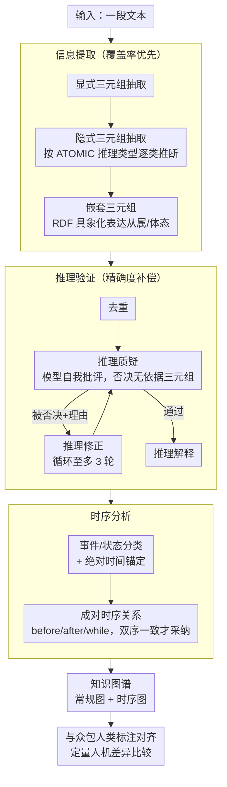

# Comparing Human and Large Language Model Interpretation of Implicit Information

**会议**: ACL 2026 Findings  
**arXiv**: [2604.17085](https://arxiv.org/abs/2604.17085)  
**代码**: 有（论文中提供链接）  
**领域**: 知识图谱 / 隐含信息理解  
**关键词**: 隐含信息提取, 知识图谱, 人机理解对比, 推理验证, 时序分析

## 一句话总结

本文提出隐含信息提取（IIE）任务和基于 LLM 的三阶段提取管道（信息提取→推理验证→时序分析），构建结构化知识图谱来表示文本的隐含含义，并通过众包人类判断对比发现 LLM 在社交丰富语境中比人类更保守，但在短事实语境中人类更保守。

## 研究背景与动机

**领域现状**：LLM 在 NLP 各任务上表现出色，但人类交流基于"解释合作"框架——文本意义由作者和读者协作创造，读者主动解释文本的隐含含义。这一框架是否适用于人与 LLM 生成文本的交互尚不清楚。

**现有痛点**：(1) 现有信息提取研究集中于显式信息，缺乏对隐含信息提取的关注；(2) 开放信息提取（OIE）不区分显式和隐式三元组；(3) 缺乏系统性的人-LLM 隐含信息理解对比框架。

**核心矛盾**：LLM 生成的文本在表面上与人类文本难以区分，但 LLM 是否像人类一样理解和推断隐含信息？如果不同，差异在哪里？

**本文目标**：(1) 设计自动化的隐含信息提取管道；(2) 系统对比人类和 LLM 在隐含信息推断上的异同；(3) 分析驱动推理的主要因素和语境依赖性。

**切入角度**：将隐含信息理解建模为知识图谱构建任务——从文本中提取关系三元组、验证推理有效性、分析时序关系，然后与人类众包判断进行定量对比。

**核心 idea**：LLM 和人类在隐含推理上的差异是语境依赖的——LLM 在社交场景中更保守，人类在事实场景中更保守。

## 方法详解

### 整体框架

本文把"理解一段文本的隐含含义"形式化为知识图谱构建问题：输入一段文本，输出一组结构化三元组，既包含字面写出的显式关系，也包含读者需要推断的隐含关系。围绕这个目标设计了一条三阶段 LLM 管道——**信息提取**阶段尽量多地抽取实体和关系三元组（覆盖率优先），**推理验证**阶段让模型自我批评、过滤掉缺乏文本支撑的隐含推理（精确度补偿），**时序分析**阶段专门判断事件之间的先后结构。最终图谱被分成"常规图 + 时序图"两部分输出，随后与众包人类标注对齐，做定量的人机差异比较。整条管道全部用少样本提示驱动，不做任何微调，因此可直接套用在黑箱 LLM 上。

### 关键设计

**1. 用 ATOMIC 推理类型把"推断隐含信息"结构化。** 直接让模型"推断所有隐含含义"太模糊，覆盖面完全靠运气。本文借用 ATOMIC 常识推理分类法，把可推断的隐含关系拆成前置条件、后置条件、参与者意图、情感反应、感知属性等若干固定类型，每种类型对应一类隐含三元组。模型被引导着逐类去想"这段话还隐含了哪些前提/后果/意图"，从而更系统地把隐含层覆盖到位，而不是零散地碰运气。这一步发生在信息提取阶段，决定了整张图谱隐含层的召回上限。

**2. 嵌套三元组表达复杂语法。** 不是所有信息都能塞进扁平的（主语，关系，宾语）结构，从属子句和体态动词尤其如此。受 RDF 具象化（reification）启发，本文允许三元组的宾语本身又是一条完整三元组，形成递归嵌套——例如 "Jordan heard Bob was looking for her" 被编码为 (JORDAN, HEARD, (BOB, WASLOOKINGFOR, JORDAN))。嵌套出的内层三元组本身被当作一条独立的隐含关系看待，从而在不牺牲形式化的前提下显著提高了表达力。

**3. 推理验证：让模型当自己的批评者，循环修正。** 第一阶段为了召回会过度生成，里面混了不少没有文本依据的臆测。验证阶段先去重（删掉与显式三元组语义重复的条目），再让同一个模型逐条质疑每条隐含三元组是否真有文本支撑——被否决的三元组会附上否决理由交还给模型，模型在不彻底篡改原意的前提下尝试修正，修正后的版本重新送审；为避免"质疑—否决—修正"无限循环，同一条被否决 3 次后直接丢弃。通过验证的三元组还会被要求给出支撑它的显式前提（推理解释），以窥探模型的推断依据。这样把流程拆成"第一阶段抓召回、第二阶段补精度"，用自我批评把臆测过滤掉。

**4. 时序分析：区分事件/状态，校验成对时序关系。** 前两阶段刻意忽略时间信息，让三元组形式上更同构；但一段话里的多个三元组之间往往有先后关系，需要单独一阶段补回。本文先逐条判断三元组属于事件（会发生的情境）还是状态（持续成立的条件），并为带时间标记的条目抽取绝对时间锚点；再两两判断时序关系，类型限定为 before / after / while / none，由此拼出事件时间线。为对抗幻觉与输出抖动，每对三元组以正反两种顺序各问一次，只有两次判断一致（before-after 或 while-while）才采纳该关系，否则视为无关。这正是实验中暴露 LLM 时序推理薄弱的那一环。

### 损失函数 / 训练策略

全程基于少样本提示，不做微调，因此适用于任意黑箱 LLM。评估在两个数据集上进行，用众包人类判断作为对照，通过直接三元组比对和一致性问题两种方式做定量分析。

## 实验关键数据

### 主实验

**LLM vs 人类隐含信息提取对比**

| 指标 | GPT-4o | Claude 3.5 | 人类 |
|------|--------|-----------|------|
| 显式三元组覆盖 | 高 | 高 | 基准 |
| 隐式三元组覆盖 | 有限 | 有限 | 显著更多 |
| 人类对模型三元组的认同率 | 高 | 高 | - |
| 人类建议的额外三元组数 | 多 | 多 | - |

### 消融实验

| 语境类型 | LLM 保守性 | 人类保守性 | 说明 |
|----------|-----------|-----------|------|
| 社交丰富语境 | **更保守** | 较开放 | LLM 不擅长社交推理 |
| 短事实语境 | 较开放 | **更保守** | 人类对事实推断更谨慎 |

### 关键发现

- 人类同意大多数 LLM 提取的三元组，但一致性地建议大量补充——说明 LLM 的隐含推理覆盖面有限
- LLM 在社交丰富语境中比人类保守，反映了社交推理能力的不足
- 人类在短事实语境中比 LLM 保守，可能因为人类意识到有限信息下推断的风险
- 人类之间在隐含信息判断上的共识度中等，说明隐含含义本身具有主观性
- 时序推理是 LLM 的薄弱环节，模型在事件时序关系判断上准确率较低

## 亮点与洞察

- 将隐含信息理解形式化为知识图谱构建任务，提供了可量化比较的框架
- "LLM 在社交场景保守、人类在事实场景保守"的发现为理解人机差异提供了新视角
- 嵌套三元组处理复杂语法结构的设计兼顾了表达力和形式化

## 局限与展望

- 三元组形式无法完全表达所有隐含含义（如反讽、暗示、文化背景）
- 推理验证依赖模型自我批评，可能存在系统性偏差
- 众包人类标注可能不代表专业语言学家的判断
- 仅在英语文本上评估，跨语言隐含信息理解差异未探索

## 相关工作与启发

- **vs ATOMIC**: ATOMIC 提供结构化常识推理分类法，本文将其适配为隐含信息提取的引导框架
- **vs 开放信息提取（OIE）**: OIE 不区分显式/隐式信息，本文专注于隐含层面
- **vs NLI**: NLI 判断蕴含关系（离散标签），本文提取开放集合的结构化三元组

## 评分

- 新颖性: ⭐⭐⭐⭐ 首次系统定义和评估 LLM 的隐含信息提取能力
- 实验充分度: ⭐⭐⭐⭐ 两个数据集、众包评估、多维度分析
- 写作质量: ⭐⭐⭐⭐ 管道设计清晰，研究问题明确
- 价值: ⭐⭐⭐⭐ 为理解 LLM 的语言理解深度提供了实证证据

<!-- RELATED:START -->

## 相关论文

- [\[ACL 2025\] FiDeLiS: Faithful Reasoning in Large Language Model for Knowledge Graph Question Answering](../../ACL2025/graph_learning/fidelis_faithful_reasoning_in_large_language_model_for_knowledge_graph_question_.md)
- [\[ACL 2026\] Graph-Based Alternatives to LLMs for Human Simulation](graph-based_alternatives_to_llms_for_human_simulation.md)
- [\[CVPR 2026\] Mario: Multimodal Graph Reasoning with Large Language Models](../../CVPR2026/graph_learning/mario_multimodal_graph_reasoning_with_large_language_models.md)
- [\[ICML 2026\] Finding the Minimal Parameter Budget for Implicit Reasoning: A Data Complexity Driven Scaling Law for Language Models](../../ICML2026/graph_learning/finding_the_minimal_parameter_budget_for_implicit_reasoning_a_data_complexity_dr.md)
- [\[ICML 2025\] From RAG to Memory: Non-Parametric Continual Learning for Large Language Models](../../ICML2025/graph_learning/from_rag_to_memory_non-parametric_continual_learning_for_large_language_models.md)

<!-- RELATED:END -->
