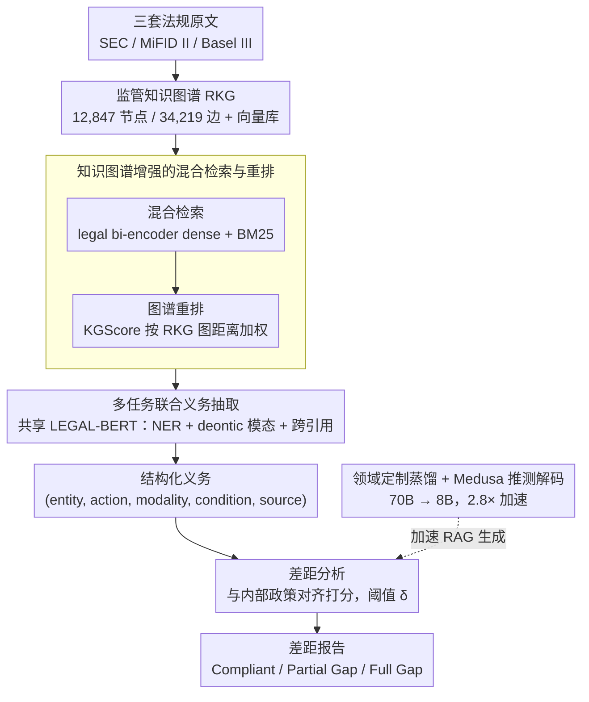

# ComplianceNLP: Knowledge-Graph-Augmented RAG for Multi-Framework Regulatory Gap Detection

**会议**: ACL 2026  
**arXiv**: [2604.23585](https://arxiv.org/abs/2604.23585)  
**代码**: 论文未提供（无）  
**领域**: 图学习 / RAG / 合规 NLP  
**关键词**: 监管合规, 知识图谱增强 RAG, 多任务义务抽取, Medusa 推测解码, 生产部署

## 一句话总结
ComplianceNLP 是一个端到端的金融监管合规系统，把 12,847 条 SEC / MiFID II / Basel III 法规构造成知识图谱来增强 RAG 检索，配合 LEGAL-BERT 的多任务义务抽取和门槛打分的差距分析，在 RegObligation / GapBench 上以 87.7 F1 击败 GPT-4o+RAG 3.5 个点，并通过领域知识蒸馏 + Medusa 推测解码实现 $2.8\times$ 推理加速；4 个月并行运行处理了 9,847 条更新，达到 96.0% 召回率和 3.1× 分析师效率提升。

## 研究背景与动机
**领域现状**：金融机构每年要追踪 60,000+ 条监管事件、跨越数十个司法辖区，2008 年金融危机以来全球银行已支付超过 $300B 的罚款和和解费。现有商业 GRC 平台（Ascent RegTech / Wolters Kluwer OneSumX）仍依赖规则系统 + 人工策划，而学术界的 Legal NLP 主要做 benchmark（LegalBench / LexGLUE / CUAD）和单框架 QA（ObliQA / DERECHA），没有端到端的生产可用合规系统。

**现有痛点**：(1) LLM 在长法规文本上 hallucinate 严重，需要可信的 grounding；(2) 现有义务抽取系统只针对单个框架（如 GDPR），无法同时处理多个监管体系；(3) 法规中的 deontic modality（shall/must/may not）和嵌套交叉引用很难统一处理；(4) 实时合规监控需要亚秒级 p50 延迟，但 70B teacher 模型推理太慢。

**核心矛盾**：合规任务需要的"高精度 + 可解释 grounding + 跨框架统一抽取 + 生产级延迟"四个要求互相冲突——更深的模型更准但更慢、统一框架更通用但容易过泛、grounding 越严越伤创造性。

**本文目标**：(1) 构造一个能同时覆盖 SEC / MiFID II / Basel III 的监管知识图谱（RKG）；(2) 联合训练 NER + 义务模态分类 + 跨引用解析的多任务义务抽取器；(3) 设计一个端到端的合规差距分析流水线；(4) 用领域定制蒸馏 + Medusa 把 70B 教师压成 8B 学生并保持精度。

**切入角度**：作者观察到法规文本熵极低（$H=2.31$ bit vs 通用文本 3.87），这正是 Medusa 推测解码"草稿 token 接受率"高的最佳条件，让小模型蒸馏 + 投机解码组合在该领域有先天优势。

**核心 idea**：用知识图谱"结构化重排"克服 RAG 的多跳推理弱点，用多任务联合训练共享 LEGAL-BERT 表示克服单一抽取头的限制，用领域熵特性把蒸馏 + Medusa 组合榨干推理效率。

## 方法详解

### 整体框架

ComplianceNLP 要解决的是"把杂乱的多框架法规原文，自动转成可对账的结构化义务，再和内部政策比对找出合规差距"这件事，并且要做到生产级延迟。系统是一条三阶段流水线：先把 SEC / MiFID II / Basel III 三套法规摄入并索引，构造出 12,847 节点、34,219 边的监管知识图谱（RKG）同时灌入向量库；再用一个共享 LEGAL-BERT 的多任务抽取器，从条款里同时抽出金融实体、义务模态和跨条款引用；最后把抽取出的结构化义务 $\langle$entity, action, modality, condition, source_provision$\rangle$ 与内部政策子句对齐打分，按阈值 $\delta$ 判定为 Compliant / Partial Gap / Full Gap 并生成差距报告。其中负责 RAG 生成（差距分析与 RegQA）的 LLM 由领域定制蒸馏 + Medusa 推测解码压成 8B 以满足生产级延迟。

### 关键设计

**1. 知识图谱增强的混合检索与重排。** 法规里充斥着"X 条款依赖 Y、Y 又引用 Z"的多跳交叉引用，纯向量检索抓不住这种结构关系。本文先做混合检索 $s(q, d) = \alpha \cdot \text{sim}_{\text{dense}}(q, d) + (1-\alpha) \cdot \text{BM25}(q, d)$（$\alpha=0.7$，dense 编码器是用 5 万法规段落对从 MiniLM-L6-v2 微调的 legal bi-encoder），再对 top-5 段落叠加图谱重排 $s_{KG}(q, d) = \beta \cdot \text{KGScore}(q, d, \mathcal{G}) + (1-\beta) \cdot s(q, d)$（$\beta=0.3$），其中 KGScore 衡量查询源条款与被检段落在 RKG 上的图距离。这种软重排既不破坏第一阶段召回，又引入了结构先验；消融里去掉它 gap detection F1 直接掉 4.6 个点，是单点贡献最大的模块。

**2. 多任务联合义务抽取。** 法规义务的三个属性——谁做什么（实体）、强制等级（deontic 模态）、引用关系——天然耦合，分成三个独立模型训练既浪费表示能力又会级联放大误差。本文用一个在 Pile of Law 上继续预训练的共享 LEGAL-BERT 编码器，接三个 head：CRF 层做 23 类金融 NER（如 Regulated_Entity / Capital_Requirement，扩展 FiNER 的金融类型，区分"投资公司"与"注册主体"这类领域语义）、句子级 deontic 分类（Obligation / Permission / Prohibition / Recommendation）、span-pair 双线性分类器做跨引用解析。联合损失 $\mathcal{L} = 0.4\mathcal{L}_{NER} + 0.3\mathcal{L}_{deontic} + 0.3\mathcal{L}_{xref}$，训练数据 8,742 句（SEC 3211 / MiFID II 2987 / Basel III 2544），标注一致性 $\kappa=0.84$。共享编码器让三个任务互相约束，抽取一致性比传统级联 pipeline 更好。

**3. 领域定制蒸馏 + Medusa 推测解码。** 实时合规要亚秒 p50 延迟，但 70B 教师太慢。本文先用 MiniLLM 反向 KL 蒸馏 $\mathcal{L}_{KD} = \text{KL}(p_{student} \| p_{teacher}) + 0.5\mathcal{L}_{SFT}$，在 1.5 万合规指令对上把 70B 压成 8B，单蒸馏已得 $2.2\times$ 加速；再给 student 加 $M=3$ 个 Medusa 预测头并在 210 万法规 token 上训练。关键洞察是法规文本熵极低（$H=2.31$ bit，远低于 C4 的 3.87），低熵让 Medusa 草稿 token 的接受率从通用文本的 82.7% 飙到 91.3%，蒸馏与投机解码组合最终达成 $2.8\times$ 总加速（659ms p50）。把"领域统计特性"直接挂钩"推理优化收益"，是这个设计最巧的地方。

### 损失函数 / 训练策略

多任务抽取损失见上；蒸馏阶段权重 $\gamma=0.5$ 平衡 KL 与 SFT；后处理接 MiniCheck 做事实核查，把 grounding 准确率从 86.7% 提到 94.2%；评估阈值 $\delta=0.6$，部署时降到 $\delta=0.45$ 以换取更高召回。

## 实验关键数据

### 主实验（RegObligation + GapBench）

| 系统 | NER F1 | Deon F1 | Gap Det F1 | RegQA EM | RegQA F1 |
|------|--------|---------|-----------|----------|----------|
| GPT-4o (5-shot) | 85.9 | 88.1 | 81.4 | 43.7 | 61.3 |
| GPT-4o + RAG | 88.6 | 90.5 | 84.2 | 48.1 | 66.8 |
| LLaMA-3-8B + RAG | 87.9 | 89.8 | 83.5 | 47.4 | 65.9 |
| LLaMA-3-70B (teacher) | 90.2 | 91.8 | 86.3 | 49.1 | 67.4 |
| **ComplianceNLP** | **91.3**†‡ | **92.7**†‡ | **87.7**†‡ | **52.8**†‡ | **71.9**†‡ |
| RIRAG (regulatory QA SOTA) | — | — | — | 38.9 | 54.2 |
| LEGAL-BERT (domain SOTA) | 82.1 | 84.6 | 71.3 | — | — |

ComplianceNLP 相比 GPT-4o+RAG 提升 +2.7 NER / +2.2 Deontic / **+3.5 Gap F1** / +5.1 QA F1，均统计显著（p < 0.05）。Grounding 准确率 94.2%（vs GPT-4o+RAG 85.1%），与人类判断相关 $r = 0.83$。

### 消融与延迟分析

| 配置 | NER F1 | Gap F1 | RegQA F1 | 说明 |
|------|--------|--------|----------|------|
| ComplianceNLP（完整） | **91.3** | **87.7** | **71.9** | — |
| w/o KG reranking | 88.4 | 83.1 (−4.6) | 66.2 | **去 KG 重排掉点最猛** |
| w/o multi-task | 89.1 (−2.2) | 84.9 | 69.1 | NER 受冲击最大 |
| w/o MiniCheck | 91.0 | 87.2 | 71.0 | F1 几乎不变但 grounding 从 94.2% 掉到 86.7% |
| End-to-end（含误差传播） | — | 83.4 | — | 12.3% 样本受抽取误差影响 |

| 推理配置 | p50 (ms) | 加速 | NER 保留率 | Gap 保留率 |
|---------|---------|------|-----------|-----------|
| 70B Teacher | 1847 | $1.0\times$ | 100 | 100 |
| 8B SFT only | 897 | $2.1\times$ | 95.1 | 95.4 |
| 8B KD only | 824 | $2.2\times$ | 96.8 | 97.0 |
| 8B + Medusa (general heads) | 793 | $2.3\times$ | 96.4 | 96.7 |
| **8B + Medusa (domain heads)** | **659** | **$2.8\times$** | **98.6** | **98.1** |

### 关键发现
- **KG 重排 = 单点贡献最大的模块**：去掉它 gap detection F1 掉 4.6 个点，远超去掉 multi-task（-2.8）或 MiniCheck（-0.5）的影响，证明法规中结构化引用关系是最有信息量的先验。
- **领域 Medusa head 接受率 91.3% vs 通用 82.7%**：作者把这个差距归因于法规文本熵 $H=2.31$ vs 通用文本 3.87，验证了"低熵领域 + 推测解码"的天然契合。这种"用领域统计特性指导推理优化"的思路值得借鉴。
- **端到端误差传播只让 F1 从 87.7 掉到 83.4**：约 2.1 个义务每 100 页漏检、1.3 个日均假阳警报，分析师认为可接受。这说明多阶段流水线不必追求每阶段都零误差，关键是误差不级联放大。
- **4 个月生产并行运行**：处理 9847 条更新，估计召回 96.0%、精度 90.7%、分析师效率 $3.1\times$，是少见的有真实生产证据的学术论文。
- 跨框架表现差异：SEC（NER F1 93.1）> MiFID II（91.4）> Basel III，反映 SEC EDGAR 标准化 XML 解析最干净，Basel III 的嵌套条件义务最难。

## 亮点与洞察
- **"低熵领域 + 推测解码 + 蒸馏" 三件套**：把领域统计特性（熵）直接挂钩工程优化（Medusa 接受率），是一种少见的"领域-推理联合优化"。这种思路可迁移到代码生成、医学报告、法律合同等所有低熵领域，预期都能拿到比通用 Medusa 更高的加速比。
- **多任务共享 LEGAL-BERT 而非堆叠多模型**：单 encoder 三 head 既共享语义又减少级联误差，比"NER → 再义务分类 → 再引用解析"的传统 pipeline 在抽取一致性上有先天优势。
- **KG 距离作为 RAG 软重排信号**：相比硬规则过滤或纯 embedding，用 graph hop 距离做加权既保留召回又引入结构先验。可推广到任何含强结构关系的 RAG 场景（如医学指南、专利引用、代码 API 依赖）。
- **MiniCheck 不改 F1 但提升 grounding 8 个点**：说明把"任务正确性"和"输出可信性"分开评估非常重要，光看 F1 可能错过 grounding 缺失的风险。在生产部署评估中应该常规化这种"双维度"指标。
- **4 个月并行运行 + 详细的部署经验复盘**：trust calibration、GRC 集成、分布漂移监控三类经验对工业 NLP 系统落地极具参考价值，弥补学术论文最缺的"真实生产证据"。

## 局限与展望
- 作者承认目前只覆盖 SEC / MiFID II / Basel III 三个框架（约一半年度更新量），扩展到其他司法辖区（如中国银保监 / 新加坡 MAS）需要新建格式解析器和 NER 标注。
- 自己发现：23 类 NER + 4 类 deontic 的 schema 是手工设计的，跨框架时可能需要重构；标注一致性 $\kappa = 0.78$（cross-ref）明显低于 NER 和 deontic，说明嵌套引用的边界标注本身就含糊。
- KG 构造依赖正则 + 学习型链接器（91.8% accuracy），但 87.3% recall 意味着约 13% 的真实引用被漏掉，对涉及深层多跳推理的查询是潜在 ceiling。
- 实时性的 18 小时盲区（夜间同步前的紧急 SEC 公告期）是回退到 embedding-only 模式（-4.6 F1），但作者把这定为"预期运作"而非降级，业务上需要补充人工复核。
- 蒸馏的 student 在 NER / Gap 上保留 98% 性能，但深层推理任务（如多步条款解释）可能损失更大，论文未充分评测。

## 相关工作与启发
- **vs DERECHA (Cejas et al. 2023)**：单框架 GDPR 合规、假设输入是预结构化政策子句、precision 89.1%；ComplianceNLP 端到端处理三个框架、从原始文本开始、达到 90.7% 生产精度。差距体现在"实际可部署性"。
- **vs RIRAG / ObliQA (Bayer et al. 2025)**：纯做 regulatory QA，无义务抽取也无差距分析，RegQA F1 54.2 vs ComplianceNLP 71.9 (+17.7)，并且无生产部署证据。
- **vs Sun et al. (2025) eventic graph compliance checker**：最接近的工作，但 (i) 单一语料、(ii) 纯 embedding 检索无 typed KG、(iii) 假设结构化输入、(iv) 无生产证据。ComplianceNLP 在四个方面都做了延伸。
- **vs Zagyva et al. (2025) Booking.com Medusa+KD**：把通用 Medusa+KD 套路引入合规领域，并挖掘"低熵 → 高接受率"的领域特性，把接受率从 82.7% 提到 91.3%。
- **vs MiniCheck (Tang et al. 2024)**：直接复用作为 grounding 后处理；ComplianceNLP 的贡献是把它系统化嵌入流水线并测量了"F1 几乎不变但 grounding 提升 8 个点"这一现象。

## 评分
- 新颖性: ⭐⭐⭐⭐ 单点技术（KG-RAG / 多任务 / Medusa-KD）都不算全新，但首个端到端覆盖三大框架 + 4 个月生产证据的系统级集成，且"低熵 → Medusa 加速"是新洞察。
- 实验充分度: ⭐⭐⭐⭐⭐ 学术 benchmark + 端到端误差传播 + 4 个月生产数据 + 跨框架细分 + 完整消融 + bootstrap 显著性检验，罕见的扎实。
- 写作质量: ⭐⭐⭐⭐ 表格结构清晰，技术细节和部署经验都有，但 Appendix-heavy（schema、pseudocode 都在 Appendix）。
- 价值: ⭐⭐⭐⭐⭐ 罕见的"学术 SOTA + 工业落地证据"双兼具的合规 NLP 系统论文，对监管科技、低熵领域 LLM 部署、KG-RAG 设计都有方法学和工程学双重启发。

<!-- RELATED:START -->

## 相关论文

- [\[CVPR 2026\] M3KG-RAG: Multi-hop Multimodal Knowledge Graph-enhanced Retrieval-Augmented Generation](../../CVPR2026/graph_learning/m3kg_rag_multi_hop_multimodal_knowledge_graph_enhanced_retrieval_augmented_genera.md)
- [\[ACL 2026\] MegaRAG: Multimodal Knowledge Graph-Based Retrieval Augmented Generation](megarag_multimodal_knowledge_graph-based_retrieval_augmented_generation.md)
- [\[ACL 2026\] AutoPKG: An Automated Framework for Dynamic E-commerce Product-Attribute Knowledge Graph Construction](autopkg_an_automated_framework_for_dynamic_e-commerce_product-attribute_knowledg.md)
- [\[ACL 2026\] TagRAG: Tag-guided Hierarchical Knowledge Graph Retrieval-Augmented Generation](tagrag_tag-guided_hierarchical_knowledge_graph_retrieval-augmented_generation.md)
- [\[ICML 2026\] DTKG: Dual-Track Knowledge Graph-Verified Reasoning Framework for Multi-Hop QA](../../ICML2026/graph_learning/dtkg_dual-track_knowledge_graph-verified_reasoning_framework_for_multi-hop_qa.md)

<!-- RELATED:END -->
