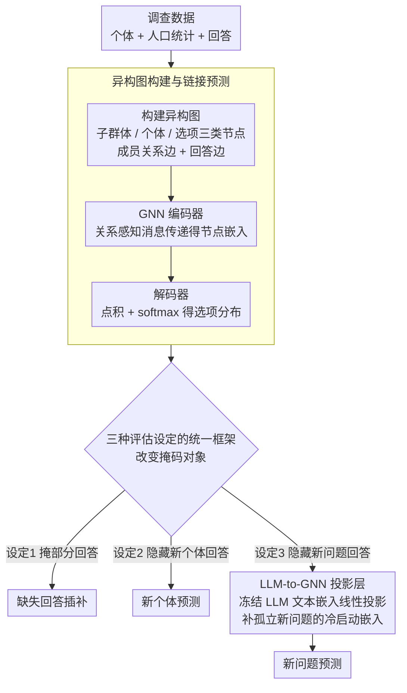

# Graph-Based Alternatives to LLMs for Human Simulation

**会议**: ACL 2026  
**arXiv**: [2511.02135](https://arxiv.org/abs/2511.02135)  
**代码**: [GitHub](https://github.com/schang-lab/gems)  
**领域**: 图学习 / 人类行为模拟  
**关键词**: 图神经网络, 人类模拟, 链接预测, 异构图, 问卷预测

## 一句话总结

本文提出 GEMS（Graph-basEd Models for Human Simulation），将封闭式人类行为模拟任务建模为异构图上的链接预测问题，在三个数据集和三种评估设定下匹配或超越强 LLM 基线方法，同时参数量减少 3 个数量级。

## 研究背景与动机

**领域现状**：人类行为模拟近年来吸引了大量关注，LLM 几乎是这一领域的唯一主流方法。大量工作使用 LLM 预测问卷调查回答、社会科学实验效果、投票结果和测试成绩等封闭式任务。

**现有痛点**：(1) LLM 运行和训练成本高昂；(2) 不透明的预训练过程导致数据泄露和社会偏见担忧；(3) 对于从固定选项中选择答案的封闭式任务，LLM 的开放文本生成优势未必被充分利用。

**核心矛盾**：封闭式模拟任务的本质是预测个体从有限选项中的选择，这更接近推荐系统中的链接预测问题而非自然语言生成任务，但领域内完全忽视了这种关系结构建模视角。

**本文目标**：探索更小、更透明的模型类别（GNN）能否在封闭式人类模拟任务上与 LLM 竞争。

**切入角度**：将个体和选项表示为异构图中的节点，将观察到的选择表示为边，利用 GNN 的关系归纳偏置来学习个体、子群体和选项的表示。

**核心 idea**：用图神经网络的链接预测替代 LLM 的 token 预测，利用人类选择的关系结构而非语言理解来模拟行为。

## 方法详解

### 整体框架

GEMS 把「预测个体从有限选项里选哪个」的封闭式人类模拟任务，重新看成推荐系统里的链接预测问题。它构建一张含三类节点的异构图——子群体节点 $\mathcal{S}$（年龄/性别等人口统计组）、个体节点 $\mathcal{U}$、选项节点 $\mathcal{C}$（每个问题的全部答案），用两种双向关系把它们连起来：成员关系边（个体→子群体）和回答边（个体→选项）。GNN 编码器靠关系感知的消息传递学出节点嵌入，解码器再用点积加 softmax 预测个体在某题各选项上的分布，整套用图结构而非语言来模拟人的选择。三种评估设定通过改变「掩码对象」共用同一张图，其中新问题场景额外接一个 LLM-to-GNN 投影层补冷启动嵌入。

### 关键设计

**1. 异构图构建与链接预测：用「相似个体做相似选择」的关系归纳偏置替代语言理解**

GEMS 故意让个体节点只带统一特征、不可识别，把可区分性全部交给可学习的子群体与选项嵌入表，逼模型从关系结构而非身份记忆里学规律。GNN 经多层消息传递聚合邻域信息得到输出嵌入 $z_w^O$，解码器按 $p(c|u,q) = \text{softmax}(\text{Dot}(z_u^O, z_c^O) / \tau)$ 给出个体 $u$ 在问题 $q$ 各选项上的概率，训练目标是自监督的链接预测——随机掩码部分回答边再重构它们。这本质上就是推荐系统里的协同过滤思路（口味相近的人选择也相近），只是首次被系统性地搬到人类行为模拟领域。

**2. 三种评估设定的统一框架：一套图模型覆盖三类现实场景**

同一张图、同一套消息传递，通过改变「掩什么」就能切出人类模拟的三个核心场景。设定 1（缺失回答插补）随机掩掉已有个体的部分回答，对应调查补全；设定 2（新个体预测）在训练时完全隐藏部分个体的全部回答、只留人口统计特征，对应新人群预测；设定 3（新问题预测）在训练时完全隐藏部分问题的全部回答，对应新问卷设计。三种设定把「老人老题、新人老题、老人新题」三种泛化方向一网打尽，也为不同方法提供了统一可比的评估维度。

**3. LLM-to-GNN 投影层（仅设定 3）：给孤立的新问题节点补一个冷启动嵌入**

设定 3 的难点在于新问题的选项节点在图里是孤立的，没有任何回答边，消息传递给不出嵌入。GEMS 的补救是学一个线性投影 $z_c' = \mathbf{W}_{\text{proj}} h_{\text{LLM}}(c)$，把冻结 LLM 对该选项文本的隐藏状态映射进 GNN 嵌入空间，训练时在已见选项节点上最小化投影结果与 GNN 实际输出嵌入之间的 MSE。这只新增 $d_{\text{LLM}} \times d_{\text{GNN}}$ 个参数，远比微调一个 LLM 便宜，而且只有设定 3 才动用文本——前两个设定完全不碰任何语言表示，运行时也无需查询 LLM。

### 损失函数 / 训练策略

链接预测用交叉熵损失，被掩码的回答边作正样本，同一问题下的其他选项经 softmax 归一化充当隐式负样本；LLM-to-GNN 投影层则用 ridge 回归单独训练。

## 实验关键数据

### 主实验

**设定 1: 缺失回答插补（准确率）**

| 方法 | OpinionQA | Twin-2K | Dunning-Kruger |
|------|-----------|---------|----------------|
| Zero-shot (Qwen3-8B) | 39.38 | 52.06 | 41.82 |
| Few-shot FT (8, best LLM) | 55.98 | 66.36 | 57.21 |
| **GEMS (SAGE)** | **57.00** | **66.62** | **57.89** |

### 消融实验

**设定 2: 新个体预测（准确率）**

| 方法 | OpinionQA | Twin-2K | Dunning-Kruger |
|------|-----------|---------|----------------|
| SFT (best LLM) | 50.56 | 61.85 | 56.66 |
| **GEMS (RGCN)** | **50.50** | **62.39** | **56.76** |

### 关键发现

- 设定 1 和 2 中 GEMS 完全不使用语言表示，仅靠图结构即匹配或超越最强 LLM 微调方法
- 设定 3（新问题）中需要 LLM-to-GNN 投影，但仍无需运行时 LLM 查询
- GEMS 参数量约 $10^3$ 倍少于 LLM，计算量最高减少 $10^2$ 倍
- 三种 GNN 架构（RGCN、GAT、GraphSAGE）表现相近，SAGE 略优
- 在 OpinionQA 上 GEMS 一致超越 Agentic CoT 和 SFT，说明关系结构比语言理解更关键

## 亮点与洞察

- 核心洞察极为简洁有力——封闭式人类模拟本质上是推荐系统问题，关系结构比语言理解更重要
- 实验设计严谨，在相同条件下对比了 5 种 LLM 方法 × 3 个模型 × 3 个数据集 × 3 种设定
- GEMS 可以从零训练在领域数据上，规避了 LLM 预训练的数据泄露和偏见问题

## 局限与展望

- 仅在封闭式任务上评估，无法扩展到开放式人类模拟（如对话生成、行为叙事）
- 设定 3 仍需冻结 LLM 提取文本特征，未完全脱离 LLM
- 图构建依赖预定义的子群体（如人口统计变量），未探索自动发现子群体的方法
- 未与经典离散选择模型（如 MNL、mixed logit）进行系统对比

## 相关工作与启发

- **vs LLM Fine-tuning (Suh et al., 2025)**: 后者在相同数据上微调 LLM，但参数量高出 1000 倍，GEMS 在设定 1 上表现相当
- **vs 推荐系统 GNN**: 技术上类似图推荐（如 PinSage），但首次系统应用于人类行为模拟领域
- **vs Agentic CoT**: 后者使用反思+预测双代理链式推理，但在多数设定下不如简单的 SFT，更不如 GEMS

## 评分

- 新颖性: ⭐⭐⭐⭐ 首次系统证明 GNN 可在人类模拟上匹配 LLM，视角转换有启发性
- 实验充分度: ⭐⭐⭐⭐⭐ 3 数据集 × 3 设定 × 5 LLM 方法 × 3 LLM 模型，对比极为全面
- 写作质量: ⭐⭐⭐⭐ 问题定义清晰，实验逻辑清楚
- 价值: ⭐⭐⭐⭐ 为人类模拟领域提供了高效透明的替代方案

<!-- RELATED:START -->

## 相关论文

- [\[ACL 2026\] From Nodes to Narratives: Explaining Graph Neural Networks with LLMs and Graph Context](from_nodes_to_narratives_explaining_graph_neural_networks_with_llms_and_graph_co.md)
- [\[ACL 2026\] AgentGL: Towards Agentic Graph Learning with LLMs via Reinforcement Learning](agentgl_towards_agentic_graph_learning_with_llms_via_reinforcement_learning.md)
- [\[ICML 2025\] EvoMesh: Adaptive Physical Simulation with Hierarchical Graph Evolutions](../../ICML2025/graph_learning/evomesh_adaptive_physical_simulation_with_hierarchical_graph_evolutions.md)
- [\[ACL 2026\] Evaluating LLMs on Large-Scale Graph Property Estimation via Random Walks](evaluating_llms_on_large-scale_graph_property_estimation_via_random_walks.md)
- [\[ACL 2026\] LLMs Underperform Graph-Based Parsers on Supervised Relation Extraction for Complex Graphs](llms_underperform_graph-based_parsers_on_supervised_relation_extraction_for_comp.md)

<!-- RELATED:END -->
