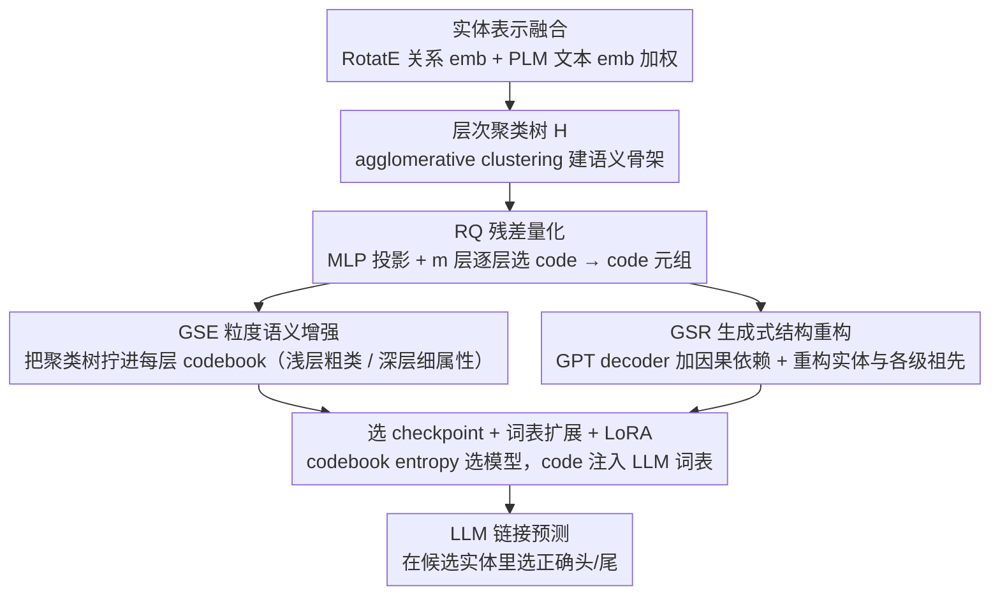

# GS-Quant: Granular Semantic and Generative Structural Quantization for Knowledge Graph Completion

**会议**: ACL 2026  
**arXiv**: [2604.21649](https://arxiv.org/abs/2604.21649)  
**代码**: https://github.com/mikumifa/GS-Quant (有)  
**领域**: 图学习 / 知识图谱补全 / 量化  
**关键词**: KGC、RQ-VAE、hierarchical clustering、codebook、LLM vocabulary 扩展

## 一句话总结
GS-Quant 把 KG 实体量化成"由粗到细"的离散 code 序列——用层次聚类树约束 RQ-VAE 让浅层 code 编码全局类别（如 "Person"）、深层 code 编码细粒度属性（如 "Artist"），再用 GPT-style decoder 重构 entity + ancestor 强制 code 之间产生因果依赖，最后把这些 code 加到 LLM 词表里做 LoRA 微调，在 WN18RR / FB15k-237 上 Hits@1 比 SOTA SSQR 高 2.2-2.4 个点。

## 研究背景与动机

**领域现状**：知识图谱补全 (KGC) 把 LLM 引入后分两派——(1) **text-based** 把 triple 线性化成自然语言 prompt (KICGPT, DIFT, KG-FIT, MKGL)，可读但 token 爆炸且打散图拓扑；(2) **embedding-based** 把 KG embedding 注入 LLM latent space (TransE/RotatE + adapter)，高效但**连续 embedding 和离散 token 模态不匹配**。

**现有痛点**：(1) text 方法平均一个 triple 几百 token，FB15k-237 上推不动；(2) embedding 方法把 holistic dense 向量塞进 LLM，但 LLM 实际上是序列 next-token 模型，单点 embedding 用不上 autoregressive 强项；(3) 最新 quantization 方法 (SSQR, ReaLM) 把 entity 编成 code 序列接近这个目标，但**code 是 flat 数值压缩**——把 entity embedding 投影成 4 个 code，相邻 code 之间没有语义层级关系，更像哈希签名而非"语言"。

**核心矛盾**：人类推理和 LLM 生成都遵循 **coarse-to-fine** 的层次结构（先分类后细化），而现有 quantization 把所有 code 都拍平用 Euclidean 最近邻找，**code 间无层级、无因果**——LLM 看到一串 code 也不知道哪个是"类别"哪个是"实例"。

**本文目标**：(1) 让 quantization 出来的 code 序列在语义上**分层**——浅层 code 编码 coarse-grained 类别、深层 code 编码 fine-grained 属性；(2) 让 code 之间有**生成式因果依赖**而非彼此独立；(3) 把这种"结构化 code"塞进 LLM 词表后做 KGC，验证比 flat code 更有效。

**切入角度**：基于 RQ-VAE（Residual Quantization 天然就有数值递归层级 $\mathbf{r}_{l+1} = \mathbf{r}_l - \mathbf{v}_{c_l}^l$），但作者认为光数值层级不够，必须**显式注入语义层级**。具体做法是先用 agglomerative clustering 在 entity embedding 上建一棵 hierarchy tree $\mathcal{H}$，再让 RQ 的每一层对齐到这棵树的对应层。

**核心 idea**：**Granular Semantic Enhancement (GSE)** 把层次聚类树注入 codebook 学习；**Generative Structural Reconstruction (GSR)** 用 GPT-style decoder 重构 entity + ancestor 加上因果依赖；两者+RQ commitment loss 联合训练。

## 方法详解

### 整体框架

GS-Quant 的目标是把每个 KG 实体压成一串"像语言一样有层级、有因果"的离散 code，再喂给 LLM 做链接预测。流水线先把 RotatE 的关系 embedding 与 PLM 的文本 embedding 加权融合成实体表示 $\mathbf{s}_x = \rho \mathbf{s}_x^{\mathcal{G}} + (1-\rho) \mathbf{s}_x^T$，在这些表示上离线做 agglomerative clustering 建一棵层次树 $\mathcal{H}$ 作为语义骨架；随后把 $\mathbf{s}$ 经 MLP 投影成 $\mathbf{r}_0 = \mathbf{z}$，沿 $m$ 层 codebook 做 Residual Quantization（每层选 $c_l = \arg\min_k \|\mathbf{r}_l - \mathbf{v}_k^l\|_2$、残差递归 $\mathbf{r}_{l+1} = \mathbf{r}_l - \mathbf{v}_{c_l}^l$）得到 code 元组 $\mathcal{I} = \{c_i\}_{i=0}^{m-1}$，并用 GSE / GSR 两个约束把树的层级语义和因果依赖注入这些 code。最终把整套 codebook 的 code 当作新词注入 LLM 词表，冻结主干、只训 code embedding 与 LoRA，让 LLM 在 KGC 候选列表里选出正确的头/尾实体。

### 关键设计

**1. Granular Semantic Enhancement（GSE）：把聚类树拧进 codebook 的每一层**

vanilla RQ-VAE 的"层级"只是残差递归的数值层级，没有语义含义，同一层 codebook 里"Person"这种粗类和"Artist"这种细属性混作一团（图 4b）。GSE 把离线建好的层次树 $\mathcal{H}$ 当作监督信号，强制 RQ 第 $i$ 层的 code 对齐到树第 $i$ 层的聚类中心 $\boldsymbol{\mu}_e$——浅层学 coarse 类别、深层学 fine 细节。由于 code 选择是离散的不可导，先构造直通 surrogate $\tilde{\mathbf{v}}_i = \mathbf{r}_i + \operatorname{sg}[\mathbf{v}_{c_i}^i - \mathbf{r}_i]$ 让梯度穿过；再施加两条方向相反的对比约束：Coarse-to-Fine Alignment $\mathcal{L}_1$ 把 $\tilde{\mathbf{v}}_i$ 拉向自身在 $i$ 层的中心 $\boldsymbol{\mu}_e$，权重取指数衰减的 $\lambda_1^{i+1}/m$（$\lambda_1\in(0,1)$）让浅层权重更大、优先凝聚同类；Hierarchical Separability $\mathcal{L}_2$ 把 $\tilde{\mathbf{v}}_i$ 推离树上邻居中心 $\mathbf{n}\in\mathcal{N}_e$，权重反向衰减为 $\lambda_2^{m-i}/m$ 让深层权重更大、优先分离细类。两个方向一起约束后，codebook 可视化（图 4a）出现浅层 code 稀疏均匀、深层 code 密集判别的结构，正好对上语言"先分类后细化"的直觉。

**2. Generative Structural Reconstruction（GSR）：用 GPT decoder 给 code 之间加因果依赖**

光有层级还不够——若 $m$ 个 code 彼此独立，LLM 看到一串 code 也分不清谁该 condition 在谁之上。GSR 把 code 元组重构成"一句有序的语义句子"：构造可学 query 序列 $\mathcal{Q}=\{\mathbf{q}_i\}_{i=0}^L$，与 $\tilde{\mathbf{v}}$ 拼接后喂进一个带 causal self-attention 的 Transformer decoder，强迫第 $l$ 个 code 只能依赖 $<l$ 的 code，形成"先粗后细"的自回归依赖，与 LLM 的生成动力学同构。decoder 的输出被分派到不同重构目标：$\mathbf{o}_0$ 重构实体自身 $\mathbf{s}$，$\{\mathbf{o}_i\}_{i\ge 1}$ 重构该实体在 $\mathcal{H}$ 上的各级祖先 $\{\mathbf{h}_i\}$，损失为 $\mathcal{L}_{\text{GSR}} = \|\tilde{\mathbf{o}}_0 - \mathbf{s}\|_2^2 + \lambda_s \|\tilde{\mathbf{o}}_1 - \mathbf{h}_0\|_2^2 + \lambda_h \sum_{i=2}^L \|\tilde{\mathbf{o}}_i - \mathbf{h}_{i-1}\|_2^2$，其中 $\lambda_s \ll \lambda_h$（因为 $\mathbf{h}_0$ 已被 GSE 约束，不必重复施压）。重构祖先而非只重构自己，强制 code 序列保留多粒度信息、避免"只编码实体本身"的退化；消融里去掉 GSR 后 WN18RR Hits@1 掉 0.8%、FB15k-237 掉 1.1%，印证因果依赖确实让 code 更"语言化"。

**3. Codebook Entropy 选 checkpoint + 词表扩展 + LoRA：把 code 接进 LLM**

RQ-VAE 训练常出现"几个 code 吃掉所有激活、其余 code 死亡"的 collapse，传统靠 random restart 或 EMA 缓解。作者改用 codebook entropy $\mathcal{Y} = -\frac{1}{M}\sum_m \sum_k p_k^m \log p_k^m$ 作为模型选择信号——它在所有 code 等概率被激活（$p_k^m = 1/K$）时取最大，等价于"最大化 codebook 表达力"，表 3 实测 $\mathcal{Y}$ 与下游 MRR / Hits@K 正相关，于是只看这个自监督指标就能挑 checkpoint，不必每个 epoch 都跑下游评估。选定 codebook 后，把 $M\times K$ 个 code 全部当作新 token 注入 LLM 词表，冻结 LLM 主体、只训新 token embedding 与作用在 attention/FFN 上的 LoRA adapter，既学到 KG 知识又不破坏通用能力；推理时直接让 LLM 在候选实体里做选择，候选集与指令模板和 DIFT 完全对齐以保证公平。

### 损失函数 / 训练策略
- **量化阶段**：$\mathcal{L}_{\text{total}} = \mathcal{L}_Q + \mathcal{L}_{\text{GSE}} + \mathcal{L}_{\text{GSR}}$（$\mathcal{L}_Q$ 为标准 commitment loss），按 codebook entropy $\mathcal{Y}$ 选 checkpoint。
- **LLM 阶段**：冻原 LLM 参数，只更新新 code token 的 embedding 与 LoRA adapter，目标是 candidate selection 的语言模型 loss。
- 关键超参：$\lambda_1 = 0.8$、$\lambda_2 = 0.4$、$\lambda_s$ 小而 $\lambda_h$ 大、$\rho$ 控制 graph/text 融合比例。
- 开销：GSE / GSR 各只带来约 4%-18% 额外训练时间，相对 vanilla RQ-VAE 没有 prohibitive overhead。

## 实验关键数据

### 主实验

WN18RR + FB15k-237 上的 KGC 主结果（候选集和指令模板对齐 DIFT）：

| 方法 | WN18RR MRR | WN18RR H@1 | WN18RR H@3 | WN18RR H@10 | FB15k-237 MRR | FB15k-237 H@1 | FB15k-237 H@3 | FB15k-237 H@10 |
|---|---|---|---|---|---|---|---|---|
| TransE | 0.243 | 0.043 | 0.441 | 0.532 | 0.279 | 0.198 | 0.376 | 0.441 |
| RotatE | 0.476 | 0.428 | 0.492 | 0.571 | 0.338 | 0.241 | 0.375 | 0.533 |
| CompGCN | 0.479 | 0.443 | 0.494 | 0.546 | 0.355 | 0.264 | 0.390 | 0.535 |
| MEM-KGC | 0.557 | 0.475 | 0.604 | 0.704 | 0.346 | 0.253 | 0.381 | 0.531 |
| CoLE | 0.593 | 0.538 | 0.616 | 0.701 | 0.389 | 0.294 | 0.429 | 0.572 |
| KICGPT | 0.564 | 0.478 | 0.612 | 0.677 | 0.412 | 0.327 | 0.448 | 0.581 |
| DIFT (LLM-base 强 baseline) | 0.617 | 0.569 | 0.638 | 0.708 | 0.439 | 0.364 | 0.468 | 0.586 |
| MKGL | 0.552 | 0.500 | 0.577 | 0.656 | 0.415 | 0.325 | 0.454 | 0.591 |
| SSQR (前作 quantization) | 0.603 | 0.553 | 0.627 | 0.692 | 0.428 | 0.349 | 0.459 | 0.583 |
| **GS-Quant (ours)** | **0.635** | **0.594** | **0.649** | **0.712** | **0.455** | **0.386** | **0.479** | **0.592** |

vs DIFT：WN18RR Hits@1 +2.5、FB15k-237 Hits@1 +2.2；vs SSQR：WN18RR Hits@1 +4.1、FB15k-237 Hits@1 +3.7。

### 消融实验

| 配置 | FB15k-237 MRR | FB15k-237 H@1 | WN18RR MRR | WN18RR H@1 | 说明 |
|---|---|---|---|---|---|
| **Ours (full)** | **0.455** | **0.386** | **0.635** | **0.594** | 基线 |
| w/o $\mathcal{L}_1$（去 coarse-to-fine alignment） | 0.450 (-0.5%) | 0.377 (-0.9%) | 0.629 (-0.5%) | 0.587 (-0.6%) | GSE 半挂 |
| w/o $\mathcal{L}_2$（去 hierarchical separability） | 0.450 (-0.5%) | 0.379 (-0.7%) | 0.625 (-0.9%) | 0.577 (-1.6%) | GSE 另半挂 |
| w/o $\mathcal{L}_{\text{GSR}}$ | 0.448 (-0.7%) | 0.375 (-1.1%) | 0.627 (-0.7%) | 0.585 (-0.8%) | code 间无因果 |
| **w/o Code（无量化全靠 LLM+LoRA）** | **0.404 (-5.1%)** | **0.303 (-8.3%)** | **0.607 (-2.7%)** | **0.541 (-5.2%)** | 量化 token 是最大贡献 |

### 关键发现
- **Quantized code 是最大贡献**：w/o Code 在 FB15k-237 Hits@1 跌 8.3 个点，证明把 KG 知识编成离散 token 注入 LLM 词表是核心 mechanism，比所有 loss 增益加起来还重要。
- **GSE 和 GSR 各贡献 ~1 个点**：单独看每个损失都"只"涨 0.5-1.6 个点，但累加起来 + 与 Code token 协同后让 Hits@1 比 SSQR 高 ~4 个点，说明这是个"少量精修"问题，结构性 inductive bias 比大模型蛮力更关键。
- **超参鲁棒**：$\lambda_1 \in [0.6, 0.9]$ / $\lambda_2 \in [0.2, 0.5]$ 内性能波动小，$\lambda_s < \lambda_h$ 一致更优——验证了 $\mathbf{h}_0$ 不应被重复约束的设计直觉。
- **Codebook entropy 是好的 model selection 信号**：$\mathcal{Y}$ 与 downstream MRR / Hits@K 正相关，意味着只看自监督指标就能选最佳 checkpoint，不用每个 epoch 都跑下游评估。
- **Codebook 可视化验证 disentanglement**：图 4a (ours) 浅层 code 节点稀疏均匀、深层 code 密集判别；图 4b (vanilla RQ-VAE) 三层混作一团——直观证明 GSE 真的让 code 学到了层级语义。
- **效率友好**：删除单个 loss 训练时间只省 4-18%，意味着整套方法相对 vanilla RQ-VAE 没有 prohibitive overhead。

## 亮点与洞察
- **"让 code 像语言一样有结构"是核心思想**：把 KGC 的 quantization 从"压缩 embedding"重新定义为"为 LLM 造一种新的子语言"，这一 framing 比单纯堆 loss 更深刻——它要求 code 序列在三个维度同时满足语言学性质：层级（粗→细）、因果（左→右）、组合（不同 code 组合编码不同语义）。
- **聚类树作为可微 inductive bias**：用 agglomerative clustering 离线生成 hierarchy tree，再用对比 loss 强制 RQ 对齐到树——把"无监督结构发现"和"端到端量化"解耦，避免了"两件事同时学"导致的训练不稳。这一思路可迁移到任何需要"分层量化"的场景（图像 token、音频 codec、推荐系统 item 编码）。
- **Codebook entropy 当训练监督**：这是个非常 portable 的小 trick——在所有用 VQ-VAE / RQ-VAE 的工作里都能直接套用 model selection，避免 codebook collapse 这个老大难问题。
- **GSR 的"重构祖先"目标**：传统 GPT decoder 重构的是 next token，这里重构的是 hierarchy tree 上不同层的祖先 embedding——把"序列生成"和"层级抽象"统一在一个 decoder 里，是非常优雅的多目标设计。
- **LLM 词表扩展 + 冻 backbone**：只学新 token embedding + LoRA 既保留通用能力又快速适配 domain，是个把 quantized 表示注入 LLM 的可复用 recipe，对所有"领域专属离散表示"的任务（化学分子、蛋白质、代码）都适用。

## 局限与展望
- **依赖外部 KG embedding**：作者用 RotatE 生成 $\mathbf{s}^{\mathcal{G}}$，量化质量天花板就被 RotatE 锚定；换更弱的 backbone 会拖累整体效果。
- **Hierarchy tree 静态生成**：agglomerative clustering 在训练前一次性建好，无法随 quantization 训练动态调整；如果初始聚类不准，后面 GSE 会沿错误方向优化。
- **只验证了 WN18RR / FB15k-237 两个经典 benchmark**：这两个数据集规模小（entity 数 4 万 / 1.5 万），实际工业 KG 动辄千万 entity，scalability 没验证；codebook size $K$ 和层数 $m$ 在大 KG 上是否需要 trade-off 未知。
- **没和 text-based 强 baseline 在 token 成本上对比**：作者强调 quantization 比 text 高效，但没量化 token 用量差距，readers 看不到效率优势的具体数字。
- **改进思路**：(i) 让 hierarchy tree 跟 codebook 端到端联合学习（differentiable clustering）；(ii) 在更大 KG（Wikidata / NELL）上做 scaling study；(iii) 把 quantized code 用到下游 QA / reasoning 任务而非仅 link prediction；(iv) 探索 cross-KG transfer——同一套 codebook 能否给多个 KG 复用。

## 相关工作与启发
- **vs SSQR（前作 vector quantization）**：SSQR 用 flat VQ + 多次 FFN projection 得 code，code 间无层级；GS-Quant 用 RQ + GSE 强制层级 + GSR 加因果，在 WN18RR Hits@1 +4.1 个点直接证明"结构化 quantization">"flat quantization"。
- **vs ReaLM**：ReaLM 也用 residual quantization 但没注入语义层级；GS-Quant 在同一架构上加 GSE/GSR，证明 codebook 设计才是 quantization 在 KGC 上work 的关键。
- **vs DIFT（embedding 注入式 SOTA）**：DIFT 把连续 embedding 通过 prompt 注入 LLM，Hits@1 0.569（WN18RR）；GS-Quant 用离散 code 0.594，证明在 LLM context 下离散表示比连续 embedding 更好对齐生成动力学。
- **vs RQ-VAE 原作**：原 RQ-VAE 用于图像生成，没考虑语义层级；GS-Quant 把它适配到结构化数据（KG）并加层级语义对齐，扩展了 RQ-VAE 的应用边界。
- **vs MKGL / KG-FIT (text-based)**：text 方法每条 triple 几百 token；GS-Quant 把 entity 压成 $m$ 个 code（通常 4-8）token，效率提升显著且效果更优——说明"把图结构化为 LLM 子语言"比"把图描述成自然语言"更对路子。

## 评分
- 新颖性: ⭐⭐⭐⭐ "code-as-language" framing 配合 GSE + GSR 是清晰的新组合；单个组件（RQ-VAE / hierarchical clustering / GPT decoder）都有先例，但用在 KGC 上把语义层级显式注入是首次。
- 实验充分度: ⭐⭐⭐⭐ 两 benchmark + 5 组消融 + 4 超参敏感性 + codebook 可视化 + entropy 与性能相关性 + 效率对比都覆盖，缺大规模 scalability 和 cross-KG transfer。
- 写作质量: ⭐⭐⭐⭐ 动机讲得很清楚（flat vs hierarchical），公式齐全，图 4 codebook 可视化对比很有说服力；个别地方文字表达冗余（如反复强调 coarse-to-fine）。
- 价值: ⭐⭐⭐⭐ 开源 + 在两个经典 KG benchmark 上拿 SOTA，对所有想用 LLM 做 KGC 的工业方有直接借鉴；GSE/GSR 这套设计对图像 token、推荐系统 item code 等场景也有迁移潜力。

<!-- RELATED:START -->

## 相关论文

- [\[AAAI 2026\] Beyond Fact Retrieval: Episodic Memory for RAG with Generative Semantic Workspaces](../../AAAI2026/graph_learning/beyond_fact_retrieval_episodic_memory_for_rag_with_generative_semantic_workspace.md)
- [\[ACL 2026\] Collaboration of Fusion and Independence: Hypercomplex-driven Robust Multi-Modal Knowledge Graph Completion](collaboration_of_fusion_and_independence_hypercomplex-driven_robust_multi-modal_.md)
- [\[ACL 2025\] Beyond Completion: A Foundation Model for General Knowledge Graph Reasoning](../../ACL2025/graph_learning/beyond_completion_a_foundation_model_for_general_knowledge_graph_reasoning.md)
- [\[ICML 2026\] Generative Representation Learning on Hyper-relational Knowledge Graphs via Masked Discrete Diffusion](../../ICML2026/graph_learning/generative_representation_learning_on_hyper-relational_knowledge_graphs_via_mask.md)
- [\[CVPR 2025\] Knowledge Bridger: Towards Training-Free Missing Modality Completion](../../CVPR2025/graph_learning/knowledge_bridger_towards_training-free_missing_modality_completion.md)

<!-- RELATED:END -->
