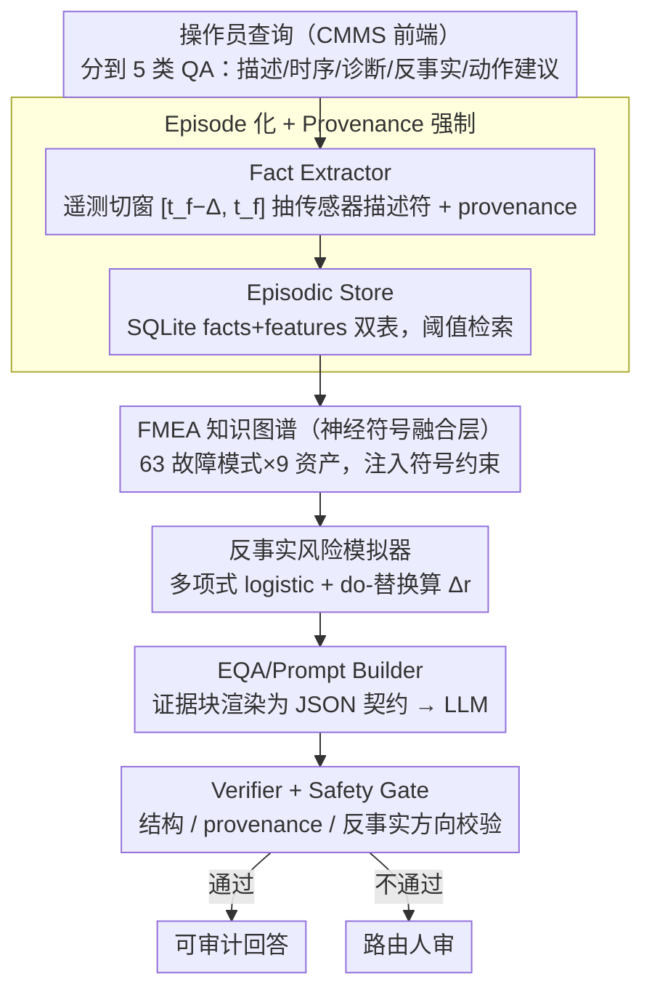

# IndustryAssetEQA: A Neurosymbolic Operational Intelligence System for Embodied Question Answering in Industrial Asset Maintenance

**会议**: ACL 2026  
**arXiv**: [2604.23446](https://arxiv.org/abs/2604.23446)  
**代码**: https://github.com/IBM/AssetOpsBench/tree/IndustryAssetEQA/IndustryAssetEQA (有)  
**领域**: 知识图谱 / 工业 / 神经符号 / Embodied QA  
**关键词**: FMEA 知识图谱、Embodied QA、反事实风险、Provenance、工业维护

## 一句话总结
本文把工业资产维护问答重新建模成"具身决策"任务，提出由 episode 化遥测、FMEA 知识图谱、参数化反事实风险模拟器、provenance 校验和安全门组成的神经符号系统 IndustryAssetEQA，在 4 个工业数据集上把结构有效性、反事实方向准确率、解释蕴含率分别提升最多 0.51 / 0.47 / 0.64，并把专家判定的严重过度断言从 28% 压到 2%。

## 研究背景与动机

**领域现状**：现代工厂依赖运行情报系统对多元遥测、报警流、维修记录进行解读，目前主流做法是在文档和仪表盘上层套一个 LLM，以自然语言界面回答 "为什么故障 / 怎么处理 / 干预后会怎样" 这类问题。

**现有痛点**：实际部署中 LLM 维护助手暴露三类一致性问题——(i) 给出泛泛的故障教科书解释，但根本没绑定到具体 episode 的传感器读数与上下文；(ii) 没有可验证的 provenance，答案不引用对应时间窗、传感器和工单记录，无法审计；(iii) 反事实和动作建议只给出定性结论，缺少明确的风险模型，不能被检验。

**核心矛盾**：把维护问答框成"语言生成"任务，而它本质是"传感器 + 风险"的决策任务——前者的目标函数只要求流畅与符合语料分布，后者却需要时序定位、证据链和可检验的干预效应，二者错位是泛化失败的根源。

**本文目标**：构造一个同时满足时间定位、证据可追溯、风险可约束、领域知识对齐 4 个要求的工业 EQA 系统，并设计专门衡量"可部署可靠性"而非"语言流畅度"的评测协议。

**切入角度**：作者注意到 Embodied AI 的感知→推理→预测→决策环路与工业维护工作流（感知遥测→诊断故障→规划干预→执行维护）在结构上同构，因此把维护问答显式建成具身决策问题；同时用神经符号融合让 LLM 的自由文本被 FMEA 知识图谱和 episodic store 双重锚定。

**核心 idea**：用 episode 化事实 + FMEA-KG + 多项式 logistic 反事实模拟器 + provenance 强制 + 安全门，把 LLM 包成一个只能"在已给证据上回答"的具身 QA 服务。

## 方法详解

### 整体框架

系统接收操作员在 CMMS 前端输入的自然语言查询，把工业维护问答当成"感知遥测→诊断→规划干预→执行"的具身决策环路来跑，全程让 LLM 的自由文本被符号知识和 episode 事实双重锚定。查询先被分到 5 类 QA 任务（描述 / 时序 / 诊断 / 反事实 / 动作建议），随后流经一条 6 模块流水线：Fact Extractor 把遥测时序切成以失败时刻 $t_f$ 为锚的固定窗口 $[t_f-\Delta, t_f]$、对每个传感器 $s$ 抽出摘要描述符 $\mathcal{F}_s = \{\mu_s, \sigma_s, \min_s, \max_s, \text{trend}_s\}$ 并拼上错误计数、距上次维护小时数等上下文，输出带全 provenance 的 episode JSONL；这些 episode 进 Episodic Store（SQLite facts+features 双表，按 `fact_id` 索引）供阈值检索 $\{f_i \mid x_{i,j} \bowtie \tau\}$；FMEA-KG（63 种故障模式 × 9 类资产，边为 `affects / component_of / indicated_by / mitigated_by`）注入符号约束；Causal Simulator 用多项式 logistic 估 $P(y\mid\bm{x})$ 并把干预建成 do-替换算出干预前后风险 $r_{\text{before}} = 1 - P(y=\text{healthy}\mid\bm{x})$、$r_{\text{after}} = 1 - P(y=\text{healthy}\mid\bm{x}^{\text{do}})$ 与方向 $\Delta r$；EQA/Prompt Builder 把证据块渲染成严格 JSON 契约喂给 LLM；最后 Verifier + Safety Gate 把输出对回 Episodic Store 做结构、provenance、反事实方向一致性校验，未通过则路由人审。

### 关键设计

**1. FMEA 知识图谱作为神经符号融合层：给自由文本套一个可审计的符号锚**

纯 LLM 解释常常引用错误的故障模式甚至凭空编造传感器，缺一个可审计的语义约束。本文把领域专家依 ISO 文档审定的失败模式、传感器签名、可允许干预编码成一张机器可解释的图：节点覆盖资产类→子部件→故障模式→传感器抽象→维护动作的完整闭环，边表达 `affects / component_of / indicated_by / mitigated_by` 关系，用 rdflib 在流水线节点注入符号约束。LLM 输出的"失败模式"必须能在 KG 中找到对应节点，否则被 Verifier 判失败；从 1004 条候选三元组中有 96% 被 ISO 风格规约的文本蕴含模型判为有效，说明这个符号锚本身质量足够高，能稳定地把 LLM 的语义约束在领域共识之内。

**2. Episode-centric + Provenance 强制：让每个回答都能回查到具体时间窗**

部署中 LLM 最大的可靠性缺口是答案没有可验证的出处——不引用对应时间窗、传感器和工单，无法审计。本文把所有问答都锚定在"某资产 + 某时间窗"的离散 episode 上：Fact Extractor 给每个 episode 产含源文件、时间范围、计数等 provenance 的 JSONL，Prompt Builder 的指令明确要求"只能用提供的证据"且 JSON 里必须给出可回查的 `fact_id / 窗口 / 引用传感器`，Verifier 再把回答里引用的 `fact_id` 和特征值对回 Episodic Store 核对、对不上号就拒绝。这一强制是论文里收益最大的单一组件：消融中去掉 provenance 强制会让 Full Pass 从 0.89 直接崩到 0.19，等于把可部署的数值预测打回成不可用的"幻觉数字"。

**3. 参数化反事实风险模拟器：把 what-if 从语言猜测变成可检验的风险计算**

"如果换轴承会怎样"这类反事实问题，LLM 单靠语言先验只能给定性结论、方向准确率仅 0.45（近乎抛硬币）。模拟器用一个统一的多项式 logistic 估计器 $P(y\mid\bm{x})$ 同时支撑诊断与反事实：反事实时只把对应特征分量做显式 do-替换 $\bm{x}\mapsto\bm{x}^{\text{do}}$，即可算出干预前后健康概率与风险变化方向 $\Delta r$，再配一个基于概率极端度的轻量信心启发式；该估计器的输出还喂给 Safety Gate，用阈值过滤低信心建议。作者明确这不是可识别的结构因果模型而是务实的代理估计器，但就这么一个简单代理就把反事实方向准确率从 0.45 拉到 0.88-0.91，性价比极高。

### 损失函数 / 训练策略

只有 Causal Simulator 需要训练：在 episode 特征向量 $\bm{x}$ 上拟合多项式 logistic 回归学 $P(y \mid \bm{x})$，标签 $y$ 取 "healthy" 或各失败模式名，目标是标准多类交叉熵。健康 episode 通过选中心时刻 $t$ 满足后续 $[t, t+H]$ 无失败、再回看 $[t-\Delta, t]$ 采样得到。LLM 部分全部黑盒 API 调用（GPT-4o-mini 与 Claude Sonnet 4），不做任何微调。

## 实验关键数据

### 主实验

四个工业数据集：Microsoft PdM（旋转机械，5716 episodes）、C-MAPSS（涡扇引擎，4842）、Genesis CPS（信息物理系统，478）、Hydraulic（液压试验台，2205），合计 13k+ episodes 与 12k+ 描述 / 11k 诊断 / 3k 反事实 / 3k 动作建议 QA。专家审定为 ground truth。

GPT-4o-mini 上从 LLM-only 到 Full IndustryAssetEQA 的逐级提升：

| 配置 | Struct.OK | Prov.OK | Label Cons. | CF Acc. | Entail.Pass | Claim Prec. |
|------|-----------|---------|-------------|---------|-------------|-------------|
| LLM-only | 0.42 | 0.47 | 0.62 | 0.45 | 0.08 | 0.12 |
| + Episodic | 0.52 | 0.62 | 0.71 | 0.45 | 0.23 | 0.25 |
| + Episodic + KG | 0.52 | 0.62 | 0.73 | 0.45 | 0.56 | 0.51 |
| + Provenance | 0.82 | 0.83 | 0.89 | 0.45 | 0.63 | 0.59 |
| **Full IndustryAssetEQA** | **0.88** | **0.89** | **0.94** | **0.88** | **0.72** | **0.67** |

Claude Sonnet 4 上 Full 拿到 Struct.OK 0.90、CF Acc. 0.91、Entail.Pass 0.78，趋势完全一致。反事实方向准确率从 0.45 直接跳到 0.88-0.91，说明这部分必须靠模拟器，LLM 自己解决不了。

### 消融实验（GPT-4o-mini）

| 配置 | Entail.Pass | Full Pass | CF Acc. |
|------|-------------|-----------|---------|
| Full IndustryAssetEQA | 0.72 | 0.89 | 0.88 |
| w/o Risk simulator | 0.59 | 0.72 | **0.49** |
| w/o Provenance enforcement | 0.42 | **0.19** | 0.81 |
| w/o FMEA-KG | 0.59 | 0.35 | 0.61 |
| w/o Episodic memory | **0.27** | 0.36 | 0.34 |

### 关键发现

- Provenance 强制是单点收益最大的组件——去掉它 Full Pass 从 0.89 暴跌到 0.19，意味着没有引用核验的数值预测就是不可部署的"幻觉数字"。
- Risk simulator 几乎是反事实推理的唯一来源：去掉后 CF Acc. 从 0.88 跌到 0.49（接近随机），但对 Entail.Pass / Full Pass 影响有限，说明语言层面的合理性与因果方向是两件事。
- Episodic memory 是地基：拿掉所有指标全崩（Entail.Pass 0.27、Full Pass 0.36、CF Acc. 0.34），表明 episode 化是其他模块得以落地的前提。
- 专家盲评 22 对 QA：IndustryAssetEQA 答案可回答率 97%（LLM-only 46%），数据 grounding 4.5/5（LLM-only 3.0/5），严重过度断言 2% vs 28%，组间 Fleiss $\kappa = 0.63$。McNemar 检验在描述 / 诊断 / 反事实上显著（$p < 0.05$），在动作建议上不显著（$p=0.93$），暗示动作类问题需要更多结构化建模，仅换模型无解。

## 亮点与洞察

- 把工业问答从"语言生成"重新定义为"具身决策"是清晰的范式转换：四个 desiderata（time-situated / evidence-grounded / risk-constrained / knowledge-grounded）直接对应了 LLM-only 系统的四类典型失败，论证非常自然。
- Provenance 强制 + JSON 契约的组合极具可迁移性——任何 LLM 应用只要让模型在结构化字段里引用可回查 ID，再做后置 Verifier，就能用极小的工程成本把"幻觉数字"挡掉，这一招对法律、医疗、金融文档问答同样适用。
- 用多项式 logistic 当"轻量代理因果模型"是务实之举：作者明确说这不是真正的结构因果模型，但比起 LLM 拍脑袋已经把方向准确率从 0.45 拉到 0.88，性价比极高，给 RAG + 工具调用类系统一个明确启示——只要工具输出能约束 LLM 的关键决策维度，不必上沉重的因果发现。

## 局限与展望

- 反事实模块是参数化代理估计器而非可识别的结构因果模型，输出是 surrogate risk 而非证明级因果效应，可能在分布漂移或新故障模式下方向反转。
- FMEA-KG 在 description / involves 等语义关系上覆盖好，但 sample / example 类结构弱关系噪声较高（<10% 验证率），且是领域级而非资产级，对罕见故障模式覆盖不足。
- Episode 用固定窗口可能漏掉多尺度或长时程的前兆，自适应窗口仍是空白；评估也全部离线，尚无真实操作员的延迟、上报率、人审采纳率数据。
- 全流水线相对 LLM-only 增加了工程和运行时开销，作者承认在边缘部署或低延迟场景需要在置信阈值、重训练频率上做取舍。

## 相关工作与启发

- **vs LLM-only 维护 QA**：他们让 LLM 直接读文档和数据集，本文强制走 episode + KG + 模拟器闭环，区别在于把"可验证"提升为系统级硬约束，本文在 Prov.OK 上由 0.47 提到 0.89。
- **vs 时序问答 (MTBench / FailureSensorIQ 等)**：他们给 LLM 喂时间序列加大模型推理预算，本文从时间序列里抽 episode 描述符 + 风险代理；本文优势是反事实和动作类问题可检验，劣势是依赖人工 FMEA 知识。
- **vs Embodied QA (MindPalace / OpenEQA 等)**：他们主要在 3D 环境做感知-语言对齐，本文把这一框架搬到工业资产 + 时序信号，区别在于决策必须经过显式风险模型而非视觉推理。

## 评分
- 新颖性: ⭐⭐⭐⭐ 框架重定义（语言生成 → 具身决策）+ 四要素分解清晰，但每个单一组件（KG / provenance / 代理模型）单看都不算新。
- 实验充分度: ⭐⭐⭐⭐⭐ 4 个工业数据集 × 5 类 QA × 2 主流 LLM，逐级消融 + 专家盲评 + McNemar 显著性 + KG 三元组验证，证据链非常完整。
- 写作质量: ⭐⭐⭐⭐ 动机叙事流畅，5 个 RQ 把实验组织得很清楚；缺点是图表内联在文本中，部分模块描述靠附录。
- 价值: ⭐⭐⭐⭐⭐ 给出了工业 LLM 部署的可落地蓝图，AssetOpsBench 已在 IBM 内部集成，对所有"高风险 + LLM"的领域都有直接借鉴意义。

<!-- RELATED:START -->

## 相关论文

- [\[AAAI 2026\] Self-Correction Distillation for Structured Data Question Answering](../../AAAI2026/graph_learning/self-correction_distillation_for_structured_data_question_answering.md)
- [\[ACL 2025\] Agent Steerable Search for Knowledge Graph Question Answering](../../ACL2025/graph_learning/agent_steerable_search_for_knowledge_graph_question_answering.md)
- [\[ICML 2026\] KBQA-R1: Reinforcing Large Language Models for Knowledge Base Question Answering](../../ICML2026/graph_learning/kbqa-r1_reinforcing_large_language_models_for_knowledge_base_question_answering.md)
- [\[ACL 2025\] The Role of Exploration Modules in Small Language Models for Knowledge Graph Question Answering](../../ACL2025/graph_learning/the_role_of_exploration_modules_in_small_language_models_for_knowledge_graph_que.md)
- [\[ACL 2025\] FiDeLiS: Faithful Reasoning in Large Language Model for Knowledge Graph Question Answering](../../ACL2025/graph_learning/fidelis_faithful_reasoning_in_large_language_model_for_knowledge_graph_question_.md)

<!-- RELATED:END -->
