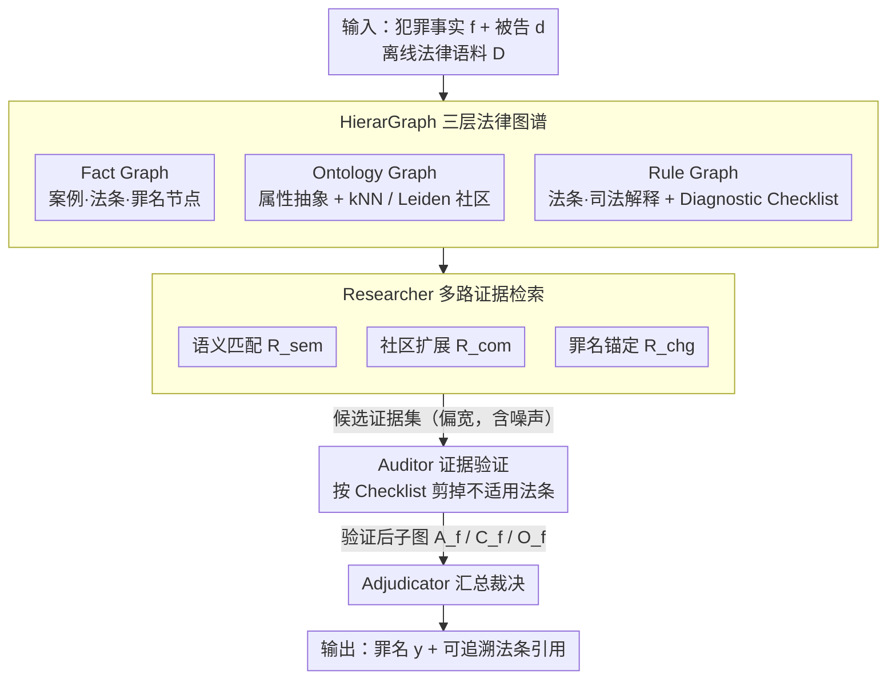

# LegalGraphRAG: Multi-Agent Graph Retrieval-Augmented Generation for Reliable Legal Reasoning

**会议**: ACL2026  
**arXiv**: [2605.28120](https://arxiv.org/abs/2605.28120)  
**代码**: https://github.com/XMUDeepLIT/LegalGraphRAG  
**领域**: GraphRAG / 法律推理  
**关键词**: 法律 RAG、层级知识图谱、多智能体、证据验证、可追溯推理  

## 一句话总结
LegalGraphRAG 用事实图、 ontology 图和规则图构成层级法律图谱，再用 Researcher-Auditor-Adjudicator 三代理流程完成检索、验证和裁决，在法律判决生成中提升准确性与证据可追溯性。

## 研究背景与动机
**领域现状**：RAG 是把通用 LLM 迁移到专业领域的常用手段，GraphRAG 进一步把文档组织成关系图以支持多跳检索和更连贯的推理。法律推理尤其依赖外部知识，因为案件事实、法条和司法解释之间存在复杂依赖。

**现有痛点**：标准 RAG 把文本块当成相互独立的检索单元，容易只按表面语义相似度取上下文。传统 GraphRAG 虽然有结构，但很多实现仍是扁平图，难以区分案件事实、抽象法条和适用条件。更严重的是，retrieve-then-generate 通常缺少显式证据验证，模型可能用无关材料给出看似正确但不可追溯的判决。

**核心矛盾**：法律任务需要同时满足“找全相关证据”和“只使用有效证据”。检索越宽，噪声越多；检索越窄，又可能漏掉关键法条或相似案例。没有层级组织和验证机制时，LLM 很难判断哪些证据真正支持裁决。

**本文目标**：作者希望构建一个面向法律推理的 GraphRAG 框架，既能按不同抽象层级组织法律知识，又能在生成判决前验证证据适用性，并输出可追溯的法条依据。

**切入角度**：论文先做 preliminary study，证明扁平检索有 granularity bias，且标准 RAG 对无关文档非常敏感；然后把解决方案拆成两个组件：HierarGraph 解决知识粒度问题，多代理流程解决证据验证问题。

**核心 idea**：把法律知识拆成 Fact/Ontology/Rule 三层图谱，并让 Researcher 检索候选证据、Auditor 验证法条适用性、Adjudicator 综合已验证证据生成判决。

## 方法详解
LegalGraphRAG 的关键不是单纯「把法律文档放进图里」，而是把法律推理过程结构化：先按不同抽象层级组织法律知识，再根据案件事实在层级图中找证据，用规则图里的 checklist 和司法解释做验证，最后只基于验证后的子图生成可追溯的判决。

### 整体框架
输入是一段犯罪事实描述 $f$ 和被告 $d$，系统先基于离线法律语料 $\mathcal{D}$ 构建法律知识图 $KG=\Phi(\mathcal{D})$。查询时检索器从图中取上下文 $\mathcal{C}=\mathcal{R}(f,d,KG)$，生成器再据此推断罪名 $y$。整条流程被拆成两个阶段：第一阶段是 Hierarchical Knowledge Construction，把历史案例、法条、司法解释、案件特征和罪名组织进分层的 HierarGraph；第二阶段是 Evidence-based Legal Reasoning，由三个代理串联——Researcher 从 ontology/fact graph 检索候选案例和法条，Auditor 用 rule graph 验证法条是否适用，Adjudicator 汇总确认后的法条、案例和罪名节点生成带引用的最终判断。

### 关键设计

**1. HierarGraph 三层法律图谱：把事实、概念、规则分层，避免扁平图混淆粒度**

法律判断常取决于事实细节是否满足某条法条的适用条件，但扁平图只按语义相似度检索，很容易找到「叙述相似」的案例却漏掉决定罪名的抽象规则。HierarGraph 因此把知识显式分成三层：Fact Graph 连接 Cases、Articles 和 Offense 节点，承载具体事实；Ontology Graph 把原始案情抽象成被告属性、犯罪行为、受害者特征、主观心态等维度，并用 kNN 加 Leiden 社区把相似案例聚到一起；Rule Graph 连接法条与司法解释，并为每条法条附上 Diagnostic Checklist。三层各司其职，检索时就能分别命中相似事实、抽象概念和适用条件，而不是把它们揉成一锅。

**2. Researcher 多路证据检索：用三条互补路径覆盖不同类型的候选证据**

单一检索路径要么偏向高频事实，要么困在局部相似案例里，覆盖不全。Researcher 把检索结果定义成三种 operator 的并集

$$\mathcal{R}(q)=\mathcal{R}_{sem}(q)\cup\mathcal{R}_{com}(q)\cup\mathcal{R}_{chg}(q)$$

分别对应语义匹配检索、社区扩展检索和罪名锚定检索：$\mathcal{R}_{sem}$ 抓直接相似的案情，$\mathcal{R}_{com}$ 顺着 Ontology Graph 的社区把相关上下文补全，$\mathcal{R}_{chg}$ 则从候选罪名反向锚定可能适用的法条。三路并集让证据池同时覆盖直接相似、社区上下文和潜在罪名依据，把「漏检关键法条」的风险压下来。

**3. Auditor 与 Adjudicator 证据闭环：先验证证据适用性，再把裁决绑定到可追溯依据**

法律场景最不能接受的是「答案对但证据不支持」——retrieve-then-generate 缺少验证时，模型可能拿无关材料给出看似正确的判决。这里 Auditor 对每个候选法条逐一用 Diagnostic Checklist 和司法解释核对案件事实是否满足适用条件，把不适用的法条及其相关节点直接剪掉；Adjudicator 再只用验证后的法条 $\mathcal{A}^f$、案例 $\mathcal{C}^f$、本体节点 $\mathcal{O}^f$ 生成判决

$$\mathcal{J}=Adjudicator(q\oplus\mathcal{A}^f\oplus\mathcal{C}^f\oplus\mathcal{O}^f)$$

这一步把黑箱生成改成可审计的证据链：每条结论都能回溯到验证过的法条和案例，显著减少 unsupported correctness。

### 一个完整示例
给定一段犯罪事实 $f$ 和被告 $d$，Researcher 先在 HierarGraph 上跑三路检索：$\mathcal{R}_{sem}$ 按语义召回几个叙述相近的历史案例，$\mathcal{R}_{com}$ 沿 Ontology Graph 的社区把同类犯罪行为的相邻案例补进来，$\mathcal{R}_{chg}$ 从候选罪名反查可能适用的法条，三路并集得到一个偏宽的候选证据集（含若干法条 + 案例）。接着 Auditor 拿 Rule Graph 里每条候选法条的 Diagnostic Checklist 逐项核对：满足适用条件的法条保留，不满足的（比如主观心态对不上、行为要件缺失）连同其挂的节点一起剪掉，候选集收窄成一组「确实适用」的法条与案例。最后 Adjudicator 只读这组验证后的 $\mathcal{A}^f/\mathcal{C}^f/\mathcal{O}^f$，生成罪名判断并附上引用的法条编号——结论里每一条依据都来自被核对过的证据，而非检索池里的全部噪声。

### 损失函数 / 训练策略
本文主要是框架与系统评测，没有提出端到端训练损失。实现上使用 GPT-4o-mini 做图构建，BGE-m3 生成 embedding，推理阶段可接不同 backbone，主实验默认使用 Qwen3-8B。评测指标使用 Accuracy 和 Micro-F1，数据集包括 CAIL2018 与 CMDL，覆盖 Public Safety、Economic Offenses、Social Order 和 Person Rights 等犯罪子领域。

## 实验关键数据

### 主实验
论文先用 preliminary study 量化标准 RAG 的两个问题：扁平检索无法处理知识粒度，且无验证机制时对噪声极敏感。下面是检索噪声实验中的生成质量下降。

| 方法 | Charge ACC | Articles ACC | Term MAE(月) | 相比正确上下文 |
|------|------------|--------------|--------------|----------------|
| RAG (Correct Context) | 42.8 | 74.7 | 24.3 | 基准 |
| RAG + 2 Irrelevant Docs | 34.9 | 57.2 | 27.7 | Charge -7.9, Articles -17.5, MAE +3.4 |
| RAG + 4 Irrelevant Docs | 32.9 | 51.1 | 28.4 | Charge -9.9, Articles -23.6, MAE +4.1 |
| RAG + 6 Irrelevant Docs | 29.8 | 46.8 | 31.7 | Charge -13.0, Articles -27.9, MAE +7.4 |

正式评测中，LegalGraphRAG 在 CAIL 和 CMDL 上相对强基线取得 6.3% 到 19.1% 的提升；相对 LegalDelta 和 ADAPT 的平均提升分别为 7.1% 和 6.7%。缓存中还报告它可与不同 backbone 结合，在 CMDL 上达到 78.7% 的峰值表现。

### 消融实验
| 配置 | CAIL ACC | Δ | 说明 |
|------|----------|---|------|
| LegalGraphRAG (Full) | 40.9 | - | 完整层级图 + 三代理流程 |
| w/o HierarGraph | 33.7 | -7.2 | 最大下降，说明层级知识组织最关键 |
| w/o Researcher | 36.9 | -4.0 | 多路检索覆盖不足 |
| w/o Semantic Match | 39.1 | -1.8 | 直接语义检索仍有贡献 |
| w/o Community Exp. | 38.5 | -2.4 | 社区扩展帮助补充结构上下文 |
| w/o Charge-Anchored | 39.3 | -1.6 | 罪名锚定补足法律依据 |
| w/o Auditor | 37.5 | -3.4 | 缺少验证会降低裁决可靠性 |

### 关键发现
- 扁平检索存在 granularity bias。论文的 preliminary study 显示，朴素 hierarchical strategy 比 flat strategy 的检索表现提升 25.3%。
- 无关文档会迅速破坏标准 RAG：加 6 个 irrelevant docs 后，法条预测准确率从 74.7 降到 46.8，刑期 MAE 从 24.3 月升到 31.7 月。
- HierarGraph 是最重要组件，移除后 CAIL ACC 下降 7.2；Researcher 和 Auditor 分别下降 4.0 与 3.4，说明检索覆盖和证据验证都不可少。
- 论文强调 LegalGraphRAG 提升 Traceable Correct 比例，减少“答案正确但证据链不支持”的 unsupported correctness。

## 亮点与洞察
- 这篇论文把法律 RAG 的关键问题说得很准：不是“有没有检索”，而是检索到的信息是否处在正确法律粒度、是否被验证过。
- HierarGraph 的三层拆分有很强领域合理性。案件事实、法律概念和规则条件本来就不是同一类节点，强行扁平化会让模型在噪声中迷失。
- Researcher-Auditor-Adjudicator 的分工贴合法律工作流：找材料、核材料、下结论。这个结构比单个 LLM 读 context 直接回答更可审计。
- 论文对“unsupported correctness”的强调很重要。法律、医疗等高风险领域不能只看最终答案准确率，还要看答案是否由有效证据支撑。

## 局限与展望
- 作者明确指出当前框架只处理单模态文本法律证据。真实司法场景还包括照片、监控视频、手写扫描件、庭审录音等非文本证据。
- 目前非文本证据需要先转写或文本描述，可能丢失视觉/听觉细节，例如故意与过失的判断有时依赖视频线索。
- 图谱构建依赖 GPT-4o-mini 和 embedding 模型，若源文档解析、ontology 抽取或 checklist 生成有误，后续代理会继承这些错误。
- 未来方向可以把 multimodal nodes 纳入 Fact Graph，让文本证言、视觉证据和音频证据互相验证，更接近智能法院的完整证据链。

## 相关工作与启发
- **vs Naive RAG**: Naive RAG 直接把检索上下文交给 LLM，缺少层级结构和验证；LegalGraphRAG 先组织法律知识，再验证证据适用性。
- **vs standard GraphRAG**: 普通 GraphRAG 有关系结构，但未必区分事实、ontology 和规则层；本文的层级图更贴合法律知识本体。
- **vs legal-specific LLM / SFT**: 专门法律模型把知识内化到参数中，成本高且可能遗忘；LegalGraphRAG 用外部知识和证据链增强推理，可更新性更强。
- **对后续工作的启发**: 面向专业领域的 RAG 应把“证据粒度”和“证据验证”显式建模，而不是只优化 top-k retrieval 或 reranking。

## 评分
- 新颖性: ⭐⭐⭐⭐☆ 层级法律图谱与三代理验证流程结合自然，领域适配充分。
- 实验充分度: ⭐⭐⭐⭐☆ 有 preliminary study、主实验、可靠性分析、case study 和组件消融；多模态与跨法域泛化仍待验证。
- 写作质量: ⭐⭐⭐⭐☆ 动机和系统结构清楚，个别表格较大且排版复杂。
- 价值: ⭐⭐⭐⭐⭐ 对法律 RAG、可信问答和高风险领域 evidence-grounded generation 很有参考价值。

<!-- RELATED:START -->

## 相关论文

- [\[ACL 2026\] EA-Agent: A Structured Multi-Step Reasoning Agent for Entity Alignment](ea-agent_a_structured_multi-step_reasoning_agent_for_entity_alignment.md)
- [\[ACL 2026\] MegaRAG: Multimodal Knowledge Graph-Based Retrieval Augmented Generation](megarag_multimodal_knowledge_graph-based_retrieval_augmented_generation.md)
- [\[ACL 2026\] STEM: Structure-Tracing Evidence Mining for Knowledge Graphs-Driven Retrieval-Augmented Generation](stem_structure-tracing_evidence_mining_for_knowledge_graphs-driven_retrieval-aug.md)
- [\[ACL 2026\] TagRAG: Tag-guided Hierarchical Knowledge Graph Retrieval-Augmented Generation](tagrag_tag-guided_hierarchical_knowledge_graph_retrieval-augmented_generation.md)
- [\[CVPR 2026\] M3KG-RAG: Multi-hop Multimodal Knowledge Graph-enhanced Retrieval-Augmented Generation](../../CVPR2026/graph_learning/m3kg_rag_multi_hop_multimodal_knowledge_graph_enhanced_retrieval_augmented_genera.md)

<!-- RELATED:END -->
