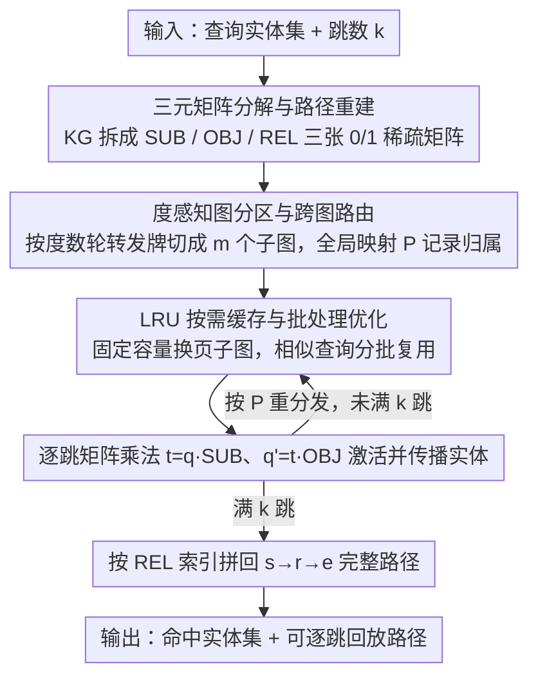

# LogosKG: Hardware-Optimized Scalable and Interpretable Knowledge Graph Retrieval

**会议**: ACL 2026  
**arXiv**: [2604.18913](https://arxiv.org/abs/2604.18913)  
**代码**: [GitHub](https://github.com/LARK-NLP-Lab/LogosKG)  
**领域**: 图学习/知识图谱  
**关键词**: 知识图谱检索, 硬件对齐优化, 多跳遍历, 稀疏矩阵运算, KG-LLM交互

## 一句话总结

本文提出 LogosKG，一个硬件对齐的知识图谱检索框架，通过将图遍历转化为三元稀疏矩阵（SUB/OBJ/REL）的乘法运算，配合度感知图分区、跨图路由和按需缓存，在单设备上实现了对十亿边规模 KG 的可扩展、可解释高跳检索，并通过下游 KG-LLM 交互实验揭示了图拓扑结构对 LLM 诊断推理的影响。

## 研究背景与动机

**领域现状**：知识图谱与 LLM 的结合日益重要——KG 提供结构化、可验证的推理支撑，尤其在医学诊断等高风险领域。多跳检索是 KG 的基础操作，但传统图遍历算法（DFS/BFS）在大规模 KG 上计算成本为 $O(|V|+|E|)$，且可达实体随跳数指数增长。

**现有痛点**：(1) 生物医学 KG（如 UMLS 407K 节点/3.4M 边，PubMedKG 54.4M 节点/86.5M 边）仅加载就占用 1.5-23.5 GB 内存，2-hop 扩展可涉及 10⁹ 条可达边；(2) 现有系统在矩阵化表示、可扩展性、路径重建三个维度上只能优化一两个——GraphBLAS 支持矩阵但不可扩展也无路径重建，Neo4j 可扩展且有路径重建但非矩阵化；(3) GPU 框架（DGL、PyG）优先于训练而非检索。

**核心矛盾**：高跳检索需要三个属性同时满足——矩阵化运算（利用硬件并行）、可扩展性（处理超出内存的大图）、路径重建（支持可解释推理）——但现有系统无法三者兼得。

**本文目标**：构建一个在单设备硬件上同时满足这三个属性的统一框架，并利用其高跳检索能力系统性地研究 KG 拓扑对 LLM 推理的影响。

**切入角度**：将 KG 分解为三个稀疏关联矩阵（SUB、OBJ、REL），将图遍历转化为稀疏矩阵乘法，天然适配 CPU/GPU 的并行计算架构。

**核心 idea**：通过 KG 三元矩阵分解 + 度感知分区 + 跨图路由 + LRU 按需缓存，将理论形式化转化为实用的大规模检索系统，实现 $\mathcal{O}(|\mathcal{E}| \log |\mathcal{E}| + |\mathcal{T}|)$ 的分区复杂度。

## 方法详解

### 整体框架

LogosKG 把"在大规模 KG 上做多跳检索"这件事重新表述成稀疏矩阵的连乘问题：先将整张 KG 分解成 SUB（实体→三元组）、OBJ（三元组→实体）、REL（三元组→关系）三个 0/1 稀疏关联矩阵，于是一跳遍历就等价于查询向量乘以 $\mathbf{SUB}\cdot\mathbf{OBJ}$，k 跳就是迭代 k 次，让 CPU/GPU 的并行硬件直接吃下整个遍历。对于装不进内存的超大图，框架再叠一层"度感知分区 + 跨图路由 + LRU 按需缓存"的内存管理：输入是查询实体集合和跳数，中间在分区子图上逐跳做矩阵乘法并按需换页，输出是命中实体集合外加可逐跳回放的完整路径。

### 关键设计

**1. 三元矩阵分解与路径重建：把遍历变成乘法，又不丢边的出处**

矩阵化检索最大的诱惑是硬件友好，最大的代价是"聚合即遗忘"——像 GraphBLAS 那样把邻接矩阵一乘，谁连到谁的边信息就被求和淹没了，路径再也拼不回来。LogosKG 的做法是把一条边拆进三张独立矩阵：$\mathbf{SUB}\in\{0,1\}^{|\mathcal{E}|\times|\mathcal{T}|}$ 记实体激活了哪些三元组，$\mathbf{OBJ}\in\{0,1\}^{|\mathcal{T}|\times|\mathcal{E}|}$ 记三元组指向哪些客体，$\mathbf{REL}\in\{0,1\}^{|\mathcal{T}|\times|\mathcal{R}|}$ 单独保留三元组到关系的映射。每一跳 $h$ 先用 $\mathbf{t}^{(h)}=\mathbf{q}^{(h-1)}\cdot\mathbf{SUB}$ 激活一批三元组，再对每个激活的 $t$ 从三张矩阵里分别读出主体、关系、客体，原地拼出 $s_h\xrightarrow{r_h}e_h$。

关键在于 REL 矩阵被刻意从乘法主链里摘了出来：它不参与"算到哪些实体"的传播，只在需要时按三元组索引被查一次。这样路径重建是零额外开销的副产品——逐跳记下激活三元组即可完整回放，可解释性不再以牺牲矩阵化为代价。

**2. 度感知图分区与跨图路由：发牌式切图，避免热点节点撑爆某个子图**

随机切图的隐患是高度数节点（hub）可能挤在同一子图，造成该子图既大又慢的负载倾斜。LogosKG 改用"洗牌发牌"：先按主体实体的度数排序，再轮转着把它们交替发到 $m$ 个子图里，让 hub 均匀摊开；同一主体的全部三元组绑定在同一子图以保持结构完整。整个分区的预处理复杂度为 $\mathcal{O}(|\mathcal{E}|\log|\mathcal{E}|+|\mathcal{T}|)$，相对检索本身可忽略。

跨图路由靠一份全局元数据映射 $P:\mathcal{E}\to\{1,\ldots,m\}$ 维护：每跳在各子图本地算完后，把结果合并成一个全局查询向量，再按 $P$ 把下一跳需要的实体重新分发到相应子图。于是"超出内存"被拆解成"逐子图按需计算"，单设备也能跑十亿边规模的高跳遍历。

**3. LRU 按需缓存与批处理优化：让换页频率逼近真实需求，而非逐查询抖动**

光有分区还不够，若逐条查询临时加载子图，磁盘 I/O 会被频繁触发。LogosKG 维护一个固定容量 $n$ 的内存缓存，用 LRU 策略管理子图的加载与驱逐，使期望检索成本写成 $\mathbb{E}[\tau_{\text{retrieval}}]=h\cdot\tau_{\text{mm}}+(1-h)\cdot(\tau_{\text{mm}}+\tau_{\text{io}})$——命中率 $h$ 越高，被 $\tau_{\text{io}}$ 拖累的比例越小，延迟越接近纯内存计算。

进一步地，框架在查询层做批处理来抬高时间局部性：把对子图需求相似的查询分到一组连续处理，让同一批查询复用刚换进缓存的子图，从而摊薄缺失代价。这一招利用的是真实查询负载里普遍存在的子图共享性，缓存因此换页更少、命中更稳。

### 损失函数 / 训练策略

LogosKG 是确定性检索系统，整条流水线不含可学习参数、也不需要训练；检索保真度与传统遍历完全一致。工程上提供 Numba、SciPy 和 Torch（支持 CPU/GPU）三套后端实现，便于在不同硬件上落地。

## 实验关键数据

### 主实验

**UMLS KG 检索效率（查询时间 ms，超时率 %）**

| 方法 | 1-hop QT | 3-hop QT | 5-hop QT | 5-hop 超时率 |
|------|---------|---------|---------|-----------|
| NetworkX | 0.21 | 93.92 | 1511.28 | 0.00 |
| igraph | 1.15 | 309.90 | - | - |
| LogosKG (CPU) | ~0.1 | ~10 | ~100 | 0.00 |
| LogosKG (GPU) | ~0.05 | ~5 | ~50 | 0.00 |

### 消融实验

**PubMedKG (100×UMLS) 可扩展性**

| 配置 | 说明 |
|------|------|
| 无分区 | 内存溢出（23.5 GB 原始数据） |
| 分区 + 按需缓存 | 成功在单设备上完成 5-hop 检索 |
| 分区 + 批处理优化 | 进一步减少 I/O 开销 |

### 关键发现

- LogosKG 在 UMLS 上比 NetworkX 快约一个数量级，且差距随 hop 深度增大（矩阵运算的并行优势在高跳时更明显）
- 在 PubMedKG（54.4M 节点/86.5M 边）上，其他单机系统均无法完成高跳检索，LogosKG 通过分区+缓存成功执行
- KG-LLM 交互实验揭示了结构性鸿沟——KG 拓扑（跳数分布、连通性）与 LLM 诊断推理之间存在系统性偏差
- 检索保真度为 100%——LogosKG 的确定性矩阵运算与传统遍历结果完全一致

## 亮点与洞察

- 将 KG 遍历转化为稀疏矩阵乘法的思路看似简单但极其有效——利用了现代硬件对矩阵运算的深度优化（SIMD、GPU tensor cores），将系统瓶颈从图遍历转移到内存管理
- REL 矩阵的保留是路径重建的关键创新——其他矩阵化方法（如 GraphBLAS）在矩阵乘法中丢失了边信息，LogosKG 通过独立维护三元组-关系映射在零额外开销下实现可解释性
- 度感知分区的"发牌"策略简洁高效——O(|E|log|E|+|T|) 的复杂度使得预处理成本可忽略

## 局限与展望

- 实验主要聚焦生物医学 KG，虽然框架是领域无关的但缺乏其他领域验证
- LRU 缓存在查询分布高度不均匀时可能效率下降
- KG-LLM 交互实验为初步探索，下游推理组件的选择（学习型 vs 非学习型）需要更深入研究
- 未与分布式系统（如 TigerGraph 集群）在大规模场景下做公平对比

## 相关工作与启发

- **vs Neo4j/TigerGraph**: 数据库引擎提供丰富查询语言但需要分布式基础设施，LogosKG 在单设备上通过矩阵化实现同等可扩展性
- **vs GraphBLAS**: 矩阵化但无路径重建也不可扩展，LogosKG 通过 REL 矩阵+分区补齐
- **vs DGL/PyG**: GPU 框架优先于训练而非检索，LogosKG 专注于检索效率

## 评分

- 新颖性: ⭐⭐⭐⭐ 三元矩阵分解+度感知分区的组合是新颖的系统设计
- 实验充分度: ⭐⭐⭐⭐ 多基线对比+可扩展性验证+KG-LLM交互，但领域较单一
- 写作质量: ⭐⭐⭐⭐ 系统论文写得清晰，算法伪代码和复杂度分析完整
- 价值: ⭐⭐⭐⭐ 解决了大规模KG高跳检索的实际系统瓶颈，开源可复用

<!-- RELATED:START -->

## 相关论文

- [\[ACL 2026\] MegaRAG: Multimodal Knowledge Graph-Based Retrieval Augmented Generation](megarag_multimodal_knowledge_graph-based_retrieval_augmented_generation.md)
- [\[ACL 2026\] Autonomous Knowledge Graph Exploration with Adaptive Breadth-Depth Retrieval](autonomous_knowledge_graph_exploration_with_adaptive_breadth-depth_retrieval.md)
- [\[ACL 2026\] TagRAG: Tag-guided Hierarchical Knowledge Graph Retrieval-Augmented Generation](tagrag_tag-guided_hierarchical_knowledge_graph_retrieval-augmented_generation.md)
- [\[ICML 2026\] Full-Spectrum Graph Neural Network: Expressive and Scalable](../../ICML2026/graph_learning/full-spectrum_graph_neural_network_expressive_and_scalable.md)
- [\[ICML 2025\] TopInG: Topologically Interpretable Graph Learning via Persistent Rationale Filtration](../../ICML2025/graph_learning/toping_topologically_interpretable_graph_learning_via_persistent_rationale_filtr.md)

<!-- RELATED:END -->
