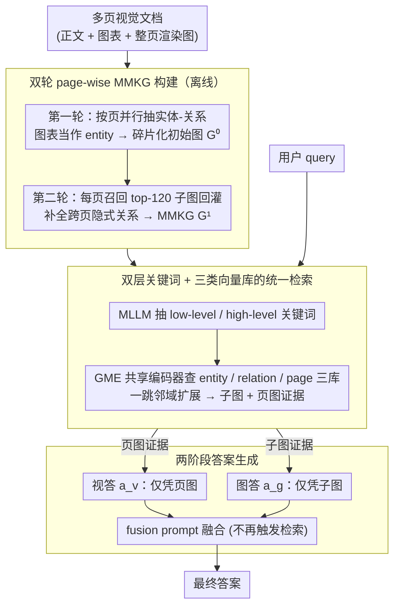

<!-- 由 src/gen_stubs.py 自动生成 -->
# MegaRAG: Multimodal Knowledge Graph-Based Retrieval Augmented Generation

**会议**: ACL 2026  
**arXiv**: [2512.20626](https://arxiv.org/abs/2512.20626)  
**代码**: https://github.com/AI-Application-and-Integration-Lab/MegaRAG (有)  
**领域**: 多模态 RAG / 知识图谱  
**关键词**: 多模态知识图谱, RAG, 跨模态推理, 视觉文档 QA, MLLM

## 一句话总结
MegaRAG 利用 MLLM 在长文档每一页并行抽取实体-关系并合并为多模态知识图谱（MMKG），再用"子图引导"的二轮 refinement 补全跨模态、跨页关系，配合双路检索与两阶段答案生成显著优于 GraphRAG/LightRAG/VisRAG，在 SlideVQA(2k) 上准确率 64.85%（baseline 最高 27.66%）。

## 研究背景与动机
**领域现状**：RAG 把外部知识塞给 LLM 已经成为长文档问答的事实标准；其中 GraphRAG / LightRAG 这一类 KG-based RAG 引入"实体-关系图"，比 chunk-级稀疏/稠密检索更擅长多跳推理，能在百万 token 量级的语料上保持可扩展性。

**现有痛点**：1) 现有 KG-based RAG 几乎全是 **纯文本** 的——把书里的图表、流程图、地图等视觉信息扔掉了，而 slide deck、技术报告这类视觉文档的核心信息恰恰在图上；2) 即便存在多模态 RAG（VisRAG、ColPaLi、GME），它们只做 page-image 级的稠密检索，**没有任何结构抽象**，无法支撑跨页多跳推理；3) 受 MLLM 上下文窗口限制，GraphRAG/LightRAG 都是 chunk 内独立抽取再合并，**跨 chunk/跨页关系**被切断了，初始图天然碎片化。

**核心矛盾**：要"结构化抽象"就必须分页/分块抽取，要"全局覆盖"就要看到整本书——两者在 MLLM 上下文窗口下不可兼得。同时，要"利用图像"就必须把图像塞进 prompt，但塞太多又会让模型 dominate 在文本上，产生模态偏置。

**本文目标**：(i) 自动地、可扩展地从视觉文档构建 MMKG；(ii) 在受限上下文窗口下让每页"看到"全局图；(iii) 让答案生成同时吸收图结构 + 视觉证据而不偏科。

**切入角度**：作者观察到——initial KG 虽然碎片化，但已经是一份"压缩版的全局知识"。如果在第二轮 refinement 时把 **当前页对应的子图** 当作提示注回给 MLLM，既保留了全局长程依赖，又不会撑爆 prompt。

**核心 idea**：用"page-wise 并行初构 + 子图引导的全局精炼"两轮构图来打破"局部抽取 vs 全局覆盖"的 trade-off，再用双流（图答 + 视觉答）+ 后融合的两阶段生成消除模态偏置。

## 方法详解

### 整体框架

MegaRAG 想解决的是"视觉长文档问答"：输入是 slide deck、技术报告这类图文混排的多页文档和一句自然语言 query，输出是同时吸收了图结构与视觉证据的答案。它的总思路是先把文档离线建成一张多模态知识图谱（MMKG），再在查询时双路取证、两阶段生成。建图分两轮——第一轮按页并行抽实体关系拿到碎片化的初始图，第二轮把"每页最相关的那一小块子图"回灌给 MLLM 补全跨页关系；查询时让一句 query 既查 KG 又查页图，最后用图答和视答各出一份中间结论再融合，避免模型在图文混输时偏科。

### 关键设计

**1. 双轮 page-wise MMKG 构建：用"子图回灌"打破局部抽取与全局覆盖的两难**

受 MLLM 上下文窗口所限，整本书喂不进去，于是只能按页抽；可一旦按页切，跨页关系就被切断、初始图天然碎片化——这是 GraphRAG/LightRAG 共有的硬伤。MegaRAG 第一轮对每页独立提取 $(E,R)_i^0 = G(P_i)$，输入 $P_i=\{T_i,F_i,B_i,I_i\}$（正文、figure 图、table 图、整页渲染图），并把图表本身当作一个 entity（"Annual Sales by Vehicle Type"这张柱状图就是一个节点），整页图 $I_i$ 只供空间推理上下文不产 entity，合并时按 entity name 与 (source, target, type) 三元组去重并聚合 description，得到碎片化但已是"压缩版全局知识"的 $\mathcal{G}^0$。

第二轮精炼写作 $(E,R)_i^1 = R(P_i, \mathcal{G}_i^0)$：用第一轮抽到的 entity name 和 relation keyword 当 query，去 $\mathcal{G}^0$ 检索一个语义 top-120 + 一跳邻域的轻量子图 $\mathcal{G}_i^0$（截到 32K token），连同原始 $P_i$ 让同一个 MLLM "对照全局"补回本页漏掉的 entity 与隐式关系（如把正文"Electric vehicle sales increased in 2023"与图节点用 `illustrates` 连起来）。妙处在于只在第二轮"看子图"而非把整张 $\mathcal{G}^0$ 塞进 prompt：既不爆 token、又保住按页并行，还能召回跨页折线图与正文实体的连线。与 GraphRAG/LightRAG 的 chunk-内 gleaning 不同，这是跨页的全局信息回流，作者只跑一轮即收效明显。

**2. 双层关键词 + 三类向量库的统一检索：一句 query 同时拿局部实体、全局结构和视觉页证据**

只用 entity 检索会漏 relation 上下文，只用 relation 检索又会漏孤立 entity，而"找具体人名"和"找整章主题"本是两种粒度。MegaRAG 让 query 进来先由 MLLM 抽 low-level / high-level 两类 keyword，一起送进 entity 向量库取 top-$k=60$，并行送进 relation 向量库取 top-$k$（每条 relation 顺带把 source/target entity 拉出），再对命中 entity 做一跳邻域扩展；同时把 query 编码后查 page-image 库取 top-$m=6$ 作为视觉证据。

三类向量（entity、relation、page）共享同一个 GME (Qwen2-VL-2B) 编码器，落到同一个稠密空间，于是 text→entity / text→relation / text→page 的跨模态检索得以在一套编码器里完成。这正是 MegaRAG 兼顾两端的支点：VisRAG/ColPaLi 有视觉检索却没有 KG，GraphRAG/LightRAG 有 KG 却检不了图像，而它用共享编码器把两边一次收齐。

**3. 两阶段答案生成：图答与视答先并行、后融合，刻意去模态偏置**

作者发现单次 prompt 同时塞进子图（文本）和页图（图像）时，MLLM 会"过度关注文本"——典型的模态偏置，视觉细节被淹没。MegaRAG 因此把生成解耦成两阶段：第一阶段并行跑两个 prompt，(a) 只喂检索到的页图、让模型仅凭视觉证据出中间答案 $a_v$，(b) 只喂子图、让模型仅凭结构化知识出中间答案 $a_g$。

第二阶段再用一个 fusion prompt 把 $(a_v, a_g)$ 综合成最终回答，融合阶段只做整合、不再触发检索。本质上这是一种廉价的 chain-of-experts / ensemble：两路独立给出可比的中间结论，融合时各取所长，因而在 Diversity 与 Empowerment 维度提升最明显，代价只是多调一次 MLLM。

### 一个完整示例

以一份 SlideVQA 财报 deck 上的问题"2023 年电动车销量为何上升"为例：建图阶段，含销量柱状图的那一页先在第一轮被抽成"电动车""2023""Annual Sales by Vehicle Type（图节点）"等碎片 entity；第二轮该页拿自己的 entity name 去 $\mathcal{G}^0$ 召回相邻的能源采购折线图子图，MLLM 据此补上"销量图 illustrates 正文结论""与可再生能源采购相关"等跨页关系，写入 $\mathcal{G}^1$。查询阶段，query 被拆成 low-level（"电动车销量"）与 high-level（"新能源趋势"）两类 keyword，分别命中 entity/relation 库并一跳扩展，同时直接召回那几张销量与能源页图。生成阶段，视答 $a_v$ 从页图读出柱状趋势，图答 $a_g$ 从子图读出"政策—采购—销量"的关系链，融合 prompt 把二者合成既有数字又有因果的最终答案。

### 损失函数 / 训练策略

MegaRAG 完全无需训练。建图与生成的所有 LLM 调用（GPT-4o-mini 建图/生成、GPT-4.1-mini 当 judge）都是 zero-shot prompting、temperature=0；GME-Qwen2-VL-2B 用现成多模态 encoder，单卡 RTX 3090 跑 encoding；文档解析用 MinerU 抽 text/figure/table；检索 $k=60$、$m=6$，refinement 跑 1 轮即足。这种"工程拼接"使它极易复用到任意新文档，当晚拿到就能跑。

## 实验关键数据

### 主实验

**UltraDomain 纯文本 global QA（vs LightRAG，胜率%，越高越好）**：

| 领域 | Comprehensiveness | Diversity | Empowerment | Overall |
|------|-------------------|-----------|-------------|---------|
| Agriculture | 65.6 vs 4.0 | 70.4 vs 10.4 | 76.0 vs 4.8 | **75.2 vs 4.8** |
| CS | 68.8 vs 3.2 | 72.0 vs 12.8 | 75.2 vs 10.4 | **76.8 vs 4.8** |
| Legal | 54.4 vs 9.6 | 69.6 vs 14.4 | 73.6 vs 12.0 | **72.0 vs 11.2** |
| Mix | 76.8 vs 3.2 | 76.8 vs 11.2 | 80.8 vs 4.0 | **80.0 vs 7.2** |

**多模态局部 QA（Accuracy %）**：

| 方法 | SlideVQA(2k) | FinReport | FinSlides | TechReport | TechSlides |
|------|--------------|-----------|-----------|------------|------------|
| NaiveRAG | 11.34 | 29.66 | 14.64 | 36.63 | 32.94 |
| GraphRAG (L) | 6.80 | 24.50 | 11.98 | 29.60 | 26.81 |
| LightRAG | 27.66 | 31.30 | 13.02 | 42.74 | 31.39 |
| **MegaRAG** | **64.85** | **39.51** | **58.37** | **51.51** | **60.86** |

SlideVQA(2k) 上 MegaRAG 是最强 baseline LightRAG 的 **2.3 倍**；FinSlides 上提升绝对值高达 **+45 pt**。

### 消融实验（DLCV / World History 多模态 global QA，胜率%）

| 配置 | DLCV Overall | World History Overall | 说明 |
|------|--------------|-----------------------|------|
| MegaRAG (full) | — | — | 完整模型 |
| A1: text-only graph | 14.4 / 57.6 / 28.0 | 1.6 / 78.4 / 20.0 | 构图阶段去掉所有视觉输入 |
| **A2: 仅页检索（无 MMKG）** | **0.0 / 100.0 / 0.0** | **0.8 / 91.2 / 8.0** | 去掉 KG 检索，仅依赖 page retrieval |
| A3: 单阶段融合生成 | 1.6 / 61.6 / 36.8 | 0.8 / 75.2 / 24.0 | 不解耦图答与视答 |

格式为 "A_x Win / MegaRAG Win / Tie"。

**MMKG 构建开销（World History 788 页）**：

| 项 | Init | Refinement | Total | GraphRAG |
|---|------|------------|-------|----------|
| Time (min) | 19.0 | 12.0 | 31.0 | 23.0 |
| KG Tokens (M) | 22.9 | 15.3 | 38.2 | 1.2 |

约为 GraphRAG 的 $1.4\times$ 索引时间，但抽出 473–538 个视觉 entity 是文本 baseline 完全拿不到的。推理延迟单 RTX 3090 上 ~42s/q（GME 26.4s），换强 GPU 可大幅下降。

### 关键发现
- **MMKG 检索是收益最大的模块**：A2 去掉 KG 后 MegaRAG 几乎 100% 胜出，说明视觉文档的多跳推理几乎完全靠结构化图，单纯页检索不可替代。
- **视觉 entity 构图是第二关键**：A1 去掉视觉后纯文本图丢失图表语义，在 DLCV 这种 slide-heavy 数据上掉得最猛——证明图表节点不是装饰而是真正提供 grounding。
- **两阶段生成对 Diversity / Empowerment 贡献最大**：A3 单 prompt 融合时 MLLM 会偏文本，导致回答缺少视觉证据带来的多样性。
- **判定模型偏差小**：作者用 Gemini-3-Flash 复跑同样实验，胜率排序与 GPT-4.1-mini 一致，Cohen's $\kappa = 0.72$。

## 亮点与洞察
- **"子图当 prompt"是个普适设计**：MegaRAG 没有把整张图塞回去，而是动态地为每页召回"它最相关的那一小块全局结构"。这一招可以直接迁移到任何"全局信息 + 局部 chunk"的精炼场景，比如长文档摘要、code 仓库分析、长视频理解。
- **图表作为一类 entity**：传统 KG 把节点限定为 named entity（人/地/机构），而本文把一张柱状图、一张地图都看作 entity 并接入文本节点，这种 "visual-as-entity" 的本体扩展为 MMKG 提供了简单可行的模式。
- **两阶段生成 = 廉价 ensemble**：图答 + 视答并行 + 后融合本质上是 expert ensemble，但成本只是多调一次 MLLM。比单纯多模态 prompt 更稳，比真正训练多 expert 模型便宜得多。
- **完全 training-free 仍达到 SOTA**：所有组件都是 zero-shot prompting + 现成 encoder，对工业落地极友好——拿到新文档当晚就能跑。

## 局限与展望
- **作者承认**：实验只在单本书/单份报告内构图，跨多本书的 cross-document QA 没做；图像处理成本高，多模态数据规模有限；每张 figure 被视为单一 entity 可能漏掉细粒度对象；MLLM 抽取本身可能 hallucinate，目前无验证机制。
- **自查**：refinement 只跑一轮，作者声称收敛但没给 2-3 轮的对比曲线；评测全靠 LLM-as-judge（GPT-4.1-mini / Gemini-3-Flash），对 win-rate 类指标存在系统偏差，缺少 BLEU/ROUGE/F1 这类参考型指标做对比；GPU 单卡 42s/q 的延迟对在线场景仍偏高。
- **改进方向**：(1) 把 figure 细化拆成多 sub-entity（柱、轴、legend），用 set-of-mark 等方式做细粒度 visual entity 抽取；(2) 在 refinement 时引入 self-consistency 投票来抑制幻觉关系；(3) 跨文档场景下需引入 entity linking / canonicalization 来融合多本书的 MMKG；(4) 把生成阶段 distill 成单模型，去掉两阶段的延迟开销。

## 相关工作与启发
- **vs GraphRAG (Edge et al., 2024)**：GraphRAG 做 community-level 全局摘要 + 多 query 聚合，开销随社区数线性涨；MegaRAG 用 page-wise subgraph refinement，避免重复全局 LLM 调用，且原生支持多模态。本文显著优于 GraphRAG 在所有维度。
- **vs LightRAG (Guo et al., 2025)**：本文沿用 LightRAG 的双层 keyword 检索，但替换了 backbone（文本→多模态）且加了 refinement；构图开销略高但 QA 质量在所有 benchmark 全面胜出。
- **vs VisRAG / ColPaLi / GME**：纯视觉 RAG，只做 page-image 检索，没有结构抽象；MegaRAG 把 GME 作为编码器复用，但额外加 MMKG 层做跨页推理。
- **vs MR-MKG / Query-driven MMKG**：MR-MKG 依赖人工构建 MMKG，无法 scale；Query-driven MMKG 在线动态建图，适合短 query；MegaRAG 做离线全局图，适合长文档反复查询。
- **启发**：用 LLM 自动构 KG 已经成熟，关键是如何"在受限上下文里让局部抽取看到全局"——子图回灌是个简单可复用的范式。对视觉文档来说，把"图当 entity"是性价比极高的本体设计。

## 评分
- 新颖性: ⭐⭐⭐⭐ "page-wise 并行 + 子图引导 refinement"在 MMKG 场景下是清晰、漂亮的解法，且 visual-as-entity 的 ontology 扩展是真正的多模态化。
- 实验充分度: ⭐⭐⭐⭐⭐ 8 个数据集（4 文本 + 4 多模态）+ 5 个 baseline（含 NaiveRAG / GraphRAG / LightRAG / VisRAG / GME / ColQwen / Query-driven）+ 完整 3-stage 消融 + 两个 judge model 交叉验证 + indexing/inference 开销分析。
- 写作质量: ⭐⭐⭐⭐ 方法图清晰，符号统一；附录给了 prompt 全文与 case study；个别地方文字稍重复，整体易读。
- 价值: ⭐⭐⭐⭐⭐ 完全 training-free + 公开代码 + 在 visual document QA 这一极具工业价值的场景上把 baseline 拉开一倍以上，落地友好。

<!-- RELATED:START -->

## 相关论文

- [\[CVPR 2026\] M3KG-RAG: Multi-hop Multimodal Knowledge Graph-enhanced Retrieval-Augmented Generation](../../CVPR2026/graph_learning/m3kg_rag_multi_hop_multimodal_knowledge_graph_enhanced_retrieval_augmented_genera.md)
- [\[ACL 2026\] TagRAG: Tag-guided Hierarchical Knowledge Graph Retrieval-Augmented Generation](tagrag_tag-guided_hierarchical_knowledge_graph_retrieval-augmented_generation.md)
- [\[ACL 2026\] STEM: Structure-Tracing Evidence Mining for Knowledge Graphs-Driven Retrieval-Augmented Generation](stem_structure-tracing_evidence_mining_for_knowledge_graphs-driven_retrieval-aug.md)
- [\[ACL 2025\] Knowledge Graph Retrieval-Augmented Generation for LLM-based Recommendation (K-RagRec)](../../ACL2025/graph_learning/kg_rag_recommendation.md)
- [\[ACL 2026\] LegalGraphRAG: Multi-Agent Graph Retrieval-Augmented Generation for Reliable Legal Reasoning](legalgraphrag_multi-agent_graph_retrieval-augmented_generation_for_reliable_lega.md)

<!-- RELATED:END -->
