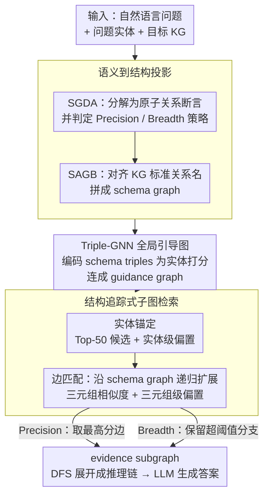

# STEM: Structure-Tracing Evidence Mining for Knowledge Graphs-Driven Retrieval-Augmented Generation

**会议**: ACL2026  
**arXiv**: [2604.22282](https://arxiv.org/abs/2604.22282)  
**代码**: https://github.com/PennyYu123/STEM_RAG  
**领域**: 图学习 / 知识图谱问答 / KG-RAG  
**关键词**: 知识图谱问答、多跳推理、结构化检索、GNN、RAG

## 一句话总结
STEM 将知识图谱多跳问答从逐步路径搜索改写为“先生成查询结构图、再按结构追踪证据子图”的问题，通过语义到结构投影、Triple-GNN 全局引导和结构匹配检索，在 WebQSP 与 CWQ 上显著提升 KG-RAG 的答案准确率和证据覆盖率。

## 研究背景与动机
**领域现状**：知识图谱增强的 RAG 通常希望把自然语言问题转成可验证的结构化证据，再交给 LLM 生成答案。现有 KGQA 方法大致分为三类：LLM 先生成推理计划再取证据链、逐步 beam search 式路径探索，以及构造 schema graph 后做结构匹配。

**现有痛点**：自然语言问题和 KG schema 之间有明显错位。LLM 生成的关系名可能语义合理但在目标 KG 中不存在，局部路径搜索又容易被 hub 节点、伪相关边和局部相似度带偏，复杂问题所需的证据也经常不是单条路径，而是一个连通子图。

**核心矛盾**：多跳 KG-RAG 既需要语言模型理解问题语义，又需要检索过程尊重 KG 的真实拓扑。只依赖自然语言计划会产生 schema 幻觉，只依赖局部图搜索又缺少全局结构蓝图。

**本文目标**：作者希望把问题分解、schema 对齐、候选实体锚定和证据子图检索整合成一个结构化 pipeline，使检索结果既覆盖完整推理路径，又能控制交互式 LLM 调用成本。

**切入角度**：本文的观察是：多跳问题可以先投影成一个抽象查询 schema graph。只要这个图和 KG 中真实证据子图在结构上近似同构，检索就能从“猜下一跳”变成“按结构找匹配”。

**核心 idea**：用 KG schema 约束 LLM 的查询分解，并用 Triple-GNN 生成全局 guidance graph，让每一步实体和三元组匹配都带有全局结构先验。

## 方法详解

### 整体框架

STEM 把多跳 KGQA 从"让 LLM 一步步猜下一跳"改写成"先画结构蓝图、再按图索骥"：输入是自然语言问题、问题实体和目标 KG，输出是一张 query-specific evidence subgraph，最后被线性化成推理链交给 LLM 生成答案。中间分三层推进——先把问题投影成 KG 可执行的 schema graph，再用一个轻量图模型生成全局 guidance graph 注入结构先验，最后让检索器在真实 KG 上对照这两张图做结构追踪，把"猜下一跳"变成"找结构匹配"。

### 关键设计

**1. 语义到结构投影：先学问题模式、再做符号 grounding，压住 schema 幻觉**

直接让 LLM 生成关系名，常会写出语义合理却在目标 KG 里根本不存在的边——这是局部路径搜索被带偏的源头之一。STEM 把投影拆成两步：SGDA 先把复杂问题分解成若干"原子关系断言"，即共享中间变量的关系句，同时判定该问题该走 Precision 还是 Breadth 检索策略；SAGB 再把这些断言对齐到 KG 的标准关系名和三元组形式，拼成 schema graph。

先抽象出"问题需要什么样的关系结构"、再把它落到具体符号，这种"模式优先、grounding 在后"的分工，使语义合理但 KG 中不存在的路径在进入检索前就被过滤掉，schema 幻觉因此显著减少。

**2. Triple-GNN 全局引导图：在局部搜索动手前，先把"整题需要什么结构"注进每一步**

传统路径搜索只看当前这条边的局部相似度，极易被 hub 节点和近义关系误导。STEM 先把 schema triples 编码后汇聚成一个查询表示，用它初始化问题实体的节点向量，再让 Triple-GNN 在候选子图上传播、为每个实体打出概率分，挑出高分节点连成 guidance graph。

这张引导图本身不回答问题，而是充当全局先验：它提前告诉后续每一步匹配"整道题大概需要哪些实体、哪些三元组"，于是局部决策不再孤立，hub 与伪相关边的干扰被全局结构压制。

**3. 结构追踪式子图检索：实体锚定 + 边匹配双偏置，按 schema 递归长出证据子图**

检索分两段并都吸收 guidance graph 的偏置。实体锚定阶段对每个 question entity 取 Top-50 候选，并用实体级全局偏置放大 guidance graph 里被看好的节点；边匹配阶段沿 schema graph 的边递归扩展，每条候选边的分数由三元组语义相似度叠加三元组级偏置共同决定。

针对"复杂问答常需多答案或分支证据"这一现实，检索按 SGDA 的判定切换两种策略：Precision 贪心选最高分边，适合单答案、低延迟、高置信；Breadth 保留所有超阈值的边，允许结构分支以覆盖多答案。两种策略共用同一套打分，只是在"取一条还是取多条"上分流，从而兼顾精度与覆盖。

### 一个完整示例

以 CWQ 上一道两跳问题为例：SGDA 先把它拆成两条共享中间变量的原子断言（如"X 导演了电影 m""电影 m 的主演是谁"），并判定它需要 Breadth；SAGB 把断言里的关系词对齐成 KG 真实关系名，拼出一张含中间变量节点的 schema graph。接着 Triple-GNN 以这些查询三元组为条件，在候选子图上为实体打分，把高分的导演、电影、演员节点连成 guidance graph。最后检索器从问题实体锚点出发，先取 Top-50 候选并按实体偏置放大被看好的节点，再沿 schema graph 的边、用"三元组相似度 + 三元组偏置"逐跳匹配并递归扩展，最终长出一张覆盖多个演员答案的 evidence subgraph，DFS 展开成推理链送给 LLM。

### 损失函数 / 训练策略

STEM 为 SGDA、SAGB 和 Triple-GNN 各自构建了专门训练数据。SGDA/SAGB 采用 Structure-to-Query Reverse Generation 做数据增强：先从 KG 结构反向生成问题模式，再训练模型把自然语言问题投影回 schema graph；Triple-GNN 则学习在 query-specific subgraph 中预测高价值实体，让 guidance graph 更可能覆盖真实推理路径。最终答案生成不再训练大模型，而是把 evidence subgraph 经 DFS 展开成推理链、配指令提示送入 LLM——把创新集中在结构化检索侧，便于与 GPT-4o、Llama-3.1 等不同推理模型自由组合。

## 实验关键数据

### 主实验
主实验在 WebQSP 和 CWQ 两个 Freebase 多跳 KGQA 数据集上评估 Hit@1 与 F1。STEM 在同样使用强推理模型时仍能保持明显优势，说明收益主要来自证据检索结构，而不只是 LLM 参数知识。

| 方法 | 推理模型 | WebQSP Hit@1 | WebQSP F1 | CWQ Hit@1 | CWQ F1 |
|------|----------|--------------|-----------|-----------|--------|
| GPT-4o | GPT-4o | 61.80 | 43.60 | 38.20 | 32.90 |
| RoG | GPT-4o | 88.09 | 70.12 | 69.61 | 61.97 |
| FiDeLiS | GPT-4-turbo | 84.39 | 78.32 | 71.47 | 64.32 |
| STEM | Llama-3.1-8B | 86.63 | 71.05 | 68.76 | 60.81 |
| STEM | Llama-3.1-70B | 88.08 | 74.62 | 72.53 | 62.09 |
| STEM | GPT-4o | 90.94 | 76.18 | 74.09 | 65.33 |

STEM + GPT-4o 在三项指标上达到表内最强结果，尤其是 CWQ 这种组合式问题更多的数据集上，Hit@1 和 F1 都超过 RoG + GPT-4o。

### 消融实验

| 配置 | WebQSP Hit@1 | WebQSP F1 | CWQ Hit@1 | CWQ F1 | 说明 |
|------|--------------|-----------|-----------|--------|------|
| STEM + GPT-4o | 90.94 | 76.18 | 74.09 | 65.33 | 完整模型 |
| w/o 实体偏置与三元组偏置 | 86.31 | 70.80 | 63.91 | 55.59 | 去掉 guidance graph 的全局校正 |
| w/o 实体偏置 | 86.45 | 75.81 | 66.35 | 57.35 | 只保留三元组级校正 |
| w/o 三元组偏置 | 86.95 | 73.45 | 64.90 | 56.42 | 只保留实体级校正 |

| 查询规划 pipeline | WebQSP Hit@1 | WebQSP F1 | CWQ Hit@1 | CWQ F1 |
|--------------------|--------------|-----------|-----------|--------|
| Llama-3.1-70B few-shot | 77.74 | 61.21 | 46.68 | 41.83 |
| GPT-4o few-shot | 83.14 | 65.77 | 50.43 | 43.20 |
| STEM 自训练 pipeline | 90.94 | 76.18 | 74.09 | 65.33 |

### 关键发现
- 三元组级结构偏置比实体级偏置更关键，去掉三元组偏置会让 CWQ 指标大幅下降，说明结构关系的全局一致性是多跳检索的瓶颈。
- 多答案问题上，STEM 的 F1 在 WebQSP 答案数大于等于 10 的子集达到 62.46，高于 RoG 的 58.33 和 GNN-RAG 的 56.28。
- 证据覆盖率会随答案数增加而下降，但 WebQSP 单答案覆盖率仍有 81.90，CWQ 单答案覆盖率为 74.28，说明 retrieval graph 仍能较好覆盖真实推理路径。

## 亮点与洞察
- 论文把 KG-RAG 的关键问题定义为结构对齐，而不是简单的“让 LLM 多想几步”。这个视角很有价值，因为它解释了为什么很多交互式路径搜索方法会慢且不稳。
- SGDA/SAGB 的两段式投影把自然语言语义和 KG 符号空间分开处理，减少了端到端语义匹配的黑箱性，也让错误更容易定位。
- Precision/Breadth 策略是一个实用设计：单答案问题追求低延迟和高置信度，多答案问题允许结构分支，符合 KGQA 中不同问题类型的实际需求。
- Triple-GNN 的作用不是直接回答问题，而是提供检索先验。这种“轻量图模型辅助 LLM 检索”的范式可以迁移到企业知识图谱、法律条文图谱和医学实体图谱。

## 局限与展望
- STEM 依赖目标 KG 的 schema 和训练数据，当前实验主要围绕 Freebase 系 WebQSP/CWQ，迁移到新图谱时需要重新构造投影与 GNN 训练数据。
- 如果 SGDA/SAGB 一开始生成的 schema graph 偏离真实推理结构，后续结构匹配很难完全修复，错误会沿 pipeline 传播。
- Breadth 策略在多答案问题上提升覆盖率，但会增加检索延迟；真实系统中需要结合问题难度自适应设置阈值。
- 论文的最终答案仍由 LLM 生成，虽然证据更完整，但生成阶段是否忠实使用 evidence subgraph 仍需要单独评估。

## 相关工作与启发
- **vs RoG**: RoG 通过 LLM 生成 reasoning plans 并检索证据链，STEM 则先生成 schema graph 再做结构追踪；后者对 KG 拓扑更敏感，也更适合多答案和分支证据。
- **vs GNN-RAG**: GNN-RAG 用图神经网络辅助相关实体检索，STEM 的 Triple-GNN 进一步把查询三元组结构作为条件，强调三元组级一致性。
- **vs GraphRAG**: GraphRAG 关注社区摘要和全局文本检索，STEM 更偏实体关系级 KGQA，两者可以在层级化知识库中互补。
- **启发**: 对结构化知识库而言，RAG 的难点常常不是召回更多文本，而是让检索路径和问题逻辑同构；未来可以把 schema graph 生成扩展到 SQL、API graph 或工具调用计划。

## 评分
- 新颖性: ⭐⭐⭐⭐☆ 结构追踪与 Triple-GNN guidance 的组合很有辨识度，但建立在 KGQA 和 GNN-RAG 既有脉络上。
- 实验充分度: ⭐⭐⭐⭐☆ 主实验、细粒度分析和消融比较完整，跨 KG 类型和真实业务图谱的验证还可以更多。
- 写作质量: ⭐⭐⭐⭐☆ 方法链条清楚，附录实验丰富，但 pipeline 组件较多，读者需要跟住 SGDA、SAGB、Triple-GNN 和检索策略之间的依赖。
- 价值: ⭐⭐⭐⭐⭐ 对 KG-RAG 系统很有实践意义，尤其适合需要可解释证据子图的企业知识问答和结构化检索场景。

<!-- RELATED:START -->

## 相关论文

- [\[ACL 2026\] MegaRAG: Multimodal Knowledge Graph-Based Retrieval Augmented Generation](megarag_multimodal_knowledge_graph-based_retrieval_augmented_generation.md)
- [\[ACL 2025\] SimGRAG: Leveraging Similar Subgraphs for Knowledge Graphs Driven Retrieval-Augmented Generation](../../ACL2025/graph_learning/simgrag_leveraging_similar_subgraphs_for_knowledge_graphs_driven_retrieval-augme.md)
- [\[ACL 2025\] Knowledge Graph Retrieval-Augmented Generation for LLM-based Recommendation (K-RagRec)](../../ACL2025/graph_learning/kg_rag_recommendation.md)
- [\[ACL 2026\] LegalGraphRAG: Multi-Agent Graph Retrieval-Augmented Generation for Reliable Legal Reasoning](legalgraphrag_multi-agent_graph_retrieval-augmented_generation_for_reliable_lega.md)
- [\[ACL 2026\] TagRAG: Tag-guided Hierarchical Knowledge Graph Retrieval-Augmented Generation](tagrag_tag-guided_hierarchical_knowledge_graph_retrieval-augmented_generation.md)

<!-- RELATED:END -->
