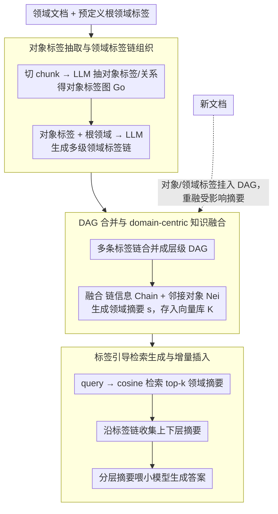

# TagRAG: Tag-guided Hierarchical Knowledge Graph Retrieval-Augmented Generation

**会议**: ACL 2026  
**arXiv**: [2601.05254](https://arxiv.org/abs/2601.05254)  
**代码**: 无  
**领域**: 图学习 / Graph RAG  
**关键词**: GraphRAG, 层级标签链, 知识图谱检索, 增量更新, 轻量 RAG

## 一句话总结
TagRAG 用“对象标签 + 领域标签链”替代 GraphRAG 中昂贵的实体社区划分和全图摘要，在保持全局知识整合能力的同时显著降低构图与检索成本，并在 UltraDomain 四个领域上以小模型 Qwen3-4B 获得高于 NaiveRAG、GraphRAG、LightRAG 和 MiniRAG 的胜率。

## 研究背景与动机
**领域现状**：RAG 已经成为让 LLM 接入外部知识的核心范式。传统 RAG 多依赖 chunk 级向量检索，适合局部事实查询；GraphRAG 则通过实体抽取、关系建图、社区划分和社区摘要，把知识提升到全局图结构层面，适合 query-focused summarization 和跨文档综合回答。

**现有痛点**：GraphRAG 的代价很高。它需要大量 LLM 调用来抽实体、抽关系、做社区摘要，构建慢、资源消耗大；当知识库增量更新时，还可能需要重建社区或重新摘要。LightRAG、MiniRAG 等轻量方法降低了成本，但往往牺牲全局视角，尤其在小模型作为 backbone 时更容易失去综合推理能力。

**核心矛盾**：GraphRAG 想要全局知识，但全局建图和摘要非常贵；轻量 RAG 想要高效率，却很难保留层级语义和跨文档整合。实际部署需要一个折中：既能有全局组织，又能用小模型低成本构建、检索和增量维护。

**本文目标**：作者希望设计一种层级图 RAG 框架，减少对大型 LLM 和复杂社区检测的依赖，同时保留 domain-level 的全局知识融合能力，并天然支持增量知识插入。

**切入角度**：论文把知识图谱的基本单位从“实体”转为“标签”。对象标签负责承载文档中的具体知识，领域标签链负责把这些对象组织到从根领域到子领域的层级路径中。这样，图结构本身就带有主题归纳和检索导航能力。

**核心 idea**：用预定义根领域引导对象标签生成层级 domain tag chain，再把链上知识和邻接对象知识预先融合成 domain-centric summaries，使推理时只需检索相关标签和标签链就能获得全局上下文。

## 方法详解
TagRAG 可以理解为把 GraphRAG 的「先抽实体再聚社区」改成「先抽标签再挂到领域链」。它不靠图算法事后发现社区，而是在构建阶段就用一个预定义根领域和 LLM 生成的层级标签链，把知识放进一个 DAG；查询时模型不必遍历整个实体图，只需检索最相关的领域标签，再沿链拿到上层和下层摘要。这样既保住了 GraphRAG 想要的全局视角，又避开了它最贵的社区检测和全图摘要。

### 整体框架
输入是一组领域文档和一个预定义根领域标签（如 Agriculture、Computer Science、Legal 或 All disciplines），输出是一个层级标签知识图谱，包含 object tags、domain tags、domain-domain 边和 object-domain 连接。构建分四步：先把文档切 chunk 并抽对象标签和关系；再把对象标签连同根领域一起交给 LLM，生成从根领域到细分子领域的标签链；接着把多条链合并成 DAG；最后为每个 domain tag 融合链上信息和相邻对象标签信息，生成可向量检索的 domain-centric summary。推理时先检索相关 domain tag summary，再沿对应标签链收集上下层 summary，最后把这些摘要喂给 LLM 生成答案。

### 关键设计

**1. 对象标签抽取与领域标签链组织：用领域概念而非实体来组织知识**

实体抽取容易把知识打得很碎，社区检测又昂贵——这正是 GraphRAG 的两个痛点。TagRAG 改用标签作为基本单位：文档集合 $D$ 被切成带 overlap 的 chunks $T$，LLM 从每个 chunk 抽出 domain-specific keywords、描述和关系，形成 object tag graph $G_o$；随后把这些 object tags 连同根领域 $\hat{v}$ 一起送进 LLM，让它生成多级 domain tag chain，每条链从通用领域逐步指向细分子领域，边的语义是 has subdomain。标签比实体更抽象、不易碎片化，又比社区摘要更可控（领域概念是显式给定的而非算法聚出来的），天然适合全局问答的导航。

**2. DAG 合并与 domain-centric knowledge fusion：把全局知识融合提前到构建阶段**

传统 RAG 到查询时才临时拼上下文，GraphRAG 到查询时甚至还要现聚合社区，都把重活压在了在线推理。TagRAG 反其道而行：先把多条标签链合成层级图——算法从根节点起遍历每条 tag chain，已有节点复用、没有的新建并挂上父子关系，从而避免冗余和环；再对每个 domain tag $v_d$ 用 LLM 融合两类信息，其所在链 $\text{Chain}(v_d)$ 给高层领域视角、相邻 object tags $\text{Nei}(v_d)$ 给具体知识，得到摘要

$$s=\text{LLM}(\text{Chain}(v_d),\text{Nei}(v_d))$$

并存进向量库 $K=\{v_i,s_i,\text{Emb}(s_i)\}$。这样推理时检索到的每个标签摘要都是「已经综合过」的知识单元，省掉了查询时的全图遍历和多轮聚合。

**3. 标签引导检索生成与增量插入：检索沿层级走，新知识沿层级挂**

查询既要定位到相关子领域，又要拿到层级全局上下文，还得能容纳新文档。给定问题 $q$，TagRAG 先用 cosine similarity 在 domain-centric library 里检索 top-k 标签和摘要（实验中 top-k 取 3），再沿相关标签链取回上级和同链 summary，按优先级先放直接相关标签摘要、再放链摘要，直到触及上下文长度上限——既保证子领域的针对性，又补上跨领域的高层视角。增量时更省事：新对象标签或新领域标签直接插进已有 DAG，同名标签追加描述，受影响的旧 summary 与新 summary 重新融合。标签链天然带挂载位置，新知识能沿领域层级并入，比每次重新做社区划分稳定得多。

### 一个完整示例
以一个跨子领域的 global question 为例：查询 $q$ 进来后，TagRAG 先在 domain-centric library 里按 cosine similarity 取 top-3 领域标签摘要（比如命中某根领域下的两三个细分子领域），这些摘要本身已经在构建阶段把链信息和对象知识融合过；接着沿这几条标签链向上收集父领域 summary、向同链收集相邻 summary，按「直接相关标签摘要 → 链摘要」的优先级逐条填进上下文，直到长度上限；最后把这组分层摘要交给小模型（Qwen3-4B）生成答案。整个过程没有遍历底层实体图，也没有现场聚合社区——全局视角来自构建期就压好的领域层级摘要。若此时有新文档进来，只需把新抽到的对象/领域标签挂到 DAG 对应位置、重融受影响的 summary，下次同样的查询就能用上新知识，不必重建全库。

### 损失函数 / 训练策略
本文不训练新模型，主要是构建和检索框架。实验 backbone 使用 Qwen3-4B 且关闭 thinking，embedding 使用 bge-large-en-v1.5，chunk size 为 1200、overlap 为 100，domain-centric retrieval 的 top-k 为 3，向量库使用 nano-vectordb。评测由 GPT-4o-mini、Gemini-2.5-Pro 和 Claude Sonnet 4.5 三个 judge 对成对答案做胜负判断，并交换答案顺序以降低位置偏差。

## 实验关键数据

### 主实验
实验使用 UltraDomain 的 Agriculture、CS、Legal 和 Mix 四个语料。数据规模分别为：Agri 12 篇文档 / 1,756 chunks / 2.02M tokens，CS 10 篇 / 1,858 chunks / 2.31M tokens，Legal 94 篇 / 4,294 chunks / 5.08M tokens，Mix 61 篇 / 579 chunks / 0.62M tokens。每个数据集用 GPT-4o-mini 生成 125 个 global questions。

| 对比对象 | Comprehensiveness Avg | Diversity Avg | Empowerment Avg | Overall Avg | 解读 |
|--------|------------------------|---------------|-----------------|-------------|------|
| vs Qwen3-4B zero-shot | 71.2 | 64.8 | 58.2 | 61.4 | 标签图显著补强小模型全局知识 |
| vs Qwen3-30B-A3B zero-shot | 71.5 | 66.6 | 53.9 | 58.0 | 4B + TagRAG 可击败更大模型直接生成 |
| vs Llama-3.3-70B zero-shot | 49.2 | 51.2 | 37.5 | 45.5 | 面对 70B 也有可竞争优势 |
| vs NaiveRAG | 89.3 | 94.1 | 85.6 | 85.8 | 全局标签融合明显优于局部检索 |
| vs GraphRAG | 75.6 | 80.2 | 75.9 | 75.7 | 更低成本下仍优于社区图摘要 |
| vs LightRAG | 87.0 | 91.0 | 88.7 | 87.0 | 保留效率同时补足高层语义 |
| vs MiniRAG | 63.0 | 73.2 | 66.4 | 64.9 | MiniRAG 是最强基线但仍落后 |

### 消融实验
消融比较 full TagRAG 与去掉链信息、去掉融合信息后的变体。表中数字是 TagRAG 相对 ablation 版本的胜率，越高说明该模块越关键。

| 消融对象 | Agri Overall | CS Overall | Legal Overall | Mix Overall | 结论 |
|------|--------------|------------|---------------|-------------|------|
| vs w/o chain | 87.2 | 87.5 | 80.1 | 75.2 | 标签链带来的高层上下文显著提升答案完整性 |
| vs w/o fusion | 96.9 | 89.7 | 88.0 | 78.4 | 只靠 domain tag 描述远远不够，融合 object knowledge 是核心 |
| vs w/o chain / Diversity | 84.7 | 87.3 | 85.6 | 76.3 | 链结构提高视角丰富度 |
| vs w/o fusion / Comprehensiveness | 97.3 | 95.5 | 95.5 | 85.9 | 预融合摘要对覆盖细节最重要 |

| 增量设置 | Comprehensiveness | Diversity | Empowerment | Overall | Time-C | Time-I |
|----------|-----------------|-----------|-------------|---------|--------|--------|
| GraphRAG | 41.7 | 42.8 | 43.2 | 44.0 | 30.47h | 36.81h |
| LightRAG | 53.5 | 54.5 | 52.9 | 52.9 | 2.28h | 4.01h |
| MiniRAG | 53.9 | 53.2 | 52.9 | 54.1 | 9.83h | 8.80h |
| TagRAG | 56.1 | 56.1 | 56.8 | 58.0 | 6.37h | 2.47h |

### 关键发现
- TagRAG 平均相对主要 RAG baselines 的胜率很高，论文摘要报告平均 78.36%，并相对 GraphRAG 获得约 14.6x 构图效率和 1.9x 检索效率。
- w/o fusion 的劣化最明显，说明 TagRAG 不是单靠标签命名取胜，而是靠 domain tag summary 把链信息和对象知识提前合并。
- 换用 bge-base 或 bge-small 检索器后，TagRAG 仍稳定领先，说明 DAG 标签聚类降低了对强 embedding 精确召回的依赖。
- 增量实验中，TagRAG 随文档轮次增加仍保持 80% 以上平均胜率；MiniRAG 初期接近，但文档变多后优势下降。

## 亮点与洞察
- 论文的关键洞察是：GraphRAG 的“全局视角”不一定必须来自昂贵社区检测，也可以来自显式领域层级。领域标签链本质上把 ontology 的味道注入 RAG，但又比人工 ontology 更自动化。
- Domain-centric fusion 是一个很实用的工程设计。它把高层链信息和低层对象标签提前压缩成可检索摘要，减少查询时全图遍历和多轮 LLM 调用，适合低资源和在线服务。
- 增量更新的设计对企业知识库尤其重要。很多 RAG 系统最大的问题不是首建，而是每天有新文档进来后如何不重建全库；TagRAG 的链式挂载给了一个清晰答案。
- 方法也提示我们，RAG 的检索单元可以不是 chunk、entity 或 community，而是“预融合的领域标签摘要”。这个粒度在全局问答中可能比原始 chunk 更稳。

## 局限与展望
- TagRAG 仍依赖 LLM 抽 object tags、生成 domain tag chains 和融合 summaries，因此成本和可复现性并没有完全摆脱 LLM。
- 根领域需要预定义，领域标签链质量会受 prompt 和源模型能力影响；在跨领域、开放域或概念边界模糊的语料上可能出现层级错误。
- 实验主要是文本知识库，不支持图片、视频或表格等多模态资料，限制了在真实企业文档中的应用范围。
- 评测是 pairwise LLM judge 胜率，缺少人工验证切片和事实一致性细粒度错误分析；未来可加入 citation-level grounding 检查。

## 相关工作与启发
- **vs GraphRAG**: GraphRAG 用实体图、社区划分和社区摘要获得全局视角，TagRAG 用 domain tag chain 和预融合摘要替代社区，效率更高、增量更自然。
- **vs LightRAG**: LightRAG 通过轻量图和双层文本索引提升速度，但高低层语义割裂；TagRAG 的标签链把高层领域和底层对象连接起来。
- **vs MiniRAG**: MiniRAG 在小模型上有较好性能，但依赖语义感知图索引和拓扑检索；TagRAG 更强调领域层级组织，因此在全局摘要与增量场景中更占优。
- **对 RAG 系统的启发**: 若面向专业领域长文档，先构造可解释的领域标签层级，再做摘要融合，可能比直接向量检索 chunks 更适合全局问答和知识更新。

## 评分
- 新颖性: ⭐⭐⭐⭐☆ 标签链式 Graph RAG 设计清晰，抓住了 GraphRAG 昂贵和增量困难的痛点。
- 实验充分度: ⭐⭐⭐⭐☆ 主实验、消融、检索器适配、增量与跨域增量都覆盖到，但人类评估和更多真实业务语料仍可增强。
- 写作质量: ⭐⭐⭐⭐☆ 方法图和流程较清楚，部分公式和算法描述略粗糙，但核心机制容易理解。
- 价值: ⭐⭐⭐⭐⭐ 对低成本 Graph RAG、企业知识库增量维护和小模型 RAG 部署很有实用价值。

<!-- RELATED:START -->

## 相关论文

- [\[ACL 2026\] MegaRAG: Multimodal Knowledge Graph-Based Retrieval Augmented Generation](megarag_multimodal_knowledge_graph-based_retrieval_augmented_generation.md)
- [\[ACL 2026\] STEM: Structure-Tracing Evidence Mining for Knowledge Graphs-Driven Retrieval-Augmented Generation](stem_structure-tracing_evidence_mining_for_knowledge_graphs-driven_retrieval-aug.md)
- [\[ACL 2026\] LogosKG: Hardware-Optimized Scalable and Interpretable Knowledge Graph Retrieval](logoskg_hardware-optimized_scalable_and_interpretable_knowledge_graph_retrieval.md)
- [\[ACL 2026\] LegalGraphRAG: Multi-Agent Graph Retrieval-Augmented Generation for Reliable Legal Reasoning](legalgraphrag_multi-agent_graph_retrieval-augmented_generation_for_reliable_lega.md)
- [\[CVPR 2026\] M3KG-RAG: Multi-hop Multimodal Knowledge Graph-enhanced Retrieval-Augmented Generation](../../CVPR2026/graph_learning/m3kg_rag_multi_hop_multimodal_knowledge_graph_enhanced_retrieval_augmented_genera.md)

<!-- RELATED:END -->
