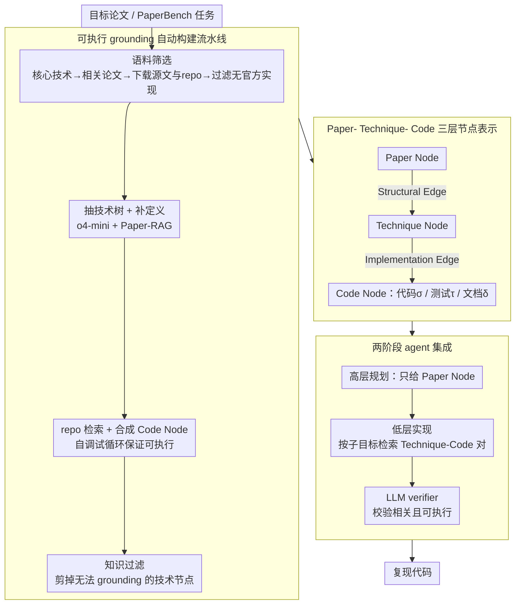

# What Makes AI Research Replicable? Executable Knowledge Graphs as Scientific Knowledge Representations

**会议**: ACL2026  
**arXiv**: [2510.17795](https://arxiv.org/abs/2510.17795)  
**代码**: https://github.com/zjunlp/xKG  
**领域**: graph_learning  
**关键词**: 可执行知识图谱、论文复现、代码检索、科研 Agent、PaperBench

## 一句话总结
本文提出 Executable Knowledge Graphs (xKG)，把论文中的技术概念和可运行代码片段组织成 Paper- Technique- Code 三层图结构，作为可插拔知识库辅助科研复现 agent，在 PaperBench Code-Dev 上为不同 agent 带来最高 10.90 个百分点的复制得分提升。

## 研究背景与动机
**领域现状**：LLM agent 已经开始被用于自动化科研任务，例如读论文、写代码、复现实验和扩展已有方法。PaperBench、MLE-Bench、LMR-Bench 等 benchmark 都在衡量 agent 是否能把论文中的方法真正落到代码实现上。

**现有痛点**：AI 论文复现难，不只是因为论文长，而是因为关键知识分散在正文、附录、引用论文、官方代码、配置文件和实现细节里。普通 RAG 可以检索文本片段，却很难知道某个“技术概念”到底对应哪段可运行代码；只看论文又容易缺少隐藏实现细节，只看 repo 又难以理解代码背后的方法结构。

**核心矛盾**：科研复现需要的是“可执行的科学知识”，但现有知识表示大多停留在文本、摘要或粗粒度概念层面。Agent 真正卡住的往往是低层实现：损失函数怎么写、模块如何拼、超参数如何配置、代码接口怎么调用。如果知识库不能把概念和可执行代码连接起来，就只能提供泛泛背景，无法支撑 repo-level implementation。

**本文目标**：作者希望构建一个 paper-centric、可自动更新、可插拔到不同 agent 框架中的知识库。它既能给 agent 高层方法结构，也能在写代码时提供低层可执行参考，从而提升 AI 研究复现的可靠性。

**切入角度**：论文把“科学知识”从普通文本知识图谱扩展成 Executable Knowledge Graph。图中的节点不只是概念，还包括经过验证的代码单元；边也不只是语义关系，还包含技术结构依赖和概念到代码的实现关系。

**核心 idea**：把论文分解成可复用技术节点，并把每个技术节点 grounding 到经过重写、调试和验证的 Code Node，让科研 agent 在规划阶段能看方法结构，在实现阶段能检索可运行代码。

## 方法详解
xKG 是一个面向 AI 论文复现的层级知识图谱。它既有图的结构化表示，也有自动构建流水线和 agent 集成方式。整个系统围绕目标论文展开：先找相关论文和官方 repo，再抽取技术概念和代码实现，最后把这些知识作为工具或模块接入复现 agent。

### 整体框架
xKG 的形式化表示为 $xKG=(N,E)$。节点集合分为三类：Paper Node、Technique Node 和 Code Node；边集合分为 Structural Edge 和 Implementation Edge。Paper Node 表示一篇论文及其元数据、技术节点和代码节点；Technique Node 表示一个可自包含的学术概念或方法组件；Code Node 表示一个可执行单元，包含实现代码、测试脚本和文档说明。

构建流程分为两大块。第一块是 paper-aware corpus curation：围绕目标 PaperBench 任务，自动识别核心技术、选择高相关引用论文和 web 检索结果、下载 arXiv 源文和官方 GitHub repo，并过滤没有官方实现的论文。第二块是 hierarchical KG construction：从论文抽技术树，从 repo 取代码片段，生成并验证 Code Node，再剪掉无法 grounding 到代码的技术节点。构建完成的 xKG 随后通过两阶段方式接入复现 agent：规划阶段只看方法骨架，实现阶段才检索可运行代码。

### 关键设计

**1. Paper-Technique-Code 三层节点表示：把"论文说了什么"和"代码怎么实现"显式对齐**

普通 RAG 返回的是一堆文本或代码片段，agent 还得自己判断哪些片段属于方法结构、哪些代码真能跑。三层节点正是为了卸掉这个负担：Paper Node 保存论文元信息以及它名下的技术/代码节点集合；Technique Node 保存一个可自包含的方法定义和可选的子技术节点，既能表示整套框架也能表示可复用模块；Code Node 则保存实现 $\sigma$、测试脚本 $\tau$ 和文档 $\delta$ 这三件套。

节点之间用两类边连起来：Structural Edge 表达技术节点之间的架构依赖（哪个模块搭在哪个模块上），Implementation Edge 把技术节点和对应代码挂钩。这样一来，agent 在规划时顺着 Structural Edge 就能读出方法骨架，在编码时顺着 Implementation Edge 就能取到可运行的实现，不必再把零散片段拼回方法结构。

**2. 可执行 grounding 的自动构建流水线：用"能不能落到代码"当知识质量过滤器**

论文抽取本身很容易产出过细、幻觉甚至根本无法实现的概念，因此 xKG 不满足于把论文转成纯文本图。构建时先用 o4-mini 抽出论文的技术树，再用 Paper-RAG 给每个技术节点补全定义；随后以技术定义为 query，在官方 repo 里用 embedding 检索相关代码片段，交给 o4-mini 合成 Code Node，每个 Code Node 还要走一遍自调试循环确保真能执行。

关键的一步是知识过滤：如果某个技术节点怎么也找不到能 grounding 的代码，就直接被剪掉。换句话说，"可执行性"被当成知识质量的硬门槛——留下的每个技术节点都至少对应一段跑得通的代码，这也是为什么自调试后 Code Node 的可执行率能从约 52% 拉到 100%。

**3. 两阶段 agent 集成方式：规划时只给方法骨架，编码时才放出代码**

复现任务其实有两个难点错开在不同阶段：先得理解方法结构，再写出功能正确的代码。xKG 顺着这个节奏分两步暴露知识。在 high-level planning 阶段，agent 只拿到目标论文的 Paper Node，刻意不直接给 Code Node，免得规划一开始就被实现细节淹没；进入 low-level implementation 阶段，agent 才按当前子目标去查相关的 Technique-Code pairs。

检索结果最后还过一个 LLM verifier，确保返回的配对既技术相关又确实可实现。这种"先骨架后血肉"的暴露顺序，避免了规划阶段堆一大坨代码、实现阶段又只剩抽象概念的两头落空。

### 损失函数 / 训练策略
本文没有提出新的神经训练损失，而是构建知识图谱并把它作为可插拔模块接入 agent。涉及的模型调用主要用于技术抽取、代码模块化、自调试和 verifier。检索侧使用 text-embedding-3-small、all-MiniLM-L6-v2 等 embedding 计算相似度，关键阈值包括 technique_similarity=0.6、paper_similarity=0.6。

## 实验关键数据

### 主实验
作者在 PaperBench Code-Dev lite subset 上评估 xKG，任务是从论文复现代码开发部分，得分由 o3-mini 基于层级 rubric 评估。xKG 被接入 BasicAgent、IterativeAgent 和 PaperCoder，并测试 o3-mini 与 DeepSeek-R1 两种 backbone。

| Agent | Backbone | vanilla 平均分 | +xKG 平均分 | 提升 |
|-------|----------|----------------|-------------|------|
| BasicAgent | o3-mini | 17.89 | 24.57 | +6.68 |
| BasicAgent | DeepSeek-R1 | 27.89 | 31.62 | +3.73 |
| IterativeAgent | o3-mini | 24.60 | 31.91 | +7.31 |
| IterativeAgent | DeepSeek-R1 | 27.02 | 35.22 | +8.20 |
| PaperCoder | o3-mini | 42.31 | 53.21 | +10.90 |
| PaperCoder | DeepSeek-R1 | 52.23 | 60.34 | +8.11 |

从表中可以看出，xKG 对简单 ReAct agent 和更强的 PaperCoder 都有帮助，说明它不是只适配某个固定框架。PaperCoder + o3-mini 的提升最大，从 42.31 到 53.21，说明强 agent 在拿到结构化可执行知识后，能把优势转化成更完整的实现。

| 目标论文 / 任务 | BasicAgent o3-mini | + xKG | 典型现象 |
|-----------------|--------------------|-------|----------|
| MU-DPO | 12.96 | 37.22 | 大幅提升，相关技术和代码可复用度高 |
| TTA-FP | 22.63 | 27.26 | 中等提升，结构知识有帮助 |
| One-SBI | 18.24 | 20.82 | 小幅提升，创新结构较难从既有知识迁移 |
| FRE | 14.82 | 14.67 | 轻微下降，检索知识可能干扰特定实现 |
| 平均 | 17.89 | 24.57 | 整体 +6.68 |

### 消融实验
节点类型消融在 PaperCoder + o3-mini 上进行，直接检验 Paper Node、Technique Node 和 Code Node 哪个最关键。

| 配置 | Replication Score | Drop | 说明 |
|------|-------------------|------|------|
| xKG Full | 53.21 | - | 完整图谱 |
| w/o Paper Node | 51.08 | 2.13 | 缺少目标论文整体结构后，规划质量下降 |
| w/o Code Node | 48.65 | 4.56 | 最大退化，说明可执行代码是核心增益来源 |
| w/o Technique Node | 52.16 | 1.05 | 影响较小，部分技术信息已被 Code Node 隐式包含 |

作者还做了 xKG 质量与扩展性分析。自动构建的技术节点、代码节点和技术-代码对并非全都完美，但整体质量足以支撑 agent。

| 分析项 | 数值 | 含义 |
|--------|------|------|
| Technique valid rate | 89.44% | 大多数技术节点是自包含学术概念 |
| Code valid rate | 100.00% | 自调试后 Code Node 可执行 |
| Tech-Code pair match | 74.51% | 仍有约四分之一配对不够精确 |
| 初始 Code Node 可执行率 | 52.38% | 自调试前可执行性不足 |
| 平均构建成本 | 约 0.7344 美元 / paper | 主要成本来自代码模块化与调试 |

### 关键发现
- Code Node 是最关键组件。去掉 Code Node 掉 4.56 分，明显大于去掉 Paper Node 或 Technique Node，说明复现瓶颈主要在“可执行实现”而不只是理解概念。
- xKG 对分析型或组合型论文更有用，例如 MU-DPO 这种建立在可复用技术上的论文；对全新方法架构，如 One-SBI，既有知识帮助较小。
- xKG 可以自演化。扩展到 56 篇相关论文后，bridging-data-gaps 任务从 11.55 提升到 44.64，sample-specific-masks 从 24.09 提升到 42.47，说明知识库越贴近目标论文，收益越明显。

## 亮点与洞察
- “可执行知识图谱”这个定义抓住了科研 agent 的真实痛点。复现不是回答论文内容问答，而是把抽象方法变成可运行代码，因此知识表示必须包含实现单元。
- 知识过滤步骤很关键：只有能 grounding 到代码的技术节点才保留。这会牺牲一些理论描述完整性，但换来更高的实用性和更少幻觉节点。
- 高层规划不暴露 Code Node、低层实现再检索代码，是一个很好的 agent memory 设计原则。它避免 agent 在规划阶段被代码细节干扰，也避免实现阶段只拿到抽象概念。
- 论文的 case study 显示 xKG 能把 agent 从“搭空架子”推向“写实质模块”。这比单纯提高最终分数更有解释力。

## 局限与展望
- PaperBench lite 评测成本仍高，论文受经费限制没有跑完整 PaperBench，也没有大规模跨领域 stress test。
- xKG 依赖目标领域已有相关论文和官方代码。对于非常新的方向、闭源方法或没有可靠 repo 的论文，图谱很难构建出有用 Code Node。
- 代码检索和重写仍可能把语义相似但技术无关的代码包装得很漂亮，从而误导 agent。作者用 verifier 缓解，但 Tech-Code pair match 74.51% 说明这仍是核心风险。
- 目前更多展示的是离线构建知识库后辅助复现。未来可以考虑在线更新、失败反馈回写图谱、执行结果驱动的图谱修正。

## 相关工作与启发
- **vs 普通 RAG**: RAG 检索文本或代码片段，xKG 则把论文结构、技术概念和代码实现显式成图，并通过可执行性过滤知识。
- **vs AutoMind / AI-Researcher 等科研 agent**: 这些系统关注 agent 工作流本身，xKG 更像底层可插拔知识基座，可以接入不同 agent 框架。
- **vs Paper2Code / AutoReproduce**: 这些工作直接从目标论文生成代码，xKG 强调复用相关论文和官方 repo 中的可执行知识，降低从零实现的难度。
- **vs ExeKG**: 名称接近，但问题不同。早期 ExeKG 面向透明数据分析或工业监控，本文 xKG 面向 AI 论文复现，并采用更轻量的 Paper-Technique-Code 结构。

## 评分
- 新颖性: ⭐⭐⭐⭐☆ 将 KG 的节点扩展到可执行代码并服务科研复现，概念清晰且贴合 agent 需求。
- 实验充分度: ⭐⭐⭐⭐☆ 覆盖多个 agent/backbone、节点消融和质量分析，但完整 PaperBench 与更广领域验证仍有限。
- 写作质量: ⭐⭐⭐⭐☆ 方法结构易懂，实验表格信息密集；个别实现细节分散在附录，需要来回对照。
- 价值: ⭐⭐⭐⭐⭐ 对自动科研复现、paper-to-code、代码 RAG 和 agent memory 设计都有很高参考价值。

<!-- RELATED:START -->

## 相关论文

- [\[ICLR 2026\] Towards Improved Sentence Representations using Token Graphs](../../ICLR2026/graph_learning/towards_improved_sentence_representations_using_token_graphs.md)
- [\[ICML 2026\] What Structural Inductive Bias Helps Transformers Reason Over Knowledge Graphs? A Study with Tabula RASA](../../ICML2026/graph_learning/what_structural_inductive_bias_helps_transformers_reason_over_knowledge_graphs_a.md)
- [\[ACL 2026\] STEM: Structure-Tracing Evidence Mining for Knowledge Graphs-Driven Retrieval-Augmented Generation](stem_structure-tracing_evidence_mining_for_knowledge_graphs-driven_retrieval-aug.md)
- [\[ACL 2026\] CoG: Controllable Graph Reasoning via Relational Blueprints and Failure-Aware Refinement over Knowledge Graphs](cog_controllable_graph_reasoning_via_relational_blueprints_and_failure-aware_ref.md)
- [\[ICLR 2026\] Explore-on-Graph: Incentivizing Autonomous Exploration of LLMs on Knowledge Graphs](../../ICLR2026/graph_learning/explore-on-graph_incentivizing_autonomous_exploration_of_large_language_models_o.md)

<!-- RELATED:END -->
