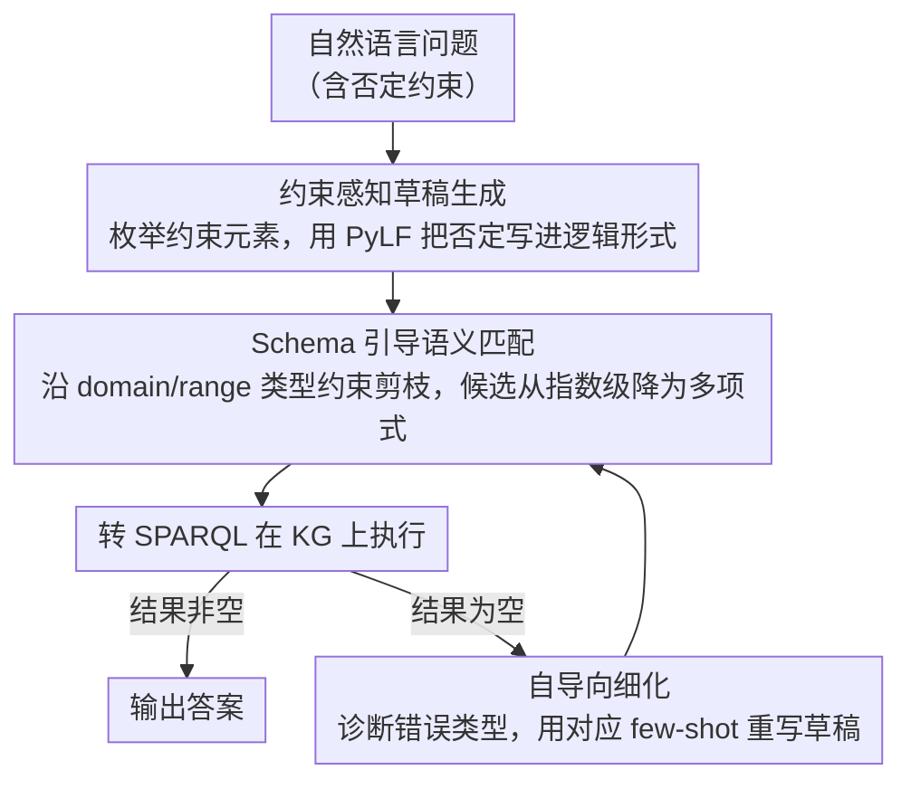

# Which bird does not have wings: Negative-constrained KGQA with Schema-guided Semantic Matching and Self-directed Refinement

**会议**: ACL 2026 Findings  
**arXiv**: [2604.14749](https://arxiv.org/abs/2604.14749)  
**代码**: [https://github.com/midannii/CUCKOO](https://github.com/midannii/CUCKOO)  
**领域**: 图学习 / 知识图谱问答  
**关键词**: 知识图谱问答, 否定约束, 语义解析, 逻辑形式, Schema引导

## 一句话总结

本文提出了否定约束知识图谱问答（NEST KGQA）新任务和 NestKGQA 数据集，设计了 Python 格式逻辑形式 PyLF 来清晰表达否定约束，并提出 CUCKOO 框架通过约束感知草稿生成、Schema 引导语义匹配和自导向细化三个模块，在 few-shot 设置下实现了多约束问题的高效精确回答。

## 研究背景与动机

**领域现状**：知识图谱问答（KGQA）是利用外部知识减少 LLM 幻觉的重要方向。其中语义解析（SP）方法将自然语言问题映射为逻辑形式，再转换成 SPARQL 查询在知识图谱上执行，具有可解释性和忠实性优势。

**现有痛点**：现有 KGQA 基准和方法严重偏向正向约束和计算约束，忽略了否定约束。虽然一些数据集中看似包含"not"等否定词，但实际是比较操作。LLM 在否定推理方面本身就很脆弱，且现有逻辑形式（如 s-expression）难以清晰表达否定语义。

**核心矛盾**：否定约束在现实问题中频繁出现，但缺乏专门的基准和方法来处理。同时否定约束问题天然包含多个约束条件，使语义复杂度大幅增加，导致生成不可执行查询的风险显著升高。

**本文目标**：(1) 定义 NEST KGQA 新任务并构建 NestKGQA 数据集；(2) 设计能清晰表达否定的逻辑形式 PyLF；(3) 构建能处理多约束否定问题的高效框架。

**切入角度**：作者观察到现有 SP 方法的语义匹配采用暴力搜索，不考虑 KG schema 语义，导致候选逻辑形式数量指数级增长。通过利用 KG schema 约束来剪枝，可以同时提升效率和准确性。

**核心 idea**：用约束感知的草稿生成显式枚举问题中的约束元素，再用 Schema 引导的语义匹配将草稿锚定到 KG 上，最后仅在执行结果为空时触发自导向细化，实现低成本高鲁棒的否定约束问答。

## 方法详解

### 整体框架

CUCKOO 遵循"生成—匹配"的两段式语义解析范式，目标是把一个可能含多重否定约束的自然语言问题精确翻译成能在知识图谱上执行的查询。输入问题后，先由约束感知草稿生成模块显式枚举问题里的约束元素、写出一份 PyLF 逻辑形式草稿；再由 Schema 引导语义匹配模块把草稿中的实体与关系提及锚定到 KG 的具体项上，产出一组可执行逻辑形式并转成 SPARQL 查询执行；只有当执行结果为空（说明草稿格式或语义出错）时，才回退到自导向细化模块修正草稿后重试。这条"先枚举约束、再剪枝锚定、失败才细化"的流水线把否定约束问题天然偏高的语义复杂度逐层化解。

### 关键设计

**1. PyLF：用一个布尔参数把否定写进逻辑形式**

现有逻辑形式在表达否定时左右为难——只有 $\lambda$ 演算能写否定但可读性极差，s-expression 可读却根本表达不了"不具备某属性"。PyLF 的切入点是借 Python 语法把否定做成一个最小扩展：在 JOIN 函数里加一个布尔参数 `neg` 标记否定约束（如 `JOIN('producing', 'Saturn', neg=True)` 表示"不生产 Saturn"），并用 `R_` 前缀区分查询的是头实体还是尾实体，让方向语义不再含糊。选 Python 作底座是因为 LLM 预训练中见过海量 Python 代码，生成时语法错误率天然更低，可执行查询的成功率因此提升。

**2. Schema 引导语义匹配：用类型约束把指数搜索压成多项式**

草稿里的实体、关系都还是自然语言提及，必须锚定到 KG 的具体项才能执行，而传统暴力匹配对每个实体取 top-$K_e$、每个关系取 top-$K_r$，候选组合数 $K_e^n \cdot K_r^m$ 随约束数指数爆炸，否定约束这种多约束问题尤其容易生成大量不可执行查询。本设计从 START 函数的主题实体出发，先用余弦相似度检索候选实体及其所属类别，再只提取包含这些候选类别的 schema 级三元组、用相似度阈值 $\theta$ 筛关系，并沿 domain/range 约束逐层传播类别信息、自动剪掉类型不合法的组合。类型约束让候选数从 $K_e^n \cdot K_r^m$ 收缩到极小规模——例如 $K_e^1 \cdot K_r^2$ 被压到 $1 \times 2 \times 2 = 4$，效率与准确性同时受益。

**3. 自导向细化：只在执行落空时触发的自包含纠错**

草稿偶尔会因约束分解缺失、格式或函数语法错误而生成空结果，但为每个问题都做多轮纠错既慢又贵。CUCKOO 把细化设成"按需触发"：仅当 SPARQL 执行返回空集时，先从预定义错误类别中诊断出问题类型（漏拆约束、格式错误、函数语法错误等），再用对应的 few-shot 示例引导 LLM 重写草稿。整个过程不依赖外部执行反馈、也不做参数微调，是自包含的单次修正，因此相比那些靠多轮 LLM 调用 + 外部反馈的代码生成方法显著降低了成本和延迟。

### 损失函数 / 训练策略

CUCKOO 是基于上下文学习（in-context learning）的免训练框架。草稿生成以 GPT-3.5-turbo 为骨干 LLM，用 SimCSE 嵌入从训练数据中检索 top-$k$ 相似示例作为 few-shot 演示；候选生成数取 1 或 6，最终预测由多数投票确定。

## 实验关键数据

### 主实验

| 数据集 | 指标 | CUCKOO(6) | KB-Coder(6) | KB-BINDER(6) |
|--------|------|-----------|-------------|--------------|
| GrailQA (Overall) | EM/F1 | **62.1/64.2** | 51.2/56.3 | 52.5/54.5 |
| GrailQA (Zero-shot) | EM/F1 | **57.5/59.8** | 46.7/51.6 | 45.9/48.6 |
| NestKGQA | F1 | **26.2** | 24.4 | 4.6 |
| GraphQ | F1 | **40.8** | 35.8 | 32.7 |

### 消融实验

| 配置 | GrailQA F1 | NestKGQA F1 | 说明 |
|------|-----------|-------------|------|
| CUCKOO 完整模型 | 64.2 | 26.2 | 完整模型 |
| w/o 自导向细化 | 63.2 | 25.8 | 细化贡献约 1 个点 |
| w/o 约束元素 | 61.3 | 24.4 | 显式约束分解有帮助 |
| w/o Schema 引导匹配 | 56.6 | 16.3 | 核心模块，去掉后大幅下降 |

### 关键发现

- Schema 引导语义匹配是最关键模块，去掉后 GrailQA 下降 7.6 点、NestKGQA 下降近 10 点
- 在多约束问题（3 个约束）上 CUCKOO 优势最明显，EM 达到最高
- 在 superlative 类型问题上实现了从 3.1 到 53.1 的巨大提升
- 所有零样本 LLM 在 NestKGQA 上表现远低于传统 KGQA，证明否定约束推理确实困难
- CPU 内存比 KB-Coder 减少 4.7%，但推理时间增加约 1.6 倍

## 亮点与洞察

- PyLF 通过在 JOIN 函数中添加 `neg` 布尔参数来表达否定，设计极其简洁却有效解决了否定约束表达的长期难题。这种"最小修改"思路值得借鉴——不需要发明全新的逻辑形式，只需在现有框架上做针对性扩展
- Schema 引导匹配利用 KG 的类型系统进行候选剪枝，将指数级搜索空间降为多项式级。这个思路可以迁移到任何需要在结构化知识上做生成+验证的场景
- 自导向细化的"仅在失败时触发"策略是一个优雅的工程设计，避免了不必要的 LLM 调用

## 局限与展望

- 基于封闭世界假设，在开放世界场景下适用性有限
- NestKGQA 数据集规模较小，是在已有基准上扩展的
- 假设 KG schema 完整可用，当 schema 不完整时需要额外的 schema 提取模型
- 性能依赖骨干 LLM 能力，未来需要探索模型无关策略

## 相关工作与启发

- **vs KB-BINDER**: KB-BINDER 使用 s-expression 无法表达否定，且语义匹配采用暴力搜索。CUCKOO 通过 PyLF 和 Schema 引导匹配在两方面超越
- **vs KB-Coder**: KB-Coder 使用 Python 格式逻辑形式但未显式处理否定和约束分解，在 I.I.D. 场景下因直接模仿示例而略占优，但在组合泛化和否定场景下不如 CUCKOO

## 评分

- 新颖性: ⭐⭐⭐⭐ 首次系统定义否定约束 KGQA 任务，任务定义清晰，PyLF 设计简洁有效
- 实验充分度: ⭐⭐⭐⭐ 多个基准、消融、多维度分析，但 NestKGQA 数据集较小
- 写作质量: ⭐⭐⭐⭐ 结构清晰，motivating example 直观
- 价值: ⭐⭐⭐⭐ 填补了 KGQA 中否定约束处理的空白，Schema 引导匹配具有通用价值

<!-- RELATED:START -->

## 相关论文

- [\[AAAI 2026\] NOTAM-Evolve: A Knowledge-Guided Self-Evolving Optimization Framework with LLMs for NOTAM Interpretation](../../AAAI2026/graph_learning/notam-evolve_a_knowledge-guided_self-evolving_optimization_framework_with_llms_f.md)
- [\[ACL 2026\] CoG: Controllable Graph Reasoning via Relational Blueprints and Failure-Aware Refinement over Knowledge Graphs](cog_controllable_graph_reasoning_via_relational_blueprints_and_failure-aware_ref.md)
- [\[ACL 2026\] TagRAG: Tag-guided Hierarchical Knowledge Graph Retrieval-Augmented Generation](tagrag_tag-guided_hierarchical_knowledge_graph_retrieval-augmented_generation.md)
- [\[ACL 2026\] GS-Quant: Granular Semantic and Generative Structural Quantization for Knowledge Graph Completion](gs-quant_granular_semantic_and_generative_structural_quantization_for_knowledge_.md)
- [\[ICLR 2026\] Pairwise is Not Enough: Hypergraph Neural Networks for Multi-Agent Pathfinding](../../ICLR2026/graph_learning/pairwise_is_not_enough_hypergraph_neural_networks_for_multi-agent_pathfinding.md)

<!-- RELATED:END -->
