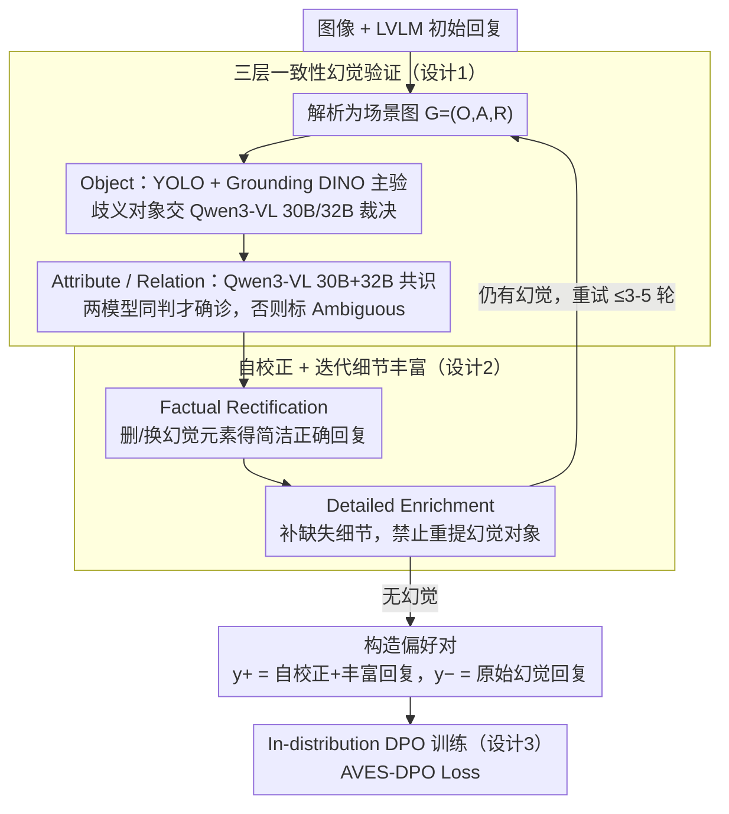

# Aligning with Your Own Voice: Self-Corrected Preference Learning for Hallucination Mitigation in LVLMs

**会议**: ACL 2026  
**arXiv**: [2604.24395](https://arxiv.org/abs/2604.24395)  
**代码**: 无  
**领域**: 幻觉检测  
**关键词**: AVES-DPO, 自我校正, 偏好学习, LVLM 幻觉, 分布对齐

## 一句话总结
提出 AVES-DPO 框架：用一致性多模型验证（YOLO/GroundingDINO/Qwen3-VL）在 object/attribute/relation 三层细粒度检测 LVLM 自己生成回复中的幻觉，再让同一个 LVLM 自我校正并丰富细节，得到的偏好对天然处于目标模型的"自身分布"内；仅 5.2K 样本即可在多个幻觉 benchmark 上超过依赖 GPT-4V 教师的 SOTA（数据效率约 25×）。

## 研究背景与动机

**领域现状**：DPO 已成为缓解 LVLM 幻觉的主流方案，构造偏好对（preferred 是正确详细回复、dispreferred 是幻觉回复）后让模型偏向前者。

**现有痛点**：(1) 现有方法（POVID、oDPO、mDPO、HALVA 等）几乎全靠 GPT-4V 等闭源模型合成正样本或扰动负样本，成本高、不可控；(2) 闭源教师与目标 LVLM 之间存在**生成模式分布失配**——教师的写作风格、词汇分布与目标模型不一致，把这种"外来风格"作为 preferred 信号会让 DPO 优化偏向"模仿教师"而非真正学到事实性提升；(3) 现有数据集和训练目标过分偏向 object 级幻觉，对 attribute 和 relation 这类细粒度幻觉（如颜色、姿态、空间关系）覆盖不足。

**核心矛盾**：教师生成的高质量正样本与目标模型自身分布之间的 gap，会被 DPO 的 log-likelihood ratio 放大成"风格差异 > 事实差异"，反而稀释对齐效率。

**本文目标**：让 preferred 回复来自目标模型本身（in-distribution），同时覆盖 object/attribute/relation 三类幻觉。

**切入角度**：经验性预实验显示，自校正回复相对初始回复的 preference margin 分布以 0 为中心（in-distribution），而 GPT-4V 校正的回复 margin 呈大负值（out-of-distribution），证明自校正天然兼容目标模型的内部分布。

**核心 idea**：用一致性验证 + 自我校正构造完全 in-distribution 的偏好对，再走标准 DPO。

## 方法详解

### 整体框架

两大阶段：(1) Hallucination Verification——先把初始回复解析成场景图 $G=(O, A, R)$，再分别用专门模型验证对象（YOLO + Grounding DINO 主验，Qwen3-VL 30B/32B 二次裁决）和属性/关系（Qwen3-VL 30B+32B 共识），共识机制要求两个独立模型给同样判定才算确诊，否则标 Ambiguous。(2) Self-correction——根据诊断让 LVLM 自己重写：先 Factual Rectification（删/换幻觉元素得到简洁正确回复），再 Detailed Enrichment（补充缺失视觉细节但禁止重提已知幻觉对象）；丰富后再回送验证，迭代至无幻觉或超过 3-5 轮后丢弃。最终把"自校正 + 丰富后的回复"作为 $y^+$、"原始幻觉回复"作为 $y^-$，跑标准 DPO。

### 关键设计

**1. 三层一致性幻觉验证（O/A/R Consensus Verification）：用「两个模型都同意」过滤单模型噪声**

现有数据集过分偏向 object 级幻觉，对 attribute（颜色/材质/姿态/状态）和 relation（空间/动作关系）这类细粒度幻觉覆盖不足，而单一 verifier 又容易带噪。AVES-DPO 先把初始回复解析成场景图 $G=(O, A, R)$，再要求两个独立 verifier $V_1, V_2$ 给出相同 label 才确诊：$L(x) = l$ 当 $V_1(x) = V_2(x) = l$，否则标为 Ambiguous。Object 层用 YOLOv8x-worldv2 + Grounding DINO 主验，对相似词（cos sim ≥ 0.5）做 grouping 避免互相干扰，Ambiguous 对象再交 Qwen3-VL 30B + 32B 二次裁决。

属性与关系只对已被判为 Factual 的对象验证，用预构建的 148 对象 + 38 属性 + 17 关系词表按语义子类型检索替换候选。分层验证比统一打分能更精确地定位错误类型，而「两者同意」机制把可靠性放在第一位——这正是用便宜的开源模型凑出媲美 GPT-4V 标注质量的关键。

**2. 自校正 + 迭代细节丰富（Factual Rectification + Detailed Enrichment）：删错加详再验证，两者一起才能凑齐**

单纯删掉幻觉会让回复变得过简、信息量低；直接让模型自由展开又容易在补充阶段重新引入新幻觉。AVES-DPO 拆成两个阶段：阶段 A（Factual Rectification）让 LVLM 按诊断信号删除或替换幻觉元素，生成简洁正确的回复——这一步刻意保留目标模型自身的语言风格；阶段 B（Detailed Enrichment）让模型补充图像中缺失的描述性细节，但 prompt 中明确禁止再提那些已被标为幻觉的对象。

丰富后的回复会重新送进 Hallucination Verification 闭环检查，若仍含幻觉则回到自校正重试，7B 最多 3 轮、13B 最多 5 轮，失败样本直接丢弃以保证数据质量。「删 + 加 + 验证循环」这一闭环才能同时拿到事实性与描述性，输出的「自校正 + 丰富后回复」就作为 DPO 的 $y^+$、原始幻觉回复作为 $y^-$。

**3. In-distribution DPO 训练（AVES-DPO Loss）：偏好对全部来自模型自身，梯度指向事实而非风格**

闭源教师与目标 LVLM 之间的生成模式失配，会被 DPO 的 log-likelihood ratio 放大成「风格差异 > 事实差异」。由于 AVES-DPO 的偏好对 $y^+, y^-$ 都来自同一个目标模型自身（$y^-$ 直接用阶段 A 之前的初始幻觉回复，$y^+$ 用最终经过验证-丰富循环的回复），在自构造的 $\mathcal{D}_{SC} = \{(x, y^+, y^-)\}$ 上跑标准 DPO、但偏好对天然 in-distribution：

$$\mathcal{L}_{\text{AVES-DPO}}(\pi_\theta; \pi_{\text{ref}}) = -\mathbb{E}_{(x, y^+, y^-)}\Big[\log \sigma\Big(\beta \log \frac{\pi_\theta(y^+ \mid x)}{\pi_{\text{ref}}(y^+ \mid x)} - \beta \log \frac{\pi_\theta(y^- \mid x)}{\pi_{\text{ref}}(y^- \mid x)}\Big)\Big]$$

正因为两个回复同源，preference margin 分布从 GPT-4V 教师方案的「以负值为中心」转到「以正值为中心」（图 4），梯度方向明确指向事实性而非风格差异，数据效率因此大幅提升。

### 损失函数 / 训练策略

LoRA 微调 LLaVA-1.5-7B/13B，rank=128、alpha=256，1 epoch，$\beta=0.1$，AdamW 优化器，单卡 RTX A6000 Ada；7B 数据 5.2K 对、13B 数据 4.6K 对。

## 实验关键数据

### 主实验

| 方法 | 数据量 | 反馈来源 | Obj-Hal CHAIR$_S\downarrow$ | Obj-Hal CHAIR$_I\downarrow$ | AMBER Hal Rate$\downarrow$ | MMHal Score$\uparrow$ |
|------|-------|---------|---------------------------|---------------------------|--------------------------|--------------------|
| LLaVA-1.5-7B | - | - | 51.4 | 14.8 | 32.5 | 2.22 |
| LLaVA-RLHF | 122K | Self-Reward | 53.6 | 14.8 | 42.5 | 2.06 |
| HALVA | 21.5K | GPT-4V | 41.4 | 11.7 | 32.2 | 2.25 |
| POVID | 17K | GPT-4V | 45.8 | 13.9 | 31.5 | 2.18 |
| oDPO | 19K | GPT-4V | 34.3 | 9.5 | 25.1 | 2.50 |
| mDPO | 10K | GPT-4V | 35.7 | 9.8 | 24.5 | 2.39 |
| SENTINEL | 8.6K | Self | 12.6 | 4.0 | 14.6 | 2.04 |
| **AVES-DPO (Ours)** | **5.2K** | **Self** | **12.2** | **3.9** | **12.6** | **2.35** |

AMBER 关系类别 7B 上拿到 66.6（vs SENTINEL 48.7、base 58.5），AMBER Acc 82.3 / F1 86.9 都是最高。

### 消融实验

| 配置 | Obj-Hal CHAIR$_S$ | AMBER CHAIR | AMBER Hal Rate |
|------|------------------|------------|----------------|
| 7B base | 51.4 | 7.1 | 32.5 |
| + GPT-4V 教师监督 (5.2K) | 38.4 | 7.6 | 31.7 |
| **+ AVES-DPO 自校正 (5.2K)** | **12.2** | **3.3** | **12.6** |
| AVES-DPO w/ Two-Phase (默认) | 12.2 | 3.3 | 12.6 |
| AVES-DPO w/ Phase-1 only (无 Enrichment) | 16.6 | 3.5 | 12.8 |
| AVES-DPO w/ Phase-2 only (无 Rectification) | 19.8 | 3.9 | 17.0 |
| 数据量 600 | 38.6 | 5.3 | 23.2 |
| 数据量 5.2K (甜蜜点) | 12.2 | 3.3 | 12.6 |
| 数据量 10.9K (过校正) | 10.6 | 2.8 | 10.1 (但 Cover 从 40.8 掉到 37.8) |

### 关键发现
- 同等 5.2K 数据下，自校正方案比 GPT-4V 教师方案 CHAIR$_S$ 从 38.4 暴跌到 12.2，证明分布失配比数据规模更关键。
- Two-Phase（先校正后丰富）效果最好；只校正会让回复过简，只丰富会引入新幻觉。
- 数据规模到 5.2K 后边际收益急剧下降，且继续加数据会出现"过校正"（描述变贫瘠，AMBER Cover 下降）。
- 关系类幻觉是最难的（13B 训练数据里 41.9% 是 relation 幻觉），但 AVES-DPO 在 AMBER relation 上 13B 拿到 77.5，远超 baselines。
- 验证策略本身在 GPT-4V 上也有效（CHAIR$_S$ 从 29.0 降到 23.9），说明 verification 模块是 model-agnostic 的。

## 亮点与洞察
- 经验性证明"in-distribution 偏好数据"对 DPO 的重要性——preference margin 分布从负值移到正值这个图非常有说服力。
- 共识机制的设计简单粗暴但有效：用便宜的开源模型 + "双方同意"过滤，达到媲美 GPT-4V 的标注质量（500 样本上 ywy_w win rate 87.1%）。
- 13B 出现 trade-off：MME 总分从 1528 降到 1364，说明大模型过度压制幻觉会损害开放知识检索——这种"scale-aware alignment"问题值得未来研究。
- 验证 → 校正 → 丰富 → 再验证的闭环把"自动构造数据"做到了可控质量，少量样本就能拿大成果。

## 局限与展望
- 属性 / 关系验证目前只考虑单对象级别，多对象同时出现的复杂场景未覆盖。
- 13B 在 MME 上的退化提示 scale-aware 的训练策略很关键，但本文未给出系统化方案。
- 验证模型仍依赖外部检测器（YOLO/GDINO），换 domain（医学图、卫星图）需重新挑选 verifier。
- 词表是基于 COCO + GQA 的 148 对象 / 38 属性 / 17 关系，开放词表场景下覆盖率有限。

## 相关工作与启发
- **vs POVID (Zhou et al., 2024a)**: POVID 用 GPT-4V 给 ground-truth 注入幻觉造负样本，且需要扭曲图像；本文不依赖外部教师，负样本直接是模型自己的初始回复，更自然。
- **vs SENTINEL (Peng et al., 2025)**: 都用 self 反馈，但 SENTINEL 主要做句子级早期干预、偏 object 幻觉；本文做 O/A/R 三层 + 迭代丰富，关系类幻觉提升更大。
- **vs mDPO / oDPO**: 这两者依赖 GPT-4V + 对象掩码或图像偏好，本文不需要任何外部教师，数据成本低 25 倍。

## 评分
- 新颖性: ⭐⭐⭐⭐ "in-distribution 自校正"思路朴素但实证扎实，验证 + 丰富的两阶段设计巧妙
- 实验充分度: ⭐⭐⭐⭐ Object-Hal / AMBER / MMHal / MME / POPE 五个 benchmark + 多种消融
- 写作质量: ⭐⭐⭐⭐ 经验分析 → 动机 → 方法 → 验证的论证链条紧凑
- 价值: ⭐⭐⭐⭐ 不依赖 GPT-4V 让开源生态可复现，对实际部署有直接帮助

<!-- RELATED:START -->

## 相关论文

- [\[AAAI 2026\] Causally-Grounded Dual-Path Attention Intervention for Object Hallucination Mitigation in LVLMs](../../AAAI2026/hallucination/causally-grounded_dual-path_attention_intervention_for_objec.md)
- [\[ACL 2025\] On-Policy Self-Alignment with Fine-grained Knowledge Feedback for Hallucination Mitigation](../../ACL2025/hallucination/on-policy_self-alignment_with_fine-grained_knowledge_feedback_for_hallucination_.md)
- [\[ACL 2026\] Logical Consistency as a Bridge: Improving LLM Hallucination Detection via Label Constraint Modeling between Responses and Self-Judgments](logical_consistency_as_a_bridge_improving_llm_hallucination_detection_via_label_.md)
- [\[ACL 2026\] MeasHalu: Mitigation of Scientific Measurement Hallucinations for LLMs](meashalu_mitigation_of_scientific_measurement_hallucinations_for_large_language_.md)
- [\[ICML 2026\] Instruction Lens Score: Your Instruction Contributes a Powerful Object Hallucination Detector for Multimodal Large Language Models](../../ICML2026/hallucination/instruction_lens_score_your_instruction_contributes_a_powerful_object_hallucinat.md)

<!-- RELATED:END -->
