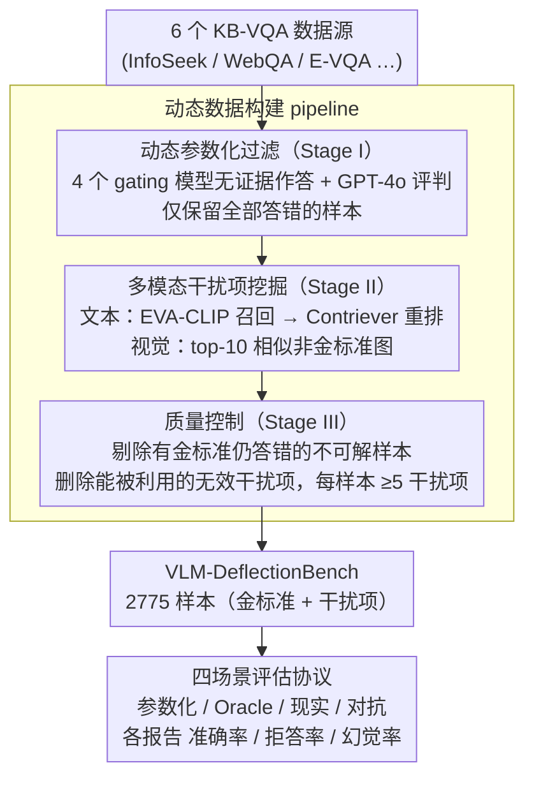

# Benchmarking Deflection and Hallucination in Large Vision-Language Models

**会议**: ACL 2026  
**arXiv**: [2604.12033](https://arxiv.org/abs/2604.12033)  
**代码**: 有（发表后公开）  
**领域**: 幻觉检测  
**关键词**: 视觉语言模型, 幻觉检测, 拒答评估, 知识问答, 检索增强生成

## 一句话总结
提出 VLM-DeflectionBench，一个包含 2775 个样本的多模态基准，通过四种评估场景（参数化/Oracle/现实/对抗）系统性地评估大型视觉语言模型在证据不足或误导时的拒答（deflection）vs 幻觉（hallucination）行为，实验覆盖 20 个 SOTA LVLM，发现几乎所有模型都无法在噪声证据下可靠拒答。

## 研究背景与动机

**领域现状**：大型视觉语言模型（LVLM）越来越多地依赖检索增强来回答知识密集型多模态问题。现有的 KB-VQA 基准（如 OK-VQA、InfoSeek、E-VQA）主要评估检索到正确证据时的准确率。

**现有痛点**：(1) **忽略了证据冲突**：现有基准不考虑视觉和文本证据之间的矛盾，也不考虑检索到的知识不完整时模型应该怎么做；(2) **快速过时**：随着 LVLM 训练集不断扩大，许多原本需要检索的问题现在可以通过参数化知识直接回答，基准失去了区分力；(3) **不区分失败模式**：只衡量"对不对"，不区分"错误回答"（幻觉）和"拒绝回答"（拒答）——而在证据不足时，拒答是更可取的失败模式。

**核心矛盾**：可靠的 RAG 系统应该在证据不足时拒答而非胡编，但目前没有基准系统地评估这种行为。

**本文目标**：构建一个动态可更新的基准，专门评估 LVLM 在不同知识条件下的幻觉 vs 拒答行为。

**切入角度**：设计四个互补场景来解耦参数化记忆和检索鲁棒性——从无证据到完美证据到混合证据到纯干扰项。

**核心 idea**：用动态过滤 pipeline 保持基准难度（过滤掉可参数化回答的样本），用四场景评估协议将"模型知道什么"和"模型不知道时怎么做"分开评估。

## 方法详解

### 整体框架
VLM-DeflectionBench 想解决的核心问题是：现有 KB-VQA 基准只在"检索到正确证据"时测准确率，根本看不出模型在证据不足或被噪声误导时到底是老实拒答还是硬编。为此它把基准构建拆成三个阶段串起来：Stage I 先用一批强 gating 模型把"不查也能答对"的样本剔掉，保证留下的题确实需要外部检索；Stage II 为每道保留题挖掘以假乱真的文本和视觉干扰项；Stage III 做质量控制，剔除连给金标准都答不出的不可解样本、删除会被模型利用的无效干扰项。最终落地 2775 个样本，每个都配齐金标准证据和干扰项，再套上一个四场景评估协议，分别施加从"零证据"到"纯干扰"的不同知识条件。

### 关键设计

**1. 动态参数化过滤（Stage I）：让基准只留下"不查就答不出"的题**

随着 LVLM 训练集越滚越大，很多原本需要检索的知识题如今靠参数化记忆就能直接答对，旧基准因此快速丧失区分力。为对抗这种"过时"，作者用 4 个强力 gating 模型——Gemma3-27B、Qwen-2.5-VL-32B、InternVL3-38B、VL-Rethinker-72B——在不给任何外部知识的条件下逐题作答，并用 GPT-4o 当评判器（SimpleQA 提示，输出 CORRECT/INCORRECT/NOT ATTEMPTED 三类标签），只保留这 4 个模型**全部**判为 INCORRECT 的样本。这一步的精妙之处在于它是"可滚动"的：将来模型更强了，只要换上更强的 gating 模型重跑过滤，基准就能自动恢复难度，而不必推倒重建。

**2. 多模态干扰项挖掘（Stage II）：用以假乱真的噪声证据逼出真实的鲁棒性**

真实检索几乎不可能只返回干净证据，所以要测鲁棒性就得喂高质量的干扰项。每道保留题先配上金标准证据 $K^{+}$，再挖掘干扰项 $K^{-}$：文本侧用 EVA-CLIP 从 Wikipedia 索引召回 top-10 相关页面，分块后再用 Contriever 重排筛出最像答案、但并非金标准的段落；视觉侧从图像索引召回 top-10 与金标准图相似但并非正确的图片。这样模型在现实/对抗场景下必须真正具备"区分相关与无关证据"的能力，而不是只要碰到任何文本就照单全收。

**3. 质量控制（Stage III）：两道 Oracle 过滤同时保证"可解"和"有迷惑性"**

光挖出干扰项还不够——题目可能本身就无解，干扰项也可能根本骗不到人。Stage III 因此用 gating 模型做两道过滤：其一是**可解性检查**，若所有 gating 模型连给了金标准证据都答错，说明这题超出能力边界、丢弃；其二是**干扰项有效性检查**，若某个干扰项 $k^{-}$ 能被任一 gating 模型利用从而答对，说明它泄题、删掉。最后强制每个样本至少保留 $K_{\min}=5$ 个干扰项，从而让留下的题既确实可解、干扰项又确实有迷惑性。

**4. 四场景评估协议：把"模型知道什么"和"模型不知道时怎么办"分开测**

单看一个准确率数字，永远分不清模型是真懂还是在赌运气，更看不出它在证据不足时会拒答还是幻觉。协议因此对同一道题施加四种递进的知识条件：**参数化场景**（不给外部知识，用来反向验证 Stage I 过滤有效，期望准确率近零）、**Oracle 场景**（只给金标准证据，测有完美证据时的能力天花板）、**现实场景**（金标准与干扰项混合，模拟真实检索返回的噪声结果）、**对抗场景**（只给干扰项，理想模型应当拒答而非编造）。每个场景都同时报告准确率、拒答率、幻觉率三个指标，于是从最理想到最恶劣的整段知识光谱上，模型的行为模式被完整摊开。

## 实验关键数据

### 主实验（20 个 LVLM 四场景评估，选取代表性模型）

| 模型 | Oracle Acc↑ | Oracle Hall↓ | Realistic Acc | Realistic Hall↓ | Adversarial Defl↑ | Adversarial Hall↓ |
|------|------------|-------------|--------------|----------------|-------------------|-------------------|
| Ovis2-34B | 66.5 | 27.8 | 49.1 | 43.3 | 38.7 | 58.1 |
| GPT-5 | 73.1 | 12.6 | 59.5 | 25.5 | 61.2 | 34.7 |
| Claude-Opus-4 | 49.1 | 9.2 | 32.1 | 8.5 | **88.3** | **11.1** |
| Gemini-2.5-Pro | 59.8 | 13.9 | 51.0 | 20.5 | 76.1 | 22.2 |
| Qwen-2.5-VL-32B | 61.0 | 33.9 | 45.2 | 49.5 | 13.7 | **83.9** |
| Mistral-Small-3.1 | 42.6 | 10.3 | 23.5 | 14.9 | 83.8 | 15.6 |

### 关键发现
- **没有任何模型在所有场景中表现均衡**：Claude 过度拒答（Oracle 准确率仅 49.1%），Qwen 过度自信（对抗场景幻觉 83.9%），Mistral 也过度拒答
- **即使给了金标准证据，幻觉仍然严重**：LLaVA-OneVision 在 Oracle 场景下仍有 41.6% 幻觉率，说明 grounding 而非检索是主要瓶颈
- **现实场景中准确率普遍下降 10-20 个百分点**：干扰项导致模型频繁被误导
- **GPT-5 在参数化场景中准确率偏高（23.7%）**：可能反映训练集污染
- **开源模型在对抗场景中几乎不拒答**：大多数拒答率低于 35%，倾向于编造答案
- **拒答和准确率之间存在根本性 trade-off**：高拒答模型（如 Claude）牺牲 Oracle 准确率

## 亮点与洞察
- **"动态过滤"理念**非常重要——基准应该随模型演进而更新，否则会快速过时。VLM-DeflectionBench 的 pipeline 可以通过更换 gating 模型来保持时效性
- **四场景评估协议**揭示了单一准确率指标无法看到的行为模式。例如 Claude 在传统基准上可能因为高拒答率得分低，但在安全性要求高的场景中反而是最合适的选择
- **"幻觉 vs 拒答"的区分**对 RAG 系统部署至关重要——在医疗、法律等高风险领域，生成不支持的答案远比拒答危险

## 局限与展望
- 基准仅使用 GPT-4o 作为评判器，可能引入评判偏差
- 2775 个样本规模相对有限，某些模态组合的样本较少
- "严格 RAG"假设（所有错误回答都算幻觉）过于简化——现实场景中错误可能来自误读证据而非凭空编造
- 未探索如何训练模型提升拒答能力（只做了评估）
- 未考虑多轮交互中的拒答行为
- 干扰项的难度未分级，不同难度的干扰项可能导致不同行为

## 相关工作与启发
- **vs MRAG-Bench**: MRAG-Bench 加入了视觉证据但不评估拒答和幻觉。VLM-DeflectionBench 首次在 KB-VQA 中系统评估这两种行为
- **vs HaloQuest/AMBER**: 这些基准只关注视觉幻觉，不涉及检索增强场景。VLM-DeflectionBench 在 RAG 框架下评估
- **vs SimpleQA/GaRaGe**: 纯文本幻觉评估，无法捕捉视觉-文本证据冲突

## 评分
- 新颖性: ⭐⭐⭐⭐⭐ 首个系统评估多模态 RAG 中拒答行为的基准，四场景设计独特
- 实验充分度: ⭐⭐⭐⭐⭐ 20 个模型（含开源和闭源），人工验证 κ=0.91
- 写作质量: ⭐⭐⭐⭐⭐ 动机清晰，实验设计严谨，发现有洞察力
- 价值: ⭐⭐⭐⭐⭐ 对 RAG 系统的可靠性评估提出了新范式，对部署决策有直接指导

<!-- RELATED:START -->

## 相关论文

- [\[ACL 2026\] Mitigating Hallucinations in Large Vision-Language Models without Performance Degradation](mitigating_hallucinations_in_large_vision-language_models_without_performance_de.md)
- [\[ACL 2026\] Mechanisms of Prompt-Induced Hallucination in Vision–Language Models](mechanisms_of_prompt-induced_hallucination_in_vision-language_models.md)
- [\[ACL 2026\] HalluAudio: A Comprehensive Benchmark for Hallucination Detection in Large Audio-Language Models](halluaudio_a_comprehensive_benchmark_for_hallucination_detection_in_large_audio-.md)
- [\[ICLR 2026\] Dynamic Multimodal Activation Steering for Hallucination Mitigation in Large Vision-Language Models](../../ICLR2026/hallucination/dynamic_multimodal_activation_steering_for_hallucination_mitigation_in_large_vis.md)
- [\[CVPR 2026\] Residual Decoding: Mitigating Hallucinations in Large Vision-Language Models via History-Aware Residual Guidance](../../CVPR2026/hallucination/residual_decoding_mitigating_hallucinations_in_large_vision-language_models_via_.md)

<!-- RELATED:END -->
