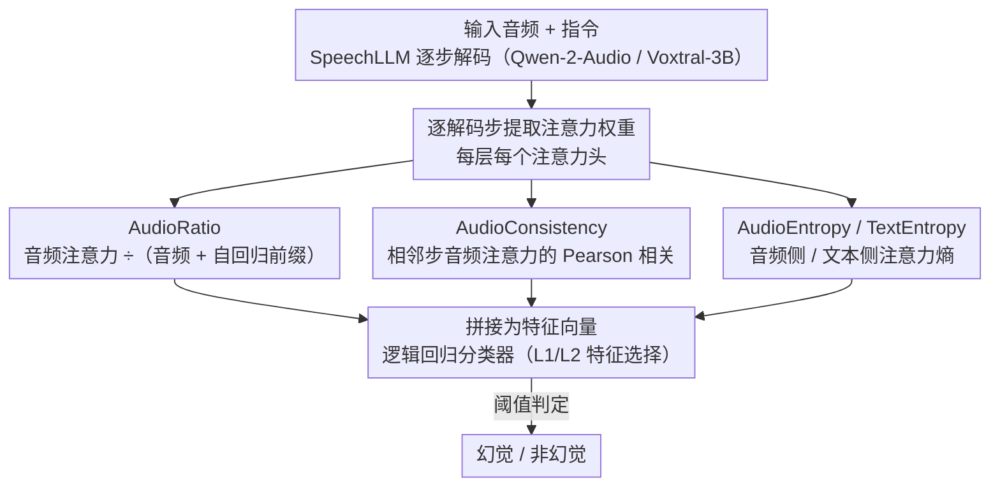

# Detecting Hallucinations in SpeechLLMs at Inference Time Using Attention Maps

**会议**: ACL 2026 Findings  
**arXiv**: [2604.19565](https://arxiv.org/abs/2604.19565)  
**代码**: 无  
**领域**: 幻觉检测  
**关键词**: 语音大模型、幻觉检测、注意力图、推理时检测、轻量级分类器

## 一句话总结

提出四种基于音频注意力的指标（AudioRatio、AudioConsistency、AudioEntropy、TextEntropy），训练轻量级逻辑回归分类器在推理时检测语音大模型（SpeechLLM）的幻觉，在域内数据上 PR-AUC 提升最高达 +0.23。

## 研究背景与动机

**领域现状**：语音大模型（SpeechLLM）在语音识别（ASR）和语音翻译（S2TT）等任务中取得了显著进展，但仍会产生幻觉——流畅但与输入音频不匹配的内容。

**现有痛点**：（1）现有幻觉检测方法依赖金标准输出进行比较，成本高昂且在部署场景中不可行；（2）为文本 LLM 开发的幻觉检测方法无法直接捕捉音频特有的信号，因为音频表征远长于文本，且输入帧与输出 token 之间的对齐关系不同于文本到文本的生成。

**核心矛盾**：需要在推理时（无参考文本）检测幻觉，但音频模态的注意力动态与文本模态本质不同，现有方法不能直接迁移。

**本文目标**：利用 SpeechLLM 内部的注意力模式开发轻量级推理时幻觉检测器。

**切入角度**：观察到模型生成幻觉时注意力会呈现病理性模式——对角线注意力结构退化、注意力回退到音频输入的起始位置。

**核心 idea**：设计四种针对音频的注意力指标捕捉幻觉相关的注意力模式，训练逻辑回归分类器实现高效检测。

## 方法详解

### 整体框架

SpeechLLM 在 ASR、语音翻译里会产生幻觉——内容流畅却和输入音频对不上，而已有检测方法要么得拿金标准答案去比对（部署时拿不到），要么是为文本 LLM 设计、抓不住音频特有的对齐信号（音频表征远长于文本，输入帧和输出 token 的对齐关系也不同）。本文的关键观察是：模型产生幻觉时注意力会出现病理性模式——对角线结构退化、注意力回退到音频起始位置。于是它对 SpeechLLM（Qwen-2-Audio、Voxtral-3B）做推理，在每个解码步提取注意力权重，算出四种音频注意力指标当特征，训一个轻量逻辑回归分类器在推理时（无需参考文本）判断当前输出是否幻觉。

### 关键设计

**1. AudioRatio：看模型把注意力投给输入音频还是自回归前缀**

幻觉往往发生在模型不再看输入音频、转而过度依赖自己已经生成的文本前缀时。AudioRatio 直接量化这个倾向：$AR^{l,h}_t = \frac{A^{l,h}_t(\text{Audio})}{A^{l,h}_t(\text{Audio}) + A^{l,h}_t(\text{ART})}$，即每个注意力头在第 $t$ 步落到音频 token 上的注意力占（音频 + 自回归文本）的比例。它沿用了 Lookback-Lens 的输入/输出注意力比思路，但把输入侧严格限制为音频 token，使其专门捕捉「脱离音频」这一类幻觉信号。

**2. AudioConsistency：看相邻解码步的音频注意力是不是反常地像**

幻觉时模型注意力常坍缩到音频起始位置不动，导致连续若干步的注意力分布高度雷同。AudioConsistency 计算相邻解码步音频注意力向量之间的 Pearson 相关系数来捕捉这种「注意力回退」——正常解码时注意力会随输出推进而平滑移动、相邻步相关系数适中，一旦坍缩则相邻步相关系数异常高。

**3. AudioEntropy / TextEntropy：用注意力熵兜住没有清晰对角线的注意力头**

并非所有注意力头都有干净的对角线对齐模式，前两个指标在这类头上会失效。AudioEntropy 把音频侧注意力权重重新归一化后算熵，$AE^{l,h}_t = H(\frac{a^{l,h,t}_{1:N}}{\sum_i a^{l,h,t}_i})$，衡量模型在音频输入上的不确定性；TextEntropy 同理算文本侧的不确定性。两者作为补充信号，让检测器在缺乏对角线结构的注意力头上也能拿到有用特征。

### 损失函数 / 训练策略

使用逻辑回归分类器，L2 正则化用于特征排序，L1 正则化用于特征剪枝（Stable Features 变体）。训练数据为 VoxPopuli 训练集 40,000 样本（4 种语言各 10,000）。幻觉标签通过 WER + SHS > 0.7 的阈值自动生成，人工标注子集校准阈值。

## 实验关键数据

### 主实验（Voxtral-3B，VoxPopuli 域内）

| 方法 | F1 | PR-AUC | PRR@10% |
|------|-----|--------|---------|
| Mean Entropy (baseline) | 0.42 | 0.44 | 0.43 |
| Perplexity (baseline) | 0.40 | 0.41 | 0.40 |
| AudioRatio Only (LR) | 0.64 | 0.67 | 0.56 |
| Combined (LR) | 0.64 | 0.69 | 0.56 |

### Qwen-2-Audio 结果

| 数据集 | 方法 | F1 | PR-AUC |
|--------|------|-----|--------|
| VoxPopuli | Mean Entropy | 0.50 | 0.49 |
| VoxPopuli | AudioRatio (LR) | 0.56 | 0.56 |
| VoxPopuli | Combined (LR) | 0.55 | 0.58 |
| CALLHOME | Mean Entropy | 0.58 | 0.67 |
| CALLHOME | Combined (LR) | 0.41 | 0.61 |

### 消融实验

| 配置 | 关键指标 | 说明 |
|------|---------|------|
| 全部特征 (4096) | PR-AUC 0.58 | 特征过多可能过拟合 |
| AudioRatio Only (1024) | PR-AUC 0.56 | 单指标表现接近最优 |
| Top 75 (300 特征) | PR-AUC 0.58 | 少量头即可达到最优域内性能 |
| Stable Features | 域外泛化更好 | ~100 个注意力头效果最优 |

### 关键发现
- 注意力特征在域内数据上显著优于不确定性估计基线，Voxtral-3B 上 PR-AUC 提升 +0.23
- 约 100 个注意力头即可实现强检测性能，且域外泛化优于使用全部头
- 效果依赖于模型：Voxtral-3B 上改进比 Qwen-2-Audio 更显著
- 域外（CALLHOME 噪声数据）泛化是主要挑战，特征选择可帮助缓解
- 幻觉率在干净数据（VoxPopuli）上很低（1-6%），在噪声数据（CALLHOME）上高达 20%

## 亮点与洞察
- 首次将注意力基幻觉检测从文本 LLM 扩展到语音 LLM，设计了音频特有的指标
- 轻量级方法（逻辑回归）可在推理时实时部署，可用于在线过滤或离线分析
- 可视化清晰展示了幻觉时注意力的病理性模式：对角线退化、注意力回退到音频起始
- 发现特征选择不仅减少计算量，还能提升域外泛化能力

## 局限与展望
- 效果高度依赖于模型和任务，需要针对特定任务训练
- 域外泛化仍是主要瓶颈，特别是从干净数据到噪声数据
- 幻觉标签依赖自动阈值（WER + SHS > 0.7），可能引入噪声
- 未来方向：与不确定性估计结合、探索更多 SpeechLLM 架构、端到端训练

## 相关工作与启发
- **vs Lookback-Lens**：Lookback-Lens 在文本 LLM 上计算输入/输出注意力比，本文将其适配到音频模态，仅计算音频 token 的注意力比
- **vs SHALLOW**：SHALLOW 是基于参考的幻觉检测基准，本文提出无参考的推理时检测
- **vs 不确定性估计**：不确定性方法（Mean Entropy、Perplexity）是通用信号，本文的注意力特征专门捕捉音频-文本对齐失败

## 评分
- 新颖性: ⭐⭐⭐ 将已有文本幻觉检测思路适配到语音模态，创新在于指标设计
- 实验充分度: ⭐⭐⭐⭐ 两个模型、两个任务、多数据集评估，消融详尽
- 写作质量: ⭐⭐⭐⭐ 方法清晰，可视化直观，实验设计合理
- 价值: ⭐⭐⭐ 实用性强但适用范围较窄，依赖于特定模型和任务

<!-- RELATED:START -->

## 相关论文

- [\[CVPR 2026\] PAS: Prelim Attention Score for Detecting Object Hallucinations in Large Vision-Language Models](../../CVPR2026/hallucination/pas_prelim_attention_score_for_detecting_object_hallucinations_in_large_vision-l.md)
- [\[ACL 2026\] FaithLens: Detecting and Explaining Faithfulness Hallucination](faithlens_detecting_and_explaining_faithfulness_hallucination.md)
- [\[ACL 2026\] TPA: Next Token Probability Attribution for Detecting Hallucinations in RAG](tpa_next_token_probability_attribution_for_detecting_hallucinations_in_rag.md)
- [\[ACL 2026\] FinGround: Detecting and Grounding Financial Hallucinations via Atomic Claim Verification](finground_detecting_and_grounding_financial_hallucinations_via_atomic_claim_veri.md)
- [\[ACL 2026\] Hallucination Detection in LLMs with Topological Divergence on Attention Graphs](hallucination_detection_in_llms_with_topological_divergence_on_attention_graphs.md)

<!-- RELATED:END -->
