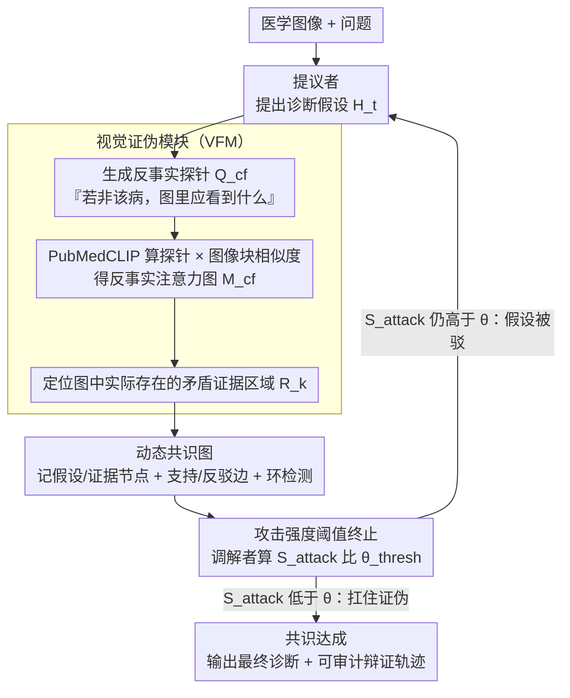

# Dialectic-Med: Mitigating Diagnostic Hallucinations via Counterfactual Adversarial Multi-Agent Debate

**会议**: ACL 2026  
**arXiv**: [2604.11258](https://arxiv.org/abs/2604.11258)  
**代码**: 无  
**领域**: 幻觉检测  
**关键词**: 医学幻觉, 多智能体辩论, 反事实推理, 视觉证伪, 确认偏差

## 一句话总结
提出 Dialectic-Med，一个受波普尔证伪主义启发的多智能体医学诊断框架，通过提议者（诊断假设）、反对者（视觉证伪模块主动检索矛盾视觉证据）和调解者（加权共识图决策）的对抗辩证推理，在 MIMIC-CXR-VQA、VQA-RAD 和 PathVQA 上取得 SOTA，解释忠实度提升 12.5%，显著缓解诊断幻觉。

## 研究背景与动机

**领域现状**：多模态 LLM 正被整合到医疗高风险领域（放射学报告生成、医学视觉问答），但面临严重的诊断幻觉问题——模型倾向于确认偏差，生成流畅但事实错误的诊断陈述。

**现有痛点**：(1) LLM 常"锁定"初步文本假设，然后"幻觉"出视觉特征来支持这个可能错误的结论，导致错误级联传播；(2) CoT 推理本质上是线性前向推理，缺乏内在的自我纠正机制——倾向于寻找验证当前步骤的证据而非挑战它（"验证主义陷阱"）；(3) 现有多智能体系统大多依赖静态共识或纯文本辩论，没有视觉证据驱动。

**核心矛盾**：稳健的诊断不应仅靠找到支持性证据，而应该经受严格的证伪尝试——但现有方法缺乏证伪机制。

**本文目标**：设计一个显式建模证伪过程的多智能体框架，迫使系统打破确认偏差循环，将推理牢固地建立在经过对抗审查的视觉区域上。

**切入角度**：从波普尔科学哲学——证伪主义出发，诊断应通过"尝试推翻它但失败了"来建立可信度。

**核心 idea**：三个角色专职 Agent（提议者诊断+反对者视觉证伪+调解者共识）的对抗辩证循环，关键创新在于反对者的视觉证伪模块——不是语义辩论而是主动检索矛盾视觉证据。

## 方法详解

### 整体框架

Dialectic-Med 想解决的是医学诊断里最隐蔽的失败模式：模型先在文本上锁定一个假设，再"幻觉"出图像里其实没有的特征来自圆其说。它的破解办法是把诊断变成一场有裁判的对抗辩论——提议者基于医学图像提出诊断假设，反对者不去做语义嘴仗，而是生成反事实探针、回到图像里主动找矛盾证据，调解者则评估这次攻击有多强、要不要逼提议者改口。一轮轮迭代下来，所有假设、证据和它们之间的支持/反驳关系都被记进一张动态共识图，直到某个假设扛住了所有证伪尝试（共识达成）或达到最大轮次为止。

### 关键设计

**1. 视觉证伪模块（VFM）：把"反驳"从嘴仗变成回图像里翻证据**

纯文本的多智能体辩论有个根子上的问题——反对者的质疑往往来自参数里的先验，而不是眼前这张片子，于是双方各说各话、谁也落不到图像上。VFM 强制反对者把质疑钉死在具体像素区域：给定当前假设 $H_t$（如"肺炎"），它先生成一个反事实探针查询 $Q_{cf}$，问的是"如果不是肺炎，图里应该看到什么"（如"清晰的肺肋角"——这是肺炎不该出现的征象），再用 PubMedCLIP 算这条探针与各图像块之间的余弦相似度，得到一张注意力图 $M_{cf}$，注意力高的区域就是图像里实打实存在的矛盾证据。这样一来，反对者不再是随口反驳，而是用一块块具体的图像区域说话，确认偏差的循环被"图像里到底有没有"这个硬约束打断。

**2. 动态共识图：让整条辩证轨迹可追溯、可审计**

简单的多数投票只留下一个最终票数，丢掉了"为什么改口""哪条证据最致命"这些临床上最该被审查的信息。Dialectic-Med 把每轮辩论都沉淀进一张图：节点 $\mathcal{V}_t$ 是诊断假设或视觉证据，边 $\mathcal{E}_t$ 编码它们之间的支持/反驳逻辑关系和置信度权重，图里还带环检测，防止假设绕回老路、陷入循环论证。反对者每次攻击的可信度被量化成攻击强度

$$S_{attack} = \frac{1}{|R_k|}\sum_{r \in R_k} \alpha_r,$$

即这轮检索到的所有矛盾证据区域 $R_k$ 的权重均值。整张图保留了完整的辩证脉络，使最终诊断不只是给个答案，还能回放"它是怎么经受住质疑的"，这正是医学场景需要的可解释性。

**3. 攻击强度阈值终止：用"还能不能被推翻"决定何时收手**

辩论需要一个停止条件，否则要么无限循环、要么被一次无关痛痒的弱攻击带偏。Dialectic-Med 用攻击强度直接当裁判：当 $S_{attack} < \theta_{thresh}$，说明反对者已经找不出足够强的矛盾证据，当前假设扛住了证伪尝试，辩论即终止、共识达成；反之则逼提议者修正假设、进入下一轮。这个阈值机制把波普尔"经得起反驳才可信"的原则落成了一个可执行的终止判据——诊断的可信度不来自找到多少支持证据，而来自"想推翻它却推翻不了"。

### 一个完整示例

以一张胸片、初步假设"肺炎"为例走一遍：提议者先给出"肺炎"假设并进入共识图作为一个假设节点；反对者据此生成反事实探针"清晰的肺肋角"，PubMedCLIP 在图上算出注意力图 $M_{cf}$，发现肺肋角区域确实清晰、注意力很高——这是一块反对肺炎的证据，于是攻击强度 $S_{attack}$ 偏高，超过阈值 $\theta_{thresh}$；调解者据此判定攻击成立，逼提议者修正，假设转向"胸腔积液"。下一轮反对者再为新假设生成探针，若这次在图里找不到足够强的矛盾区域、$S_{attack}<\theta_{thresh}$，辩论停止，"胸腔积液"作为扛住证伪的结论被采纳，共识图里完整记下了"肺炎 → 被肺肋角证据反驳 → 胸腔积液 → 无法再被推翻"这条可审计的轨迹。论文报告这类辩论通常 3–5 轮即可收敛。

## 实验关键数据

### 主实验

| 方法 | MIMIC-CXR-VQA | VQA-RAD | PathVQA |
|------|--------------|---------|---------|
| 单 Agent CoT | 基线 | 基线 | 基线 |
| 多 Agent 共识 | +中等 | +中等 | +中等 |
| **Dialectic-Med** | **SOTA** | **SOTA** | **SOTA** |

### 关键指标提升

| 指标 | 提升 |
|------|------|
| 解释忠实度 | +12.5% |
| 诊断准确率 | SOTA |
| 幻觉率 | 显著降低 |

### 关键发现
- **视觉证伪是关键差异化因素**：纯语义辩论的多 Agent 方法改进有限，VFM 带来了本质提升
- **确认偏差在标准 CoT 中非常严重**：模型会"看到"不存在的视觉特征来支持错误假设
- **3-5 轮辩论通常足以达成共识**，计算开销可控
- **解释忠实度提升 12.5%** 表明诊断不仅更准确，而且更可解释、更可信

## 亮点与洞察
- **将波普尔证伪主义操作化为 AI 系统设计原则**是一个深刻的洞察——不仅找支持证据，更主动寻找反对证据。这个原则可以迁移到任何需要可靠推理的高风险场景
- **VFM 让"辩论"从语言游戏变成了视觉证据驱动的科学过程**——反对者不是随意反驳，而是用实际图像区域说话
- **对医学 AI 安全有直接价值**：在部署到临床前，证伪机制可以作为安全保障层

## 局限与展望
- VFM 依赖 PubMedCLIP 的视觉-语言对齐质量，在罕见病变上可能退化
- 多轮辩论增加推理延迟，对实时诊断有约束
- 反事实探针的质量依赖于医学知识 $\mathcal{K}_{med}$ 的完整性
- 仅在 VQA 任务上验证，放射学报告生成等更复杂任务待探索
- 共识图的构建和遍历增加了系统复杂度

## 相关工作与启发
- **vs 标准 CoT**: CoT 是线性验证性推理，Dialectic-Med 是迭代证伪性推理
- **vs CAMEL 等多 Agent**: CAMEL 用角色扮演协作，Dialectic-Med 用对抗辩证——后者更适合需要审查的场景
- **vs Med-PaLM**: Med-PaLM 追求单模型准确率，Dialectic-Med 通过系统设计保证可信度

## 评分
- 新颖性: ⭐⭐⭐⭐⭐ 证伪主义+视觉证伪模块的结合是全新范式
- 实验充分度: ⭐⭐⭐⭐ 三个基准+忠实度评估，但消融细节略少
- 写作质量: ⭐⭐⭐⭐⭐ 哲学动机和技术实现的连接非常自然
- 价值: ⭐⭐⭐⭐⭐ 对医学 AI 安全和可信推理有深远意义

<!-- RELATED:START -->

## 相关论文

- [\[AAAI 2026\] MUG: Multi-agent Undercover Gaming — Hallucination Removal via Counterfactual Test for Multimodal Reasoning](../../AAAI2026/hallucination/multi-agent_undercover_gaming_hallucination_removal_via_coun.md)
- [\[AAAI 2026\] InEx: Hallucination Mitigation via Introspection and Cross-Modal Multi-Agent Collaboration](../../AAAI2026/hallucination/inex_hallucination_mitigation_via_introspection_and_cross-mo.md)
- [\[ACL 2026\] Stable-RAG: Mitigating Retrieval-Permutation-Induced Hallucinations in Retrieval-Augmented Generation](stable-rag_mitigating_retrieval-permutation-induced_hallucinations_in_retrieval-.md)
- [\[CVPR 2026\] SEASON: Mitigating Temporal Hallucination in Video Large Language Models via Self-Diagnostic Contrastive Decoding](../../CVPR2026/hallucination/season_mitigating_temporal_hallucination_in_video_large_language_models_via_self.md)
- [\[ACL 2025\] Removal of Hallucination on Hallucination: Debate-Augmented RAG](../../ACL2025/hallucination/removal_of_hallucination_on_hallucination_debate-augmented_rag.md)

<!-- RELATED:END -->
