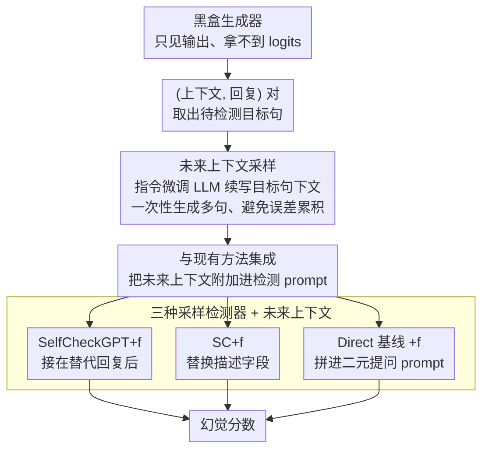

# Enhancing Hallucination Detection via Future Context

**会议**: ACL 2026 Findings  
**arXiv**: [2507.20546](https://arxiv.org/abs/2507.20546)  
**代码**: 无  
**领域**: 幻觉检测  
**关键词**: 幻觉检测, 未来上下文, 黑盒生成器, 采样方法, 滚雪球效应

## 一句话总结

本文提出利用采样生成的"未来上下文"（后续句子）来增强黑盒场景下的幻觉检测，利用幻觉一旦出现就倾向于持续传播的"滚雪球效应"，在 SelfCheckGPT 和 SC 等多种采样方法上一致提升检测性能。

## 研究背景与动机

**领域现状**：LLM 幻觉检测方法主要分为基于不确定性（需要 logits 访问）和基于采样（如 SelfCheckGPT，通过生成多个回复检查一致性）两类。在实际场景中（如博客文章、API 服务被更新或弃用），生成器的内部信号常常不可访问。

**现有痛点**：(1) 不确定性方法需要 token 级 logits，在黑盒场景下不可行；(2) 检索方法对内部文档或私有知识库受限，且无法检测逻辑幻觉和内部不一致（35.2% 的自相矛盾幻觉无法通过检索发现）；(3) 现有采样方法仅利用"当前上下文"的替代采样，未利用"未来上下文"的信号。

**核心矛盾**：幻觉一旦出现就倾向于在后续生成中持续和放大（滚雪球效应），但现有方法只关注当前句的一致性，忽略了未来上下文提供的线索。

**本文目标**：利用未来上下文作为额外线索来增强现有的采样方法幻觉检测能力。

**切入角度**：用指令微调的 LLM 生成目标句之后的可能下文，将这些未来上下文附加到检测 prompt 中，为幻觉判断提供更丰富的线索。

**核心 idea**：如果当前句是幻觉，其未来上下文更可能包含幻觉信息——利用这种"传染性"作为检测信号。

## 方法详解

### 整体框架

方法围绕一个反直觉的观察展开：幻觉一旦冒头，往往会在后续句子里继续蔓延（滚雪球效应），那么"目标句之后会被生成出什么"本身就是判断目标句真假的线索。整条管道分三步：先由黑盒生成器产出"上下文-回复"对（只能看到输出、拿不到 logits）；再用一个指令微调 LLM 为待检测的目标句采样若干"未来上下文"，即它之后可能接的句子；最后把这些未来上下文拼进现有检测方法（SelfCheckGPT、SC、Direct）的 prompt 里，让原本只盯当前句的检测器多一份"下文证据"。整个过程不碰生成器内部，天然适配博客、被弃用 API 这类真实黑盒场景。

### 关键设计

**1. 未来上下文采样：把幻觉的"传染性"变成可观测的检测信号**

现有采样类方法只围绕目标句本身反复重采（当前上下文），始终在同一句话里打转，看不到幻觉向后扩散留下的痕迹。本文反过来用一个指令微调 LLM，提示它续写目标句"接下来可能说的话"，并把单次采样路径生成的整组句子定义为一个"未来上下文"。当需要不止一句下文时，作者发现一次性生成多句比逐句序贯生成更有效——序贯生成会让误差逐步叠加，一次成型的下文更连贯也更省采样。之所以这管用，正是因为滚雪球效应：目标句若是幻觉，会抬高其后续句子也出现幻觉的概率，于是"下文里冒出的幻觉"就反过来成了指认目标句的证据。

**2. 与现有方法的集成：一个"附加"动作把未来上下文嫁接到任意采样检测器上**

每种检测方法的内部逻辑各不相同，若要逐个改造代价高、也难推广。作者用一个统一到近乎朴素的策略——直接把未来上下文附加进检测 prompt，不动底层判断逻辑。具体落到三种方法：SelfCheckGPT+f 把未来上下文接在替代回复后面，扩大一致性检查能比对的线索范围；SC+f 用未来上下文替换掉 SC 原本的描述字段；Direct+f 则把未来上下文拼进 Direct 的提问 prompt，给"凭内部知识判断"再补一层下文佐证。正因为只是"附加"而非"重写"，未来上下文得以作为一个通用增强件插到任何采样方法上，无需触碰各方法的核心逻辑。

**3. Direct 基线方法：剥掉概率估计、直接问 LLM"这句对不对"**

SelfCheckGPT 等方法依赖多次采样和一致性统计，机制重、也不便单独考察"未来上下文到底贡献了什么"。Direct 把判断压到最朴素的形式：对每个"句子-线索"对，直接向检测器 LLM 抛一个二元问题（"这句话准确吗？"），让它调用自身内部知识与推理给出回答，再把所有句子-线索对的判断平均成幻觉分数。它既是一个不靠复杂概率估计的简洁基线，也为消融提供了一个能精确控制变量的实验条件——加不加未来上下文带来的差异，可以在这里被干净地隔离出来。

### 损失函数 / 训练策略

不涉及模型训练，使用预训练指令微调模型（LLaMA 3.1、Gemma 3、Qwen 2.5）作为检测器和采样器。

## 实验关键数据

### 主实验

**幻觉检测 AUC-PR（平均跨 6 个数据集）**

| 检测器 | 方法 | 无未来上下文 | 有未来上下文 | 提升 |
|--------|------|------------|------------|------|
| LLaMA 3.1 | Direct | 68.9 | **71.1** | +2.2 |
| LLaMA 3.1 | SelfCheckGPT | 73.5 | **74.8** | +1.3 |
| LLaMA 3.1 | SC | 65.7 | **70.8** | +5.1 |
| Gemma 3 | SelfCheckGPT | 69.4 | **72.4** | +3.0 |
| Qwen 2.5 | Direct | 67.4 | **69.4** | +2.0 |

### 关键发现

- 未来上下文**一致性地**提升所有方法、所有检测器模型的性能
- SC 方法受益最大（+5.1），因为原始 SC 的线索较少，未来上下文提供了显著的信息增益
- 增加未来上下文的采样数量可以进一步提升性能
- 未来上下文还能**减少采样成本**——与 SelfCheckGPT 结合使用时，可以用更少的替代回复达到同等性能
- 实证验证了滚雪球效应：幻觉句后续出现幻觉的概率显著高于非幻觉句

## 亮点与洞察

- 利用幻觉的"传染性"（滚雪球效应）作为检测信号的思路非常巧妙且反直觉——通常我们认为幻觉传播是坏事，但这里将其转化为检测工具
- 方法的通用性和简洁性是重要优点——作为"附加"方案可以增强任何采样方法
- 生成器无关特性使其适用于博客、API 等真实黑盒场景

## 局限与展望

- 需要额外的采样步骤生成未来上下文，增加了推理成本
- 未来上下文本身也可能包含幻觉，可能引入噪声信号
- 仅在句子级别检测，未扩展到声明级别或段落级别
- 实验数据集以维基百科风格的事实文本为主，对话或创意写作场景未覆盖

## 相关工作与启发

- **vs SelfCheckGPT**: SelfCheckGPT 用当前上下文的替代采样，本文加入未来上下文的采样
- **vs 基于不确定性方法**: 本文完全在黑盒设置下操作，不需要 logits 访问

## 评分

- 新颖性: ⭐⭐⭐⭐ 利用滚雪球效应进行检测的思路新颖，但方法本身是简单的"附加"
- 实验充分度: ⭐⭐⭐⭐⭐ 三个检测器、六个数据集、三种方法的全面组合评估
- 写作质量: ⭐⭐⭐⭐ 动机清晰，实验设计严谨
- 价值: ⭐⭐⭐⭐ 为黑盒幻觉检测提供了简单有效的增强方案

<!-- RELATED:START -->

## 相关论文

- [\[ICLR 2026\] Enhancing Hallucination Detection through Noise Injection](../../ICLR2026/hallucination/enhancing_hallucination_detection_through_noise_injection.md)
- [\[ACL 2026\] The Reasoning Trap: How Enhancing LLM Reasoning Amplifies Tool Hallucination](the_reasoning_trap_how_enhancing_llm_reasoning_amplifies_tool_hallucination.md)
- [\[AAAI 2026\] ESG-Bench: Benchmarking Long-Context ESG Reports for Hallucination Mitigation](../../AAAI2026/hallucination/esg-bench_benchmarking_long-context_esg_reports_for_hallucination_mitigation.md)
- [\[ACL 2026\] Hallucination Detection in LLMs with Topological Divergence on Attention Graphs](hallucination_detection_in_llms_with_topological_divergence_on_attention_graphs.md)
- [\[ACL 2026\] MultiHaluDet: Multilingual Hallucination Detection via LLM Hidden State Probing](multihaludet_multilingual_hallucination_detection_via_llm_hidden_state_probing.md)

<!-- RELATED:END -->
