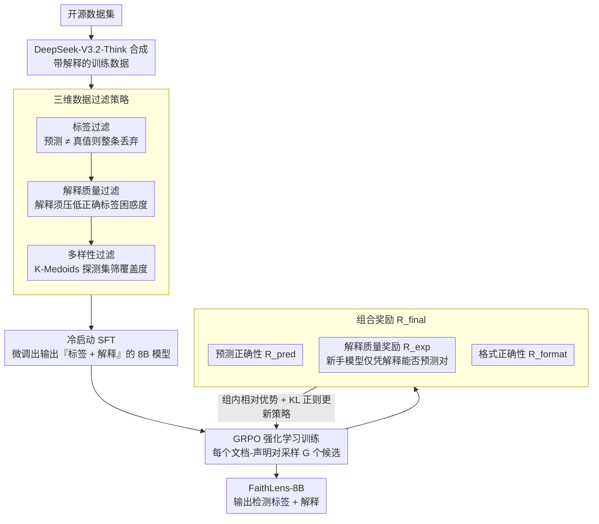

# FaithLens: Detecting and Explaining Faithfulness Hallucination

**会议**: ACL 2026  
**arXiv**: [2512.20182](https://arxiv.org/abs/2512.20182)  
**代码**: [https://github.com/S1s-Z/FaithLens](https://github.com/S1s-Z/FaithLens)  
**领域**: 幻觉检测  
**关键词**: 忠实性幻觉, 可解释检测, 规则强化学习, 数据过滤, 跨任务泛化

## 一句话总结

本文提出 FaithLens，一个 8B 参数的忠实性幻觉检测模型，通过高质量数据合成+三维过滤（标签正确性、解释质量、数据多样性）进行冷启动 SFT，再用基于规则的强化学习（预测正确性奖励+解释质量奖励）进一步优化，在 12 个任务上超越 GPT-5.2 和 o3，同时提供高质量的解释性输出。

## 研究背景与动机

**领域现状**：LLM 广泛用于基于上下文的文本生成（如 RAG、摘要），但容易产生与给定上下文不一致或无关的"忠实性幻觉"。检测此类幻觉对于负责任的 LLM 服务至关重要。

**现有痛点**：(1) 缺乏可解释性——现有方法将幻觉检测视为黑盒二分类，仅输出预测标签而不解释原因，用户无法定位错误和理解原因；(2) 跨任务泛化不一致——不同任务有不同的幻觉模式（摘要中的微妙扭曲 vs RAG 中的矛盾声明），通用模型表现不均衡；(3) 缺乏高质量数据——标注成本高、一致性低，合成数据缺乏质量控制。

**核心矛盾**：要同时实现高检测准确率和高解释质量是困难的：SFT 训练让模型模仿训练数据，容易记住简单样本但在复杂场景泛化差；而自由形式解释的质量难以用规则直接验证。

**本文目标**：构建成本效益高的幻觉检测模型，同时输出检测结果和解释性说明，在 12 个多样化任务上实现 SOTA。

**切入角度**：两阶段训练——先用精心过滤的合成数据 SFT 冷启动，再用巧妙设计的规则奖励（预测正确性+解释质量）进行 GRPO 强化学习。

**核心 idea**：解释质量奖励的关键洞察——如果一个解释能帮助"新手模型"（未微调的 Llama-3.1-8B）正确预测标签，说明该解释足够清晰和信息丰富。

## 方法详解

### 整体框架

FaithLens 要解决的是"幻觉检测既要准、又要能说清为什么"这对难题，整体走两阶段。第一阶段冷启动 SFT：从开源数据集出发，用高级推理模型（DeepSeek-V3.2-Think）合成带解释的训练数据，经过一道三维过滤筛掉噪声样本后微调出一个会输出"标签 + 解释"的 8B 模型；第二阶段规则强化学习：用 GRPO 进一步优化，奖励由预测正确性、解释质量、格式三部分组成。两阶段串起来的逻辑是——SFT 先让模型学会基本的检测和解释格式，RL 再用奖励信号把它推到复杂场景也站得住的水平。

### 关键设计

**1. 三维数据过滤策略：用三道筛子保证合成数据既标得对、又讲得清、还覆盖得全**

不加过滤的合成数据混着大量噪声和过多的简单样本，直接拿来 SFT 会让模型只学会背简单题。FaithLens 设计了递进式的三道过滤。**标签过滤**比较 LLM 预测与真实标签，不一致就整条丢弃——因为一个错误标签配上的 CoT 和解释往往看起来很连贯，却是和错误预测"内在自洽"的，留着就是教模型自圆其说。**解释质量过滤**测量加入解释后模型对正确标签的困惑度是否下降，只保留那些能把困惑度压低的样本，等于要求解释真的携带了有用信息而非空话。**多样性过滤**先用 K-Medoids 聚类构建一个探测集，再测试每个候选样本能否帮探测集里的样本预测正确，保留对多样化样本有正面影响的训练数据。三道筛子从"对不对 → 有没有信息量 → 覆不覆盖多样场景"层层收紧，最后留下的数据才同时具备正确性、信息量和多样性。

**2. 解释质量奖励：用"新手能不能看懂你的解释"来给自由文本质量打分**

自由形式的解释好不好，几乎没法用规则直接验证，这是把解释质量纳入 RL 奖励的最大障碍。FaithLens 的巧招是做一次代理评估：把生成的解释 $e$ 连同文档和声明一起喂给一个"新手模型"（未微调的 Llama-3.1-8B-Instruct），看它能不能仅凭这段解释把标签预测对——能则奖励为 $1$，否则为 $0$，并入总奖励 $R_{\text{final}} = R_{\text{pred}} + R_{\text{exp}} + R_{\text{format}}$。背后的判据很直白："如果一个未经训练的新手都能顺着你的解释得出正确答案，那这段解释一定足够清晰、信息足够丰富。"这就把"文本质量好不好"这个不可验证的问题，转化成了"新手分类对不对"这个可验证的二分类问题。

**3. GRPO 强化学习训练：在 SFT 冷启动之上靠探索把复杂场景也啃下来**

SFT 的通病是容易记住简单样本、却在复杂场景泛化差，光靠模仿训练数据走不远。FaithLens 接着用 GRPO（Group Relative Policy Optimization）：对每个文档-声明对生成 $G$ 个候选（每个含解释 + 预测），用上面那套组合奖励给每个候选打分，再通过 GRPO 的组内相对优势估计更新策略，同时用 KL 散度正则化防止偏离参考策略过远。相比 SFT 的被动模仿，RL 靠主动探索 + 奖励驱动，逼着模型在那些 SFT 阶段没见好、靠背题过不去的复杂样本上也产出高质量的"解释 + 预测"。

### 损失函数 / 训练策略

SFT 阶段在过滤后的合成数据上用标准交叉熵损失微调。RL 阶段用 GRPO，组合奖励 = 预测正确性(0/1) + 解释质量(0/1) + 格式正确性(0/1)。基础模型为 Llama-3.1-8B-Instruct。

## 实验关键数据

### 主实验

**12 个任务的总体性能（Balanced Accuracy %）**

| 模型 | 标准差 ↓ | 平均值 ↑ |
|------|---------|---------|
| GPT-4o | 7.0 | 76.1 |
| o3 | 6.0 | 82.1 |
| GPT-5.2 | - | 85.3 |
| Claude-3.7-Sonnet | 5.3 | 82.6 |
| DeepSeek-V3.2-Think | 5.1 | 84.4 |
| MiniCheck-7B | 9.3 | 76.7 |
| **FaithLens-8B (Ours)** | **4.1** | **85.8** |

### 消融实验

| 配置 | 平均准确率 | 说明 |
|------|----------|------|
| Full FaithLens | 85.8 | 完整模型 |
| w/o RL（仅 SFT） | 82.3 | RL 贡献 +3.5 |
| w/o 解释质量奖励 | 84.1 | 解释奖励贡献 +1.7 |
| w/o 数据过滤 | 79.8 | 过滤贡献 +6.0 |
| w/o 多样性过滤 | 81.5 | 多样性过滤贡献 +4.3 |

### 关键发现

- 8B FaithLens 超越了 GPT-5.2（85.8 vs 85.3）和 o3（82.1），在成本上有数量级优势
- 标准差最低（4.1），说明跨任务泛化最稳定——解决了现有方法"部分任务强、部分任务弱"的问题
- 数据过滤的贡献（+6.0）大于 RL（+3.5），说明高质量训练数据是基础
- 多样性过滤对跨任务泛化至关重要，去除后准确率下降 4.3 个百分点
- 解释质量奖励不仅提升了解释质量，还间接提升了检测准确率（+1.7），说明"解释→预测"的过程有内在正则化效果

## 亮点与洞察

- "新手模型代理评估"是评估自由形式解释质量的优雅方案——将不可验证的文本质量问题转化为可验证的分类正确性问题
- 三维数据过滤的"标签→解释→多样性"递进式设计保证了训练数据的全面质量
- 仅 8B 参数超越闭源巨型模型，展示了"精心设计的训练策略 > 蛮力扩大参数"

## 局限与展望

- 解释质量奖励依赖"新手模型"的能力，如果新手模型本身有偏差，奖励信号可能失真
- 合成数据来源于现有开源数据集，可能继承其偏差
- 仅评测了英语任务，多语言泛化能力未验证
- 未来可探索更细粒度的解释评估（如句级别的证据锚定）

## 相关工作与启发

- **vs MiniCheck**: MiniCheck 用合成数据训练 7B 分类器达到 GPT-4o 水平，但无解释能力；FaithLens 同时提供解释并超越 GPT-5.2
- **vs SelfCheckGPT**: SelfCheckGPT 依赖大型模型推理，效率低；FaithLens 用 8B 模型实现更好性能
- **vs DeepSeek-V3.2-Think**: 作为数据合成教师它很强（84.4%），但 FaithLens 通过 RL 超越了教师（85.8%）

## 评分

- 新颖性: ⭐⭐⭐⭐ 解释质量奖励和三维过滤策略有创新，但整体框架（SFT+RL）是常见范式
- 实验充分度: ⭐⭐⭐⭐⭐ 12 个任务、多基线（含 GPT-5.2/o3）、详尽消融
- 写作质量: ⭐⭐⭐⭐ 方法描述清晰，公式完整
- 价值: ⭐⭐⭐⭐⭐ 8B 模型超越 GPT-5.2 且提供解释，实用性极强

<!-- RELATED:START -->

## 相关论文

- [\[ACL 2026\] Detecting Hallucinations in SpeechLLMs at Inference Time Using Attention Maps](detecting_hallucinations_in_speechllms_at_inference_time_using_attention_maps.md)
- [\[ACL 2026\] FinGround: Detecting and Grounding Financial Hallucinations via Atomic Claim Verification](finground_detecting_and_grounding_financial_hallucinations_via_atomic_claim_veri.md)
- [\[ACL 2026\] TPA: Next Token Probability Attribution for Detecting Hallucinations in RAG](tpa_next_token_probability_attribution_for_detecting_hallucinations_in_rag.md)
- [\[ICLR 2026\] LUMINA: Detecting Hallucinations in RAG System with Context-Knowledge Signals](../../ICLR2026/hallucination/lumina_detecting_hallucinations_in_rag_system_with_context-knowledge_signals.md)
- [\[ICML 2026\] From Flat Facts to Sharp Hallucinations: Detecting Stubborn Errors via Gradient Sensitivity](../../ICML2026/hallucination/from_flat_facts_to_sharp_hallucinations_detecting_stubborn_errors_via_gradient_s.md)

<!-- RELATED:END -->
