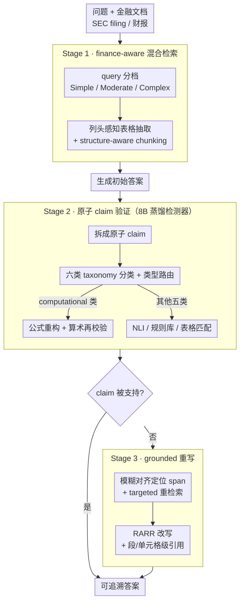

# FinGround: Detecting and Grounding Financial Hallucinations via Atomic Claim Verification

**会议**: ACL 2026  
**arXiv**: [2604.23588](https://arxiv.org/abs/2604.23588)  
**代码**: 未公开  
**领域**: 幻觉检测  
**关键词**: 金融问答, 原子断言验证, 公式重构, 表格 attribution, 知识蒸馏

## 一句话总结
FinGround 是一个面向金融文档问答的三阶段 "verify-then-ground" pipeline：(1) finance-aware 混合检索；(2) 把答案拆成原子 claim 并按"数值/时间/实体属性/比较/监管/计算"六类 taxonomy 用 type-routed 策略验证 (其中 computational claim 用公式重构 + 算术再校验)；(3) 对未支持的 claim 进行 grounded 重写并加段/单元格级引用——把 GPT-4o 蒸馏到 8B 检测器实现 91.4% F1、18× 加速，端到端将 hallucination rate 相比 GPT-4o+CoT 降 78%。

## 研究背景与动机

**领域现状**：金融行业的 LLM 必须把答案 grounded 到具体的 SEC filing 或财报上，但即使带 RAG 的 GPT-4-Turbo 在 SEC 问答上仍有 81% 错误率 (Islam 2023)。同时欧盟 AI 法案对高风险金融 AI 的强制合规期是 2026 年 8 月，要求"人为监督 + 可解释 + 准确性保证"。

**现有痛点**：FActScore、SAFE 等通用幻觉检测器把所有 claim 同等对待——它们能拆出"gross margin 是 62.4%"这种 atomic fact，但没法把它和表格单元格对齐校验，于是漏掉了 43% 的计算类错误。RARR 类重写方法假设单一证据源，在不区分 claim 类型时盲目重写，会让 34% 的计算类 claim 重写后产生新幻觉。table-cell attribution 若上游 chunking 不感知结构，会产生 23% 的 dangling citation。

**核心矛盾**：通用 hallucination 检测追求"领域无关"，但金融场景的核心错误 (数值算错、监管引用编造、表格未对齐) 恰恰需要"领域感知"——claim 的类型决定了应该用 NLI、还是公式重算、还是表格匹配。一刀切的 NLI 在比率和 margin 验证上注定失败。

**本文目标**：(i) 把检测和缓解统一到一个生产可用的金融 QA pipeline；(ii) 设计 claim 类型路由的验证策略，特别要解决计算类错误；(iii) 把成本降到能真上线 (≤$0.005/query)；(iv) 提出"retrieval-equalized evaluation"协议，把检索增益与验证增益解耦。

**切入角度**：作者从 500 条真实金融幻觉的错误分析出发，发现错误集中在 6 个可枚举的 claim 类型上，每种类型都有对应的最佳验证策略——所以问题不是"更强的 NLI 模型"，而是"按类型路由"。

**核心 idea**：把 atomic-claim 验证从"单一 NLI 黑盒"升级为"按 6 类金融 claim taxonomy 路由的多策略集成"，其中 computational 类用公式模板库 + 表格单元格抽取 + 算术再校验三步替代传统 NLI。

## 方法详解

### 整体框架

FinGround 要解决的是金融文档问答里"答案看着对、但数字算错或证据编造"的幻觉，整条 pipeline 走的是 "verify-then-ground"：先检索证据、再把答案逐条核验、最后把核验不过的句子重写并打上可追溯的引用。具体分三段流转——**Stage 1 检索**用 RoBERTa-base 把 query 分成 Simple/Moderate/Complex 三档，分别走 BM25、密集检索+表格抽取、迭代式 retrieve-then-reason；表格相似度用列头感知打分 $\text{sim}(q,t)=\alpha\cdot\cos(\mathbf{q},\mathbf{t}_{\text{cell}})+(1-\alpha)\cdot\cos(\mathbf{q},\mathbf{t}_{\text{header}})$（$\alpha=0.6$），并用 structure-aware chunking 保留行列关系，每个 chunk 带 $\langle\text{document, section, page, element\_type}\rangle$ 的来源标记。**Stage 2 验证**把答案拆成原子 claim，分类后按类型路由到不同验证策略，输出 supported / contradicted / unverifiable 三态；执行验证的不是 GPT-4o，而是把它蒸馏到的 8B 检测器。**Stage 3 重写**把后两态的 claim 通过模糊对齐（edit distance ≤3）定位回原答案 span，做 targeted 重检索后按 RARR 范式改写，加段级或单元格级 inline citation `[Doc:d, §s, p.p]` / `[Doc:d, Table t, Row r, Col c]`；若一次要改的 claim ≥3 条，干脆触发整段重生成以免逐句改写产生 error compounding。

### 关键设计

**1. 六类金融 claim taxonomy + 类型路由验证：先认清这是哪种错，再决定怎么验**

通用幻觉检测器（FActScore、SAFE）把所有 claim 一视同仁、统统丢给 NLI，但金融答案里"gross margin 是 62.4%"这种话，NLI 根本不会去算它对不对——于是漏掉了 43% 的计算类错误。FinGround 的应对是先把 atomic claim 按错误类型分成六类：numerical（具体数值）、temporal（时间断言）、entity-attribute（实体属性）、comparative（跨实体/时段比较）、regulatory（合规引用）、computational（派生量），再按类路由：numerical 抽出 (value, unit, period, entity) 与表格单元格精确匹配，entity-attribute 走 cross-encoder NLI，regulatory 查规则库，computational 单独走公式重构分支。这套 taxonomy 不是拍脑袋定的——它来自对 500 条真实金融幻觉的错误归因，且实测 6 类比 3 类高 4.3 F1、比 10 类无显著差别（$p=0.23$），说明六类正好是"够用且不冗余"的粒度。本质上它承认了一件被通用检测器忽略的事：验证策略和 claim 类型是耦合的，强行用 NLI 验证比率和 margin，等于让一个不会算账的人去审账。

**2. Computational claim 的公式重构 + 算术再校验：对派生量不靠"猜"，重新算一遍**

错误分析里 computational claim 是幻觉率最高的一类（28.4%），但作者发现它同时也是最容易自动验证的——因为只要找对 operand 就能精确重算，瓶颈从来不在"验证难度"而在"被当成 NLI 处理"。所以这一类不做语义蕴含判断，而是真的把数重新算出来：先用 47 个金融公式模板库匹配出 claim 隐含的公式（如毛利率、负债权益比），再从表格单元格里检索对应的 operand value，最后重算派生量并允许 ±0.5% 容差以容忍四舍五入。这等于把一段 symbolic execution 嵌进了 RAG 验证，computational 类单项验证做到 90.2% F1，比 SelfCheckGPT 高出 +18.9 F1。

**3. 8B 蒸馏检测器 + retrieval-equalized 评测协议：既要能上线，也要能说清增益来自哪**

GPT-4o 验证单条 claim 要 6.1s，放到金融实时问答里成本根本扛不住，所以 FinGround 用 GPT-4o（gpt-4o-2024-05-13）在 3,200 条金融 QA 上蒸馏到 Llama-3-8B-Instruct：蒸馏目标用 reverse KL divergence 配多任务联合（claim 拆分 + 证据对齐 + verdict 分类），标注侧用两轮一致性检查丢掉 8.4% 不一致样本。结果 p95 延迟从 6.1s 压到 340ms（18×），F1 91.4%（保留教师 96.2% 的性能），部署成本 \$0.003/query。另一半贡献是评测协议：以往 RAG 论文很难区分提升是"找到更好证据"还是"更好地用证据"，FinGround 提出 retrieval-equalized——先给每个 baseline 都装上自己的 Stage 1 检索，把所有差异都收敛到"验证"这一个变量上再比 HalRate，这样得到的验证增益才是干净的、可归因的。

### 一个完整示例：核验一句"毛利率 = 62.4%"

假设模型答出"Q3 gross margin was 62.4%, up from 58.1% last year"。Stage 1 把这个 Moderate 难度 query 路由到密集检索+表格抽取，用列头感知相似度命中财报里的 Revenue 与 COGS 两行，chunk 带上 `⟨10-Q, Income Statement, p.4, table⟩` 来源。Stage 2 先拆成两条 atomic claim：①"Q3 gross margin = 62.4%"，②"up from 58.1% last year"。分类器把①判为 computational、②判为 comparative。①不走 NLI 而进公式分支：模板库匹配出 $\text{gross margin}=(\text{Revenue}-\text{COGS})/\text{Revenue}$，从单元格抽出 Revenue=820、COGS=312，重算得 $(820-312)/820=61.95\%$，落在 62.4% 的 ±0.5% 容差外 → 判 **contradicted**；②的去年值则匹配上表得到验证 → supported。Stage 3 只对①触发重写：模糊对齐定位回原 span，targeted 重检索确认数值，改写成"Q3 gross margin was 62.0%"并加单元格级引用 `[Doc:10-Q, Table 1, Row Revenue/COGS]`。整句从一个看似精确实则算错的数字，变成一个算对且可追溯的答案。

### 损失函数 / 训练策略

蒸馏用 reverse KL（$\text{KL}(p_{\text{student}} || p_{\text{teacher}})$ 在 mode-seeking 上更稳），多任务联合 decomposition + alignment + verdict，配 vLLM 部署 + continuous batching。Cross-encoder alignment 模型在 8,400 条 TAT-QA/FinQA NLI 上微调达到 87.2% F1。

## 实验关键数据

### 主实验：FinHalu 检测性能 (1,200 条专家标注三元组)

| 系统 | Precision | Recall | F1 |
|------|-----------|--------|-----|
| SelfCheckGPT | 69.4 | 76.5 | 72.8 |
| HHEM (Vectara) | 78.9 | 73.8 | 76.3 |
| FActScore | 74.2 | 79.3 | 76.7 |
| CRAG | 80.6 | 74.9 | 77.6 |
| Self-RAG | 81.2 | 77.1 | 79.1 |
| GPT-4o (teacher) | 94.1 | 95.9 | 95.0 |
| **FinGround (8B distilled)** | **92.7** | **90.2** | **91.4** |

所有相对 baseline 的改进 $p<0.01$；FinGround 8B 保留 teacher F1 的 96.2%、p95 延迟 340ms (vs 6.1s)。

### 端到端 HalRate 与消融 (FinanceBench 列重点)

| 系统 | FinQA HalRate↓ | TAT-QA HalRate↓ | FinanceBench HalRate↓ | Uncond. Acc |
|------|---------------|----------------|----------------------|-------------|
| Vanilla RAG | 34.7 | 31.5 | 43.8 | 63.9 |
| FActScore | 25.3 | 22.7 | 32.4 | 66.2 |
| Self-RAG | 22.1 | 18.4 | 28.5 | 68.2 |
| GPT-4o + CoT | 18.6 | 15.2 | 22.4 | 71.9 |
| **FinGround (full)** | **3.6** | **3.8** | **4.9** | **71.2** |
| − regeneration | 3.6 | 3.8 | 4.9 | 63.8 |
| − taxonomy (统一 NLI) | 7.2 | 8.1 | 11.7 | 70.5 |
| − table retrieval | 5.9 | 10.6 | 9.4 | 66.2 |

端到端 HalRate 相比 GPT-4o+CoT 平均降 78%；retrieval-equalized 设置下仍多降 68–76% ($p<0.01$)，证明验证贡献独立于检索。

### 关键发现
- **去 taxonomy → HalRate 翻倍**：FinanceBench 上 4.9%→11.7%，证明"按类型路由验证"是核心贡献，不是噱头。
- **去 table retrieval → 表格密集型数据集崩**：TAT-QA HalRate 从 3.8% 飙到 10.6%，凸显金融问答里表格证据不可省。
- **Computational claim 最难也最易**：28.4% 是 hallucination 最严重的类别，但同时也是 formula reconstruction 提升最大的 (+18.9 F1)——"瓶颈在路由不在验证难度"得到实证。
- **Cross-generator 泛化好**：在 Llama-3-70B 和 Claude-3.5-Sonnet 上 F1 仍达 87–89%，说明 FinGround 是 generator-agnostic 的验证层。
- **Hedged 语言占 52% 假阳性**：诸如 "approximately"、"roughly" 这种模糊表达让验证器误判，是未来的明显改进点。
- **4 周 24 分析师 pilot**：retrieval 召回不全导致 3.8% false negative，其中 56% 是 computational claim 的 operand 落在检索窗口外——验证不是万能，必须配合更好的 retrieval。

## 亮点与洞察
- **"按 claim 类型路由验证策略"是 FActScore 之后最自然的演进**：FActScore 把答案打散到原子事实就是为了独立验证每一条，但没考虑"不同 fact 该用不同方式验证"——FinGround 把这个想法补完。这种"将统一验证拆分为类型路由"的思路可以迁移到法律、医疗 (剂量、副作用、引用判例) 等任何领域 QA。
- **Computational claim 用公式重算而不是 NLI**：让模型"算"而不是"猜"——这其实是一种把 symbolic execution 嵌入 RAG 验证的具体落地，且 47 个公式模板远比想象的少 (金融比率本就有限)。
- **Retrieval-equalized evaluation 是被忽视的方法学贡献**：把 RAG 论文长期搅混的"检索增益 vs 验证增益"解耦，应该成为 RAG 类论文的新标配；类似于 NLP 早期对 "model vs data" 的分离实验。
- **8B 蒸馏到 $0.003/query**：这不是炫技，是"真要部署到 40 家银行"的硬指标——很多 NLP 论文止步于 GPT-4o teacher，FinGround 完成了 production-grade 的 last mile。

## 局限与展望
- 公式模板库只有 47 条，超出库范围的 derived quantity 仍走 NLI fallback，准确率会掉。
- Hedged language 处理弱，"approximately"、"roughly" 触发 52% 假阳性，需要更细的不确定性建模。
- 检索窗口外的 operand 导致 3.8% false negative，证明"再好的验证"也救不了"检索丢"——pipeline 整体效果受限于 Stage 1 召回。
- FinHalu 只有 1,200 条专家标注样本 ($\kappa=0.83$)，规模偏小且严重依赖标注者的金融专业能力。
- 只在 FinQA/TAT-QA/FinanceBench 三个英文 SEC 域评测，跨语言、跨监管体系 (如欧盟 MiFID、中国 SAC) 的泛化未知。
- 没开源代码或模型权重 (摘要未提)，复现门槛高。

## 相关工作与启发
- **vs FActScore (Min 2023)**: 都把答案拆原子 fact；FActScore 用统一 NLI 验证 (76.7 F1)，FinGround 加上 6 类 taxonomy 路由 + 公式重构，金融场景下 +14.7 F1。本质区别是"类型感知 vs 类型无关"。
- **vs SelfCheckGPT (Manakul 2023)**: SelfCheckGPT 靠 sampling 一致性，不需要外部证据；FinGround 必须有 retrieval evidence 但能给出 grounded citation——前者适合开放域、后者适合监管域。
- **vs Self-RAG / CRAG (Asai 2024, Yan 2024)**: 两者都改进 RAG 本身 (自适应检索)；FinGround 是 verification 层，能叠加在它们之上 (Table 3 显示 Stage 1 检索给 baseline +37% 后 FinGround 再加 +68% HalRate 降幅)。
- **vs PHANTOM / FAITH 金融幻觉基准**: 两者是评测集；FinGround 是解决方案，且自带新基准 FinHalu。
- **启发**：(a) 任何 grounded QA 场景都应先做错误类型聚类再设计验证；(b) 把 symbolic execution / 算术嵌入 RAG verification 是低 hanging fruit；(c) production paper 应该把"检索/验证/重写"严格解耦评测，否则结论不可信。

## 评分
- 新颖性: ⭐⭐⭐⭐ 六类金融 claim taxonomy + computational claim 的公式重构是金融域的实质性贡献；retrieval-equalized 评测协议是方法学新意。
- 实验充分度: ⭐⭐⭐⭐ 三个公开 + 一个自建基准、cross-generator transfer、4 周 24 人 pilot、retrieval-equalized 设置、消融详尽，但 FinHalu 规模 1,200 略小。
- 写作质量: ⭐⭐⭐⭐ 三阶段结构清晰、每段都有数据支撑、limitations 诚实；公式和表格略密集需要细读。
- 价值: ⭐⭐⭐⭐ 直接对应欧盟 AI 法案 2026 年 8 月合规期，且配 $0.003/query 的部署方案，立即可用；taxonomy + 公式重构思路可迁移到其他 grounded QA 场景。

<!-- RELATED:START -->

## 相关论文

- [\[ACL 2026\] TPA: Next Token Probability Attribution for Detecting Hallucinations in RAG](tpa_next_token_probability_attribution_for_detecting_hallucinations_in_rag.md)
- [\[CVPR 2026\] Evaluating and Easing Hallucinations for GUI Grounding](../../CVPR2026/hallucination/exposing_and_evaluating_hallucinations_for_gui_grounding.md)
- [\[ACL 2026\] Detecting Hallucinations in SpeechLLMs at Inference Time Using Attention Maps](detecting_hallucinations_in_speechllms_at_inference_time_using_attention_maps.md)
- [\[ACL 2026\] FaithLens: Detecting and Explaining Faithfulness Hallucination](faithlens_detecting_and_explaining_faithfulness_hallucination.md)
- [\[ICLR 2026\] LUMINA: Detecting Hallucinations in RAG System with Context-Knowledge Signals](../../ICLR2026/hallucination/lumina_detecting_hallucinations_in_rag_system_with_context-knowledge_signals.md)

<!-- RELATED:END -->
