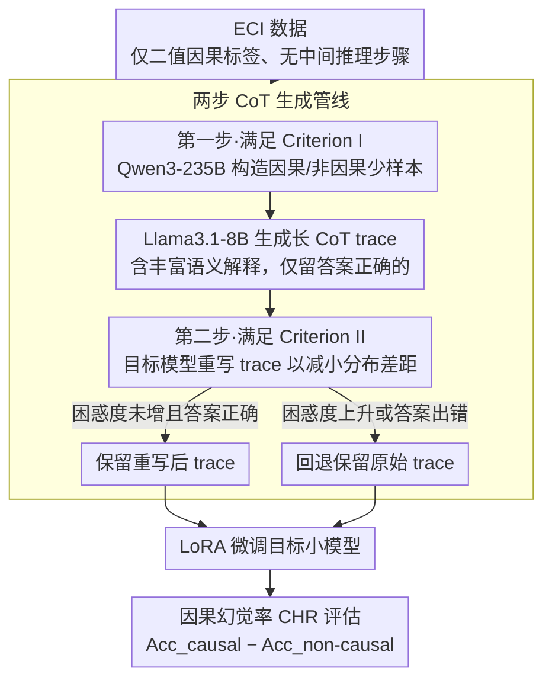

# Generating Effective CoT Traces for Mitigating Causal Hallucination

**会议**: ACL 2026  
**arXiv**: [2604.12748](https://arxiv.org/abs/2604.12748)  
**代码**: 无  
**领域**: 幻觉检测  
**关键词**: 因果幻觉、思维链、事件因果识别、小模型微调、数据生成

## 一句话总结
本文首先提出了因果幻觉率（CHR）指标来量化小型 LLM 在事件因果识别中过度预测因果关系的倾向，然后通过系统实验确定了有效 CoT 数据的两个关键标准（充分长度的语义解释+与目标模型对齐的分布），设计了一套低成本的 CoT 数据生成管线，将 Qwen2.5-1.5B 的 CHR 从 83.54% 降至 6.26%，同时提升平均准确率至 66.00%。

## 研究背景与动机

**领域现状**：大型语言模型在数学、编程等复杂推理任务上表现出色，但在事件因果识别（ECI）任务中存在严重的"因果幻觉"——模型倾向于不论事件对之间是否存在真实因果关系都预测为因果关系。这一问题在小型模型（≤1.5B参数）中尤为严重，如 Qwen2.5-1.5B 在因果事件对上准确率很高但在非因果事件对上几乎为零。

**现有痛点**：现有 ECI 研究主要聚焦于推理时的提示设计（如 Dr.ECI 的因果提示、MRBalance 的多 Agent 辩论），但这些方法无法缓解小模型的因果幻觉。当前 ECI 数据集仅包含二值标签，缺少中间推理步骤，不适合用于 CoT 微调。而已有的 CoT 数据构建准则（低困惑度优先、短 trace 更易学、重写以减小分布差距）是在数学推理任务上得出的，不一定适用于 ECI。

**核心矛盾**：小型 LLM 因参数量有限，难以仅从二值标签或简短提示中学会因果推理的细粒度判别能力，需要丰富的中间推理步骤来"教会"模型区分因果和非因果关系——但怎样的 CoT trace 才是有效的，这一问题在 ECI 领域尚无系统研究。

**本文目标**：（1）定义量化因果幻觉的指标；（2）系统探究有效 CoT trace 的标准；（3）设计低成本的 CoT 数据生成管线来缓解小模型的因果幻觉。

**切入角度**：不直接沿用数学推理中的 CoT 构建准则，而是通过对困惑度、trace 长度和分布差距三个因素的控制实验，发现 ECI 领域有其独特的准则——长 trace 反而更好，困惑度不是可靠的选择标准。

**核心 idea**：有效的 ECI CoT trace 必须满足两个标准——包含充分长的语义解释和推理步骤（Criterion I），且与目标模型保持小的分布差距且不增加困惑度（Criterion II）——据此设计两步生成管线。

## 方法详解

### 整体框架
两步 CoT trace 生成管线：第一步用 Qwen3-235B-A22B (Thinking) 构造少样本示例，提示 Llama3.1-8B 生成包含丰富语义解释和推理步骤的 CoT trace，仅保留产生正确答案的 trace；第二步用目标模型本身重写这些 trace 以减小分布差距，验证重写后困惑度未增加。最后用这些 trace 通过 LoRA 微调目标小模型，并用因果幻觉率（CHR）衡量缓解效果。

### 关键设计

**1. 因果幻觉率（CHR）指标：用一个差值直接揪出“逢对就判因果”的系统性偏差**

整体准确率或 F1 会掩盖因果幻觉——一个把所有事件对都判成因果的模型，仍可能有 50% 的总体准确率，问题被均值藏住了。CHR 的做法是分开看两类样本再相减：$\text{CHR} = \text{Acc}_{\text{causal}} - \text{Acc}_{\text{non-causal}}$，即因果事件对准确率减去非因果事件对准确率。CHR $>0$ 表示存在因果幻觉、数值越大越严重，CHR $<0$ 则表示反向偏好（过度预测非因果）。这个差值会把偏差暴露无遗：Qwen2.5-1.5B 原始 CHR 高达 83.54%，意味着它几乎把所有事件对都判成了因果关系。指标本身很简洁，却能推广到其他存在标签不平衡偏好的任务。

**2. 有效 CoT trace 标准的实证发现：推翻三条从数学推理迁移来的“常识”**

ECI 缺中间推理步骤的数据，而现成的 CoT 构建准则都是在数学推理上得出的，照搬未必成立。论文用三组控制实验逐条检验，得到与数学推理相反的结论：其一，困惑度不是可靠的选择标准——按低困惑度挑出的 trace CHR 为 39.26%，反而是困惑度更高的长 Llama trace 把 CHR 压到 34.12%，因为长 trace 含更丰富的语义解释；其二，小模型确实能从更长的 CoT trace 中学习——随 trace 长度增加 CHR 持续下降（242 token: 59.79% → 317 token: 34.68% → 482 token: 30.60%）；其三，重写策略只在不增加困惑度时才有效——对中等长度 trace 重写反而同时抬高了困惑度和 CHR。这三条发现把“低困惑度优先、短 trace 更易学、重写减小分布差距”这套数学推理经验逐一证伪，为 ECI 立下了自己的数据构建准则。

**3. 两步 CoT 生成管线：大模型把质量拉满，小模型把分布拉回**

要满足上面两条标准（充分长的语义解释 + 与目标模型对齐且不抬高困惑度），论文设计了低成本两步管线。第一步用 Qwen3-235B-A22B (Thinking) 各构造一个因果、一个非因果的少样本示例，再用这两个示例提示 Llama3.1-8B 生成包含丰富语义解释和推理步骤的长 CoT trace，只保留产生正确答案的那些——满足 Criterion I 的“长且有解释”。第二步用目标模型本身（如 Qwen2.5-1.5B）重写这些 trace 以减小分布差距，并逐条验证重写后困惑度未增加且答案仍正确，否则回退保留原始 trace——满足 Criterion II 的“对齐且不增困惑度”。整条管线主力是 Llama3.1-8B，成本低；大模型引导质量、小模型适配分布，再加回退机制兜底，避免重写带来的质量退化。

### 损失函数 / 训练策略
使用 TRL 框架的 SFTTrainer 进行 LoRA 微调：batch size 1，梯度累积 8 步，训练 1 个 epoch，学习率 $2 \times 10^{-4}$，余弦退火调度。LoRA rank=8，scaling factor=16，dropout=0.05。解码温度固定为 0 以确保可复现性。

## 实验关键数据

### 主实验

| 方法 | CHR (↓) | mAcc (↑) |
|------|---------|----------|
| GPT-4 | 53.30 | 51.40 |
| Llama3.1-8B | 60.59 | 58.97 |
| Qwen2.5-1.5B (原始) | 83.54 | 52.97 |
| Qwen2.5-1.5B (CoT提示) | 69.77 | 51.48 |
| Qwen2.5-1.5B (二值标签微调) | 66.67 | 56.74 |
| **Qwen2.5-1.5B (本文管线)** | **6.26** | **66.00** |
| Llama3.2-1B (原始) | 76.43 | 55.58 |
| **Llama3.2-1B (本文管线)** | **9.14** | **63.44** |

### 消融实验

| 配置 | CHR | mAcc | 说明 |
|------|-----|------|------|
| Qwen2.5-1.5B 原始 | 83.54 | 52.97 | 基线 |
| w/o 重写 | 23.39 | 56.51 | 仅第一步 |
| w/ 重写 | 6.26 | 66.00 | 完整管线 |
| Llama3.2-1B 原始 | 76.43 | 55.58 | 基线 |
| w/o 重写 | 17.13 | 55.51 | 仅第一步 |
| w/ 重写 | 9.14 | 63.44 | 完整管线 |

### 关键发现
- 微调后的 1.5B 模型因果幻觉程度低于 GPT-4（CHR 6.26% vs 53.30%）和 Llama3.1-8B（6.26% vs 60.59%），说明管线生成的 CoT 数据质量极高
- 跨数据集泛化强：在 EventStoryLine 上训练，在 Causal-TimeBank 和 MAVEN-ERE 上 CHR 分别降至 11.37% 和 11.13%
- 跨难度泛化强：句子级训练数据能泛化到文档级 ECI（更难的跨句事件对），CHR 从 54.52% 降至 1.41%
- 鲁棒性：注入错误干预提示后模型准确率基本不变，说明模型真正学会了因果推理而非简单遵循指令

## 亮点与洞察
- 推翻了三个从数学推理迁移来的 CoT 构建"常识"是本文最重要的贡献。特别是"小模型能从长 CoT trace 中学习"这一发现与 Li et al. (2025) 的结论相矛盾，但通过严谨的控制实验给出了令人信服的解释——长 trace 中的语义解释才是关键因素，而非 trace 本身的长度。
- CHR 指标的设计简洁但击中要害：传统评估指标会掩盖因果幻觉问题（CHR=100% 的模型仍有 50% 的总体准确率），而 CHR 直接暴露了模型的系统性偏差。这个指标可以推广到其他存在标签不平衡偏好的任务。
- 两步管线的设计体现了"用大模型引导质量、用小模型适配分布"的精巧平衡，且通过保留原始 trace 的回退机制避免了重写可能带来的质量退化。

## 局限与展望
- 管线的第一步依赖 Qwen3-235B 构造少样本示例，虽然只需两个示例但仍需要访问大型模型
- 重写策略的有效性条件（不增加困惑度）需要预先验证，不同 trace 长度下的行为不一致
- 实验仅覆盖 EventStoryLine 等英文 ECI 数据集，对中文或其他语言的适用性未验证

## 相关工作与启发
- **vs Dr.ECI (Cai et al., 2025)**: Dr.ECI 使用因果推理原则构造提示词，但在 Qwen2.5-1.5B 上 CHR 达到 100%（全预测为因果），而本文通过 CoT 微调将 CHR 降至 6.26%
- **vs Zhang et al. (2025) 的困惑度选择策略**: 该方法在数学推理中有效但在 ECI 中不成立——困惑度最低的 trace 并不产生最低的 CHR，长度和语义解释丰富度才是主导因素

## 评分
- 新颖性: ⭐⭐⭐⭐ 提出 CHR 指标并推翻了三个 CoT 构建常识，对 ECI 领域有独特贡献
- 实验充分度: ⭐⭐⭐⭐⭐ 控制变量实验严谨，跨数据集/跨难度/鲁棒性测试全面
- 写作质量: ⭐⭐⭐⭐ 实验分析层层递进，从发现到标准到管线的逻辑清晰

<!-- RELATED:START -->

## 相关论文

- [\[NeurIPS 2025\] Causal-LLaVA: Causal Disentanglement for Mitigating Hallucination in Multimodal Large Language Models](../../NeurIPS2025/hallucination/causalllava_causal_disentanglement_for_mitigating_hallucinat.md)
- [\[ICML 2026\] Mitigating Hallucinations in Large Vision-Language Models via Causal Route Gating](../../ICML2026/hallucination/mitigating_hallucinations_in_large_vision-language_models_via_causal_route_gatin.md)
- [\[CVPR 2025\] Seeing Far and Clearly: Mitigating Hallucinations in MLLMs with Attention Causal Decoding](../../CVPR2025/hallucination/seeing_far_and_clearly_mitigating_hallucinations_in_mllms_with_attention_causal_.md)
- [\[ACL 2026\] Mitigating Hallucinations in Large Vision-Language Models without Performance Degradation](mitigating_hallucinations_in_large_vision-language_models_without_performance_de.md)
- [\[ACL 2026\] Stable-RAG: Mitigating Retrieval-Permutation-Induced Hallucinations in Retrieval-Augmented Generation](stable-rag_mitigating_retrieval-permutation-induced_hallucinations_in_retrieval-.md)

<!-- RELATED:END -->
