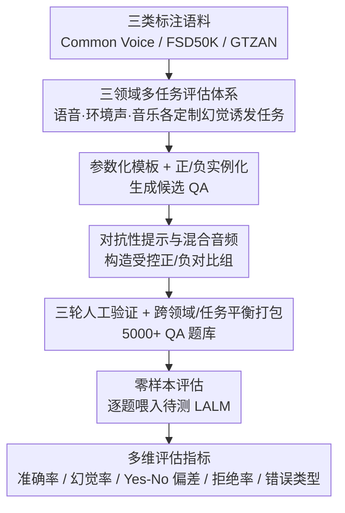

# HalluAudio: A Comprehensive Benchmark for Hallucination Detection in Large Audio-Language Models

**会议**: ACL 2026  
**arXiv**: [2604.19300](https://arxiv.org/abs/2604.19300)  
**代码**: [https://github.com/Feiyuzhao25/halluaudio](https://github.com/Feiyuzhao25/halluaudio)  
**领域**: 幻觉检测  
**关键词**: 音频幻觉, 大型音频语言模型, 基准评测, 对抗性提示, 多维分析

## 一句话总结

本文提出 HalluAudio，首个大规模跨领域（语音/环境声/音乐）的音频幻觉检测基准，包含 5000+ 人工验证的 QA 对和系统化的对抗性提示设计，通过多维指标（准确率/幻觉率/Yes-No偏差/拒绝率/错误类型）评估主流 LALM，揭示了当前模型在声学锚定、时间推理和音乐属性理解方面的显著缺陷。

## 研究背景与动机

**领域现状**：大型音频语言模型（LALM）在语音识别、声音问答和音乐理解方面展示了强大能力。幻觉问题在文本和视觉领域已被广泛研究，但在音频领域严重不足。

**现有痛点**：(1) 现有音频基准主要关注能力评估而非可靠性；(2) 少数音频幻觉研究（如 AHa-Bench）规模小、仅限二元分类、缺乏诊断深度；(3) 缺乏系统化的对抗性提示和混合音频条件来诱发幻觉。

**核心矛盾**：在标准基准上表现强的模型不一定能抵抗幻觉——能力评估和可靠性评估之间存在鸿沟。

**本文目标**：构建首个大规模、跨领域、多维度的音频幻觉检测基准，系统分析 LALM 的失败模式。

**切入角度**：三个领域（语音/环境声/音乐）× 多种任务类型（二元判断/多选推理/属性验证/开放问答）× 对抗性设计（对抗提示/混合音频），配合多维评估指标。

**核心 idea**：定义音频幻觉为模型生成的声明不受输入声学证据支持，包括编造（声称不存在的事件）、证据矛盾和无根据的肯定偏差三种类型。

## 方法详解

### 整体框架

HalluAudio 是一个纯评测基准，目标是补上音频领域几乎空白的幻觉诊断能力。它的构建遵循一条从语料到题库的流水线：先从 Common Voice、FSD50K、GTZAN 等高质量标注语料中选取语音、环境声、音乐三类音频，再用参数化提示模板配合正/负实例化生成 QA，接着通过最小修改提示或音频属性构造受控的正负对比组，最后经两名独立标注加一名高级审核的三轮人工验证、并跨领域与任务类型做平衡打包。评估阶段把每道题零样本喂给待测 LALM，输出交由自动化评估引擎按多维指标统一打分。

### 关键设计

**1. 三领域多任务评估体系：按音频类型定制幻觉诱发任务**

不同音频领域的幻觉模式并不相同——语音里多是时间幻觉，环境声里常见事件编造，音乐里则是属性误判，单一任务集无法覆盖。因此基准在三个领域各自设计了一批针对性任务：语音侧有重叠检测、词序判断、计数、性别验证、噪声验证、转录匹配、速度/响度比较；环境声侧有重叠/顺序/存在/共存检测、错配查询、多标签检查、响度比较；音乐侧有流派匹配、乐器存在、节奏/速度比较、调性判别。每类任务都对应一个明确的幻觉诱发机制，三领域合在一起才能给出全面的诊断粒度。

**2. 对抗性提示与混合音频：用受控扰动逼出幻觉**

模型在标准输入上往往表现良好，幻觉只在被故意误导时才暴露，所以基准刻意把扰动做进题目里。对抗性提示用与事实相悖的描述测试模型是否盲目附和，例如对一段男声录音追问“女声说了什么？”；混合音频则把两段声音拼接，检验模型能否正确区分时间顺序和事件归属；正/负对比组只改动单一属性，从而把触发幻觉的因素隔离出来。这样的设计专门针对 Yes/No 偏差这类标准测试看不到、却系统性存在的失败。

**3. 多维评估指标：超越准确率刻画失败模式**

只看准确率会掩盖 LALM 特有的系统性偏差，因此基准用一组互补指标共同描绘模型行为：准确率衡量基础正确性，幻觉率统计模型编造不存在事实的比例，Yes/No 偏差刻画模型是否系统性偏向肯定或否定，错误类型分析进一步把错误拆成编造、矛盾、肯定偏差三类，拒绝率则记录模型回避回答的频率。其中 Yes/No 偏差与拒绝行为正是单看准确率无法察觉、却最能反映可靠性短板的维度。

### 损失函数 / 训练策略

HalluAudio 是评测基准，不涉及模型训练，全程采用统一的零样本评估协议，模型输出经自动化评估引擎标准化后再核验。

## 实验关键数据

### 主实验

**主流 LALM 在三个领域上的平均准确率**

| 模型 | 语音 Acc | 环境声 Acc | 音乐 Acc | 总体 Acc |
|------|---------|----------|---------|---------|
| Gemini-2.5-Pro | 最高层 | 最高层 | 最高层 | ~70-80% |
| Qwen2-Audio | 中等 | 中等 | 低 | ~50-60% |
| SALMONN | 低 | 中等 | 低 | ~40-50% |

### 消融实验

| 维度 | 发现 | 说明 |
|------|------|------|
| Yes/No 偏差 | 多数模型倾向 Yes | 无根据肯定偏差普遍 |
| 拒绝行为 | 部分模型频繁拒绝 | 安全对齐过度 |
| 领域差异 | 音乐最难 | 音乐属性理解最弱 |
| 对抗性 vs 标准 | 显著下降 | 证实幻觉问题不在标准评估中显现 |

### 关键发现

- 音乐领域是所有模型的最大弱点——音乐属性（调性、节奏、乐器细节）理解能力严重不足
- 系统性 Yes/No 偏差普遍存在——模型倾向无条件肯定，即使音频中不存在被问及的元素
- 标准基准高分 ≠ 幻觉鲁棒——能力评估和可靠性评估之间的鸿沟在音频领域同样显著
- 闭源大模型在抗幻觉方面通常优于开源模型，但差距不如文本/视觉领域大

## 亮点与洞察

- 首个系统化的音频幻觉基准——填补了文本和视觉领域已有大量幻觉研究但音频领域几乎空白的鸿沟
- 三领域×多任务×多维指标的设计提供了前所未有的诊断粒度
- Yes/No 偏差和拒绝率分析揭示了 LALM 特有的系统性问题

## 局限与展望

- 数据集规模（5K+）相对视觉幻觉基准仍较小
- 音频源来自有限的几个数据集，可能不覆盖所有真实场景
- 多语言语音幻觉未涉及
- 未来可扩展到音频-视频联合场景和对话式音频理解

## 相关工作与启发

- **vs AHa-Bench**: 小规模二元 QA，HalluAudio 提供多任务多维度的全面评估
- **vs CHAIR (视觉)**: CHAIR 检测物体级幻觉，HalluAudio 将类似思路迁移到音频领域
- **vs Frieske & Shi (2024)**: 仅分析 ASR 幻觉，HalluAudio 覆盖语音+环境声+音乐三个领域

## 评分

- 新颖性: ⭐⭐⭐⭐⭐ 首个大规模跨域音频幻觉基准，填补重要空白
- 实验充分度: ⭐⭐⭐⭐ 多模型多维度评估，但对模型表现的深入分析可更详细
- 写作质量: ⭐⭐⭐⭐ 基准设计清晰，分类法系统
- 价值: ⭐⭐⭐⭐⭐ 为音频 AI 安全研究提供了急需的评测工具

<!-- RELATED:START -->

## 相关论文

- [\[ACL 2025\] ReefKnot: A Comprehensive Benchmark for Relation Hallucination Evaluation, Analysis and Mitigation in Multimodal Large Language Models](../../ACL2025/hallucination/reefknot_a_comprehensive_benchmark_for_relation_hallucination_evaluation_analysi.md)
- [\[ACL 2026\] Benchmarking Deflection and Hallucination in Large Vision-Language Models](benchmarking_deflection_and_hallucination_in_large_vision-language_models.md)
- [\[ACL 2026\] Rethinking Evaluation for LLM Hallucination Detection: A Desiderata, A New RAG-based Benchmark, New Insights](rethinking_evaluation_for_llm_hallucination_detection_a_desiderata_a_new_rag-bas.md)
- [\[ACL 2026\] Mechanisms of Prompt-Induced Hallucination in Vision–Language Models](mechanisms_of_prompt-induced_hallucination_in_vision-language_models.md)
- [\[ACL 2025\] CCHall: A Novel Benchmark for Joint Cross-Lingual and Cross-Modal Hallucinations Detection in Large Language Models](../../ACL2025/hallucination/cchall_a_novel_benchmark_for_joint_cross-lingual_and_cross-modal_hallucinations_.md)

<!-- RELATED:END -->
