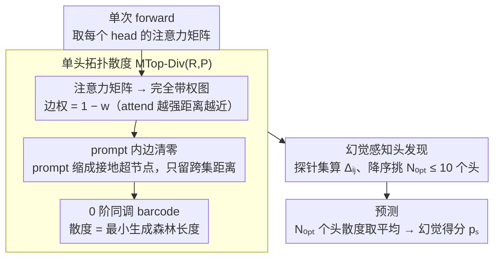

# Hallucination Detection in LLMs with Topological Divergence on Attention Graphs

**会议**: ACL 2026  
**arXiv**: [2504.10063](https://arxiv.org/abs/2504.10063)  
**代码**: https://github.com/sb-ai-lab/TOHA  
**领域**: 幻觉检测  
**关键词**: TDA、注意力图、Manifold Topology Divergence、幻觉感知头、训练免

## 一句话总结
TOHA 把 LLM 的 attention 矩阵当成带权图，用拓扑数据分析里的 Manifold Topology Divergence 度量「response 子图相对 prompt 子图的拓扑新颖度」，并发现存在跨数据集稳定的「幻觉感知头」——只用 10 个这样的头做平均，就能在 RAG 场景下做到 training-free + 比 SelfCheckGPT 快 70× 且 ROC-AUC 显著领先。

## 研究背景与动机

**领域现状**：LLM + RAG 已是当下事实部署形态，但模型仍会写出"和提供的上下文不符"的幻觉。现有检测方法可粗分三类：(1) **不确定性**——perplexity / max entropy 用输出概率；(2) **一致性**——SelfCheckGPT / Semantic Entropy / EigenScore 跑 N 次重新采样比一致性；(3) **内部状态**——HaloScope / LLM-Check / ReDeEP 探针线性分类隐藏层 / attention。

**现有痛点**：(1) 监督内部状态方法需要大量人工标注幻觉样本；(2) 一致性方法要重生成 10–20 次，开销爆炸；(3) 输出概率本身不能完全反映模型真实不确定性；(4) 已有 attention-based 工作要么把所有 head 平等对待，要么只看 attention 数值不看几何结构，浪费了 attention 矩阵自带的图结构信息。

**核心矛盾**：高质量幻觉检测要么吃数据（监督）要么吃算力（多次采样），二者皆便宜的方案目前缺失；同时学界已知"attention 内部状态信息丰富"但没人系统地挖它的拓扑结构。

**本文目标**：(1) 找到一个 training-free、单次生成、用少量探针就能选关键 head 的检测器；(2) 让"幻觉是否发生"和"attention 几何/拓扑结构"有可证明的联系；(3) 验证选出的"幻觉感知头"在跨数据集场景下能否迁移。

**切入角度**：把每个 head 的 attention 矩阵看成一个完全带权图，prompt token 与 response token 是两个子顶点集；在这种图上做 **Manifold Topology Divergence** 计算 response 子图相对 prompt 子图的拓扑新颖度，并把"新颖度过高"作为幻觉信号（直觉：忠实的回答应该和提示在 attention 几何上相互"嵌入"）。

**核心 idea**：用 0 阶同调（MST 长度）量化 "response 接到 prompt 上要花多长的最小连接距离"，距离越大 = response 越脱离 prompt = 越可能是幻觉；并发现只需 ≤10 个特定 head 做平均就足够。

## 方法详解

### 整体框架
TOHA 流水线（Algorithm 1 两阶段）：(a) **HeadsSelection**——用一个很小的探针集（hallucination 集 $S_h$ + grounded 集 $S_g$）算每个 head $(i,j)$ 的 $\Delta_{ij}$（幻觉 vs grounded 上的拓扑散度均值差），降序排序；从 $N=1$ 到 $N_{\max}=10$ 逐个累加平均，挑 AUROC 最大的 $N_{\mathrm{opt}}$。(b) **Prediction**——对测试样本 $s$ 算这 $N_{\mathrm{opt}}$ 个 head 的 $d_{ij}(s)$ 平均，作为幻觉得分 $p_s$。整套流程不训练任何参数，只看 forward pass 出来的 attention 矩阵。

### 关键设计

**1. Attention as Weighted Graph + 拓扑散度 MTop-Div$_G$(R,P)：把"response 是否忠于 prompt"换成可数值化的图论度量**

过去 attention-based 检测要么只盯 attention 数值大小、要么把所有 head 求和，白白浪费了 attention 矩阵自带的图结构。本文换一个视角：对每个 head 把 attention 矩阵 $W$ 看成一张完全无向带权图 $G$，边权取 $1-w_{ij}$ 当作 token 之间的"伪距离"——attend 得越强、距离越近。顶点天然分成 prompt 子集 $P$ 与 response 子集 $R$ 两堆。在这张图上对修改后的复形做 Vietoris-Rips 滤流、求 0 阶同调 barcode $\mathcal{B}_0$，散度定义为所有 bar 的长度和 $\operatorname{MTop-Div}_G(R,P)=\sum_{[b_i,d_i]\in\mathcal{B}_0}|d_i-b_i|$。

这个抽象指标之所以可信，是因为它有几何与信息论的双重落地解释。Proposition 3.1 证明它恰好等于"用最小生成森林把 $R$ 接到 $P$ 上"的总边长；信息论上又有 $\operatorname{MTop-Div}_G(R,P)\geq L_{\mathrm{MST}}(R\cup P)-L_{\mathrm{MST}}(P)$，正是把 response token 加进来后 MST 长度的增量。直觉因此非常直白：忠实回答会和 prompt 在 attention 几何上彼此嵌入、接得很近，散度小；而幻觉 response 脱离了 prompt 的支撑，要花更长的连接距离才接得上，散度就大。

**2. Hallucination-Aware Heads 发现：把每个 head 的"幻觉敏感度"显式量化，只挑极小子集做检测**

既然不是所有 head 都对幻觉敏感，就需要一把尺子把敏感的挑出来。本文在训练集上给每个 head $(i,j)$ 算它在幻觉样本与 grounded 样本上的平均散度之差

$$\Delta_{ij}=\frac{1}{|S_{\mathrm{hallu}}|}\sum_{s\in S_{\mathrm{hallu}}} d_{ij}(s)-\frac{1}{|S_{\mathrm{gr}}|}\sum_{s\in S_{\mathrm{gr}}} d_{ij}(s),\qquad d_{ij}(s)=\frac{1}{|R_{ij}^s|}\operatorname{MTop-Div}_{G_{ij}^s}(R_{ij}^s,P_{ij}^s),$$

$\Delta_{ij}$ 越大说明这个 head 越能把幻觉和忠实拉开。把跨数据集的 $\Delta_{ij}$ 画成散点（图 2）会发现一个很稳的结构：Mistral-7B 有 4 个 head、Llama-2-7B 有 3 个 head 不管数据集怎么换都死死落在右上角。这种跨数据集稳定性直接换来强可迁移——head 一旦选定就能搬到新任务上；只用 ≤10 个 head 又让推理几乎零额外成本。更妙的是这些 head 部分正是 Sun 2025 报告过的"copying head"，给检测信号补上了机制解释：忠实回答靠复制 prompt 信息，复制不充分时 response 就在 attention 几何上飘走、散度升高。

**3. 设零 prompt 内边权的几何取舍：让散度只反映跨集距离，剔掉 prompt 自身的结构噪声**

prompt 内部本来就有丰富的语义/句法 attention 连接，但这些对"判断 response 是否幻觉"是噪声——会把真正想看的跨界信号淹掉。所以在算 MTop-Div 之前先把 $P$ 内所有边权清零，等价于把整段 prompt 缩成一个"接地"的连通超节点，再去做最小生成森林。这样最终拓扑只衡量"response 节点接到 prompt 要走多远"，干干净净只剩跨界距离。§4.4 消融确认这步简化不是可有可无：保留 prompt 内边权后信号会被结构噪声盖住、检测明显变差。这种"任务特化的拓扑简化"也很通用——在域适应等图任务里同样可以靠清掉源域内部边来突出跨域结构。

### 损失函数 / 训练策略
TOHA 完全 training-free，唯一"训练"步骤是 HeadsSelection 阶段的 head 排序，需要一个极小标注集（验证集 100 条 + 5% 实验拆分），且这些标注只用来排 head 而非训分类器。$N_{\mathrm{opt}}$ 上限为 10。

## 实验关键数据

### 主实验：ROC-AUC（↑），5 个数据集 × 5 个 LLM

| 模型/方法 | MS MARCO | CNN/DM | CoQA | SQuAD | XSum |
|------|------|------|------|------|------|
| **Mistral-7B** | | | | | |
| SelfCheckGPT (一致性) | 0.63 | 0.51 | 0.86 | 0.71 | 0.66 |
| Max entropy (不确定) | 0.68 | 0.60 | 0.73 | 0.75 | 0.71 |
| ReDeEP (内部) | 0.54 | 0.47 | 0.59 | 0.45 | 0.63 |
| **TOHA** | **0.76** | **0.60** | **0.89** | **0.96** | 0.66 |
| **LLaMA-2-7B** | | | | | |
| SelfCheckGPT | 0.59 | 0.60 | 0.66 | 0.57 | 0.64 |
| Semantic entropy | 0.53 | 0.51 | 0.76 | 0.73 | 0.61 |
| **TOHA** | **0.65** | 0.56 | **0.90** | **0.87** | **0.68** |
| **LLaMA-2-13B** | | | | | |
| Max entropy | 0.62 | 0.53 | 0.66 | 0.78 | 0.59 |
| **TOHA** | **0.67** | **0.56** | **0.92** | **0.88** | **0.66** |

TOHA 在 MS MARCO 上相对最强 baseline 涨 11.7%，CoQA 上对 LLaMA-2-7B 涨 21.6%。Wilcoxon-Holm post-hoc 显著性检验 TOHA 总排名 1.67 且对每个 baseline 都 $p\leq 0.0016$ 显著。

### 消融/分析：效率 + 迁移性

| 维度 | 数值 | 说明 |
|------|------|------|
| 相对 SelfCheckGPT (单次额外生成) | ~7× faster | TOHA 只跑一次 forward |
| 相对 SelfCheckGPT (实际 10–20 次) | **~70× faster** | 实测部署场景 |
| 与 max entropy 接近 | 同量级 | 但 AUROC 高得多 |
| 训练集大小 | $|S_h\cup S_g|=100$ | 仅用 100 条样本选 head |
| 选中 head 数 | $N_{\mathrm{opt}}\leq 10$ | 跨数据集稳定 4 个 (Mistral)/3 个 (Llama-2) |
| HotpotQA 多跳 | TOHA 优于所有基线 | "in the wild" 验证 |
| 跨数据集迁移 (XSum↔CNN/DM) | 落在 1σ 内 | 选出的 head 通用性强 |

### 关键发现
- **不需要全 head**：只 ≤10 个 head 就能击败所有 baseline；这暗示 attention 矩阵里的"幻觉信号"高度集中而非均匀分布。
- **拓扑信号 > 数值信号**：直接用 attention 数值的 ReDeEP/LLM-Check 在多数任务上跌到 0.5 附近（接近随机），TOHA 用同样数据但提取 MST 拓扑就能稳定到 0.8+，说明"几何结构"比"绝对权重"信息量更高。
- **跨任务迁移强**：选中的 head 在 XSum 上选出来，搬到 CNN/DM 上性能仍在标准差内，跨数据集 transferability 是该方法的核心优势。
- **机制可解释**：被选中的 head 部分是已知的"copying head"——这给"高散度 ⇒ 复制不足 ⇒ 幻觉"提供了直觉链路。

## 亮点与洞察
- **把 TDA 真正用对了场景**：之前 TDA 在 NLP 多是"acc 高几个点"的描述性研究；本文给出 MTop-Div$_G$(R,P) 的几何（MSF 长度）+ 信息论（MST 长度增量 ≈ 熵）双重等价形式，让一个看似抽象的指标变得既可计算又可解释，这对让 TDA 进入主流 LLM 工具箱很重要。
- **"幻觉感知头"的发现具有独立价值**：它揭示了 hallucination 是 attention 机制里某些 head 的局部行为而非全网现象，给 mechanistic interpretability 社区提供了具体抓手，可能催生更精准的 hallucination 抑制方法（如只在这些 head 上做干预）。
- **"prompt 内边清零"是个非常聪明的工程取舍**：把语义结构噪声直接消掉，让指标只对"跨界距离"敏感；这种"任务特化的拓扑简化"思路在其它图任务里也可以借鉴（例如域适应中清掉源域内部边）。

## 局限与展望
- **依赖少量标注**：虽然只要 100 条，但需要这 100 条带"幻觉/不幻觉"标签来选 head；纯零样本场景仍需研究。
- **白盒前提**：必须能读 attention 矩阵，闭源 API 模型（GPT-4o、Claude）用不上。
- **只覆盖 RAG 场景**：TOHA 的"散度对应 prompt-response 关系"假设在自由生成（无 prompt context）场景下意义模糊，论文也仅评测 RAG。
- **0 阶同调可能不够**：作者只用了 $\mathcal{B}_0$ 即连通分量，未来用 $\mathcal{B}_1$（loop）或多阶 persistent homology 可能解锁更多结构信号。
- **可改进方向**：与 RLHF/对齐训练联合，把"低散度 head"作为可学习的正则；或用 TOHA 信号触发 RAG 二次检索改写。

## 相关工作与启发
- **vs SelfCheckGPT / Semantic Entropy**：一致性方法靠重生成 10-20 次，TOHA 一次 forward；准确率多数 dataset 上 TOHA 还更高。
- **vs HaloScope / LLM-Check / ReDeEP**：同样用内部状态，但前者要么训探针要么平等对待 head；TOHA 用拓扑选 head 既免训练又解释强。
- **vs Kushnareva 2021 / Tulchinskii 2023**：同样把 attention 视为 TDA 对象，但前作多用于分类任务的全局拓扑；TOHA 首次将 manifold topology divergence 用到 prompt-response 跨集结构上，且证明它的 MSF 等价性。

## 评分
- 新颖性: ⭐⭐⭐⭐ 把 manifold topology divergence 引入 attention 图分析并给出 MSF 等价证明
- 实验充分度: ⭐⭐⭐⭐ 5 LLM × 5 数据集 + HotpotQA + 跨数据集迁移 + 效率对比 + 显著性检验
- 写作质量: ⭐⭐⭐⭐ 直觉图（图1）和 head 散点图（图2）都讲得很清楚，公式推导完备
- 价值: ⭐⭐⭐⭐ 70× 加速 + 100 条标注 + 通用迁移，是工业 RAG 部署可直接落地的检测器

<!-- RELATED:START -->

## 相关论文

- [\[ACL 2026\] Detecting Hallucinations in SpeechLLMs at Inference Time Using Attention Maps](detecting_hallucinations_in_speechllms_at_inference_time_using_attention_maps.md)
- [\[ACL 2026\] Distorted or Fabricated? A Survey on Hallucination in Video LLMs](distorted_or_fabricated_a_survey_on_hallucination_in_video_llms.md)
- [\[ACL 2025\] Mixture of Decoding: An Attention-Inspired Adaptive Decoding Strategy to Mitigate Hallucination in Multimodal LLMs](../../ACL2025/hallucination/mixture_of_decoding_an_attention-inspired_adaptive_decoding_strategy_to_mitigate.md)
- [\[ACL 2026\] Enhancing Hallucination Detection via Future Context](enhancing_hallucination_detection_via_future_context.md)
- [\[NeurIPS 2025\] Robust Hallucination Detection in LLMs via Adaptive Token Selection](../../NeurIPS2025/hallucination/robust_hallucination_detection_in_llms_via_adaptive_token_selection.md)

<!-- RELATED:END -->
