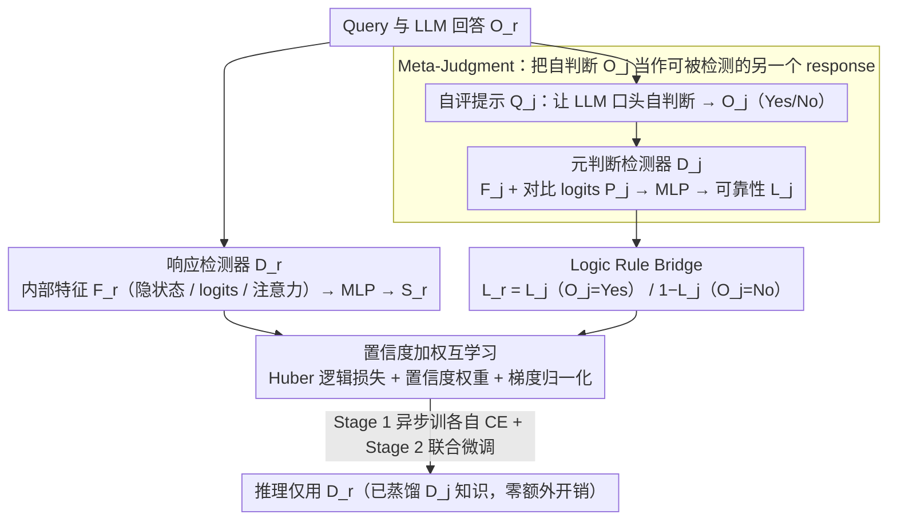

# Logical Consistency as a Bridge: Improving LLM Hallucination Detection via Label Constraint Modeling between Responses and Self-Judgments

**会议**: ACL 2026  
**arXiv**: [2605.03971](https://arxiv.org/abs/2605.03971)  
**代码**: https://summerrice.github.io/LaaB (项目主页)  
**领域**: 幻觉检测  
**关键词**: 幻觉检测, Self-Judgment, 元判断, 逻辑约束, 互学习, 内部特征

## 一句话总结
把 LLM 的 self-judgment ("它觉得自己刚才答对了没") 也当成一个可能幻觉的 generation，先用 intrinsic feature 训一个 "meta-judgment detector" 估它的可信度，再用"如果 self-judgment 说真→两标签相同/说假→两标签相反"这条天然逻辑规则，把 response detector 和 meta-judgment detector 通过 Huber loss 互相约束、用置信度加权的互学习联合训练；推理时只用 response detector 但已经吸收了 self-judgment 的知识，零额外推理成本就拿到双视角增益。

## 研究背景与动机

**领域现状**：LLM 幻觉检测当前两条主流路线：(a) **内在模式 (intrinsic-pattern)** 路线——挖 LLM 生成时的 hidden states (SAPLMA)、prediction logits (Logits Lens)、attention 模式 (Lookback Lens)，本质是微观层面的不确定性量化；(b) **自判断 (self-judgment)** 路线——直接让 LLM 用语言回答 "我刚才说的对吗"，把宏观符号判断作为信号。

**现有痛点**：两路线各有死穴互不相通——(a) 路线虽然能拿到细粒度神经信号，但 "高置信度的幻觉" (LLM 自己很确信却胡说) 很难被检测到；指标缺乏语义校准；(b) 路线虽然有显式语义推理，但 verbal judgment 本身可能"二次幻觉"——self-preference bias (LLM 偏袒自己输出)、overthinking、evaluative hallucination 等问题让 "它说真" 不一定就真。

**核心矛盾**：内在特征 (隐式/神经/微观) 和自判断 (显式/符号/宏观) 是**耦合**行为却被独立处理。直接拼接两路输出 (比如简单 ensemble) 又会被弱者拖累强者；而把 self-judgment 当 ground truth 又会被 evaluative hallucination 污染。

**本文目标**：(a) 在一个统一可学习框架里同时使用两路信号；(b) 不能把 self-judgment 当真理，必须给它一个 "可靠性估计"；(c) 推理时不能增加大量额外开销 (跑两遍 LLM 太贵)。

**切入角度**：作者的关键观察是 "LLM 对自己 response 的 self-judgment 也是一个 response"——这个 judgment 本身也是生成出来的、也可能幻觉、也可以用 intrinsic feature 来估其可信度。如果我能估出 self-judgment 的可信度 $L_j$，再加上 "self-judgment 说真→response 是真" / "self-judgment 说假→response 是假" 这条**必然成立的逻辑规则**，就可以把对 self-judgment 的判断**反推**回对 response 的判断，从而得到一条独立于 response detector 的预测路径。

**核心 idea**：把 self-judgment $O_j$ 看作"另一个 response"，对它跑一个 meta-judgment detector $D_j$ 估其真假 $L_j$，再用逻辑桥 $L_r = L_j$ if $O_j = $"Yes" else $L_r = 1 - L_j$ 把 $D_j$ 的预测翻译成对原 response 的预测，最后用互学习让 $D_r$ 和 $D_j$ 在 logic 约束下相互拉齐。

## 方法详解

### 整体框架
LaaB 有三个模块和一个两阶段训练策略：

**模块 (a) Response Hallucination Modeling**：给定 query $Q_r$ 和 LLM 生成的 response $O_r$，从 LLM 内部抽出特征 $F_r \in \{H_r, P_r, A_r\}$ (hidden states / logits / attention)，喂给 MLP 检测器 $D_r$ 输出 $S_r = (S_{r,\text{hallu}}, S_{r,\text{real}})$。

**模块 (b) Self-Judgment Hallucination Modeling**：用 evaluation prompt $Q_j$ 让 LLM 自评得到 verbal judgment $O_j \in \{\text{"Yes"}, \text{"No"}\}$；同样从生成 $O_j$ 时的内部特征 $F_j \in \{H_j, P_j, A_j\}$ 抽出特征，喂给 MLP 检测器 $D_j$ 输出 $S_j$ 估计这个 judgment 本身是否正确 ($L_j \in \{0,1\}$)。

**模块 (c) Logic-Constrained Mutual Learning**：用 logic rule (Table 2) 把 $D_j$ 的预测翻译成对 $L_r$ 的预测，再用 Huber loss 把 $D_r$ 和 $D_j$ 的概率分布拉齐，配合置信度加权防互相拖累。

**两阶段训练**：Stage 1 round-robin 异步训 $D_r$、$D_j$ 各自的 CE loss；Stage 2 联合微调加入 logic loss。**推理只跑 $D_r$**——通过互学习把 $D_j$ 的知识蒸馏过来了，所以推理阶段不需要额外跑 self-judgment 那次 generation，零推理开销增加。

### 关键设计

**1. Meta-Judgment——把 self-judgment 当 "可被检测的 response"：给自评估一个可靠性，而不是当真理**

self-judgment 路线最大的隐患是把 LLM 的 verbal judgment $O_j$ 直接当真值，可它本身也会犯 self-preference bias、overthinking、evaluative hallucination。LaaB 的破题点是观察到"LLM 评估自己时同样是一次 generation"，于是把 $O_j$ 不再当输入、而是当"另一个 query-response 对"，对称地训一个 meta-judgment 检测器 $D_j$ 去估它的真假 $L_j$。$D_j$ 的输入与 response 检测器同构：取 judgment 末 token 在 validation-optimal 层的 hidden $H_j$、首 token 的 logits $P_j$、以及把 judgment 上下文切成 Framing / Query / Response / Eval_Query / Format / Trigger 六段后算出的 attention 分配比例 $A_j$，喂给 MLP 输出 $L_j$。

其中 $P_j$ 不是裸用首 token logits，而是拼了一个对比向量：$O_j=$"Yes" 时 $P_j = P_{\text{yes}} \oplus (P_{\text{yes}} - P_{\text{no}})$，$O_j=$"No" 时 $P_j = P_{\text{no}} \oplus (P_{\text{no}} - P_{\text{yes}})$。裸 logits 的数量级容易差很多，而差值项直接编码"模型有多确定是 Yes/No"，让 $D_j$ 对自评置信度更敏感。这一步在保留 verbal judgment 语义优势的同时，用神经信号给它装了一个可靠性闸门，绕开了直接信任自评带来的污染。

**2. Logic Rule Bridge——用逻辑必然成立的恒等式把两路检测器拴在一起**

有了 $L_j$ 还不够，得把它翻译回对 response 的判断。这里用的不是启发式假设而是定义上的恒等式：既然 $L_j$ 表示"$O_j$ 是否正确判断了 response"，那么 $O_j=$"Yes"（说 response 为真）时 $O_j$ 正确就意味着 response 为真，$L_r = L_j$；$O_j=$"No" 时 $O_j$ 正确意味着 response 为假，$L_r = 1 - L_j$。合起来就是 $L_r = L_j$ if $O_j=$"Yes" else $1 - L_j$。

落到损失上，用 Huber loss 把两路对同一目标的概率分布拉齐：$\mathcal{L}_{\text{Logic}} = \mathcal{L}_{\text{Huber}}(S_{r,\text{hallu}}, S_{j,\text{hallu}})$ if $O_j=$"Yes"，否则 $\mathcal{L}_{\text{Huber}}(S_{r,\text{hallu}}, S_{j,\text{real}})$（Huber 比 MSE 对 outlier 更鲁棒）。妙处在于这条约束是从定义推出来的必然真理，等于在两个本来独立训练的检测器之间凭空插入一个无需额外标注、无需额外算力的弱监督信号——只靠 $O_j$ 的极性翻转就强制它们逻辑自洽。

**3. 置信度加权互学习 + 梯度归一化平衡——别让弱检测器把强检测器带偏**

标准 Deep Mutual Learning 假设 peer 对等，但幻觉检测里 $D_r$（如 hidden state）和 $D_j$（如 attention）的特征质量天然不对等，等权互学习会让弱者反向污染强者。LaaB 给每个样本对加一个置信度权重：$\mathcal{L}_{\text{Logic}, r} = \log(1 + \frac{S_j(L_j)}{S_r(L_r)}) \cdot \mathcal{L}_{\text{Logic}}$，$\mathcal{L}_{\text{Logic}, j} = \log(1 + \frac{S_r(L_r)}{S_j(L_j)}) \cdot \mathcal{L}_{\text{Logic}}$——peer 在 ground truth 上越自信，自己就越该听它的。

同时为防 CE loss 和 Logic loss 数量级悬殊压倒训练，用梯度范数动态调比例 $\alpha_* = \frac{\|\nabla_{\theta_*^{-1}} \mathcal{L}_{\text{CE}, *}\|_2}{\|\nabla_{\theta_*^{-1}} \mathcal{L}_{\text{Logic}, *}\|_2 + \epsilon}$，最终单路目标是 $\mathcal{L}_* = \mathcal{L}_{\text{CE}, *} + \alpha_* \mathcal{L}_{\text{Logic}, *}$。这套加权 + 归一化的组合让互学习对特征选择鲁棒，是让整个框架在不对等 peer 上仍稳的工程关键。

### 损失函数 / 训练策略
**Stage 1**：round-robin 异步训练 $D_r$ 和 $D_j$，各自最小化 $\mathcal{L}_{\text{CE}} + \alpha \mathcal{L}_{\text{Logic}}$，谁先收敛就冻结、另一个继续。**Stage 2**：联合微调，$\mathcal{L}_{\text{Joint}} = \mathcal{L}_{\text{CE}, r} + \mathcal{L}_{\text{CE}, j} + \alpha \mathcal{L}_{\text{Logic}}$。**推理只用 $D_r$**——已经通过 logic loss 蒸馏吸收了 $D_j$ 的知识，不需要再跑一次 self-judgment generation，推理开销和单 $D_r$ 一样。训练时的 self-judgment generation 只发生一次 (作为训练数据)，不增加部署成本。

## 实验关键数据

### 主实验
**实验设置**：4 个数据集 (TriviaQA / MMLU / NQ_Open / HaluEval) × 4 个 LLM (Llama-3.1-8B-Instruct / Llama-3.1-70B-Instruct / Qwen-2.5-32B-Instruct / Mistral-7B-Instruct-v0.3) × 8 个 baseline (Self-Judge / SAPLMA / Logits Lens / Lookback Lens / SelfCheckGPT / EigenScore 等)。划分 7:1:2 训练/验证/测试。指标 Macro F1 + Accuracy。

| 维度 | 配置 | 说明 |
|------|------|------|
| 数据集 | TriviaQA | 开放域问答 |
| 数据集 | MMLU | 多任务理解 |
| 数据集 | NQ_Open | 开放自然问答 |
| 数据集 | HaluEval | 专为幻觉检测设计 |
| LLM | Llama-3.1-8B / 70B-Instruct | 小+大规模对比 |
| LLM | Qwen-2.5-32B-Instruct | 跨家族 |
| LLM | Mistral-7B-Instruct-v0.3 | 跨家族 |
| Baseline (self-judgment) | Self-Judge (Kadavath et al. 2022) | 让 LLM 直接 verbal 自评 |
| Baseline (intrinsic, trainable) | SAPLMA (hidden state) / Logits Lens / Lookback Lens | 3 类内部特征检测器 |
| Baseline (intrinsic, consistency) | SelfCheckGPT / EigenScore | 一致性 / 谱方法 |
| **LaaB 应用方式** | 把上述 3 个可训练 baseline 都"套上 LaaB" | 每个 base detector + LaaB |

论文 Table 3 标注："**Bolded numbers denote that the use of LaaB is better-performing than its corresponding base version. Underlined numbers are the highest in each column within each LLM group.**" — 即对每个 (LLM, base detector) 组合，"+LaaB" 版本几乎全面 (绝大多数 cell 被加粗) 超过原 base 版本，且 underline (column 最高) 集中在 LaaB 相关组合上。

### 消融实验
论文的关键消融维度：

| 配置 | 主要作用 | 预期影响 |
|------|---------|---------|
| Full LaaB (w/ logic + meta-judgment + 互学习) | 完整方法 | baseline |
| w/o meta-judgment (回到直接信任 verbal $O_j$) | 把 self-judgment 当 ground truth | 受 evaluative hallucination 污染，效果掉 |
| w/o logic rule (用 KL 强行对齐两路概率，不区分 Yes/No) | 忽略 $O_j$ 极性 | 错误传递，特别是 No case |
| w/o confidence weighting | 等权互学习 | 弱者拖累强者，性能下降 |
| w/o stage 1 round-robin (只跑 stage 2) | 不预训练单独检测器 | 训练不稳定 |
| 单 feature 对比：$H_*$ vs $P_*$ vs $A_*$ | 哪个特征最强 | hidden state 通常最强，attention 最弱 |
| 单 detector 推理 vs 双 detector ensemble | 推理是否要跑 $D_j$ | 双检测器轻微涨点但推理成本翻倍，论文选单 $D_r$ |

(注：原论文 Table 3 的具体数字在缓存中被截断，上述消融维度基于方法 4.3 节描述与图 2 架构图推断；最终数字以原论文为准。)

### 关键发现
- **LaaB 是 "套壳增强"**：3 个可训练 baseline (SAPLMA / Logits Lens / Lookback Lens) 都能套上 LaaB 框架，且 paper 文本明确说 +LaaB 一致超过 base 版本——证明这是一个**通用 wrapper** 而非特定 baseline 的特调。
- **Self-Judge 单独用并不强**：作为 baseline 的 Self-Judge (Kadavath 2022) 的 verbal-judgment 路线已经被证明有 evaluative hallucination 问题；LaaB 通过 meta-judgment + logic rule 让 self-judgment 信号经过过滤后才发挥作用。
- **推理零额外开销是核心卖点**：训练时虽然要跑一次 self-judgment generation 收集训练数据，但推理时只跑 $D_r$，意味着部署阶段比 baseline 没多任何开销，可直接替代现有内在模式检测器。
- **跨 LLM 鲁棒**：4 个 LLM (8B / 70B / 32B / 7B 不同家族不同规模) 上一致涨点，说明 logic bridge 不是 LLM-specific 偶然现象。
- **置信度加权防 mutual degradation**：作者明确提到这是为了 "prevent a weaker detector from misleading a stronger one"，说明实践中 $D_j$ 性能波动较大、必须用 confidence weighting 才能稳。

## 亮点与洞察
- **"self-judgment 也是 response" 这个视角转换是 deep insight**：之前所有 self-judgment 路线都默认 LLM 的 verbal 自评是 "更高一层的真理 oracle"，本文第一次把它降级为"另一个可能幻觉的 generation"，从而打开了用 intrinsic feature 来校准它的大门。这个观点对 LLM-as-judge / RLAIF / self-rewarding 等所有依赖 LLM 自评的工作都有 hard-hitting 启示——你的 LLM judge 本身也是个会幻觉的 generator。
- **逻辑规则作为弱监督信号**：把"必然成立的逻辑恒等式"用 Huber loss 编码进损失函数，是少见的 "免费多视角" 监督信号——不需要额外标注、不需要额外算力，仅靠 $O_j$ 的极性翻转就在两个独立检测器之间引入约束。这种"用 logical identity 替代额外标注"的思路可以推广到任何"多视角预测同一目标"的检测/分类任务。
- **推理阶段只用 $D_r$ 是工程上极聪明的设计**：互学习的精髓本来就是 "训练时多视角、推理时单视角"。LaaB 把这套搬到幻觉检测里、$D_j$ 只是训练时的 teacher，部署时完全消失，意味着工业界 LLM 服务可以无痛升级——重训 detector head 就行，推理 pipeline 不变。
- **置信度加权互学习 + 梯度归一化平衡**：解决了多视角联合训练里的"强弱不对等"和"loss 数量级悬殊"两个老大难，工程上很扎实，可直接借用到其他 multi-task 联合训练场景。
- **$P_j$ 用对比向量 $(P_{\text{yes}} - P_{\text{no}})$ 而非单 logits**：把"我有多确定是 Yes/No"显式编码到特征里，比单纯首 token logits 更鲁棒；这种 contrastive feature engineering trick 在 Yes/No 二分类任务里都值得复用。

## 局限与展望
- **依赖 self-judgment generation 作为训练数据**：训练阶段必须先对每个 $(Q_r, O_r)$ 跑一次 self-judgment 拿到 $O_j$ 和对应 intrinsic features，训练数据收集成本是直接幻觉检测的 2×；对超大模型/超大语料 scale 较贵。
- **逻辑规则只对二元 Yes/No 判断成立**：如果 self-judgment 支持更复杂的 verbal output ("partially correct" / "uncertain"等)，logic rule 就不再是简单 $L_r = L_j$ 或 $1 - L_j$；难以推广到 graded 或 multi-class 判断。
- **缓存中 Table 3 被截断**，无法验证具体 macF1 / Acc 提升幅度；从 paper 文本判断 LaaB 全面 ≥ baseline 但具体 delta 没法量化。
- **依赖 intrinsic feature 的可获取性**：必须能访问 LLM hidden states / logits / attention，对闭源 API (GPT-4o, Claude) 不适用——这是所有 intrinsic 路线的共有局限。
- **没在长生成场景验证**：4 个数据集都是短答类 QA (TriviaQA / NQ_Open / MMLU 是选择题、HaluEval 偏短答)，长生成 (长文摘要、对话、code generation) 里 hidden state 聚合方式可能要改。
- **$D_r$ 和 $D_j$ 的特征类型必须匹配**：实现里假设两者用同类 feature (都用 hidden 或都用 attention)，跨类型组合 (比如 $D_r$ 用 hidden + $D_j$ 用 attention) 没探索；可能因为 logic loss 需要可比较的概率空间。

## 相关工作与启发
- **vs SAPLMA / Logits Lens / Lookback Lens**: 都是单视角 intrinsic 检测器，LaaB 不是替代而是套壳——把其中任一作为 $D_r$，再加一个对称的 $D_j$，通过 logic 把两路融合。LaaB 在每个 base 上都涨点，说明这是 orthogonal contribution。
- **vs Self-Judge (Kadavath et al. 2022)**: Kadavath 直接用 verbal judgment 当结果，没有 meta-detector 来校准 judgment 自身可靠性，因此被 evaluative hallucination 拖累；LaaB 给 self-judgment 装了一个 "可靠性闸门"。
- **vs SelfCheckGPT / EigenScore**: 这两个是"一致性"路线——多次采样 response 后看分布特性；LaaB 是"逻辑一致性"路线——response 和 self-judgment 这两个分布必须满足 logic rule；两个 "consistency" 的层级不同，可能能互补 (作者没做这个组合)。
- **vs Deep Mutual Learning (Zhang et al. 2018)**: 标准 mutual learning 是 KL 对齐 peer 输出，假设 peer 等价；LaaB 用 Huber loss + 置信度加权 + logic rule 三件套对其改造，让它在 unequal peer 上仍稳健。
- **vs Chain-of-Verification / Self-Correction**: 这些方法让 LLM 反复迭代自我修正，开销高 (多次 generation)；LaaB 是 "一次 self-judgment + 学一次 detector"，推理零开销，工程上更轻量。
- **启发**：(1) **任何依赖 LLM 自评的工作 (LLM-as-judge / self-reward / RLAIF) 都应该给 self-evaluation 装一个 meta-detector**——self-judgment 本质是另一个 generation 行为，必然有自己的 reliability profile；(2) **逻辑恒等式可以作为免费弱监督**——只要任务里能写出"两个变量必须满足某个 logical relation"，就能用 Huber/MSE loss 编码到训练里；(3) **训练时多视角、推理时单视角** 是 multi-modal / multi-view 部署的标准范式，应该被更多关注延迟的工业系统采用。

## 评分
- 新颖性: ⭐⭐⭐⭐ "self-judgment 也是 response 也会幻觉" 这个视角是真原创；logic rule 作为 mutual learning bridge 是新组合；meta-judgment + intrinsic feature 的对称设计在幻觉检测里第一次出现。
- 实验充分度: ⭐⭐⭐⭐ 4 数据集 × 4 LLM × 8 baseline 的网格覆盖范围广，跨 LLM 家族跨规模对比扎实；但缓存截断让我无法看 ablation 完整性。
- 写作质量: ⭐⭐⭐⭐ 逻辑链条 (intrinsic 弱点 + self-judgment 弱点 → 互补 → 怎么互补) 讲得非常清楚；Figure 1 (三种范式对比) 和 Figure 2 (架构图) 应该很直观；公式齐全，notation 表清晰。
- 价值: ⭐⭐⭐⭐ "推理零开销 + 跨 LLM 通用 + 套壳已有检测器" 工程上极有吸引力，可直接落地到任何已部署 detector；"self-judgment 也要被 detect" 的视角对 LLM-as-judge 整个研究方向都有启示意义。

<!-- RELATED:START -->

## 相关论文

- [\[ACL 2026\] MultiHaluDet: Multilingual Hallucination Detection via LLM Hidden State Probing](multihaludet_multilingual_hallucination_detection_via_llm_hidden_state_probing.md)
- [\[ACL 2026\] 为什么 LLM 在结构化知识上产生幻觉：推理过程的机制分析](why_llms_hallucinate_on_structured_knowledge_a_mechanistic_analysis_of_reasoning.md)
- [\[ACL 2026\] Rethinking Evaluation for LLM Hallucination Detection: A Desiderata, A New RAG-based Benchmark, New Insights](rethinking_evaluation_for_llm_hallucination_detection_a_desiderata_a_new_rag-bas.md)
- [\[ICML 2025\] Steer LLM Latents for Hallucination Detection](../../ICML2025/hallucination/steer_llm_latents_for_hallucination_detection.md)
- [\[ACL 2026\] Aligning with Your Own Voice: Self-Corrected Preference Learning for Hallucination Mitigation in LVLMs](aligning_with_your_own_voice_self-corrected_preference_learning_for_hallucinatio.md)

<!-- RELATED:END -->
