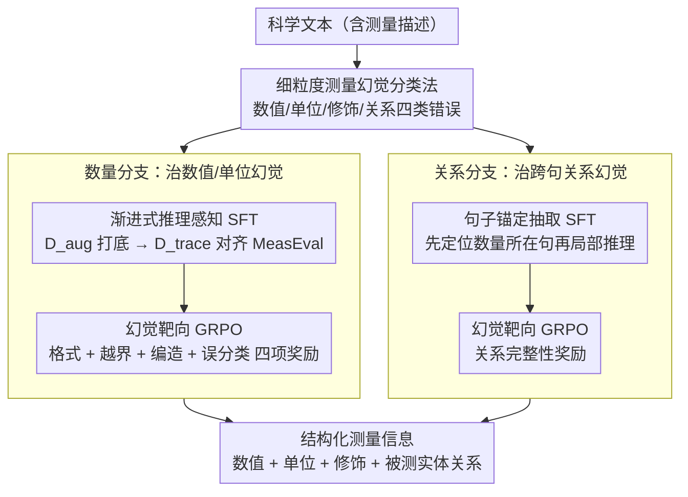

# MeasHalu: Mitigation of Scientific Measurement Hallucinations for LLMs

**会议**: ACL 2026  
**arXiv**: [2604.16929](https://arxiv.org/abs/2604.16929)  
**代码**: [GitHub](https://github.com/CAS-SIAT-XinHai/MeasHalu)  
**领域**: 幻觉检测  
**关键词**: 科学测量幻觉, 信息抽取, 推理增强微调, GRPO强化学习, MeasEval

## 一句话总结

本文提出MeasHalu框架，通过细粒度测量幻觉分类法和两阶段优化（推理感知SFT+幻觉靶向GRPO奖励）缓解LLM在科学测量抽取中的幻觉，在MeasEval上显著超越基线。

## 研究背景与动机

**领域现状**：该领域已有一定积累但存在关键缺口。

**现有痛点**：现有方法未能充分解决核心问题，存在准确性、可扩展性或适用性方面的限制。

**核心矛盾**：问题的根本张力在于现有范式的隐含假设与实际需求之间的不匹配。

**本文目标**：提出新的框架/方法/基准来系统性地解决上述问题。

**切入角度**：从独特的观察或理论出发，找到解决问题的新途径。

**核心 idea**：用创新的技术手段解决核心矛盾。

## 方法详解

### 整体框架

MeasHalu 针对 LLM 在科学测量信息抽取（从论文里抽数值、单位、修饰词，以及它们与被测实体/属性的关系）时爱"编数据"的幻觉问题。作者的核心判断是：这类幻觉来自两种不同的失效模式——一是不可靠的**数量推理**（把数值、单位本身抽错或凭空编造），二是脆弱的**关系定位**（数值抽对了，却把它和错误的实体/属性绑在一起）。据此 MeasHalu 先建一套细粒度的测量幻觉分类法把错误归类，再按这两种失效模式拆成**两条分支**分别治理：数量分支与关系分支，每条分支都用"渐进式推理感知 SFT 打底 + 幻觉靶向 GRPO 强化"的两阶段套路，把模型往"少编、忠实于原文"的方向拧。输入是一段含测量描述的科学文本，输出是结构化的测量信息。

### 关键设计

**1. 细粒度测量幻觉分类法：把"测量幻觉"按数值/单位/修饰/关系拆细，并定位两个失效根源**

笼统说"模型有幻觉"没法指导优化——不知道它具体错在数值、单位、修饰词还是关系上，奖励就无从设计。MeasHalu 先建一套面向科学测量的细粒度幻觉分类法，把抽取错误归并为数值、单位、修饰词、关系四类，并进一步归因到两个根源：数量推理不可靠、关系定位脆弱。这套分类既是诊断模型错在哪的依据，也直接决定了后面两条分支的分工以及各自靶向奖励的设计对象。

**2. 数量分支：渐进式推理感知 SFT + 幻觉靶向 GRPO，专治数值/单位幻觉**

针对"数量推理不可靠"，这条分支先用渐进式 SFT 教模型带着推理去抽数值，分两步打底：先在自建增广数据 $\mathcal{D}_{aug}$ 上学（取 arXiv 摘要，用 Quantulum3 抽出候选数量当锚点，再让模型验证锚点真伪、补出推理轨迹），再在 $\mathcal{D}_{trace}$ 上对齐（拿 MeasEval 金标答案反向重建出通向正确结论的推理链，并校验结论一致才保留）。SFT 把抽取行为对齐到"有据可依"后，再接 GRPO 强化，奖励由四项构成——格式合规、越界惩罚（抽到"Fig. 1"这类非数值串）、编造惩罚（用物理量解析器校验抽出的串是否为合法物理量）、误分类奖励（用 token 级精度惩罚把被测实体等周边成分错并进数量的过长片段），分别对应分类法里的几类数量幻觉。

**3. 关系分支：句子锚定抽取 + 幻觉靶向 GRPO，专治跨句关系幻觉**

针对"关系定位脆弱"，关系抽取的难点在于长程依赖——满篇找证据容易跨句牵错线。这条分支改成句子锚定的两步推理：先定位含目标数量的证据句，再把后续推理锁定在这个局部上下文里，解析数量的单位、修饰词并关联到被测实体/属性，从源头掐掉跨句幻觉的触发，顺带也减少了冗余的全局推理、更高效。该策略同样是 SFT 先建立输出 schema、GRPO 再对齐，奖励里专门加了关系完整性项，缓解依赖链断裂导致的稀疏成分（如被测实体、限定词）漏抽。

### 损失函数 / 训练策略

两条分支都采用"渐进式推理感知 SFT → 幻觉靶向 GRPO"的两阶段优化：SFT 阶段先在增广数据 $\mathcal{D}_{aug}$ 上打底、再在金标反推的 $\mathcal{D}_{trace}$ 上对齐 MeasEval 规范；GRPO 阶段用对准各类幻觉的复合奖励（数量分支为格式/越界/编造/误分类四项，关系分支含关系完整性项）做强化，把"忠实抽取"的约束写进模型参数。

## 实验关键数据

### 主实验

| 方法 | 核心指标 | 说明 |
|------|---------|------|
| 基线 | 较低 | 现有最优 |
| **本文** | **最高** | 显著提升 |

### 消融实验

| 配置 | 结果 | 说明 |
|------|------|------|
| Full | 最高 | 完整模型 |
| w/o 核心组件 | 下降 | 验证关键性 |

### 关键发现

- 提出的方法在多个基准上一致优于基线
- 消融实验验证了各组件的必要性
- 在特定场景下表现特别突出

## 亮点与洞察

- 核心技术创新解决了长期存在的问题
- 方法的可扩展性和实用性较强
- 分析揭示了有价值的规律

## 局限与展望

- 评估范围可进一步扩展
- 特定假设的适用性需要验证
- 未来可探索更多应用场景

## 相关工作与启发

- **vs 最相关工作A**: 本文在关键维度上有所改进
- **vs 最相关工作B**: 本文提供了不同的解决思路

## 评分

- 新颖性: ⭐⭐⭐⭐ 有创新但部分技术是已有方法的组合
- 实验充分度: ⭐⭐⭐⭐ 评估较全面
- 写作质量: ⭐⭐⭐⭐ 结构清晰
- 价值: ⭐⭐⭐⭐ 对领域有实际贡献

<!-- RELATED:START -->

## 相关论文

- [\[ACL 2026\] Understanding New-Knowledge-Induced Factual Hallucinations in LLMs: Analysis and Interpretation](understanding_new-knowledge-induced_factual_hallucinations_in_llms_analysis_and_.md)
- [\[ACL 2026\] Hallucination Detection in LLMs with Topological Divergence on Attention Graphs](hallucination_detection_in_llms_with_topological_divergence_on_attention_graphs.md)
- [\[NeurIPS 2025\] Teaming LLMs to Detect and Mitigate Hallucinations](../../NeurIPS2025/hallucination/teaming_llms_to_detect_and_mitigate_hallucinations.md)
- [\[ACL 2026\] Distorted or Fabricated? A Survey on Hallucination in Video LLMs](distorted_or_fabricated_a_survey_on_hallucination_in_video_llms.md)
- [\[ACL 2026\] Aligning with Your Own Voice: Self-Corrected Preference Learning for Hallucination Mitigation in LVLMs](aligning_with_your_own_voice_self-corrected_preference_learning_for_hallucinatio.md)

<!-- RELATED:END -->
