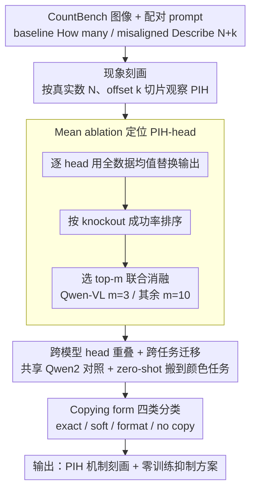

# Mechanisms of Prompt-Induced Hallucination in Vision–Language Models

**会议**: ACL 2026  
**arXiv**: [2601.05201](https://arxiv.org/abs/2601.05201)  
**代码**: https://github.com/michalg04/prompt-induced_hallucinations.git  
**领域**: 幻觉检测  
**关键词**: prompt-induced hallucination, attention head knockout, mean ablation, object counting, modality conflict

## 一句话总结
在受控的目标计数任务里把"模型听 prompt 不看图"的幻觉行为定位到 LLaVA-OneVision / Qwen-VL / Janus-Pro **早期层** (主要是 L0-1) 的 3-10 个 attention head，对它们做 mean ablation 不需要任何再训练就让 prompt-following 从 42–64% 掉到 <11%，把真实计数恢复率推到 70–78%，并能 zero-shot 迁移到颜色识别任务 (PIH 抑制 40–95%)。

## 研究背景与动机
**领域现状**：VLM (LLaVA / Qwen-VL / Janus) 在 prompt 和图像信息冲突时倾向于跟着 prompt 走，产生"prompt-induced hallucination (PIH)"——例如图里只有 3 朵睡莲，被问"描述这 4 朵睡莲"时模型就真的描述出 4 朵。这是真实部署里很常见的 sycophancy / 锚定偏差，但既有研究多停留在现象层，缺乏机制级 (mechanistic) 解释。

**现有痛点**：(1) 现有 hallucination 缓解方案要么靠 RLHF 重训 (贵)、要么靠 prompt engineering (脆)，没有定位到"到底是哪个组件在执行 prompt-copying"；(2) 已知 attention head 可以承担特定功能 (如 induction heads / copying heads)，但 PIH 是不是也由可定位的少数 head 调度还没被验证；(3) 即便定位到 head，跨任务、跨模型的功能性差异 (各模型是用相同还是不同机制执行 PIH) 仍是开放问题。

**核心矛盾**：(a) 干预的最小化 vs 效果的最大化 —— 改的越少越安全，但希望影响范围足够大以全面抑制 PIH；(b) **机制的共性 vs 模型的特异性** —— 是同一个机制贯穿所有 VLM，还是每个模型有自己的 PIH 电路？

**本文目标**：(1) 系统刻画 PIH 何时出现 (按 ground-truth 数量 N 和 prompt offset k 切片)；(2) 用 attention head knockout (mean ablation) 找到承担 PIH 的最小 head 集合；(3) 验证它跨模型是否共享、跨任务 (counting → color) 是否泛化；(4) 拆解 PIH-head 的功能 (是抑制 copying 还是放大视觉注意？)。

**切入角度**：作者注意到 LLaVA-OV 和 Qwen-VL 共享 Qwen2 backbone 但视觉 encoder 不同，这天然形成了一个对照实验——如果它们识别出的 PIH-heads 高度重合，那 PIH 主要源于 LM 而非视觉组件。

**核心 idea**：用经典的 mean ablation 范式 (替换 head 输出为该 head 在全数据上的均值，移除 token-specific 信息但保留激活幅度) 单 head 排序找 PIH-heads，分组消融测试，并跨任务/跨模型对比 head 重叠和功能差异。

## 方法详解

### 整体框架
本文是一项 inference-only 的机制可解释研究，目标是把"模型听 prompt 不看图"的 PIH 行为定位到具体的 attention head 并刻画其功能。流程上分三步：先做**现象刻画**，在 CountBench 上对每张图配一对 prompt——baseline "How many [X] are in the image?" 与 misaligned "Describe the N+k [X] in the image"（$k \in \{1,...,5\}$，再加 $k \in \{10, 20, 50\}$ 测极端），观察模型何时被 prompt 带偏；再做**机制定位**，对每个 head 用 mean ablation 单独消融、按"把回答从 N+k 拉回真实计数 N"的成功率排序，取 top-m（Qwen-VL m=3，其余 m=10）联合消融；最后做**功能分析**，在四类 copying form 下统计各模型行为变化、并测 attention mass 从文本转向图像的层级分布，从而判断同一行为表象背后是否是同一机制。

### 关键设计

**1. Mean ablation 替代 zero ablation：剥掉 head 的 token 信息但保住它的激活预算**

直接把 head 输出置零会破坏 layer norm 之后的激活分布、引入不可控的 distribution shift，让"消融效果"和"分布扰动副作用"纠缠不清。Mean ablation 改用该 head 在全数据所有 token 上的平均输出去替换每个位置——$\tilde H^{(l,h)}_t = \mu^{(l,h)} = \frac{1}{T}\sum_{t'} H^{(l,h)}_{t'}$——相当于让这个 head 失去"看 token 内容"的能力、却仍贡献一个固定 bias，于是干预只移除 token-specific 信息而不改激活幅度。knockout 成功率定义为"PIH 样本中被纠正回正确计数 N 的比例"，最小 head 集合通过两阶段筛选确定：先按单 head 成功率排序，再对 m∈{1,3,5,10} 做分组消融挑最佳 m。这一招正是 mechanistic interpretability 社区在 IOI circuit、induction head 研究里反复验证过的标准探针。

**2. 跨模型 head 重叠 + 跨任务迁移：把"哪个组件负责 PIH"变成可观测的重叠率**

要直接 probe 数百亿参数判断 PIH 来自 LM 还是视觉组件几乎不可能，作者改用一组控制变量实验把问题转化为可量化的 head 重叠率。LLaVA-OV 与 Qwen-VL 共享 Qwen2 LM 但视觉 backbone 不同，二者 top-1/top-2 的 PIH-head 完全重合（都是 L0H3、L0H6）、top-10 里一半重合；而用 DeepSeek-LLM 的 Janus-Pro 重合度很低（top head 是 L0H20），这一对照强烈指向 PIH 源自 LM 而非 cross-modal fusion 层。随后把同一组 PIH-head 直接搬到 Visual CounterFact 的颜色任务（"Describe the C+k [object]"，用色轮距离 $k\in\{1,2,3\}$ 替代数字 offset），检验该 head 集合是否任务无关。

**3. Copying form 四类细粒度分类：区分"不再 copy"和"copy 形式变了"**

聚合 metric 只能看到 prompt-following 整体下降，却看不出"为什么幻觉减少"，更看不出三个模型其实走了不同机制。作者把响应细分成四类——exact copy（内容+格式都跟 prompt，如给 N=2 答 "There are 3 cats"）、soft copy（内容跟 prompt 但换格式，"There are three cats"）、format copy（内容对但格式仿 prompt，"There are 2 cats"）、no copy（内容对且自由格式，"There are two cats"），再分别看消融前后 $P(N_{digit}\mid N_{digit})$ 与 $P(N_{word}\mid N_{digit})$ 的概率变化，判断 prompt-following 的下降到底来自 attention mass 重分配到图像还是来自 copying 被抑制。正是这层划分让 LLaVA-OV（全面抑制 copying + 大幅转向 image attention）与 Qwen-VL（消融后 format copying 反而**增加**）的机制差异显形。

### 损失函数 / 训练策略
**无训练**。本文是 inference-only mechanistic study：所有干预通过 hook 注入 mean activation 实现，单张 RTX 3090 即可完成所有实验 (总计 200–300 GPU 小时，含探索性实验)。

## 实验关键数据

### 主实验：PIH-head 消融效果 (CountBench, 平均 k∈{1,...,5})

| 指标 | LLaVA-OV | Qwen-VL | Janus-Pro |
|---|---|---|---|
| Baseline prompt Exact Match (↑, 干预前) | 76.89 | 78.49 | 80.32 |
| Baseline prompt Exact Match (↑, **PIH 消融后**) | **81.24** (+4.35) | 79.29 (+0.80) | 79.41 (−0.91) |
| Misaligned **Prompt Match** (↓, 干预前) | 42.58 | 56.51 | 64.10 |
| Misaligned Prompt Match (↓, Random 消融) | 37.80 | 54.60 | 58.30 |
| Misaligned Prompt Match (↓, **PIH 消融**) | **1.42** | **3.22** | **10.19** |
| Misaligned **True-Count Match** (↑, 干预前) | 45.68 | 37.70 | 30.54 |
| Misaligned True-Count Match (↑, **PIH 消融**) | **77.80** | **70.66** | **70.90** |

PIH-head 消融让 prompt-following 几乎归零，真实计数恢复率 +30–40 个百分点；且不破坏 baseline counting (甚至 LLaVA-OV 提升 4.35%)，random head 消融效果可忽略。在 CalTech101 (controlled copying) / MM-Vet / POPE 三个 sanity check benchmark 上性能波动 ≤2%，证明 PIH-head 是任务特异而非"全局"的。

### 消融：颜色任务 (Visual CounterFact)，验证跨任务泛化

| Response 类型 | LLaVA-OV 干预前 | LLaVA-OV 干预后 | Qwen-VL 干预前 | Qwen-VL 干预后 | Janus-Pro 干预前 | Janus-Pro 干预后 |
|---|---|---|---|---|---|---|
| No PIH (合并) | 0.96 | **95.21** | 20.27 | **79.72** | 14.78 | **55.42** |
| PIH (合并) | 99.04 | **4.79** | 79.73 | **20.28** | 85.22 | **44.58** |

颜色任务上 PIH 抑制：LLaVA-OV **94.25%**、Qwen-VL **59.45%**、Janus-Pro **40.64%**，完全 zero-shot (用 counting 任务找到的 head 集合直接搬过去)。

### 关键发现
- **PIH 的 "N=4 阈值"**：当真实物体数 N ≤ 4 时模型多数能纠正 prompt 错误，N ≥ 5 后 prompt match 飙到 80–90% 且与 offset 大小无关——即便 k=50 (问 "describe 59 cats" 给 9 只猫)，模型也照样描述 59 只。作者用 baseline prompt 下 $p(N|P_B)$ 与 prompt-following 的 Pearson 相关 (Qwen-VL ρ=0.37, Janus-Pro ρ=0.46) 证明**视觉置信度越低，PIH 越严重**。
- **PIH-head 集中在 LM 前 1-2 层**：Qwen-VL top-10 里 5 个在 L0，LLaVA-OV 7/10 在 L0，Janus-Pro 3/10 在 L0-1；且 LLaVA-OV / Qwen-VL top-1 都是 L0H3、top-2 都是 L0H6 (共享 Qwen2 backbone)，强烈支持"PIH 是 LM-internal 信息路由"而非视觉融合问题。
- **三种模型 = 三种 PIH 机制**：LLaVA-OV 走"全面抑制 copying + 注意力 +12% 转向图像"路线 (Layer 2 attention mass Δ=0.121)；Janus-Pro 走"抑制 format copying 但不增加视觉依赖"路线；Qwen-VL 反而**消融后增加 format copying 但抑制 soft copying** (format copying 从 40.21% → 53.95%)。说明同一行为表象 (prompt-following 下降) 可由完全不同的内部机制实现。
- **干预无副作用**：MM-Vet / POPE / CalTech101 性能稳定，证明 PIH-heads 是高度 specialized 的，不承担一般 instruction following。

## 亮点与洞察
- **跨模型 head 重叠作为定位归因的探针**：通过比较共享 LM / 不同视觉 backbone 的两个模型 PIH-heads 重合率，作者把"PIH 在哪里"这个问题转化为可定量回答的实验，方法学上非常优雅，可推广到任何"VLM 行为 vs LM 行为"的归因问题。
- **机制同构性 ≠ 实现同构性**：三个模型都通过 mean ablation 同一类 head 减小了 PIH，但拆开看 copying form 才发现内部实现完全不同 (LLaVA 全抑、Janus 转 word form、Qwen 反而强化 format copying)。这提醒了"top-line metric 一致"绝不等于"机制一致"，未来 interpretability 研究需要更多 functional dissection。
- **inference-time 干预的工程价值**：3-10 个 head 的 mean ablation 通过 hook 即可部署，对生产 VLM 服务而言几乎零成本，相比 RLHF / DPO 是个轻量化的幻觉缓解方案。
- **N≥5 阈值的视觉认知意义**：与人类视觉的 subitizing range (≤4 个物体能瞬时点数) 高度吻合，提示模型可能在 pre-training 阶段也内化了类似的"小数精确、大数估计"先验。

## 局限与展望
- 作者承认：(1) 只研究 7B 规模 VLM，70B+ 是否同构不确定；(2) 注意力 pattern 本身不可解释，PIH-head 的内部计算细节未拆完；(3) 没解释为何三模型机制差异如此大（架构？训练数据？头分布？）；(4) ablation 的 second-order 效应 (其它 head 在干预后重新分配注意力) 未追踪。
- 我看到的局限：(1) 颜色任务的"色轮距离 k"作为干扰强度代理太粗，颜色感知本身是非线性流形；(2) 没和已有 hallucination 缓解方法 (DoLa, OPERA, VCD) 横向比；(3) mean ablation 是 distributional intervention，对生产部署等价于在 attention 输出上加固定 bias，是否有副作用没在 long-tail prompt 上充分验证。
- 改进方向：用 path patching 把 PIH-head → output logits 的因果路径拆出来；扩展到更复杂的 modality conflict (空间关系、属性、动作)；试在 70B 模型上验证早层 head 集中性是否仍成立。

## 相关工作与启发
- **vs Frank 2021 / Salin 2022 (textual bias of VLM)**：他们观察现象 (VLM 偏向文本)，本文给出机制级解释。
- **vs Olsson 2022 (induction heads in LM)**：induction heads 解释 in-context learning，PIH heads 是其在 VLM cross-modal conflict 下的"恶性 cousin"；同样集中在早层，验证了"早层负责浅 copy"的统一图像。
- **vs Nikankin 2025 (modality-specific circuits)**：他们划分了"视觉 vs 文本"任务的不同 circuit，本文进一步在两类 circuit 的接口 (PIH) 上做手术。
- **vs Sharma 2024 (sycophancy)**：sycophancy 是行为层概念，本文是 sycophancy 的 mechanistic 实例化 (在 VLM 模态冲突场景)。

## 评分
- 新颖性: ⭐⭐⭐⭐☆ "PIH" 作为受控研究 protocol + 跨模型/跨任务 head 重叠归因方法都很新；mean ablation 本身是已有技术，但应用场景和发现是首次。
- 实验充分度: ⭐⭐⭐⭐☆ 三模型、两任务、CalTech/MM-Vet/POPE 三 sanity check、copying form 拆解 + 层级 attention 分析、large offset (k=10/20/50) 测试都做了；缺横向 baseline 比较。
- 写作质量: ⭐⭐⭐⭐⭐ 结构清晰，各 section 紧密衔接，附录里 attention pattern 可视化 + per-N 准确率详细可复现，limitation 写得诚恳。
- 价值: ⭐⭐⭐⭐☆ 对 mechanistic interp 社区是 VLM 方向重要数据点；对部署侧提供了零成本 inference-time 干预方案；对 LLM hallucination 研究启发"找特定 head 而非全网微调"。

<!-- RELATED:START -->

## 相关论文

- [\[ACL 2026\] Benchmarking Deflection and Hallucination in Large Vision-Language Models](benchmarking_deflection_and_hallucination_in_large_vision-language_models.md)
- [\[ACL 2026\] Understanding New-Knowledge-Induced Factual Hallucinations in LLMs: Analysis and Interpretation](understanding_new-knowledge-induced_factual_hallucinations_in_llms_analysis_and_.md)
- [\[ACL 2026\] Mitigating Hallucinations in Large Vision-Language Models without Performance Degradation](mitigating_hallucinations_in_large_vision-language_models_without_performance_de.md)
- [\[ACL 2026\] Stable-RAG: Mitigating Retrieval-Permutation-Induced Hallucinations in Retrieval-Augmented Generation](stable-rag_mitigating_retrieval-permutation-induced_hallucinations_in_retrieval-.md)
- [\[CVPR 2026\] Overthinking Causes Hallucination: Tracing Confounder Propagation in Vision Language Models](../../CVPR2026/hallucination/overthinking_causes_hallucination_tracing_confounder_propagation_in_vision_langu.md)

<!-- RELATED:END -->
