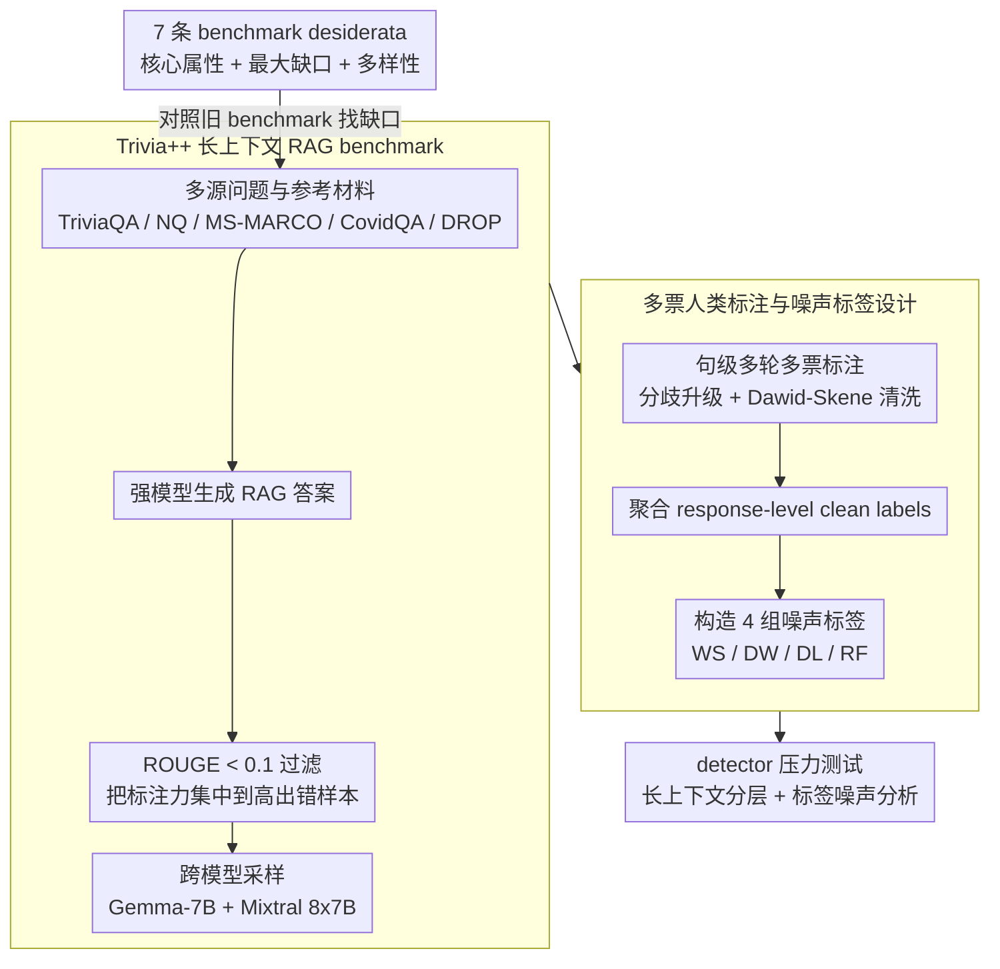

# Rethinking Evaluation for LLM Hallucination Detection: A Desiderata, A New RAG-based Benchmark, New Insights

**会议**: ACL2026  
**arXiv**: [2605.11330](https://arxiv.org/abs/2605.11330)  
**代码**: https://github.com/amazon-science/hallucination-benchmark-trivialplus  
**领域**: 幻觉检测  
**关键词**: RAG幻觉检测、长上下文评测、标签噪声、Trivia++、LLM-as-a-Judge

## 一句话总结
本文重新定义了 RAG 场景幻觉检测 benchmark 应具备的 7 条要求，构建了长上下文、人类多轮标注且带真实噪声标签的 Trivia++，并发现现有检测器在有机 RAG 幻觉上仍明显低于理想性能。

## 研究背景与动机
**领域现状**：LLM 幻觉检测已经从开放式事实性检查扩展到摘要、问答、RAG 等多种场景，常见 detector 包括 SelfCheckGPT、LLM-as-a-Judge、few-shot judge、prompt optimization 和基于 LoRA 的监督微调模型。与此同时，研究社区也积累了 HaluEval、RAGTruth、FACTS、Dolly 等 benchmark，用于衡量 hallucination detector 的进展。

**现有痛点**：这些 benchmark 看似很多，但真正贴近现代 RAG 应用的很少。现实 RAG 往往有长上下文、领域材料、知识密集问题和人类难以快速核验的答案，而已有数据集要么上下文短，要么 hallucination 是人工注入或提示模型故意生成，要么缺少可靠的人类评测标签。

**核心矛盾**：幻觉检测评测需要干净的 gold test labels，但 detector 训练又经常依赖 LLM judge、弱监督或众包标签；如果 benchmark 只给一个理想化测试集，却不暴露训练标签噪声，研究者很难知道检测器在真实 noisy-label 场景下是否稳健。

**本文目标**：作者把问题拆成三层：先提出什么样的 hallucination detection benchmark 才值得信赖；再用这套标准审视已有 benchmark 的缺口；最后构建一个覆盖长上下文 RAG、有机 hallucination、人类验证标签和多种噪声标签的新数据集。

**切入角度**：论文不是只提出一个新 detector，而是从评测基础设施入手。作者认为如果 benchmark 本身不满足现代 RAG 应用需求，detector 排名就会误导研究方向，尤其会高估那些只在短上下文或人工构造 hallucination 上表现好的方法。

**核心 idea**：用一套 benchmark desiderata 约束评测设计，并以 Trivia++ 作为实例，把长上下文 RAG、人类多票标注和真实标签噪声同时纳入 hallucination detection 研究。

## 方法详解

### 整体框架
论文的工作流可以理解为“评测标准 → 数据构建 → detector 压力测试”。第一步，作者提出 7 个 hallucination detection benchmark 应具备的性质，并将其分为核心属性、文献最大缺口和多样性属性。第二步，作者基于多个问答和检索数据源构建 Trivia++，收集来自 3 个 LLM 的 RAG-style answers，并通过多轮人类句级标注得到 response-level clean labels。第三步，作者额外构造 4 组 noisy labels，用于模拟弱监督、众包分歧和随机翻转。第四步，在 Trivia++、RAGTruth、Dolly、HaluEval 等 RAG-QA benchmark 上评估常用 detector，分析长上下文和标签噪声对性能的影响。

### 关键设计
**1. 7 条 benchmark desiderata：给幻觉检测 benchmark 立一张统一体检表，可靠性不再靠规模或流行度说了算**

幻觉检测是一项高度依赖评测定义的任务——hallucination 怎么来的、test label 谁验证的、有没有 noisy train label，每一项都会改变 detector 的排名。作者把这种隐性约束显式化成 7 条要求：organic generations、人类验证的 test labels、现实训练标签噪声、RAG/长上下文任务、faithfulness 类型覆盖、多 LLM 来源、多领域覆盖。逐项对照后发现，没有任何一个旧 benchmark 能同时满足全部 7 条。这张清单点破了三类常见隐患：如果 hallucination 是人工注入的，detector 可能只学会识别注入模式；如果 test label 不是人类验证的，排行榜反映的其实是 judge 偏差；如果没有 noisy train label，就无从评估真实部署里普遍存在的弱监督训练风险。

**2. Trivia++ 长上下文 RAG benchmark：用真实 RAG 分布造一个更接近现代应用的检测数据集**

为了同时满足"长上下文"和"organic generation"这两条最大缺口，作者从 TriviaQA、NaturalQuestions、MS-MARCO、CovidQA、DROP 等数据源取问题和参考材料，先用一个商用强模型生成答案，再用 ROUGE < 0.1 的策略过滤、保留答案与参考文本低重叠的样本以提高 hallucination 命中率，但全程不干预模型输出本身；随后把同一组 context-question pairs 喂给 Gemma-7B 和 Mixtral 8x7B，形成跨模型样本。这里要厘清一个关键点：ROUGE 过滤是一种资源分配策略而非 hallucination 注入——它只是把宝贵的标注人力集中到更可能出错的有机输出上，而完整保留了 LLM 自然犯错的真实分布，这正是它区别于 HaluEval 那类人工构造数据集的地方。

**3. 多票人类标注与噪声标签设计：一份数据同时撑起可靠 evaluation 和 noisy-label robustness 研究**

RAG 长上下文样本极难标注，单人标签的可靠性根本不够，于是作者在句级做多轮多票标注：标签分 Supported、Contradicted、Not Mentioned、Supplementary 四类，其中 Contradicted 和 Not Mentioned 映射为 unfaithful。第一轮采用 disagreement escalation，每个样本从 2 个标注者起步，一旦分歧就增至 4 票或 6 票；第二轮先用 Dawid-Skene 剔除低质量标注者，再对剩余样本补 3 票，最终 response-level label 按最严格的句级标签聚合，保证测试标签可信。在这套干净标签之外，作者额外构造 4 组噪声标签——LLM weak supervision、Dissenting Worker、Dissenting Label、Random Flip，后三者噪声水平控制在 15%。这样的设计让研究者第一次能在同一数据集上把 sample-dependent noise（与样本相关的人类分歧）和 sample-independent noise（随机翻转）对 detector 的影响干净地区分开。

### 损失函数 / 训练策略
本文核心贡献是 benchmark 与评测分析，不提出新的 detector 损失函数。实验中的 SFT detector 使用 Mistral-7B-Instruct-v0.2 加 LoRA 微调，SelfCheckGPT 使用 GPT-4-mini 或 Claude-Sonnet-3.5 生成一致性信号，LLM-as-a-Judge、few-shot 和 prompt-optimized 方法通过 prompt 产生二分类判断。监督类方法在 clean 与 noisy labels 上分别训练，用同一 clean test set 检验噪声鲁棒性。

## 实验关键数据

### 主实验
Trivia++ 相比已有 RAG-based HDB 的关键差异在于长上下文和领域覆盖。它的 mean context length 达到 9.3K characters，max context length 达到 94K characters，明显长于 RAGTruth 和 Dolly。

| Benchmark | 样本数 | 平均上下文长度 | 最大上下文长度 | hallucination 比例 | LLM 数 | 领域 |
|-----------|--------|----------------|----------------|--------------------|--------|------|
| HaluEval QA | 20K | 344 | 1557 | 50.0% | 1 | HotpotQA-based multi-hop QA |
| RAGTruth QA | 989 | 1.3K | 2.8K | 29.1% | 6 | MS-MARCO web search |
| Dolly NC | 100 | 3.1K | 5.99K | 44.5% | 7 | MS-MARCO web search |
| Trivia++ | 3224 | 9.3K | 94K | 35.0% | 3 | Paragraph reasoning / Web / Medical / Wikipedia |

在 detector 评测中，HaluEval 上的 F1 普遍很高，但在 organic RAG benchmark 上显著下降，说明非有机 hallucination 会高估 detector 能力。

| 数据集 | 最强或代表方法 | F1 | Precision | Recall | Accuracy | 关键结论 |
|--------|----------------|----|-----------|--------|----------|----------|
| HaluEval | SFT | 0.996 | 0.999 | 0.993 | 0.996 | 人工提示式 hallucination 很容易被监督模型分开 |
| RAGTruth | SFT | 0.671 | 0.644 | 0.700 | 0.874 | organic RAG 幻觉下监督模型仍不高 |
| Dolly NC | SC-GPT (C) | 0.667 | 0.567 | 0.810 | 0.651 | 小规模 organic 数据上方法差距有限 |
| Trivia++ | LLM-as-a-Judge | 0.694 | 0.601 | 0.821 | 0.749 | 简单 LLM judge 反而与监督方法相当或更好 |

### 消融实验
长上下文分层实验显示，所有 detector 在 >5K characters 的上下文上都明显退化，Trivia++ 因而暴露了短上下文 benchmark 无法观察到的问题。

| 方法 | 短上下文 <1K F1 | 中等 1K-5K F1 | 长上下文 >5K F1 | 长上下文下降 |
|------|----------------|----------------|----------------|--------------|
| SFT | 0.725 | 0.702 | 0.504 | -0.221 |
| SC-GPT (C) | 0.739 | 0.732 | 0.508 | -0.231 |
| SC-GPT (G) | 0.700 | 0.632 | 0.506 | -0.194 |
| LLM-as-a-Judge | 0.712 | 0.722 | 0.621 | -0.091 |
| Few-shot | 0.711 | 0.732 | 0.594 | -0.117 |
| Prompt-optimized | 0.701 | 0.725 | 0.535 | -0.166 |

标签噪声实验进一步说明 noisy labels 会扭曲评测或训练结论。

| 设置 | SC-GPT(C) F1 | LLM-aaJ F1 | FS F1 | PO F1 | SFT F1 | 说明 |
|------|--------------|------------|-------|-------|--------|------|
| 用 WS noisy test label 评测 | 0.763 | n/a | 0.929 | 0.912 | 0.708 | LLM 弱监督标签会乐观高估 LLM-based detector |
| 用 DW noisy test label 评测 | 0.678 | 0.680 | 0.682 | 0.664 | 0.664 | sample-dependent human noise 与 clean 更接近 |
| 用 RF noisy test label 评测 | 0.611 | 0.609 | 0.613 | 0.607 | 0.620 | 随机翻转会悲观低估性能 |
| Clean test label | 0.675 | 0.694 | 0.692 | 0.670 | 0.663 | clean label 下没有方法接近 ceiling |

### 关键发现
- Trivia++ 是一个更难的 RAG hallucination benchmark：长上下文、自然生成错误和多领域样本共同拉低了现有 detector 的表现。
- LLM-as-a-Judge 在 Trivia++ 上 F1=0.694，略高于 FS、PO 和 SFT，说明强 LLM 与良好 prompt 的零样本判断能力已经成为很强的 baseline。
- 监督微调并不自动解决问题。SFT 在 HaluEval 上几乎完美，但在 Trivia++ 上只有 F1=0.663，且训练标签噪声会进一步伤害 SFT。
- ReDeEP 在 Trivia++ 上还受长上下文内存限制影响，14% 到 22% 的样本无法在单张 95GB GPU 上处理，显示 attention-based detector 的结构性瓶颈。

## 亮点与洞察
- 论文最有价值的地方是把“评测数据集是否可信”作为一等问题处理。很多 detector 论文只追求模型指标，但本文说明 benchmark 的 hallucination 来源、标签来源和上下文长度会直接改变结论。
- Trivia++ 的 noisy label 设计很实用。它不是抽象地说标签可能有噪声，而是释放多种可控噪声版本，让后续研究可以系统测试 robust learning for hallucination detection。
- LLM-as-a-Judge 的竞争力是一个很现实的信号：在 2026 年的强模型条件下，复杂 detector 如果不能明显超过认真设计的 judge prompt，就需要重新证明自身价值。
- 长上下文分层是一个可迁移的评测范式。RAG、agent search、long-context QA、法律和医学问答都可以按 context length 或 evidence length 做分层，避免平均指标掩盖失效区间。

## 局限与展望
- Trivia++ 虽然覆盖多个来源和 3 个 LLM，但仍主要是英语文本 RAG-QA；多语言、代码、表格、多模态 RAG 幻觉还没有覆盖。
- ROUGE < 0.1 的过滤策略提高了 hallucination 密度，但也可能改变样本分布，使 benchmark 更偏向答案与参考文本低重叠的情况。
- 人类标注成本高，3224 个样本已经有价值，但对于训练鲁棒 detector 仍偏小，尤其不适合直接训练大规模 supervised detector。
- 论文主要评估通用 detector，没有提出新的噪声鲁棒训练方法。后续可以将 co-teaching、loss correction、confidence calibration 等 LNL 方法引入 RAG hallucination detection。

## 相关工作与启发
- **vs HaluEval**: HaluEval 规模大，但很多 hallucination 是提示或构造得到的；Trivia++ 更强调 organic generation，因此更能检验真实 RAG 输出中的错误。
- **vs RAGTruth**: RAGTruth 有人类标注和多 LLM，但上下文更短，且不提供多种训练噪声标签；Trivia++ 把长上下文和 noisy-label stress test 作为核心设计。
- **vs FACTS / Dolly NC**: 这些 benchmark 对 faithfulness 有帮助，但存在生成内容不可用、规模小或领域单一等限制；本文的 desiderata 可以作为评估新 benchmark 的 checklist。
- **启发**: 做 RAG 或 agent 系统评测时，不应只报告总体准确率，而应同时检查 evidence length、domain shift、label reliability 和 weak-supervision bias。

## 评分
- 新颖性: ⭐⭐⭐⭐☆ 从 benchmark desiderata 和 noisy-label 角度重构 hallucination detection 评测，问题定义很清晰。
- 实验充分度: ⭐⭐⭐⭐☆ 覆盖多 benchmark、多 detector、长上下文分层和标签噪声，但 detector 训练方法本身还可扩展。
- 写作质量: ⭐⭐⭐⭐☆ 结构清楚，表格信息量大，个别 benchmark 细节较密集但逻辑连贯。
- 价值: ⭐⭐⭐⭐⭐ 对 RAG 幻觉检测、LLM judge 评测和 noisy-label robust learning 都有直接参考价值。

<!-- RELATED:START -->

## 相关论文

- [\[NeurIPS 2025\] Hallucination as an Upper Bound: A New Perspective on Text-to-Image Evaluation](../../NeurIPS2025/hallucination/hallucination_as_an_upper_bound_a_new_perspective_on_text-to-image_evaluation.md)
- [\[ACL 2026\] Understanding New-Knowledge-Induced Factual Hallucinations in LLMs: Analysis and Interpretation](understanding_new-knowledge-induced_factual_hallucinations_in_llms_analysis_and_.md)
- [\[ACL 2026\] MultiHaluDet: Multilingual Hallucination Detection via LLM Hidden State Probing](multihaludet_multilingual_hallucination_detection_via_llm_hidden_state_probing.md)
- [\[ACL 2026\] HalluAudio: A Comprehensive Benchmark for Hallucination Detection in Large Audio-Language Models](halluaudio_a_comprehensive_benchmark_for_hallucination_detection_in_large_audio-.md)
- [\[ACL 2026\] TPA: Next Token Probability Attribution for Detecting Hallucinations in RAG](tpa_next_token_probability_attribution_for_detecting_hallucinations_in_rag.md)

<!-- RELATED:END -->
