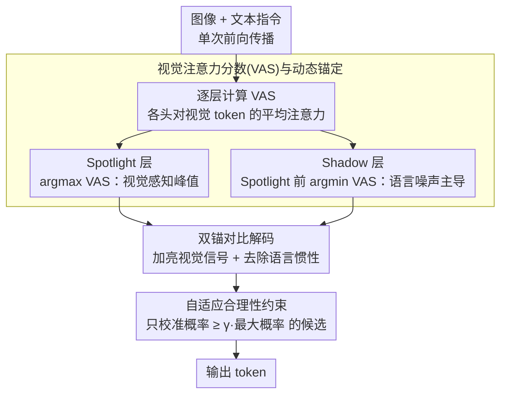

# Spotlight and Shadow: Attention-Guided Dual-Anchor Introspective Decoding for MLLM Hallucination Mitigation

**会议**: ACL 2026  
**arXiv**: [2604.10071](https://arxiv.org/abs/2604.10071)  
**代码**: 无  
**领域**: 幻觉检测  
**关键词**: 多模态幻觉, 对比解码, 层级分析, 视觉注意力, 训练无关

## 一句话总结

提出 DaID (Dual-Anchor Introspective Decoding)，通过挖掘 MLLM 内部不同层的视觉感知差异——Spotlight 层放大视觉信号、Shadow 层抑制语言惯性——在单次前向传播内实现幻觉缓解。

## 研究背景与动机

**领域现状**：多模态大语言模型 (MLLMs) 在推理任务中表现出色，但存在严重的幻觉问题——生成文本与视觉内容不一致。

**现有痛点**：现有对比解码方法（VCD、ICD）存在两大缺陷：(1) 每步需额外前向传播来获取负样本分布，推理延迟增加 1.83×；(2) 依赖启发式外部扰动（如视觉遮蔽）构造负分布，引入随机噪声导致语义偏移。

**核心矛盾**：外部扰动的不确定性可能导致正确的视觉信号被错误抑制（如 VCD 将正确的"黄色"替换为错误的"红色"）。

**本文目标**：从外部干预范式转向内部自省范式，利用模型自身中间层的感知差异作为对比信号源。

**切入角度**：对 MLLM 进行逐层诊断，发现浅层具有强烈幻觉倾向（视觉失认），中间层视觉感知最强（peak fidelity），深层视觉信号被语言先验覆盖（先见后忘）。

**核心 idea**：用视觉注意力分数 (VAS) 动态定位每个 token 的 Spotlight 层（视觉感知峰值）和 Shadow 层（语言噪声主导），在单次前向传播内通过对比校准实现幻觉抑制。

## 方法详解

### 整体框架

DaID 在标准 MLLM 解码过程中，利用各层对视觉 token 的注意力分布实时选择两个锚定层：Spotlight 层（视觉注意力最高 → 放大视觉信号）和 Shadow 层（Spotlight 之前视觉注意力最低 → 抑制语言先验），通过双锚对比公式校准最终 logits，并用自适应合理性约束把校准限制在语法合理的候选词上。整个过程不需要额外前向传播。

### 关键设计

**1. 视觉注意力分数 (VAS) 与动态锚定：用模型自己对视觉 token 的注意力当探针，逐 token 找峰值层和噪声层**

做对比解码得先有“正信号”和“负信号”两个来源。过去的方法靠外部扰动（遮蔽图像）硬造负样本，既要多跑一次前向，又会引入随机噪声。DaID 改从模型内部找：定义视觉注意力分数 $\text{VAS}_t(l)$ 为第 $l$ 层各注意力头对视觉 token 的平均注意力权重，把 $\arg\max\,\text{VAS}$ 的层取作 Spotlight（视觉感知峰值），把 Spotlight 之前 $\arg\min\,\text{VAS}$ 的层取作 Shadow（视觉最弱、纯语言噪声主导）。作者实验发现视觉注意力和物体识别准确率/幻觉率高度同步（LLaVA-1.5 上两者都在第 25 层达峰），所以 VAS 是一个不用训练、就能反映模型当前认知状态的可靠代理。

**2. 双锚对比解码：在一次前向里同时“加亮”视觉信号、“去噪”语言惯性**

幻觉既来自视觉信号太弱、也来自语言先验太强，所以单独增强视觉或单独抑制语言都不够。DaID 把两个锚定层的 logits 一起塞进最终 logits 做校准：

$$L_{\text{DaID}} = [L_{\text{final}} + \alpha \cdot L_{\text{spotlight}}] \cdot (1+\beta) - \beta \cdot L_{\text{shadow}}$$

其中 $\alpha$ 控制视觉增强强度、$\beta$ 控制语言抑制强度。前半把 Spotlight 层的视觉证据加进来放大正确信号，后半减掉 Shadow 层所代表的语言惯性，相当于一次前向就同时完成“加亮+去噪”，不必像 VCD 那样为负分布额外跑一次前向。

**3. 自适应合理性约束：只在语法说得通的候选里做校准**

Spotlight 取自中间层，它的 logits 虽然视觉相关，却可能夹带语法不当的 token，直接拿去校准会破坏句子流畅度。约束的办法是只对最终层分布中概率 $\ge \gamma \cdot \max\text{-prob}$ 的候选 token 应用双锚校准，其余一律置零。这样把校准动作限制在“语法本来就合理”的候选空间内，既享受到视觉增强，又不会把奇怪的 token 顶上来。

### 损失函数 / 训练策略

DaID 为训练无关的推理时方法。核心超参数：α=0.8（视觉增强），β=0.2（语言抑制），γ=0.9（POPE）/0.1（其他）。

## 实验关键数据

### 主实验

**LLaVA-1.5-7B 上的幻觉基准**:

| 方法 | POPE Acc | POPE F1 | CHAIR_S↓ | CHAIR_I↓ | MME Total↑ |
|------|----------|---------|----------|----------|-----------|
| Greedy | 81.38 | 82.20 | 49.6 | 14.4 | 559.48 |
| VCD | 84.66 | 84.52 | 49.2 | 14.8 | 603.66 |
| OPERA | 84.88 | 85.21 | 45.4 | 12.7 | 549.00 |
| SID | 84.82 | 85.50 | 44.2 | 12.2 | 599.80 |
| EAZY | 84.97 | 85.78 | 38.8 | 11.4 | 596.16 |
| **DaID** | **85.08** | **85.92** | **35.9** | **11.3** | **633.68** |

**LLaVA-NeXT 上的幻觉基准**:

| 方法 | POPE Acc | POPE F1 | CHAIR_S↓ | CHAIR_I↓ | MME Total↑ |
|------|----------|---------|----------|----------|-----------|
| Greedy | 83.78 | 82.24 | 32.8 | 9.1 | 580.92 |
| EAZY | 84.91 | 85.40 | 26.8 | 8.3 | 611.14 |
| **DaID** | **85.32** | **85.76** | **24.2** | **8.2** | **644.40** |

### 消融实验

**超参数分析（LLaVA-1.5）**:
- α 从 0.4→0.8：POPE Acc 从 83.44% 上升到 85.08%；α>0.8 性能下降（视觉信号过强破坏语法）
- β=0.2 最优：相比 β=0（无抑制），F1 +0.93%，Acc +0.51%；β>0.2 过度抑制导致性能下降

**通用推理能力**：在 GQA、VQAv2、MMB、SeedI、VizWiz 五个基准上，DaID 在 7B 和 13B 规模上不仅保持而且一致提升了性能（如 SeedI 上 +2.1%）。

### 关键发现

- 逐层诊断揭示了 MLLM 的"先见后忘"现象：中间层物体识别准确率达峰后在深层显著下降（LLaVA-NeXT 下降 11.12%）
- 视觉注意力与物体识别准确率精确同步（LLaVA-1.5 均在第 25 层达峰），验证了 VAS 作为认知状态代理的可靠性
- DaID 在不增加推理开销的情况下（单次前向传播）全面优于需要额外前向传播的 VCD、OPERA 等方法
- 跨 5 个 MLLM 架构的泛化实验确认了方法的一致有效性

## 亮点与洞察

- 从"外部扰动"到"内部自省"的范式转换非常优雅——避免了外部噪声引入的问题，同时减少了计算开销
- "Spotlight + Shadow"双锚概念直觉性强，浅层=语言噪声→Shadow，中间层=视觉峰值→Spotlight
- 逐层诊断分析本身就有重要的科学价值——"先见后忘"现象和注意力代理机制可启发更多研究
- 方法完全免训练，可即插即用地应用到任何 MLLM

## 局限与展望

- α 和 β 在不同基准上需要不同设置（如 γ 在 POPE 上 0.9 vs 其他 0.1），超参数选择缺乏自动化
- 层级分析基于 LLaVA 系列，对其他架构（如 Qwen2-VL）的最优层可能不同
- 单次前向传播的优势在注意力提取和层级 logits 计算上可能有额外开销，未报告具体 latency
- 对视频理解等更复杂多模态场景的扩展有待研究

## 相关工作与启发

- 与 VCD 的对比最具说明性：VCD 用外部扰动构造负分布，DaID 用浅层的语言先验作为天然负分布，更优雅也更有效
- DoLa 同样利用层级对比，但仅对比早期和晚期层来提取事实知识，DaID 的双锚 + VAS 动态选择更为精细
- 对 MLLM 架构设计的启示：可考虑在训练时加入中间层视觉保持的辅助目标，从根源缓解"先见后忘"

## 评分

- 新颖性: ⭐⭐⭐⭐⭐ 内部自省范式新颖，双锚动态选择机制设计精巧，"先见后忘"发现有重要价值
- 实验充分度: ⭐⭐⭐⭐ 多个幻觉和通用基准、多个 MLLM、超参数分析完整
- 写作质量: ⭐⭐⭐⭐⭐ 论文结构优美，从 Motivation 到 Observation 到 Method 一气呵成

<!-- RELATED:START -->

## 相关论文

- [\[AAAI 2026\] Causally-Grounded Dual-Path Attention Intervention for Object Hallucination Mitigation in LVLMs](../../AAAI2026/hallucination/causally-grounded_dual-path_attention_intervention_for_objec.md)
- [\[CVPR 2026\] Tell Model Where to Look: Mitigating Hallucinations in MLLMs by Vision-Guided Attention](../../CVPR2026/hallucination/tell_model_where_to_look_mitigating_hallucinations_in_mllms_by_vision-guided_att.md)
- [\[CVPR 2026\] Locate-then-Sparsify: Attribution Guided Sparse Strategy for Visual Hallucination Mitigation](../../CVPR2026/hallucination/locate-then-sparsify_attribution_guided_sparse_strategy_for_visual_hallucination.md)
- [\[ACL 2025\] Mixture of Decoding: An Attention-Inspired Adaptive Decoding Strategy to Mitigate Hallucination in Multimodal LLMs](../../ACL2025/hallucination/mixture_of_decoding_an_attention-inspired_adaptive_decoding_strategy_to_mitigate.md)
- [\[ACL 2026\] Hallucination Detection in LLMs with Topological Divergence on Attention Graphs](hallucination_detection_in_llms_with_topological_divergence_on_attention_graphs.md)

<!-- RELATED:END -->
