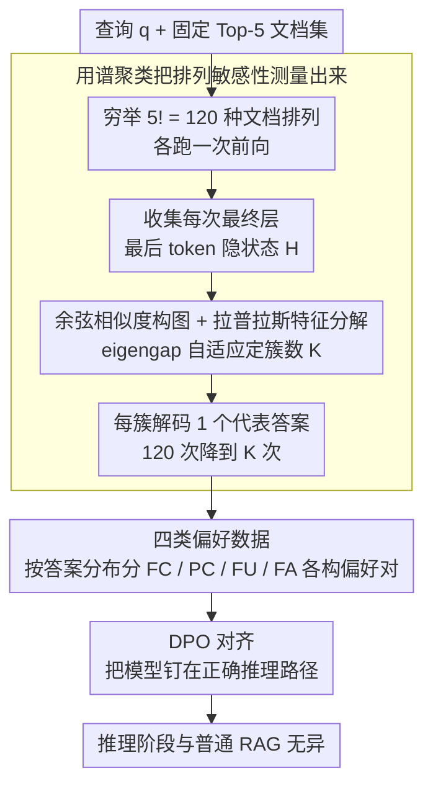

# Stable-RAG: Mitigating Retrieval-Permutation-Induced Hallucinations in Retrieval-Augmented Generation

**会议**: ACL 2026  
**arXiv**: [2601.02993](https://arxiv.org/abs/2601.02993)  
**代码**: [GitHub](https://github.com/zqc1023/Stable-RAG)  
**领域**: 幻觉检测  
**关键词**: 检索增强生成, 排列敏感性, 幻觉, 隐状态聚类, 偏好对齐

## 一句话总结

揭示 RAG 系统对检索文档排列顺序高度敏感的问题，提出 Stable-RAG：通过对文档排列产生的隐状态做谱聚类识别主导推理模式，再用 DPO 对齐将幻觉输出引导向正确答案，在三个 QA 数据集上实现准确率和推理一致性的双重提升。

## 研究背景与动机

**领域现状**：RAG 是缓解 LLM 事实幻觉的关键范式，通过检索外部文档为生成提供证据支撑。当前 RAG 研究主要关注检索质量（如何找到更好的文档）和位置偏差（长上下文中的注意力不均）。

**现有痛点**：作者发现了一个此前被忽视的脆弱性——排列敏感性（permutation sensitivity）：即使检索到的文档集完全相同（包含金标文档），仅仅改变文档顺序就能导致模型走上截然不同的推理路径，产生不一致的答案。在 NQ 数据集上，即使金标文档固定在第一位，LLM 的排列扰动成功率（PSR）仍然很高。

**核心矛盾**：排列敏感性既不是检索质量问题（文档集完全相同），也不是长上下文位置偏差（Top-5 仅千 token 以内），而是源自 LLM 内部推理动态的结构性不稳定——随着网络深度增加，文档排列诱导越来越多不同的推理轨迹。

**本文目标**：(1) 量化并理解排列敏感性的内在机制，(2) 设计一种模型无关的方法使 RAG 在任意文档排列下产生一致且准确的输出。

**切入角度**：通过逐层可视化隐状态的谱聚类行为，作者发现浅层隐状态混杂，但深层隐状态按最终答案清晰分簇，且敏感样本的分簇数远多于非敏感样本。这表明排列影响在高层逐渐放大。

**核心 idea**：利用排列敏感性估计本身来消除排列诱导的幻觉——对所有排列的最终层隐状态做谱聚类，从每个簇的中心解码代表性答案，再构建偏好数据通过 DPO 对齐模型。

## 方法详解

### 整体框架

Stable-RAG 把"消除排列幻觉"拆成一条从内部观测到偏好对齐的流水线：给定查询 $q$ 与固定的 Top-5 文档集，先穷举 $5!=120$ 种排列让模型各跑一遍前向，把每次最终层最后一个 token 的隐状态收集起来做谱聚类，识别出模型在不同顺序下走过的几条主导推理路径；再从这些路径对应的答案中筛出"该奖励的"与"该惩罚的"，构造偏好对；最后用 DPO 把模型推向那条正确路径，使它对文档顺序不再敏感。整个方法模型无关，只在训练阶段引入排列采样，推理阶段与普通 RAG 无异。

### 关键设计

**1. 用谱聚类把排列敏感性"测量"出来：把 120 次解码压成 K 次**

直接对所有排列解码再投票，计算和人工标注代价都太高，而且无法分辨哪些排列其实走的是同一条推理路径。作者的做法是把"答案空间"的统计搬到"隐状态空间"做：对 $N=n!$ 种排列各取最终层最后 token 的隐状态拼成 $H \in \mathbb{R}^{N \times d}$，用余弦相似度构图 $A_{ij} = \exp(-\frac{1-\cos(h^{(i)}, h^{(j)})}{\sigma})$，再对归一化拉普拉斯 $L = I - D^{-1/2}AD^{-1/2}$ 做特征分解，靠特征间隙（eigengap）自适应地定下簇数 $K$。每个簇只需对最接近质心的那个隐状态解码一次，就能代表整簇排列的答案，从而把 120 次全量解码降到 $K$ 次。之所以可行，是因为论文逐层可视化发现深层隐状态会按最终答案清晰分簇——定量上这套聚类的 F1 在 LLaMA3 上达 83.9%、Qwen3 上达 87.6%，足以可靠地还原"模型究竟有几种推理模式"。

**2. 四类偏好数据：按排列一致性的不同病因开不同的药**

把样本一刀切成"对/错"会浪费掉排列分布里的结构信息。作者按聚类后的答案分布把样本分成四类，分别给出不同的偏好信号：FC（所有排列都答对）直接排除出训练，因为模型已经稳定；PC（部分对部分错）取最频繁的正确答案为 $y_w$、最频繁的错误答案为 $y_l$，目的是把已有能力稳住；FU（全错且问题本不可答）令 $y_w=$"I don't know"，教模型在证据不足时弃权而非编造；FA（全错但本可答）则把金标答案设为 $y_w$，逼模型从证据里抽出正确结论。这种细分让 DPO 收到的信号与每个样本的失败原因对齐——稳能力、学弃权、纠错误各司其职，消融中 PC 组件贡献最大，去掉它平均 SubEM 从 52.34 跌到 42.51。

**3. DPO 对齐：用偏好对而非奖励模型把模型钉在正确路径上**

有了偏好对后，训练用标准 DPO 损失 $\mathcal{L}_{\text{DPO}} = -\mathbb{E}[\log\sigma(\beta \log\frac{\pi_\theta(y_w|x)}{\pi_{\text{ref}}(y_w|x)} - \beta \log\frac{\pi_\theta(y_l|x)}{\pi_{\text{ref}}(y_l|x)})]$，其中输入 $x$ 是查询拼上某一个具体文档排列，超参 $\beta$ 控制偏好锐度。选 DPO 而非 RLHF，是因为它无需另训奖励模型就能直接从偏好对学习，恰好可以高效消费上一步聚类产出的高质量偏好数据；而把"不同排列"作为 $x$ 喂进去，等于显式告诉模型：无论顺序怎么变，都该收敛到同一个 $y_w$，这正是抑制排列幻觉所需的训练目标。

### 损失函数 / 训练策略

标准 DPO 损失，$\beta$ 控制偏好锐度。基座模型为 LLaMA3-8B-Instruct 与 Qwen3-8B，检索器为 DPR 和 Contriever，Top-5 检索；训练集上对每个查询用全排列（$5!=120$ 种）做隐状态聚类和偏好数据构建。

## 实验关键数据

### 主实验

LLaMA3-8B-Instruct，SubEM (%) / F1 (%)：

| 方法 | NQ (Contriever) | TriviaQA (DPR) | HotpotQA (Contriever) | 平均 SubEM |
|------|-----------------|----------------|----------------------|------------|
| Vanilla RAG | 40.75 / 42.82 | 67.12 / 68.61 | 30.73 / 34.08 | 45.66 |
| RetRobust | 41.82 / 44.26 | 68.67 / 70.42 | 31.46 / 35.34 | 47.08 |
| ATM | 43.75 / 44.88 | 70.12 / 70.35 | 34.36 / 36.97 | 48.82 |
| **Stable-RAG** | **48.14** / 45.80 | **73.43** / **73.76** | **38.91** / **39.87** | **52.34** |

Qwen3-8B，SubEM (%)：

| 方法 | NQ (Contriever) | TriviaQA (DPR) | HotpotQA (Contriever) | 平均 SubEM |
|------|-----------------|----------------|----------------------|------------|
| Vanilla RAG | 44.65 | 69.62 | 33.14 | 48.08 |
| ATM | 45.47 | 70.06 | 35.12 | 49.24 |
| **Stable-RAG** | **46.12** | **71.32** | **35.73** | **50.27** |

### 消融实验

基于 LLaMA3-8B-Instruct（Contriever, NQ SubEM）：

| 组件 | 平均 SubEM | 弃权率 AR |
|------|-----------|----------|
| 完整 Stable-RAG | 52.34 | 适中 |
| 去掉 PC 组件 | 42.51 | 35.1% |
| 仅 PC（无 FA/FU） | 51.96 | 0.0% |
| PC + FU（无 FA） | 50.87 | 17.3% |

聚类质量随层深度提升（LLaMA3-8B, NQ, DPR）：

| 层 | Precision | Recall | F1 |
|----|-----------|--------|-----|
| 8 | 69.2 | 71.8 | 69.3 |
| 16 | 81.4 | 82.5 | 81.3 |
| 24 | 82.3 | 83.7 | 82.2 |
| 32 | 84.1 | 85.2 | 83.9 |

### 关键发现

- 排列敏感性是普遍现象：即使金标文档放首位，LLaMA 各版本的 PSR 仍达 40-60%
- 隐状态聚类质量随网络深度提升：LLaMA3 第 8 层 F1=69.3%，第 32 层升至 83.9%
- PC（部分正确）组件贡献最大，去掉后平均 SubEM 从 52.34 骤降至 42.51
- Stable-RAG 具有跨数据集/检索器/Top-K 的强泛化性

## 亮点与洞察

- "排列敏感性"问题定义精准——既不是检索质量问题也不是长上下文问题，开辟了 RAG 鲁棒性研究新维度
- 逐层隐状态可视化直观揭示了排列如何影响内部推理：浅层混杂→深层分化，为方法设计提供了直接启发
- 四类偏好数据构建策略（FC/PC/FU/FA）体现了细粒度的训练信号设计

## 局限与展望

- 全排列 $n!$ 计算开销大（Top-5 需 120 次前向传播），扩展到更多检索文档时需要采样策略
- 当前仅在 QA 任务上评估，长文本生成等场景的排列敏感性可能表现不同
- 未探索训练时和推理时方法的结合（如推理时做多排列解码 + 投票）

## 相关工作与启发

- RetRobust 和 RAAT 通过注入检索噪声训练鲁棒性，但不处理排列问题；ATM 考虑了排列扰动但未显式建模推理轨迹
- Pos2Distill 和 Ms-PoE 关注长上下文位置偏差，而排列敏感性在短上下文（<1000 tokens）中同样存在
- 启发：LLM 的推理路径远比我们想象的脆弱，输入的微小结构变化（不改变语义内容）就能导致完全不同的输出

## 评分

- 新颖性: ⭐⭐⭐⭐⭐ 问题定义新颖且重要，排列敏感性是 RAG 领域被严重忽视的脆弱性
- 实验充分度: ⭐⭐⭐⭐ 三个数据集 + 两个检索器 + 两个基座模型，消融和泛化实验完整
- 写作质量: ⭐⭐⭐⭐ 逻辑链清晰，可视化图表出色，问题动机推导自然

<!-- RELATED:START -->

## 相关论文

- [\[ACL 2025\] Automated Explanation Generation and Hallucination Detection for Heritage Image Retrieval](../../ACL2025/hallucination/automated_explanation_generation_and_hallucination_detection_for_heritage_image_.md)
- [\[ACL 2025\] Removal of Hallucination on Hallucination: Debate-Augmented RAG](../../ACL2025/hallucination/removal_of_hallucination_on_hallucination_debate-augmented_rag.md)
- [\[ACL 2025\] REFIND at SemEval-2025 Task 3: Retrieval-Augmented Factuality Hallucination Detection in Large Language Models](../../ACL2025/hallucination/refind_at_semeval-2025_task_3_retrieval-augmented_factuality_hallucination_detec.md)
- [\[ACL 2026\] Understanding New-Knowledge-Induced Factual Hallucinations in LLMs: Analysis and Interpretation](understanding_new-knowledge-induced_factual_hallucinations_in_llms_analysis_and_.md)
- [\[ACL 2026\] TPA: Next Token Probability Attribution for Detecting Hallucinations in RAG](tpa_next_token_probability_attribution_for_detecting_hallucinations_in_rag.md)

<!-- RELATED:END -->
