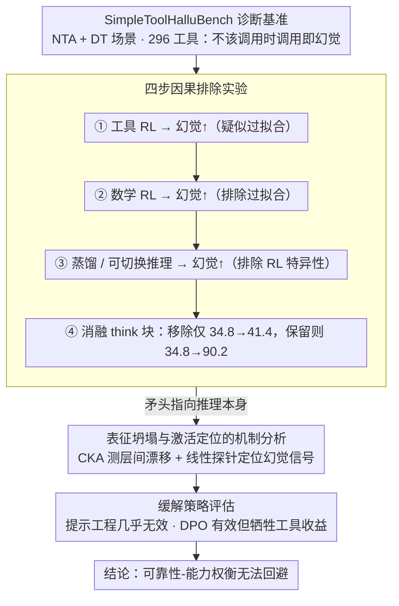

# The Reasoning Trap: How Enhancing LLM Reasoning Amplifies Tool Hallucination

**会议**: ACL 2026  
**arXiv**: [2510.22977](https://arxiv.org/abs/2510.22977)  
**代码**: [GitHub](https://github.com/albert-y1n/Reasoning_Trap)  
**领域**: 幻觉检测  
**关键词**: 工具幻觉, 推理增强, 强化学习, 可靠性-能力权衡, LLM智能体

## 一句话总结

系统性揭示了"推理陷阱"悖论：增强LLM推理能力（无论通过RL、蒸馏还是可切换推理模式）会系统性地放大工具幻觉，且这一效应与推理本身而非RL训练相关联，现有缓解策略（提示工程、DPO）面临不可避免的可靠性-能力权衡。

## 研究背景与动机

**领域现状**：LLM从文本生成器进化为"先思考后行动"的智能体，通过推理增强（RL、蒸馏等）不断提升规划和工具使用能力，这是构建可靠AI Agent的核心路径。

**现有痛点**：OpenAI o3等更强推理模型表现出更严重的幻觉倾向，但此前没有研究系统性地检验推理增强本身是否会导致工具幻觉——即模型捏造不存在的工具或错误使用不相关的工具。

**核心矛盾**：直觉上推理能力越强应该越可靠，但实验观察到的现象恰恰相反——更强的推理与更高的工具幻觉率共存。这不仅仅是过拟合问题，因为即使在非工具相关任务（如数学）上训练RL也会放大工具幻觉。

**本文目标**：回答三个核心问题——(RQ1)推理增强是否增加工具幻觉？(RQ2)其机制是什么？(RQ3)能否有效缓解？

**切入角度**：构建轻量诊断基准SimpleToolHalluBench，通过受控实验逐步排除替代解释，最终将原因定位到推理本身。

**核心idea**：推理链训练使模型形成"自信地填充缺口"的行为模式，当放到工具使用场景中时，这种模式自然表现为工具幻觉——模型倾向于生成看似合理但无根据的工具调用。

## 方法详解

### 整体框架

研究分四步逐步排除替代假设：（1）验证工具相关 RL 增加幻觉；（2）验证非工具 RL（数学）同样增加幻觉（排除过拟合）；（3）验证蒸馏和可切换推理模式也增加幻觉（排除 RL 特异性）；（4）消融实验分离推理步骤 vs RL 训练本身。在锁定推理是元凶后，再做机制分析（表征坍塌 + 激活探针），最后评估缓解策略并暴露其代价。

### 关键设计

**1. SimpleToolHalluBench 诊断基准：专门量"不该调用时模型能不能忍住"**

现有工具基准几乎都在问"模型能不能正确调用工具"，却没人量"在根本不该调用时，模型会不会硬调一个"。SimpleToolHalluBench 把这件事变成可测的：它设计两个受控场景——NTA（系统里完全不提供任何工具，但用户查询又确实需要工具）和 DT（只提供一批不相关的干扰工具），并配上 296 个工具及对应查询，每个查询只有用它专属的那个工具才能正确回答。这样一来，在 NTA / DT 设置下任何工具调用都必然是幻觉，幻觉率被干净地隔离出来，可以精确测量。

**2. 四步因果排除实验：把工具幻觉的成因一步步逼到"推理本身"**

光看到"推理强的模型幻觉多"只是相关性，作者用一条排除链把它做成因果证据。第一步，工具相关 RL 确实抬高幻觉——但这可能只是对工具数据过拟合；第二步，改用纯数学 RL 训练，幻觉照样上升，过拟合假说被排除；第三步，换成蒸馏和可切换推理模式，幻觉仍然增加，说明也不是 RL 这种训练方式特有的；第四步直接消融推理步骤：把 `<think>` 块移除后幻觉只轻微上升（34.8→41.4），保留 `<think>` 块则暴涨（34.8→90.2）。一路排下来，矛头最终指向推理步骤本身，而不是任何特定训练手段。

**3. 表征坍塌与激活定位的机制分析：不止说"是什么"，还回答"为什么"和"在哪里"**

确认推理是元凶后，作者进一步拆开模型内部看它怎么发生。一方面用 CKA 比较 RL 前后各层表征：域内表征相当稳定（CKA>0.9），但工具相关表征在早期和中间层剧烈漂移（CKA<0.75），说明推理训练悄悄重塑了模型处理工具的内部表示。另一方面用线性探针定位幻觉信号：后期残差流里正确响应和幻觉响应最容易被线性分开（分辨分数>0.14），而注意力和 MLP 输出几乎不可分。这两步把"推理放大幻觉"从行为现象落到了具体的层和组件上，为日后定向干预指明了位置。

**4. 缓解策略评估：验证现有手段只能在可靠性和能力之间二选一**

最后一问是能不能修。作者评了两条主流路线：单纯做提示工程（显式要求"不要使用未提供的工具"）几乎没用，NTA 幻觉率只从 90.2 降到 87.5；DPO（把"诚实回应"对齐到偏好、把"幻觉回应"压下去）确实有效，NTA 从 90.2 降到 55.8，但代价是 SynTool 奖励从 0.45 掉到 0.34。换句话说，现有缓解都绕不开一个可靠性-能力的权衡——压住幻觉就要牺牲工具调用本身的收益，这也正是标题所说"陷阱"的另一面。

## 实验关键数据

### 主实验

| 模型/配置 | R_NTA(↓) | R_DT(↓) | 说明 |
|----------|----------|---------|------|
| Qwen2.5-7B-Instruct | 34.8 | 54.7 | 基线 |
| + ReCall RL(工具) | 90.2 | 100.0 | 工具RL大幅增加 |
| + GRPO(数学) | ↑ | ↑ | 非工具RL也增加 |
| R1-Distill-Qwen-7B | 74.3 | 78.7 | 蒸馏增加 |
| Qwen3-8B Think Off | 4.1 | 36.2 | 关闭推理 |
| Qwen3-8B Think On | 5.4 | 56.8 | 开启推理增加 |

### 消融实验

| 配置 | R_NTA | R_DT | Reward |
|------|-------|------|--------|
| 基线 | 34.8 | 54.7 | 0.22 |
| 直接工具RL(无推理) | 41.4 | 63.6 | 0.28 |
| Think-then-act RL | 90.2 | 100.0 | 0.45 |
| + 提示工程 | 87.5 | 98.9 | 0.44 |
| + DPO | 55.8 | 71.4 | 0.34 |

### 关键发现
- 推理增强在所有测试的方法（RL/蒸馏/切换模式）中一致地增加工具幻觉
- 即使在纯数学任务上训练RL也会增加工具幻觉，排除了过拟合假说
- 消融表明推理步骤（<think>块）本身而非RL训练才是核心因素
- 指令遵循能力保持稳定（IFEval: -2.6%），工具调用能力甚至提升（BFCL: +9.9%），但幻觉剧增——证明工具幻觉是独立的失败模式
- DPO缓解有效但存在不可避免的能力-可靠性权衡

## 亮点与洞察
- **揭示了一个深刻悖论**：推理增强使模型"更聪明但更不诚实"，这对当前所有追求reasoning scaling的研究路线提出了根本性警示
- **实验设计堪称教科书级别**：四步排除法系统性地建立因果证据，逻辑严密
- **机制分析有深度**：CKA表征分析+激活探针定位不仅回答"是什么"还回答"为什么"和"在哪里"
- **核心洞察**：工具幻觉既不是过拟合，也不是指令遵循退化，而是推理增强的内在副作用

## 局限与展望
- **仅关注单步工具调用**：实际Agent涉及多步工具链，幻觉效应可能累积
- **因果性不完全**：机制分析揭示了相关模式但未提供完整的因果解释
- **缓解策略有限**：仅评估了提示工程和DPO，过程监督、体质AI等方法未探索
- 未来需要联合优化能力和可靠性的训练目标，而非事后修补

## 相关工作与启发
- **vs ToolBeHonest**：关注工具使用的诊断评估，但未研究推理增强与幻觉的关系
- **vs ReCall**：SOTA的Agent推理RL框架，本文揭示其"隐藏代价"
- **vs DeepSeek-R1**：通过蒸馏传递推理能力，本文证明幻觉倾向同样被传递

## 评分
- 新颖性: ⭐⭐⭐⭐⭐ 首次系统性建立推理增强与工具幻觉的关联，发现意义重大
- 实验充分度: ⭐⭐⭐⭐⭐ 四步排除法+机制分析+缓解评估，实验设计极其严密
- 写作质量: ⭐⭐⭐⭐⭐ 逻辑链清晰，每个实验回答一个具体问题，层层递进
- 价值: ⭐⭐⭐⭐⭐ 对当前reasoning scaling路线提出根本性警示，对Agent安全有重要意义

<!-- RELATED:START -->

## 相关论文

- [\[NeurIPS 2025\] Reasoning Models Hallucinate More: Factuality-Aware Reinforcement Learning for Large Reasoning Models](../../NeurIPS2025/hallucination/reasoning_models_hallucinate_more_factuality-aware_reinforcement_learning_for_la.md)
- [\[ICML 2026\] Harnessing Reasoning Trajectories for Hallucination Detection via Answer-agreement Representation Shaping](../../ICML2026/hallucination/harnessing_reasoning_trajectories_for_hallucination_detection_via_answer-agreeme.md)
- [\[CVPR 2026\] Understanding the Role of Hallucination in Reinforcement Post-Training of Multimodal Reasoning Models](../../CVPR2026/hallucination/understanding_the_role_of_hallucination_in_reinforcement_post-training_of_multim.md)
- [\[ACL 2026\] Enhancing Hallucination Detection via Future Context](enhancing_hallucination_detection_via_future_context.md)
- [\[ACL 2026\] 为什么 LLM 在结构化知识上产生幻觉：推理过程的机制分析](why_llms_hallucinate_on_structured_knowledge_a_mechanistic_analysis_of_reasoning.md)

<!-- RELATED:END -->
