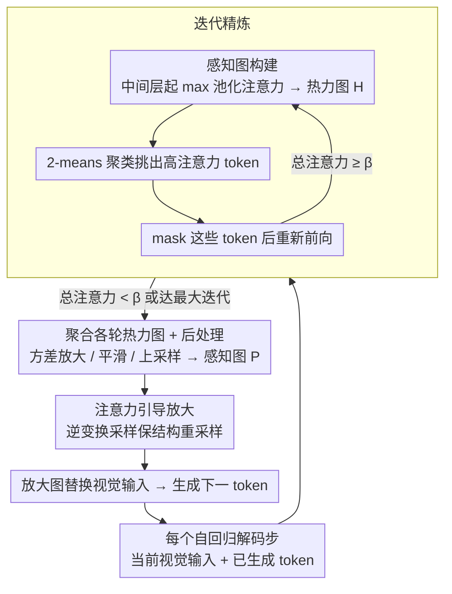

# Through the Magnifying Glass: Adaptive Perception Magnification for Hallucination-Free VLM Decoding

**会议**: ACL 2026  
**arXiv**: [2503.10183](https://arxiv.org/abs/2503.10183)  
**代码**: [GitHub](https://github.com/ShunqiM/PM)  
**领域**: 幻觉检测  
**关键词**: 视觉幻觉缓解, 感知放大, 注意力引导解码, 迭代精炼, 视觉语言模型

## 一句话总结

本文提出 Perception Magnifier (PM)，一种视觉解码方法，在每个自回归解码步基于多层注意力迭代识别关键视觉区域并自适应放大，通过提升关键区域的有效分辨率来缓解 VLM 的视觉幻觉，同时保持空间结构完整性和推理能力。

## 研究背景与动机

**领域现状**：VLM 的幻觉缓解方法主要分为训练时方法（去偏数据集、增大视觉分辨率）和推理时方法（对比解码、视觉 token 增权）。其中解码端方法因无需微调而受到关注，主要通过抑制偏差 logits 或增强视觉嵌入权重来减少幻觉。

**现有痛点**：(1) 对比解码（VCD、M3ID）通过抑制偏差输出来减少幻觉，但当视觉信息本身不足以区分时，两路 logits 中都缺乏正确信息，抑制偏差无法恢复缺失细节；(2) 嵌入增权（PAI、IBD）增强视觉 token 的影响力，但当目标区域在 ViT 特征中太小或太分散时仍然无效；(3) 裁剪方法（ViCrop）通过裁剪并放大关键区域来增强细节，但破坏了空间结构（丢失上下文），且引入双图像输入导致困惑。

**核心矛盾**：现有方法要么不增强视觉细节（对比/增权），要么增强了细节但破坏了空间结构（裁剪）——需要在增强细节和保持结构之间找到平衡。

**本文目标**：在不破坏空间结构的前提下，自适应增强关键视觉区域的有效分辨率。

**切入角度**：将视觉增强建模为"放大镜"效果——关键区域被放大（占据更多像素/patch）而非关键区域被压缩（而非丢弃），整体图像结构保持不变。

**核心 idea**：基于注意力热力图构建感知图（perception map），将其视为概率质量函数，通过逆变换采样（inverse transform sampling）对原始图像进行保结构的自适应重采样——高注意力区域被放大、低注意力区域被压缩。

## 方法详解

### 整体框架

PM 想解决的痛点很具体：VLM 出现幻觉，很多时候不是没"看"对地方，而是关键物体在 ViT 特征里太小、有效分辨率不够，看到了也认不准。已有解法要么不增强细节（对比解码、嵌入增权），要么增强了细节却破坏空间结构（裁剪丢上下文）。PM 的破法是把视觉增强做成一个"放大镜"——在每一步自回归解码时，它先从 VLM 的注意力里找出当前最该看清的区域，迭代扩大覆盖范围，把结果整理成像素级的感知图，再据此对原图做保结构的重采样：关键区域被放大占更多像素、非关键区域被压缩而非丢弃，整体结构不变。放大后的图替换原始视觉输入，生成下一个 token。

### 关键设计

**1. 感知图构建（Perception Map）：把多层注意力聚成一张"该看哪里"的热力图**

要放大正确的区域，先得知道当前解码步最相关的视觉区域在哪。PM 聚合中间层到深层（$l \geq \mathcal{L}$）的自注意力：每层先对所有头取最大值，再跨层求和得到 token 级热力图

$$\mathcal{H} = \sum_{l=\mathcal{L}}^{N_l} \max_{h \in 1,\dots,N_h} \text{Attn}_{l,h}$$

之所以从中间层起、用 max 而非均值池化，是因为中间层注意力比最终层更准地定位目标对象，而 max 池化能保住视觉重要区域的尖峰信号、不被平均稀释。拿到 $\mathcal{H}$ 后再做后处理：归一化、方差放大（系数 $\alpha$）加 sigmoid 压缩、均匀平滑滤波（核大小 $k$），最后双线性上采样到像素级感知图 $\mathcal{P}$。其中方差放大这一步是为了确保"小但重要"的区域不被淹没。

**2. 迭代精炼（Iterative Refinement）：层层揭开被信息寄存器遮住的次显著区域**

单次注意力提取有个盲区：深层视觉模型会把细粒度特征压缩进少量 token（信息寄存器），导致空间上分散但语义相关的区域被一次性遗漏。迭代精炼模仿人眼看图的过程——先注意到最显著的区域，把它"遮住"再看下一个。每一轮里它提取热力图、用 2-means 聚类挑出高注意力 token、在注意力 mask 中屏蔽这些 token、重新前向传播，直到总注意力低于阈值 $\beta$ 或达到最大迭代数，最后把所有轮次的热力图聚合起来。

具体走一遍会更直观：第一轮注意力全压在画面中央的大物体上，聚合后把它屏蔽；第二轮注意力转移到角落一把原本被忽略的小椅子上；几轮之后所有相关线索都被陆续点亮、汇成一张完整的感知图。这种渐进式发现保证了放大不会只盯着最扎眼的那一块。

**3. 注意力引导放大（Attention-Based Magnification）：用逆变换采样做保结构的重采样**

有了感知图，最后一步是怎么"放大"。PM 把感知图 $\mathcal{P}$ 当成一个概率质量函数，沿水平和垂直方向分解成边际分布并算出累积分布 $\mathcal{F}_x(n)$ 和 $\mathcal{F}_y(n)$，再用逆变换采样重映射每个像素坐标：

$$\hat{I}_{i,j} = \text{Interp}(I, \mathcal{F}_x^{-1}(i), \mathcal{F}_y^{-1}(j))$$

直觉是：高注意力区域的 CDF 增长慢，意味着更多输出像素映射到这块区域，等于把它放大；低注意力区域 CDF 增长快、分到更少像素，等于被压缩。和裁剪的本质区别在于——所有区域都还在，只是相对分辨率变了，完整空间结构得以保留。这正好避开了裁剪丢上下文导致的位置判断和计数错误，后面实验里 Position 维度的对比就印证了这一点。

### 训练策略与超参

PM 完全在推理时工作，无需任何训练。基座模型为 LLaVA-1.5 7B，关键超参：起始层 $\mathcal{L}=12$、缩放系数 $\alpha=10$、平滑核 $k=3$、迭代阈值 $\beta=0.3$。

## 实验关键数据

### 主实验

**MME Perception 幻觉得分**

| 方法 | Existence | Count | Position | Color | Total* |
|------|-----------|-------|----------|-------|--------|
| Greedy | 195.00 | 143.33 | 128.33 | 163.33 | 630.00 |
| VCD | 190.00 | 143.33 | 120.00 | 155.00 | 608.33 |
| M3ID | 190.00 | 150.00 | 133.33 | 166.67 | 640.00 |
| IBD | 190.00 | 160.00 | 133.33 | 170.00 | 653.33 |
| ViCrop-R | 190.00 | 163.33 | 105.00 | 175.00 | 633.33 |
| **PM** | **195.00** | **175.00** | **138.33** | **175.00** | **683.33** |

**POPE 准确率（%）**

| 方法 | COCO | AVG |
|------|------|-----|
| Greedy | 85.29 | 84.59 |
| VDD | 86.71 | 86.32 |
| API-C | 87.31 | 86.41 |
| **PM** | **87.68** | **86.70** |

### 消融实验

**MME Perception 消融**

| 配置 | Total |
|------|-------|
| Greedy | 630.00 |
| PM w/o IR & MLA | 640.00 |
| PM w/o MLA | 645.00 |
| PM w/o IR | 665.00 |
| PM (Full) | **683.33** |

**放大方式对比**

| 方法 | MME Perception Total |
|------|---------------------|
| Blurring | 630.00 |
| Bounding Box | 640.00 |
| Masking | 648.33 |
| ViCrop | 646.67 |
| **Magnification** | **683.33** |

### 关键发现

- PM 在 MME Perception 上以 683.33 显著领先所有基线（次优 IBD 653.33），在 Count 和 Color 维度提升最大
- ViCrop 在 Position 维度表现差（105.00 vs PM 138.33），证实裁剪破坏空间结构对位置判断有害
- 所有对比解码基线在 MME Cognition 子集上性能下降，而 PM 不会——放大视觉输入不影响推理能力
- 迭代精炼和多层聚合各自贡献显著，Full PM 比无精炼版本高 18.33 分
- 定性分析显示 PM 能将小物体（如椅子）放大到可识别的分辨率

## 亮点与洞察

- "准确的注意力不等于正确的识别"——VLM 能注意到正确区域但在低分辨率下仍然误判，说明分辨率增强是必要的
- 保结构放大 vs 裁剪的设计选择非常关键——裁剪在 Position 上损失 33 分，放大反而提升 10 分
- 逆变换采样的放大方式优雅地统一了"放大关键区域"和"保留全局结构"

## 局限与展望

- 放大会导致局部形状畸变，在需要几何精度的任务上可能有害
- 打断了 KV cache 的高效解码——每步需要对放大后的图像重新编码
- 对 token-图像映射复杂的 VLM（非 interleaved 架构）需要额外的注意力对齐机制
- 仅在 LLaVA-1.5 7B 上验证，未在更新的 VLM 上测试

## 相关工作与启发

- **vs VCD/M3ID (对比解码)**: 抑制偏差 logits 但不增强视觉细节；PM 直接提升视觉分辨率
- **vs IBD/PAI (嵌入增权)**: 增强视觉 token 权重但不改变视觉内容；PM 改变视觉输入本身
- **vs ViCrop (裁剪)**: 裁剪丢失上下文且双图像输入引入困惑；PM 的保结构放大避免这些问题
- **vs API (区域 prompting)**: API 通过 mask 强调区域但不增加有效分辨率；PM 实际增大了关键区域的像素数

## 评分

- 新颖性: ⭐⭐⭐⭐ 逆变换采样实现保结构放大的思路新颖，迭代精炼有效但相对直接
- 实验充分度: ⭐⭐⭐⭐⭐ 4个基准+12种基线+详细消融（地图构建方式×放大方式×迭代精炼×多层聚合）+GPT-4o辅助评估
- 写作质量: ⭐⭐⭐⭐ 方法表述清晰，定性分析直观
- 价值: ⭐⭐⭐⭐ 从"增强视觉分辨率"角度缓解幻觉的思路有启发性，保结构设计实用

<!-- RELATED:START -->

## 相关论文

- [\[ACL 2025\] Mixture of Decoding: An Attention-Inspired Adaptive Decoding Strategy to Mitigate Hallucination in Multimodal LLMs](../../ACL2025/hallucination/mixture_of_decoding_an_attention-inspired_adaptive_decoding_strategy_to_mitigate.md)
- [\[ACL 2026\] Spotlight and Shadow: Attention-Guided Dual-Anchor Introspective Decoding for MLLM Hallucination Mitigation](spotlight_and_shadow_attention-guided_dual-anchor_introspective_decoding_for_mll.md)
- [\[ICLR 2026\] Enhancing Hallucination Detection through Noise Injection](../../ICLR2026/hallucination/enhancing_hallucination_detection_through_noise_injection.md)
- [\[CVPR 2026\] TriDF: Evaluating Perception, Detection, and Hallucination for Interpretable DeepFake Detection](../../CVPR2026/hallucination/tridf_evaluating_perception_detection_and_hallucination_for_interpretable_deepfa.md)
- [\[ACL 2025\] Activation Steering Decoding: Mitigating Hallucination in Large Vision-Language Models through Bidirectional Hidden State Intervention](../../ACL2025/hallucination/activation_steering_decoding_mitigating_hallucination_in_large_vision-language_m.md)

<!-- RELATED:END -->
