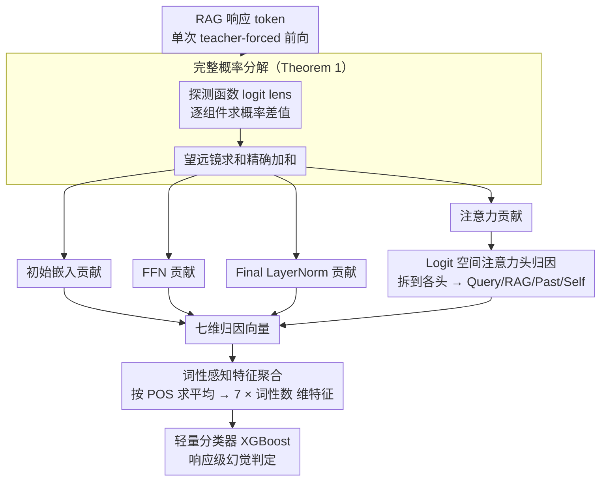

# TPA: Next Token Probability Attribution for Detecting Hallucinations in RAG

**会议**: ACL 2026  
**arXiv**: [2512.07515](https://arxiv.org/abs/2512.07515)  
**代码**: 无  
**领域**: 幻觉检测  
**关键词**: RAG幻觉检测, 概率归因, 残差流分解, 词性标注, 注意力机制

## 一句话总结

本文提出 TPA 框架，通过数学方法将 LLM 每个 token 的生成概率精确分解为七个来源（Query、RAG Context、Past Token、Self Token、FFN、Final LayerNorm、Initial Embedding）的贡献，结合词性标注聚合特征，实现 RAG 场景下的 SOTA 幻觉检测。

## 研究背景与动机

**领域现状**：RAG 通过检索外部知识来缓解 LLM 幻觉，但仍然可能忽视或误解检索信息。现有检测方法要么依赖启发式代理信号（如一致性检查、语义熵），要么聚焦于 FFN 与 RAG 上下文之间的二元冲突。

**现有痛点**：(1) 代理信号方法只测量幻觉的"症状"（如输出方差、表面置信度），不触及架构根因，对自信错误失效；(2) 先前内部分析工作（如 ReDeEP）仅关注 FFN vs RAG 的二元冲突，忽略了 LayerNorm、用户查询等其他关键组件的影响。

**核心矛盾**：FFN 对 token 概率的高贡献并不总是意味着幻觉——对于功能词（"the"、"of"）这是正常的，但对于命名实体则高度可疑。现有方法无法区分这种语法差异。

**本文目标**：建立完整的 token 概率归因框架，覆盖 Transformer 所有加性组件，并结合词性信息捕捉语法维度的异常。

**切入角度**：利用 Transformer 残差流的加性结构，将最终 token 概率精确分解为各组件的贡献增量。

**核心 idea**：token 概率 = 初始嵌入贡献 + 各层注意力贡献 + 各层 FFN 贡献 + 最终 LayerNorm 调整；注意力贡献进一步按注意力权重分配到 Query/RAG/Past/Self 四个来源；按词性聚合后形成检测特征。

## 方法详解

### 整体框架

TPA 分三步：(1) 粗粒度分解——用探测函数（logit lens）将 token 概率分解为 Initial Embedding、各层 Attention、各层 FFN 和 Final LayerNorm 四类贡献；(2) 细粒度归因——将 Attention 贡献通过 logit 空间分配到各注意力头，再按注意力权重归因到 Query/RAG/Past/Self 四个来源，形成七维归因向量；(3) 语法感知特征工程——按词性标签（名词、动词、数词等）聚合归因分数，构建检测特征，最终在该特征上训练轻量分类器输出响应级幻觉判定。

### 关键设计

**1. 完整概率分解（Theorem 1）：把 token 概率精确拆成各组件贡献之和，一分不漏**

先前的内部分析工作（如 ReDeEP）只盯着 FFN 与 RAG 上下文的二元冲突，LayerNorm、初始嵌入这些组件的影响被整个忽略了。TPA 的办法是定义一个探测函数 $\Phi(\mathbf{h}, y) = [\text{Softmax}(\mathbf{h} \mathbf{W}_U)]_y$，把任意中间状态直接映射到目标 token 的概率，然后把每个组件的贡献定义为"施加该组件前后探测概率的差值"，例如第 $l$ 层注意力的贡献为 $\Delta P_{att}^{(l)} = \Phi(\mathbf{h}_{mid}^{(l)}, y) - \Phi(\mathbf{h}^{(l-1)}, y)$。

由于这些差值首尾相接形成望远镜求和，所有组件贡献能精确加和回最终概率——这是精确分解而非近似，不丢任何信息。相比只看 FFN 的旧工作，它一次性把 Final LayerNorm、Initial Embedding 这些被忽视的加性组件全纳入了视野。

**2. Logit 空间注意力头归因：绕过 Softmax 非线性，把注意力贡献追溯到四个输入来源**

注意力的总贡献还要继续拆——拆到每个注意力头，再追溯到 Query/RAG/Past/Self 四种输入。但 Softmax 是非线性的，直接在概率空间分解注意力头不可行。TPA 转到 logit 空间求解：每个头的 logit 贡献 $\Delta z_{h,y}^{(l)}$ 可以精确算出（把头输出投影到 unembedding 向量），再用指数 logit 比例把概率贡献摊回各头，最后每个头的贡献按其注意力权重分配到 Query/RAG/Past/Self 四个来源，最终凑成一个七维归因向量。

之所以能这么做，是因为一阶 Taylor 展开提供了理论依据（Proposition 1）——logit 空间是线性的，允许做加法分解，而概率空间因 Softmax 不行。

**3. 词性感知特征聚合：用语法类别区分"正常的高贡献"和"可疑的高贡献"**

同一个归因数值在不同词性上的含义截然相反：功能词（"the"、"of"）天然依赖 FFN/LayerNorm，FFN 贡献高很正常；但命名实体若 FFN 贡献高、RAG 贡献低，就高度可疑。不区分词性，这些关键信号会被一锅烩平。TPA 对生成响应做词性标注（POS tagging），把每个 token 的七维归因向量按词性类别求平均，拼成 $7 \times |\text{POS}|$ 维的特征向量——比如"名词的 RAG 贡献偏低"或"数词的 LayerNorm 贡献异常偏高"都成了独立可读的幻觉强信号。

正是这一步让检测器能捕捉到语法维度的异常：内容词本应主要由 RAG 驱动，一旦它们改吃 FFN/LayerNorm，就暴露了模型在"编"而非"查"。

### 损失函数 / 训练策略

在归因特征上训练轻量级分类器（如 XGBoost）。整个归因计算可通过单次 teacher-forced 前向传播完成（非自回归），计算效率高。

## 实验关键数据

### 主实验

TPA 在 5 个 LLM（Llama2-7B/13B、Llama3-8B、Mistral-7B、Qwen3-8B）和多个 RAG 幻觉检测基准上取得 SOTA 性能，超越基于一致性、语义熵和内部探测的先前方法。

### 消融实验

| 配置 | 关键指标 | 说明 |
|------|---------|------|
| 完整 TPA（7源+POS） | SOTA | 完整归因+词性聚合 |
| w/o POS 聚合 | 显著下降 | 验证词性区分的关键性 |
| 仅 FFN+RAG（二元） | 下降 | 验证覆盖全组件的价值 |
| w/o LayerNorm | 下降 | LayerNorm 是新发现的重要信号源 |

### 关键发现

- **LayerNorm 是被忽视的幻觉信号源**：SHAP 分析显示，数词（NUM）的 LayerNorm 贡献过高是强幻觉指标——这是传统 FFN vs RAG 框架完全无法捕捉的。
- **词性区分至关重要**：名词的 RAG 低贡献和 FFN 高贡献是幻觉信号，但同样模式在功能词上完全正常。不用 POS 聚合，检测器无法区分这两种情况。
- **跨架构泛化**：TPA 在 Llama2/3、Mistral 和 Qwen3 上均表现一致，说明归因模式是 Transformer 架构的通用特征。
- **单次前向传播**：与需要多次采样的一致性/熵方法不同，TPA 仅需一次 teacher-forced 前向传播，推理效率高。

## 亮点与洞察

- **从"检测症状"到"诊断根因"的范式转变**：TPA 不再依赖输出层面的代理信号，而是直接分析生成过程中每个组件的实际贡献，提供了更可靠的检测基础。
- **精确分解的数学优雅**：利用残差流的望远镜求和性质实现精确（非近似）概率分解，理论基础扎实。
- **LayerNorm 的新发现**：首次揭示 Final LayerNorm 在幻觉产生中的作用，拓展了对 Transformer 内部机制的理解。

## 局限与展望

- 假设 RAG 检索的上下文是正确且相关的，不处理检索错误导致的幻觉。
- POS 标注器本身可能在生成文本上有噪声，影响特征质量。
- 需要训练分类器，不是完全无监督的检测方法。
- 细粒度归因在 token 级别进行但最终聚合为响应级别检测，未提供 token 级幻觉定位。

## 相关工作与启发

- **vs ReDeEP**: ReDeEP 只分析 FFN vs RAG 上下文的二元冲突。TPA 将分析扩展到全部七个来源，发现 LayerNorm 等被忽视的信号。
- **vs 语义熵/一致性检查**: 这些方法测量输出层面的症状，TPA 直接分析内部生成机制，对"自信错误"更鲁棒。

## 评分

- 新颖性: ⭐⭐⭐⭐⭐ 精确的七源概率分解+词性聚合是全新的检测范式
- 实验充分度: ⭐⭐⭐⭐ 5个模型验证充分，SHAP 分析提供可解释性
- 写作质量: ⭐⭐⭐⭐⭐ 数学推导严谨，图示清晰
- 价值: ⭐⭐⭐⭐⭐ 为 RAG 幻觉检测提供了新的分析框架和 SOTA 方法

<!-- RELATED:START -->

## 相关论文

- [\[ICLR 2026\] LUMINA: Detecting Hallucinations in RAG System with Context-Knowledge Signals](../../ICLR2026/hallucination/lumina_detecting_hallucinations_in_rag_system_with_context-knowledge_signals.md)
- [\[ACL 2026\] Detecting Hallucinations in SpeechLLMs at Inference Time Using Attention Maps](detecting_hallucinations_in_speechllms_at_inference_time_using_attention_maps.md)
- [\[ACL 2026\] FinGround: Detecting and Grounding Financial Hallucinations via Atomic Claim Verification](finground_detecting_and_grounding_financial_hallucinations_via_atomic_claim_veri.md)
- [\[ACL 2026\] Stable-RAG: Mitigating Retrieval-Permutation-Induced Hallucinations in Retrieval-Augmented Generation](stable-rag_mitigating_retrieval-permutation-induced_hallucinations_in_retrieval-.md)
- [\[ACL 2026\] FaithLens: Detecting and Explaining Faithfulness Hallucination](faithlens_detecting_and_explaining_faithfulness_hallucination.md)

<!-- RELATED:END -->
