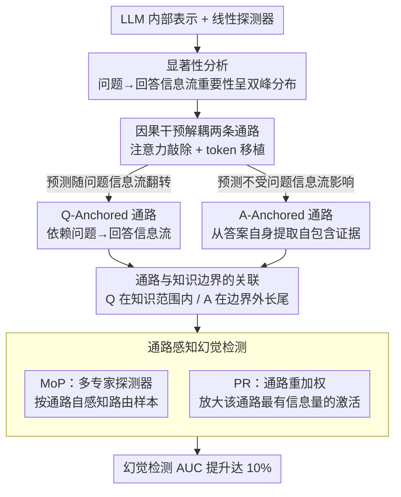

# Two Pathways to Truthfulness: On the Intrinsic Encoding of LLM Hallucinations

**会议**: ACL 2026  
**arXiv**: [2601.07422](https://arxiv.org/abs/2601.07422)  
**代码**: [https://github.com/RowanWenLuo/llm-truthfulness-pathways](https://github.com/RowanWenLuo/llm-truthfulness-pathways)  
**领域**: 幻觉检测  
**关键词**: 幻觉检测, 真实性编码, 注意力机制, 信息通路, 知识边界

## 一句话总结

本文发现 LLM 内部编码真实性信号存在两条不同的信息通路：Question-Anchored（依赖问题到回答的信息流）和 Answer-Anchored（从生成答案本身提取自包含证据），两者与知识边界紧密关联，并据此提出 Mixture-of-Probes 和 Pathway Reweighting 两种通路感知的幻觉检测方法，AUC 提升达 10%。

## 研究背景与动机

**领域现状**：LLM 常产生幻觉——看似合理但事实错误的输出。先前工作已证明 LLM 内部表示编码了丰富的真实性信号，可通过线性探测器检测幻觉。但这些信号的来源和工作机制仍不清楚。

**现有痛点**：现有内部探测方法将所有样本视为同质的，使用单一探测器检测所有幻觉。但不同样本的真实性信号可能通过不同机制产生，用统一方法处理会导致次优性能。

**核心矛盾**：显著性分析显示，问题到回答的信息流的重要性呈双峰分布——一部分样本高度依赖问题信息，另一部分几乎不依赖。这暗示存在两种本质不同的真实性编码机制。

**本文目标**：(1) 验证并解耦两条真实性通路；(2) 揭示它们的涌现特性；(3) 利用通路区分提升幻觉检测性能。

**切入角度**：通过注意力敲除（attention knockout）和 token 移植（token patching）两种因果干预实验来解耦和验证两条通路。

**核心 idea**：真实性信号通过两条独立通路产生——Q-Anchored 依赖问题到回答的信息流（适用于模型知识范围内的事实），A-Anchored 从生成文本本身提取自包含证据（适用于知识边界外的长尾事实）。

## 方法详解

### 整体框架

这篇论文想搞清楚一件被忽视的事：LLM 内部那个能用线性探测器读出来的"真实性信号"，到底从哪儿来、是不是只有一种来源。它分三步推进：先做显著性分析，发现"问题→回答"信息流的重要性在样本间呈**双峰分布**——有的样本高度依赖问题信息，有的几乎不依赖，由此提出存在两条真实性通路的假设；再用注意力敲除（attention knockout）和 token 移植（token patching）两种因果干预去验证、解耦这两条通路；最后把这个机制洞察落到实处，设计两种通路感知的幻觉检测方法。全程在 12 个模型（base/instruct/reasoning，1B 到 70B）和 4 个 QA 数据集上验证。

### 关键设计

**1. 因果干预解耦两条通路：如果真实性信号只有一种来源，掐断问题信息流应该一视同仁地影响所有样本**

要证明"两条通路"不是臆测，得有因果证据，作者用了两种互补的干预。其一是**注意力敲除**：对于在第 $k$ 层训练好的探测器，把第 1 到 $k$ 层里从精确问题 token 流向后续位置的注意力权重全部置零，相当于物理阻断"问题→回答"这条信息流，再看探测器的预测会不会翻转。结果样本干净利落地分成两组——一组预测概率大幅变化（说明它的真实性信号确实依赖问题信息流），定义为 Q-Anchored；另一组几乎纹丝不动（信号另有来源），定义为 A-Anchored。其二是**token 移植**做反向佐证：把一个样本的精确问题 token 替换成另一个样本的，等于往问题里注入幻觉线索，再看预测的翻转率——Q-Anchored 样本对这种注入显著更敏感，而 A-Anchored 样本几乎无动于衷，正好和敲除实验的分组对上。这种双峰式分叉跨所有模型和数据集稳定出现，而作为对照的随机 token 敲除则毫无影响，直接坐实了两种本质不同的编码机制确实并存。

**2. 通路与知识边界的关联：两条通路不是随机分工，而是按"模型知不知道答案"切换的**

光证明存在两条通路还不够，得知道它们各自管什么。作者用三个指标刻画知识边界——回答准确率、I-don't-know 率、以及问题涉及实体的流行度——再回看两组样本的画像：Q-Anchored 样本准确率显著更高、涉及的实体也更流行，落在模型知识范围之内；A-Anchored 样本准确率低、涉及长尾实体，落在知识边界之外。合起来给出一个清晰的认知解释：当模型确实掌握相关知识时，它主要靠"问题→回答"的信息流来判断真实性；当知识不足时，它转而从生成文本自身的内在统计模式里抠线索。这层关联正是后面设计针对性检测策略的依据。

**3. 通路感知幻觉检测（MoP + PR）：既然信号来源本质不同，就别再用一个探测器通吃**

现有内部探测方法把所有样本当同质的、用单一探测器检测全部幻觉，必然在两条通路上各有妥协。本文据此给出两条改进路线。其一是 **Mixture-of-Probes（MoP）**：训练多个专家探测器各自专精一种真实性编码机制，再利用一个关键发现——模型的内部表示本身就带着足以区分两条通路的信息（线性分类准确率 >87%，即"通路自感知"能力）——据此把每个样本自动路由到合适的专家。其二是 **Pathway Reweighting（PR）**：先判断当前样本属于哪条通路，再选择性地增强该通路相关的内部信号、放大最有信息量的那些激活维度。两种方法在多个数据集和模型上都一致超过单探测器基线，AUC 提升最高达 10%。

### 损失函数 / 训练策略

探测器与通路分类器都是在模型原始内部表示上用二元交叉熵训练的线性分类器——通路分类器的高准确率本身就验证了"模型能自感知走的是哪条通路"这一前提。

## 实验关键数据

### 主实验

| 方法 | PopQA AUC | TriviaQA AUC | HotpotQA AUC | NQ AUC |
|--------|------|------|----------|------|
| 标准 Probing | 基线 | 基线 | 基线 | 基线 |
| MoP (本文) | +5-10% | +3-8% | +2-5% | +3-7% |
| PR (本文) | 类似提升 | 类似提升 | 类似提升 | 类似提升 |

### 消融实验

| 分析 | 结果 | 说明 |
|------|---------|------|
| 通路自感知准确率 | 75-93% | 模型能从原始表示区分两条通路 |
| Q-Anchored 准确率 | 显著高于 A-Anchored | 知识范围内事实用 Q-Anchored |
| 实体流行度 | Q-Anchored >> A-Anchored | Q-Anchored 涉及高频实体 |
| 随机 token 敲除 | 无显著影响 | 确认效果特异于精确问题 token |

### 关键发现

- **两条通路跨模型跨数据集稳健存在**：从 1B 到 70B，从 base 到 instruct 到 reasoning 模型，双峰模式在所有 12 个模型和 4 个数据集上一致出现。
- **知识边界决定通路选择**：模型"知道答案"时用 Q-Anchored（通过问题理解来判断真实性），"不知道答案"时用 A-Anchored（通过答案本身的统计模式判断）。
- **模型具有通路自感知能力**：内部表示中包含足以区分两条通路的信息，分类准确率 75-93%，这是 MoP 方法的基础。
- **A-Anchored 的"自包含"特性**：移除问题后仅用答案做前向传播，A-Anchored 样本的预测几乎不变，而 Q-Anchored 样本大幅变化。

## 亮点与洞察

- **机制性理解的深度**：不仅证明了两条通路的存在，还揭示了它们与知识边界的关联，提供了认知层面的解释。
- **通路分离的实际应用**：从发现到应用的路径清晰——MoP 和 PR 直接利用机制洞察提升检测性能，不是单纯的分析论文。
- **实验规模**：12 个模型（含最新的 Qwen3）、4 个数据集的全面验证，可信度高。

## 局限与展望

- 目前聚焦于事实性 QA 场景，对开放式生成、多轮对话等场景的通路模式未知。
- 通路自感知准确率并非 100%，错误路由会影响 MoP 性能。
- 未探讨如何通过训练干预来增强特定通路的可靠性。
- 精确 token 的定义依赖语义框架理论，自动化提取可能有噪声。

## 相关工作与启发

- **vs Burns et al. (2023)**: CCS 发现了 LLM 中的线性真实性方向，但未区分信号来源。本文揭示了信号的双通路结构。
- **vs Orgad et al. (2025)**: 他们证明在精确答案 token 上探测效果最好，本文进一步解释了为什么——Q-Anchored 通路的信号集中在精确 token 的信息流中。

## 评分

- 新颖性: ⭐⭐⭐⭐⭐ 首次揭示 LLM 真实性编码的双通路结构，发现深刻
- 实验充分度: ⭐⭐⭐⭐⭐ 12个模型4个数据集，因果干预验证严谨
- 写作质量: ⭐⭐⭐⭐⭐ 从假设到验证到应用的叙事逻辑清晰
- 价值: ⭐⭐⭐⭐⭐ 对幻觉检测的机制理解和实用改进都有重要贡献

<!-- RELATED:START -->

## 相关论文

- [\[ACL 2026\] 为什么 LLM 在结构化知识上产生幻觉：推理过程的机制分析](why_llms_hallucinate_on_structured_knowledge_a_mechanistic_analysis_of_reasoning.md)
- [\[ICML 2026\] REALISTA: Realistic Latent Adversarial Attacks that Elicit LLM Hallucinations](../../ICML2026/hallucination/realista_realistic_latent_adversarial_attacks_that_elicit_llm_hallucinations.md)
- [\[ACL 2026\] The Reasoning Trap: How Enhancing LLM Reasoning Amplifies Tool Hallucination](the_reasoning_trap_how_enhancing_llm_reasoning_amplifies_tool_hallucination.md)
- [\[ACL 2025\] HALoGEN: Fantastic LLM Hallucinations and Where to Find Them](../../ACL2025/hallucination/halogen_hallucinations.md)
- [\[ACL 2026\] Logical Consistency as a Bridge: Improving LLM Hallucination Detection via Label Constraint Modeling between Responses and Self-Judgments](logical_consistency_as_a_bridge_improving_llm_hallucination_detection_via_label_.md)

<!-- RELATED:END -->
