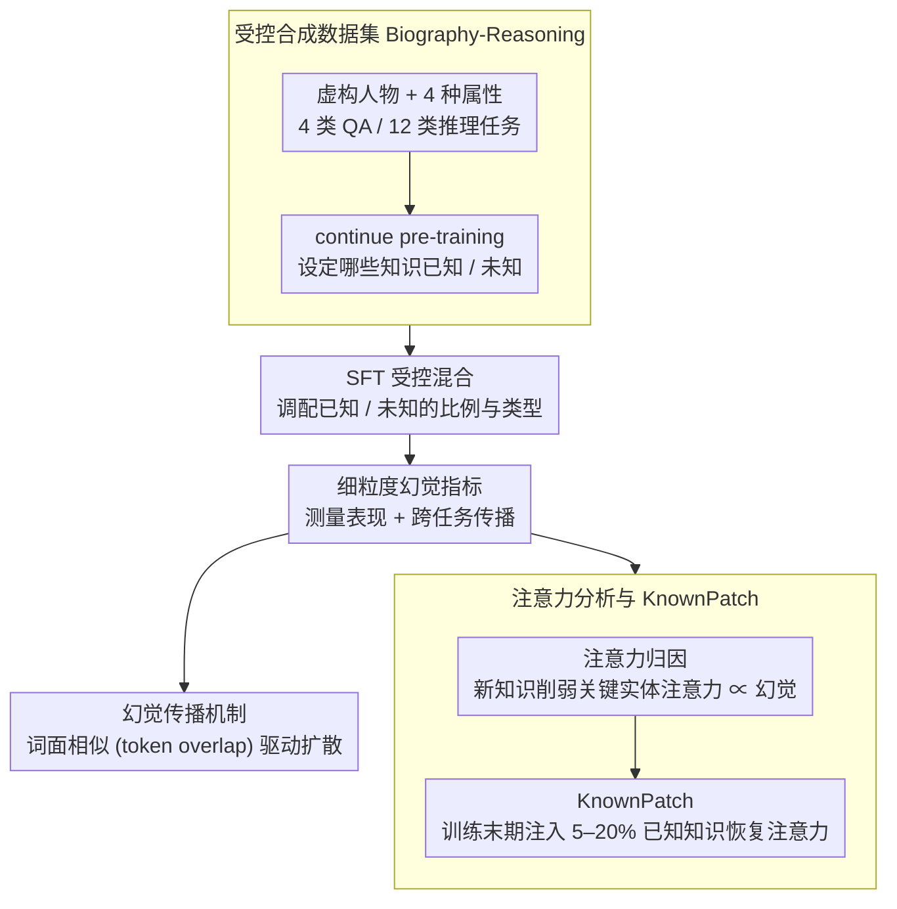

# Understanding New-Knowledge-Induced Factual Hallucinations in LLMs: Analysis and Interpretation

**会议**: ACL 2026 Findings  
**arXiv**: [2511.02626](https://arxiv.org/abs/2511.02626)  
**代码**: 无  
**领域**: 幻觉检测  
**关键词**: 事实幻觉, 新知识学习, 注意力机制, SFT, KnownPatch

## 一句话总结

本文通过受控合成数据集 Biography-Reasoning 系统分析了 SFT 阶段学习新知识导致的事实幻觉现象，发现幻觉的根本机制是模型对关键实体的注意力被削弱，并提出 KnownPatch——在训练末期注入少量已知知识来恢复注意力模式，有效缓解幻觉。

## 研究背景与动机

**领域现状**：LLM 在预训练中获取丰富的世界知识，在 SFT 阶段学习遵循指令。已有研究表明，SFT 中引入预训练未覆盖的新知识会增加事实幻觉风险——模型会在不相关上下文中错误生成新学到的信息。

**现有痛点**：先前工作主要关注混合知识类型的封闭式 QA 场景，对幻觉的具体表现形式和底层机制理解不足。具体来说：(1) 不同知识类型和任务类型中幻觉的传播规律不清楚；(2) 幻觉的注意力机制层面的原因未被揭示；(3) 缺乏轻量级的缓解方法。

**核心矛盾**：当某一类知识完全由新知识构成时，即使新知识总量很少，也会导致严重幻觉。这与先前"新知识比例越高幻觉越严重"的简单理解不同——关键因素是特定知识类型内部的陌生程度，而非全局新知识占比。

**本文目标**：(1) 构建受控数据集细粒度分析幻觉的表现；(2) 揭示幻觉的注意力机制；(3) 提出轻量级缓解方法。

**切入角度**：构建合成人物传记数据集，精确控制已知/未知知识的比例和类型，使用注意力分析追踪幻觉的产生和传播机制。

**核心 idea**：学习新知识削弱了模型对问题中关键实体的注意力，导致过度依赖上下文中的其他 token，进而产生幻觉。在训练末期注入已知知识可恢复注意力模式。

## 方法详解

### 整体框架

本文围绕一个受控合成数据集 Biography-Reasoning 展开：为一批虚构人物各配四种属性、四类 QA 和十二种推理任务，并通过 continue pre-training 把一部分知识变成模型"已知"、其余保持"未知"，从而在 SFT 时精确调配已知/未知知识的类型与比例。分析沿三个层次推进——先用细粒度指标刻画幻觉的表现与跨任务传播，再深入注意力层揭示其根因，最后据此提出轻量的 KnownPatch 缓解手段。一条核心线索贯穿始终：学习新知识会削弱模型对问题中关键实体的注意力，而恢复这一注意力即可缓解幻觉。

### 关键设计

**1. 受控合成数据集 Biography-Reasoning：把"已知"与"未知"干净分离**

真实语料里根本无从判断哪些知识模型本就掌握，这一混淆使幻觉的因果分析难以进行。本文为虚构人物定义四种属性（出生年、逝世年、专业、大学），每种属性即对应一类知识，再围绕它们构造四种 QA 任务和十二种推理任务（单步推理、比较推理、新型推理）。通过 continue pre-training 让一部分知识成为"已知"、其余保持"未知"，随后在 SFT 中按不同比例与类型混合训练。如此一来，已知/未知的边界完全可控，幻觉的成因得以从数据分布的混淆中干净地隔离出来。

**2. 注意力分析与 KnownPatch：把幻觉归因到注意力，再就地修复**

聚焦中后层（12–24 层）对关键实体（人名 token）的注意力变化，作者发现一条清晰规律：学习新知识会显著拉低对关键实体的注意力，且注意力下降的幅度与幻觉严重度高度吻合；反之，学习已知知识会增强这一注意力。既然幻觉源于注意力模式被破坏，那么修复模式本身就应能缓解幻觉——这正是 KnownPatch 的思路：在训练的最末阶段注入少量（5–20%）已知知识样本，借已知知识天然的"注意力增强"效应，把被新知识压垮的注意力重新拉回。它不需要事先过滤全部训练数据中的新知识，因而非常轻量。

**3. 幻觉传播机制：是词面相似而非语义相似在驱动扩散**

为弄清幻觉如何从训练任务蔓延到本不相关的测试任务，作者构造了两类对照变体——词汇相似但语义不同、以及语义相似但词汇不同。结果显示传播主要由词汇相似度（token overlap）驱动，而非语义相似度。机制上也讲得通：注意力权重在所有输入 token 上归一化，当关键实体的注意力被削弱，多出来的注意力便流向周围上下文 token，于是那些与训练中未知知识样本共享词汇的测试样本最容易"中招"。这也解释了含未知知识的推理任务为何会反向恶化 QA 测试——两者上下文的词面重叠更高。

### 损失函数 / 训练策略

标准 SFT 使用交叉熵损失。KnownPatch 在训练的最后阶段把已知知识样本注入训练数据（不是混洗，而是放在最后），利用训练顺序效应修复注意力。对照实验中还测试了添加 KL 散度约束（$\alpha=25$）来直接保持注意力模块输出的一致性。

## 实验关键数据

### 主实验

| 条件 | STQA 准确率下降 | Wiki 准确率下降 | 说明 |
|--------|------|------|------|
| 全部已知（基线） | 0% | 0% | 无幻觉 |
| 一种类型全部未知 | >50% | 显著下降 | 严重幻觉 |
| KeepKnown 50% | 中等下降 | 中等下降 | 保留已知缓解幻觉 |
| RemoveKnown 5% | 严重下降 | 严重下降 | 全未知类型极其有害 |

### 消融实验

| 配置 | STQA | Wiki | 说明 |
|------|---------|------|------|
| KnownPatch 5% | 显著恢复 | 显著恢复 | 仅5%已知注入就有效 |
| KnownPatch 20% | 接近基线 | 略超基线 | 接近上界 |
| Shuffled 20% | 中等恢复 | 中等恢复 | 混洗效果不如末期注入 |
| KL 约束 | 部分缓解 | 部分缓解 | 直接约束注意力也有效但有副作用 |

### 关键发现

- **特定类型的陌生度比全局比例更重要**：即使新知识总量很少，只要某一知识类型全部由未知知识构成（RemoveKnown），就会导致极其严重的幻觉。KeepKnown 即使替换 50% 也远好于 RemoveKnown 替换 5%。
- **幻觉跨类型传播**：学习一种类型的新知识不仅导致同类型 QA 幻觉（STQA 下降 >50%），还传播到不同类型的 QA（DTQA 下降 ~5%）和 OOD Wiki 测试集。
- **推理任务到 QA 的逆向传播**：学习含未知知识的推理任务，QA 测试集的幻觉竟比其他推理测试集更严重，因为 QA 上下文与推理轨迹有更高的词汇重叠。
- **注意力与幻觉高度相关**：未知知识比例越高，关键实体注意力越低，幻觉越严重。两者的相关曲线几乎完美对应。
- **KnownPatch 的非重放性质**：即使注入的已知知识不覆盖所有未知知识类型，仍能缓解未覆盖类型的幻觉，说明 KnownPatch 通过恢复注意力模式而非知识重放起作用。

## 亮点与洞察

- **"特定类型全未知"比"全局比例高"更危险**：这一发现颠覆了先前"新知识比例越高越危险"的简单理解，对实际 SFT 数据构建有直接指导意义——应确保每种知识类型中都保留一些模型已知的样本。
- **词汇相似度驱动幻觉传播**：这一发现解释了为什么看似无关的任务也会受到幻觉影响——只要它们与训练中含新知识的样本共享足够多的词汇 token。
- **KnownPatch 的轻量性**：仅在训练末期注入 5% 的已知知识就能显著缓解幻觉，不需要对全部训练数据进行昂贵的已知/未知分类。

## 局限与展望

- 实验主要在 Qwen2.5-1.5B 上进行，虽然附录中验证了在 Llama3.2-1B、Qwen3-8B 和 Qwen2.5-32B 上的一致性。
- 使用合成数据集，真实世界知识的复杂性和分布可能与合成设定不同。
- KnownPatch 需要获取已知知识样本，在实际中判断知识是否已知仍是开放问题。
- 未探讨非事实性幻觉（如逻辑错误、格式错误）的机制。

## 相关工作与启发

- **vs Gekhman et al. (2024)**: 他们发现新知识比例越高幻觉越严重，但使用混合知识类型设置。本文通过控制知识类型揭示了更细粒度的规律——类型内部的陌生程度才是关键。
- **vs Sun et al. (2025)**: 他们从 token 概率角度分析新知识过度泛化，本文从注意力机制角度提供了互补的解释。

## 评分

- 新颖性: ⭐⭐⭐⭐ 受控实验设计精巧，"类型内陌生度"的发现有新意
- 实验充分度: ⭐⭐⭐⭐⭐ 多维度消融、多模型验证、注意力分析、传播机制分析，极其充分
- 写作质量: ⭐⭐⭐⭐⭐ 逻辑链从现象到机制到缓解方法非常清晰
- 价值: ⭐⭐⭐⭐⭐ 对理解和缓解 SFT 阶段幻觉有重要的实践指导意义

<!-- RELATED:START -->

## 相关论文

- [\[ACL 2026\] Rethinking Evaluation for LLM Hallucination Detection: A Desiderata, A New RAG-based Benchmark, New Insights](rethinking_evaluation_for_llm_hallucination_detection_a_desiderata_a_new_rag-bas.md)
- [\[ACL 2026\] Mechanisms of Prompt-Induced Hallucination in Vision–Language Models](mechanisms_of_prompt-induced_hallucination_in_vision-language_models.md)
- [\[ACL 2026\] Stable-RAG: Mitigating Retrieval-Permutation-Induced Hallucinations in Retrieval-Augmented Generation](stable-rag_mitigating_retrieval-permutation-induced_hallucinations_in_retrieval-.md)
- [\[ACL 2026\] MeasHalu: Mitigation of Scientific Measurement Hallucinations for LLMs](meashalu_mitigation_of_scientific_measurement_hallucinations_for_large_language_.md)
- [\[CVPR 2026\] Understanding and Mitigating Hallucinations in Multimodal Chain-of-Thought Models](../../CVPR2026/hallucination/understanding_and_mitigating_hallucinations_in_multimodal_chain-of-thought_model.md)

<!-- RELATED:END -->
