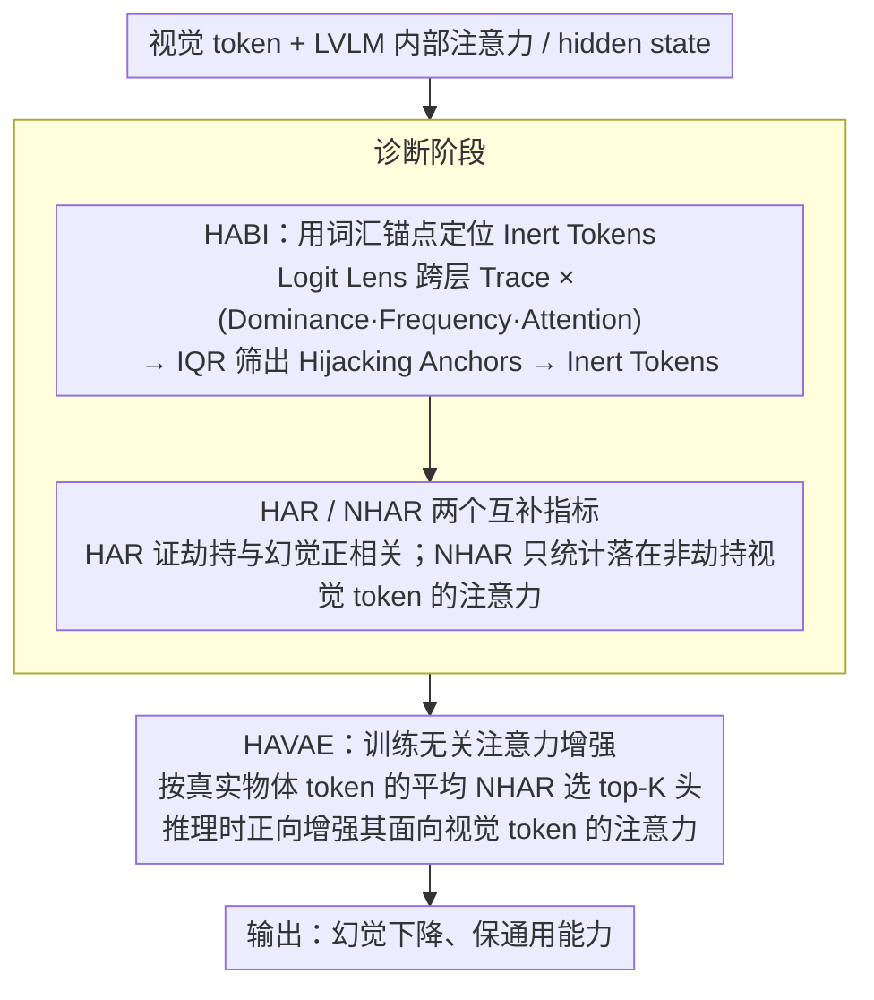

# Vocabulary Hijacking in LVLMs: Unveiling Critical Attention Heads by Excluding Inert Tokens to Mitigate Hallucination

**会议**: ACL2026  
**arXiv**: [2605.10622](https://arxiv.org/abs/2605.10622)  
**代码**: https://github.com/lab-klc/HAVAE  
**领域**: 幻觉检测  
**关键词**: LVLM幻觉, 注意力头解释, Logit Lens, Vocabulary Hijacking, 训练无关干预

## 一句话总结
本文发现 LVLM 中部分无效视觉 token 会稳定解码到一组无关词并劫持注意力，进而提出 HABI 定位这些 token、用 NHAR 找到可靠视觉头，再通过 HAVAE 在推理时增强这些头以降低幻觉。

## 研究背景与动机
**领域现状**：多模态大模型的幻觉缓解方法常围绕“让模型多看图”展开，例如对视觉注意力做干预、使用对比解码、做 activation steering，或在生成时增强图像 token 的影响。近期很多分析已经指出，幻觉和视觉 token 注意力不足或注意力异常有关。

**现有痛点**：问题不在于“是否应该干预注意力”，而在于“应该干预哪些注意力头、哪些视觉 token”。如果只增强总视觉注意力，很容易把注意力推向背景、冗余 patch 或 attention sink；如果用启发式挑头，又难以解释为什么这些头和事实 grounding 有关。

**核心矛盾**：LVLM 的视觉注意力并不天然等价于有效视觉证据。一些 token 得到大量注意力，却几乎不携带目标物体信息，反而把生成引向固定的、无意义的词汇锚点。现有方法缺少机制级诊断，因此可能同时放大有用注意力和噪声注意力。

**本文目标**：作者试图回答三个问题：视觉注意力异常的内部表征模式是什么；这些异常 token 如何与幻觉相关；能否不用训练、只在推理阶段选择并增强真正可靠的视觉注意力头。

**切入角度**：论文用 Logit Lens 观察视觉 token 在不同层的 hidden state 被投影到词表空间后“像什么词”。作者发现某些高注意力视觉 token 的跨层 trace 会反复落在固定无关词上，这不是普通背景 token，而是一种语义坍缩式的注意力劫持。

**核心 idea**：先识别会被固定词汇锚点劫持的 Inert Tokens，再排除这些 token 来寻找真正面向有效视觉内容的关键注意力头。

## 方法详解

### 整体框架
论文的方法链条分为“诊断”和“干预”两部分。诊断阶段先在 COCO 2014 validation 的 500 张图上，让 LLaVA-1.5、Shikra、MiniGPT-4、Qwen2-VL 等模型生成描述，并用 COCO 标注区分真实物体和幻觉物体。随后作者通过 Logit Lens 追踪视觉 token 在层间被解读成哪些词，定义 Vocabulary Hijacking、Hijacking Anchors 和 Inert Tokens。

在此基础上，论文构造两个注意力指标。HAR 衡量关键视觉头有多少注意力落在 Inert Tokens 上，用来证明 hijacking 与 hallucination 正相关；NHAR 则反过来只统计落在非 Inert 视觉 token 上的注意力，用来选出更可靠的 factual grounding heads。

干预阶段提出 HAVAE。它不更新模型参数，也不引入额外模型，只在推理时对 NHAR 排名前 $K$ 的注意力头增强其面向视觉 token 的注意力。这样做的目标不是盲目提高所有视觉注意力，而是增强那些已经被诊断为“关注非劫持视觉内容”的头。

### 关键设计

**1. HABI：用词汇锚点定位 Inert Tokens**

普通的 attention sink 分析只能告诉你"某些视觉 token 吸走了大量注意力"，却没解释这些 token 内部表征到底在做什么，因此无法区分它们是有用的视觉证据还是噪声。HABI 把注意力异常和词表空间里的语义坍缩联系起来：对每个视觉 token $v_i$，用 Logit Lens 把它在各层的 hidden state 投影到词表，得到一条跨层词序列 Trace；若某个 token 的 Trace 被同一个固定 Anchor 反复支配，且这个 Anchor 在全局上又频繁出现在高注意力 token 里，就给它高 hijacking 分数。具体把 Dominance（单 token 是否跨层僵化）、Frequency（某词是否系统性出现）和 Attention（是否真的影响生成）三个维度相乘得到 $S_{hijack}(v_i)$，再在词表级用 IQR outlier 阈值筛出 Hijacking Anchors。三维相乘能滤掉大量偶然噪声，比单纯按 attention magnitude 找背景 token 更具体、也更可解释。

**2. HAR 与 NHAR：把"证明劫持有害"和"挑选可靠头"两件事分开**

高视觉注意力本身既可能是好信号也可能是坏信号，关键看它落到哪里，所以需要两个互补指标。HAR 计算某个头落在 Inert Tokens 上的注意力占全部视觉注意力的比例，实验中幻觉 token 往往对应更高的 HAR，由此证明 hijacking 与 hallucination 正相关。NHAR 则反过来，只累加落在非 Inert 视觉 token 上的注意力，相当于把视觉注意力预算里被劫持的那部分剔除，只保留面向有效视觉内容的密度。NHAR 的价值在于把头选择标准从"看图很多"改成"看有效图像区域很多"，为后续推理时增强哪些头提供了一个可解释的依据，而不是凭启发式拍脑袋。

**3. HAVAE：训练无关的注意力增强**

直接惩罚或清零 Inert Tokens 反而会破坏生成，因为这些 token 可能承担某种残余路由或占位功能——消融里 $\beta=0.6$ 的负向压制就让 CHAIR 恶化了。HAVAE 因此选择正向增强而非负向压制：先按真实物体 token 上的平均 NHAR 选出 top-$K$ 目标头 $H_{target}$，推理时只对这些头面向视觉 token 的注意力加上一个层内平均注意力幅度项，增强强度由 $\alpha$ 控制（Qwen2-VL 用 $K=300$，其余模型多用 $K=450$；长文本场景把 $\alpha$ 从默认 0.1 调到 0.6 或 0.7）。它不更新任何参数、不引入额外模型，只增强那些已被 NHAR 诊断为"关注非劫持视觉内容"的头，因此既能用于权重不可训练的场景，又比盲目抬高所有视觉注意力更稳。

### 损失函数 / 训练策略
本文没有训练损失，因为 HAVAE 是 training-free 推理干预。需要的离线步骤是用少量图像统计 Hijacking Anchors、Inert Tokens 和 NHAR 排名；推理阶段只修改选中注意力头的注意力权重。这个设计让它能用于闭源权重不可训练的场景，但仍要求能够访问模型内部注意力。

## 实验关键数据

### 主实验
主实验在 CHAIR、POPE、POPE-Chat、AMBER、MME 等基准上评估 hallucination 与通用能力，并覆盖 LLaVA-1.5 7B/13B、MiniGPT-4 7B、Shikra 7B、Qwen2-VL 7B。

| 模型 | 方法 | CHAIRs ↓ | CHAIRi ↓ | POPE Acc ↑ | POPE F1 ↑ | POPE-Chat Acc ↑ | POPE-Chat F1 ↑ | 关键结论 |
|------|------|----------|----------|------------|-----------|-----------------|----------------|----------|
| LLaVA-1.5-7B | Greedy | 48.2 | 14.2 | 84.8 | 85.5 | 85.5 | 83.4 | 原始模型幻觉明显 |
| LLaVA-1.5-7B | PAI | 23.8 | 6.2 | 85.9 | 86.0 | 85.5 | 83.4 | 注意力干预有效但不最优 |
| LLaVA-1.5-7B | HAVAE | 18.2 | 3.8 | 86.2 | 86.3 | 88.0 | 87.0 | CHAIRi 比可靠最强基线降 38.7% |
| MiniGPT-4-7B | HAVAE | 21.8 | 6.9 | 76.9 | 77.6 | 80.2 | 80.2 | 小模型上仍有提升 |
| Shikra-7B | HAVAE | 15.8 | 5.0 | 81.6 | 82.1 | 76.7 | 78.6 | CHAIRi 比可靠最强基线降 46.2% |
| LLaVA-1.5-13B | HAVAE | 21.8 | 5.0 | 82.5 | 84.7 | 87.9 | 86.6 | 13B 规模仍可扩展 |

### 消融实验
论文的消融重点是证明：不能只按总视觉注意力选头，必须排除 Inert Tokens；也不能直接惩罚 Inert Tokens，正向增强更可靠。

| 配置 | CHAIRs ↓ | CHAIRi ↓ | POPE Acc ↑ | POPE F1 ↑ | MME Per ↑ | MME Cog ↑ | 说明 |
|------|----------|----------|------------|-----------|-----------|-----------|------|
| Max Attention 选头 | 7.8 | 4.4 | 85.9 | 85.6 | 1399.0 | 277.0 | 幻觉指标低但 F1 和 MME 明显受损，说明高注意力头不一定可靠 |
| HAVAE / NHAR 选头 | 18.2 | 3.8 | 86.2 | 86.3 | 1483.9 | 327.9 | 更好平衡幻觉抑制和通用能力 |
| 样本数 10 | 18.8 | 3.7 | 86.1 | 86.2 | 未列 | 未列 | 很少样本已有可用估计 |
| 样本数 500 | 18.2 | 3.7 | 86.1 | 86.2 | 未列 | 未列 | 指标稳定，论文采用 500 |
| 惩罚系数 $\beta=0.0$ | 18.2 | 3.7 | 86.1 | 86.2 | 未列 | 未列 | 标准 HAVAE |
| 惩罚系数 $\beta=0.6$ | 19.8 | 4.7 | 86.1 | 86.2 | 未列 | 未列 | 直接惩罚 Inert Tokens 反而恶化 CHAIR |

### 关键发现
- Vocabulary Hijacking 不是孤立于某个模型的异常。作者在 LLaVA-1.5、MiniGPT-4、Shikra、Qwen2-VL 中都观察到 hijacking score 长尾分布和 salient token 的 hijacking ratio 双峰分布。
- 幻觉 token 的 HAR 明显更高，而真实物体 token 更集中在高 NHAR 区域，说明“被劫持的视觉注意力”与“可靠视觉 grounding”在统计上可区分。
- MME 上 HAVAE 没有破坏通用能力：例如 LLaVA-1.5-7B perception 从 1472.5 提升到 1483.9，cognition 从 322.5 提升到 327.9；Shikra cognition 从 250.4 提升到 272.5。
- Qwen2-VL 上也有同向收益：CHAIRs 从 27.6 降到 22.8，CHAIRi 从 8.8 降到 6.2，MME All 从 2268.4 提升到 2290.2。
- 阈值敏感性较低。$\tau_r$ 和 $\tau_s$ 在 0.8 到 1.2 倍范围内扰动，CHAIR 和 POPE 指标变化都较小，说明 HABI 不是靠极窄超参窗口工作的。

## 亮点与洞察
- 论文最有意思的地方是把 hallucination 从输出错误追到词表空间中的固定锚点。它不是泛泛地说“注意力错了”，而是给出一条内部机制链：视觉 token trace 坍缩到 Hijacking Anchors，吸走头的注意力，关键头 grounding 下降，最后生成幻觉物体。
- HABI 的设计很有解释性。Dominance 看单个 token 是否跨层僵化，Frequency 看某个词是否系统性出现，Attention 看它是否真的影响生成；三者相乘能过滤掉很多偶然噪声。
- NHAR 比“视觉注意力总量”更适合做头选择标准。这给多模态解释性一个启发：解释 attention 时不能只看图像 token 权重，还要先判断图像 token 本身是否有语义贡献。
- HAVAE 的正向增强策略很稳。作者的惩罚消融说明，异常 token 未必能简单清零；增强可靠通路往往比暴力压制异常通路更符合深层模型的路由结构。
- 这项工作对后续 mechanistic interpretability 有启发：可以把 Logit Lens、attention flow 和行为错误绑定起来，而不是只做静态可视化。

## 局限与展望
- 方法需要访问模型内部 hidden state、unembedding 和注意力权重，因此不适合只能调用黑盒 API 的闭源 LVLM。
- 机制起源还没有完全解释。作者推测 Vocabulary Hijacking 可能来自早期视觉语言对齐中的 shortcut，但没有通过训练过程追踪或可控预训练实验验证。
- 验证模型最大到 13B，Qwen2-VL 为 7B；更大规模模型、更新架构或视频 LVLM 是否有同样的 hijacking anchors 仍需系统检查。
- HABI 依赖 COCO 图像和物体标注构建真实/幻觉物体集合。虽然 AMBER 显示一定域外泛化，但对于医学影像、遥感、文档图像等领域，Inert Tokens 的分布可能不同。
- HAVAE 是推理时注意力修改，和 KV cache、高效推理框架、量化模型的兼容性还需要工程侧验证。

## 相关工作与启发
- **vs Visual Attention Sink**: VAS 关注空洞或背景 token 垄断注意力，本文进一步指出这些 token 的 hidden states 会稳定解码到固定无关词，即 Vocabulary Hijacking 给出了更细的词表空间机制。
- **vs PAI / Devils**: 这些方法也是训练无关注意力干预，但通常依赖更粗的视觉注意力启发式。HAVAE 的区别是先排除 Inert Tokens，再按 NHAR 选择关键头，减少增强噪声通路的风险。
- **vs VISTA / activation steering**: VISTA 通过激活方向影响生成，可以减少幻觉但可能影响通用能力。HAVAE 只增强选中特定头的视觉注意力，干预位置更局部、机制解释更清楚。
- **vs Logit Lens 分析工作**: 以往 Logit Lens 常用于观察表征如何从视觉到语义演化，本文把它用于定位异常 trace，并进一步把分析结果转化成可工作的推理干预。

## 评分
- 新颖性: ⭐⭐⭐⭐⭐ Vocabulary Hijacking 与 Hijacking Anchors 的机制刻画很新，且能转化为有效干预。
- 实验充分度: ⭐⭐⭐⭐☆ 覆盖多模型、多基准和多种消融，但更大模型与非 COCO 域仍有扩展空间。
- 写作质量: ⭐⭐⭐⭐☆ 诊断到干预的链条清楚，表格较多但支撑充分。
- 价值: ⭐⭐⭐⭐⭐ 对 LVLM 幻觉解释和训练无关修复都很有启发，尤其适合后续可解释性研究复用。

<!-- RELATED:START -->

## 相关论文

- [\[CVPR 2026\] Mitigating Object Hallucination in LVLMs via Attention Imbalance Rectification](../../CVPR2026/hallucination/mitigating_object_hallucinations_in_lvlms_via_attention_imbalance_rectification.md)
- [\[CVPR 2026\] Same Attention, Different Truths: Put Logit-Lens over Visual Attention to Detect and Mitigate LVLM Object Hallucination](../../CVPR2026/hallucination/same_attention_different_truths_put_logit-lens_over_visual_attention_to_detect_a.md)
- [\[AAAI 2026\] Causally-Grounded Dual-Path Attention Intervention for Object Hallucination Mitigation in LVLMs](../../AAAI2026/hallucination/causally-grounded_dual-path_attention_intervention_for_objec.md)
- [\[ACL 2025\] Mixture of Decoding: An Attention-Inspired Adaptive Decoding Strategy to Mitigate Hallucination in Multimodal LLMs](../../ACL2025/hallucination/mixture_of_decoding_an_attention-inspired_adaptive_decoding_strategy_to_mitigate.md)
- [\[ICML 2026\] Finding the Correct Visual Evidence Without Forgetting: Mitigating Hallucination in LVLMs via Inter-Layer Visual Attention Discrepancy](../../ICML2026/hallucination/finding_the_correct_visual_evidence_without_forgetting_mitigating_hallucination_.md)

<!-- RELATED:END -->
