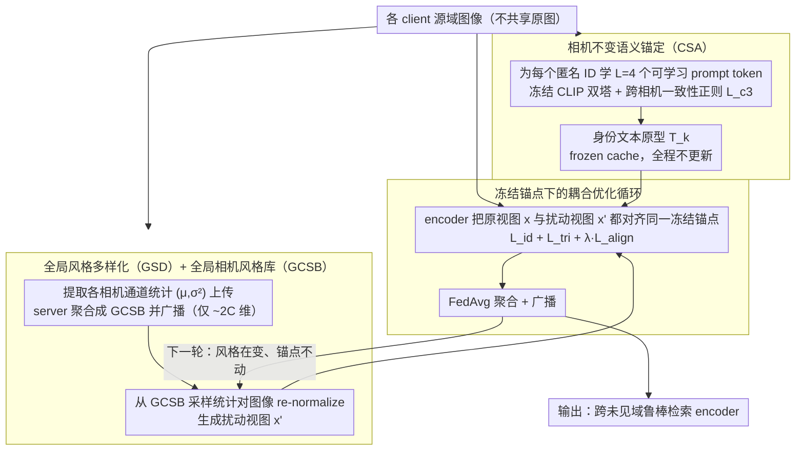

# CO-EVO: Co-evolving Semantic Anchoring and Style Diversification for Federated DG-ReID

**会议**: ACL 2026  
**arXiv**: [2604.26363](https://arxiv.org/abs/2604.26363)  
**代码**: https://github.com/NanYiyuzurn/ACL-LGPS-2026  
**领域**: 联邦学习 / 域泛化 / Person ReID  
**关键词**: 联邦域泛化, 行人重识别, CLIP 语义锚定, 风格多样化, 相机不变性

## 一句话总结
CO-EVO 针对联邦域泛化行人重识别（FedDG-ReID）中的"语义-风格冲突"，提出 CSA（相机不变语义锚定）学习冻结的身份级文本原型作为"引力中心"+ GSD（全局风格多样化）用轻量 GCSB（全局相机风格库）合成真实跨域扰动，二者耦合优化在 Market-1501/MSMT17/CUHK03 leave-one-out 上 ViT mAP 平均比 SOTA 提升 14 个点（34.1→48.1）。

## 研究背景与动机

**领域现状**：Person ReID 在真实部署中面临严重的跨相机域偏移；DG-ReID 试图从多源训练泛化到未见目标域；隐私需求推动 FedDG-ReID 范式——多客户端各自持有源域数据、不共享原始图像、联邦训练一个能泛化到未见目标域的检索模型。SOTA 方法如 DACS、SSCU 用 Style Transformation Model (STM) 做本地多样化。

**现有痛点**：(1) **Shortcut Learning**：本地优化缺乏全局语义参考，模型走捷径——利用背景纹理、相机色彩印记区分身份，本地表现稳定但跨联邦完全失败。(2) **VLM 难落地**：CLIP 等 VLM 有强语义先验，但 ReID 标签是匿名 ID 没有自然语言名称，且联邦传 LLM 通信代价巨大。(3) **风格扰动方法痛点**：STM 需要训练辅助生成网络，计算昂贵、联邦下不稳定，生成图像常出现 repetitive artifact 与过曝。

**核心矛盾**：**语义-风格冲突**——纯视觉监督会陷入域特定 shortcut；过强的风格增强又会破坏 identity-sensitive cue 如果没有 grounding 锚点；现有方法要么有 grounding 没多样化，要么有多样化没 grounding，无法同时兼顾。

**本文目标**：在严格的联邦设定（不共享原始数据、通信开销可控）下，**同时实现**(a) 稳定的全局语义参考（防止 shortcut learning），(b) 高质量的跨域风格多样化（提供视觉边界探索），并让二者耦合循环 reinforce 彼此。

**切入角度**：作者把 "language-guided semantic supervision" 引入 FedDG-ReID（首次），用 CLIP 学每个身份的 learnable prompt token 作为文本锚点；同时用统计量（通道 mean/var）共享相机风格而不传原始数据，避开 STM 的训练负担。

**核心 idea**：让 CSA 学到的身份文本原型作为"引力中心" $T_k$ 冻结缓存，而 GSD 通过通道统计 re-normalization 把图像变成多样风格视图 $x'$，强制 encoder 把原视图 $x$ 与扰动视图 $x'$ 都映射到同一锚点 $t_{y_i}$ 上——风格在变、锚点不动、表征被迫聚焦于身份解剖学特征。

## 方法详解

### 整体框架
CO-EVO 是一个两阶段联邦框架，目标是在不共享原始图像、通信开销可控的前提下，让全局图像 encoder 学到"风格在变、身份不变"的跨域鲁棒表征。Phase I 先在各 client 本地为每个身份学一组可学习 prompt token，冻结 CLIP 双塔得到纯净的身份文本原型并 frozen cache，同时把各相机的通道统计量上传 server 聚合成全局相机风格库 GCSB；随后的联邦循环里，client 端用 GSD 从 GCSB 采样统计量对图像做 re-normalization 生成扰动视图，强制 encoder 把原视图和扰动视图都对齐到同一个冻结锚点，本地训练后 FedAvg 聚合再广播。整条流程的核心是让"动态演化的风格输入"与"静止不动的语义锚点"耦合循环，输出一个可直接部署到未见目标域的检索 encoder。

### 关键设计

**1. 相机不变语义锚定（CSA）：为匿名 ID 学一个跨相机纯净的文本引力中心**

ReID 的身份是匿名编号、没有自然语言名称，纯视觉监督又会让模型走捷径——靠背景纹理、相机色彩印记区分身份，本地稳定却跨联邦完全失效。CSA 给每个身份 $y$ 引入 $L$ 个可学习 token 插入模板 "a photo of a [$X_1^y$]...[$X_L^y$] person"，冻结 CLIP 只优化 token，用双向对比损失对齐视觉与文本：$L_{i2t}(i) = -\log\frac{\exp(s(v_i, t_{y_i})/\tau)}{\sum_a \exp(s(v_i, t_a)/\tau)}$ 与对称的 $L_{t2i}(y)$。关键创新是加一项跨相机一致性正则 $L_{c3} = \sum_y \sum_{i,j \in P(y), c_i \ne c_j} \|s(v_i, t_y) - s(v_j, t_y)\|^2$，把"同一身份在不同相机下与文本的相似度应当一致"作为硬约束，逼迫 token 只编码身份不变特征而非相机印记，总损失 $L_{CSA} = L_{i2t} + L_{t2i} + \lambda_{c3} L_{c3}$（$\lambda_{c3}=0.1$）。原型 $T_k$ 在 Phase I 后 frozen cache、整个联邦循环不再更新——消融显示动态更新原型反而掉 3.3% mAP，因为动态原型会被本地相机噪声重新污染，只有冻结锚点才能持续担当稳定的"引力中心"；token 长度取 $L=4$ 最优，$L=1$ 太泛、$L\ge 8$ 过参化反而引入相机噪声。

**2. 全局风格多样化（GSD）+ 全局相机风格库（GCSB）：用通道统计共享真实跨域风格**

STM 类方法（DACS/SSCU）靠训练辅助生成网络做风格扰动，联邦下不稳定且常生成 repetitive artifact 与过曝。GSD 改用纯统计 re-normalization：通道一阶/二阶统计量主要捕获 illumination、color tone、texture 而保留语义结构，于是 Phase I 结束时每个 client $k$ 对每个相机 $c$ 提取 $(\mu_{k,c}, \sigma^2_{k,c}) = \mathrm{Stat}(\{x_i^k | c_i^k = c\})$ 上传，server 聚合成 GCSB $\mathcal{B} = \cup_k \cup_c \{(\mu_{k,c}, \sigma^2_{k,c})\}$ 广播。本地训练时从 $\mathcal{B}$ 采样 $(\mu_s, \sigma_s^2)$，对图像先标准化再重注入目标风格：$\hat{x} = \frac{x - \mu(x)}{\sqrt{\sigma^2(x) + \epsilon}}$，$x' = \hat{x} \odot \sqrt{\sigma_s^2} + \mu_s$，得到的扰动视图基于真实相机分布而非任意噪声（相机 ID 不可用时用 K-means 伪 group 替代）。"全局"库是关键——单 client 的 style 已被本地训练充分见过，必须跨 client 共享才能形成 unseen domain proxy（GSD-Global 42.4% vs GSD-Local 40.2% mAP on Market）；而共享的只是约 $2C$ 维（mean+var）统计而非图像，既最大化保护隐私又近乎零通信开销，GCSB 构造 4s/client、无可训练参数、占总训练时间 <0.1%，且对 30% 相机 ID 噪声/伪 group 都鲁棒。

**3. 冻结锚点下的耦合优化循环：把静态语义与动态风格在每一步绑定**

CSA 提供了 grounding、GSD 提供了 diversification，但二者必须在训练里耦合才能真正逼出不变性。每个 mini-batch 同时喂原视图 $x$ 与扰动视图 $x' \sim GSD(\mathcal{B})$，对两个视图都计算分类损失 $L_{id}$、triplet 损失 $L_{tri}$，以及关键的语义对齐损失 $L_{align}(i; \tilde{x}) = -\log\frac{\exp(s(v_i(\tilde{x}), t_{y_i})/\tau)}{\sum_{y\in Y_k} \exp(s(v_i(\tilde{x}), t_y)/\tau)}$，且 $x$ 和 $x'$ 都对齐到同一个冻结锚点 $t_{y_i}$，逼迫 encoder 把任意风格输入都映射回该身份的 anchor，总目标 $L_{loc} = \sum_{\tilde{x}\in\{x,x'\}}(L_{id} + L_{tri} + \lambda L_{align})$，本地训练 $E=1$ epoch 后 server 做 FedAvg。作者把这种"输入分布经 GSD 演化、encoder 参数在固定 anchor 引力下演化"的机制定义为 co-evolution——不是双向同步更新，而是动态视觉与静态语义的耦合。效果上它把 same-identity 平均 cosine 距离从 0.68（SSCU）降到 0.35（−48.5%）、different-identity 从 0.42 升到 0.78（+85.7%），决策边界完全恢复；消融显示 CSA 单独 +13.3、GSD 单独 +14.4，合用却 +17.0 mAP，呈非加性互补。

### 损失函数 / 训练策略
Phase I：$L_{CSA} = L_{i2t} + L_{t2i} + \lambda_{c3} L_{c3}$（120 rounds，$\lambda_{c3}=0.1$，$L=4$，$\tau=0.07$，CLIP ViT-B/16 frozen，只学 token）。Phase II/III：$L_{loc} = \sum_{\tilde{x}}(L_{id} + L_{tri} + \lambda L_{align})$（60 rounds，$E=1$，batch 64，SGD lr=1e-3，FedAvg 聚合）。

## 实验关键数据

### 主实验 Protocol I — Leave-One-Domain-Out（mAP / Rank-1 %，CUHK02/CUHK03/MSMT17/Market 各做 source 或 target）

| Method | MS+C2+C3→M | M+C2+C3→MS | MS+C2+M→C3 | Average mAP/R1 |
|--------|------------|------------|------------|-----------------|
| FedPav | 25.4 / 49.4 | 5.2 / 15.5 | 22.5 / 24.3 | 17.7 / 29.7 |
| MixStyle | 31.2 / 53.5 | 5.5 / 16.0 | 28.6 / 31.5 | 21.8 / 33.6 |
| SNR | 32.7 / 59.4 | 5.1 / 15.3 | 28.5 / 30.0 | 22.1 / 34.9 |
| DACS (RN50) | 36.3 / 61.2 | 10.4 / 27.5 | 30.7 / 34.1 | 25.8 / 40.9 |
| SSCU (RN50) | 39.5 / 66.4 | 11.9 / 32.3 | 32.8 / 34.1 | 28.1 / 44.3 |
| **CO-EVO (RN50)** | **42.4** / **71.2** | **12.9** / **33.7** | **34.9** / **37.1** | **30.1** / **47.3** |
| DACS (ViT) | 45.4 / 70.7 | 20.3 / 44.2 | 36.6 / 42.1 | 34.1 / 52.3 |
| **CO-EVO (ViT)** | **60.7** / **80.2** | **32.2** / **60.3** | **51.3** / **52.7** | **48.1** / **64.4** |

ViT backbone 上平均 mAP 比 DACS-ViT 提升 **+14.0**（34.1→48.1），R1 提升 **+12.1**（52.3→64.4），证明方法在更强 backbone 下增益不退反增。

### 消融与诊断实验

| 配置 | MS+C2+C3→M mAP/R1 | M+C2+C3→MS mAP/R1 | MS+C2+M→C3 mAP/R1 | 说明 |
|------|-------------------|-------------------|-------------------|------|
| Baseline (no CSA, no GSD) | 25.4 / 49.4 | 5.2 / 15.5 | 22.5 / 24.3 | FedPav |
| + CSA only | 38.7 / 66.7 | 9.1 / 30.7 | 33.8 / 35.2 | +13.3 mAP avg |
| + GSD only | 39.8 / 67.6 | 10.8 / 30.3 | 34.1 / 35.9 | +14.4 mAP avg |
| **+ CSA + GSD (full)** | **42.4** / **71.2** | **12.9** / **33.7** | **37.1** / **38.9** | **+17.0 mAP avg, 协同非加性** |
| CSA Dynamic (vs Static) | 39.1 / 67.8 | 10.4 / 30.1 | 34.2 / 35.6 | 动态更新原型 -3.3 mAP |
| GSD Local-only (vs Global) | 40.2 / 68.5 | 10.5 / 31.4 | 35.1 / 36.3 | 不共享 style -2.2 mAP |
| Random Stat noise | 39.1 / 67.2 | 9.7 / 30.9 | 34.5 / 35.6 | 任意扰动几乎无增益 |

### Metadata 鲁棒性 + 超参敏感度

| 设置 | MS+C2+C3→M | M+C2+C3→MS | MS+C2+M→C3 | 说明 |
|------|------------|------------|------------|------|
| Clean (full metadata) | 42.4 / 71.2 | 12.9 / 33.7 | 37.1 / 38.9 | 基准 |
| 30% Camera ID Noise | 40.4 / 68.7 | 11.7 / 32.4 | 34.6 / 36.2 | mild drop |
| K-means Pseudo-Groups (no metadata) | 41.1 / 69.8 | 12.2 / 33.1 | 35.8 / 37.5 | 仍超 SSCU clean |
| **超参 $L=4$ (best)** | 42.4 / 71.2 | 12.9 / 33.7 | 37.1 / 38.9 | 最优 token 长度 |
| $L=1$ | 40.8 / 69.4 | 10.3 / 29.5 | 35.5 / 36.8 | 表征不足 |
| $L=16$ | 41.5 / 70.2 | 11.5 / 31.6 | 36.2 / 37.7 | 过参化 overfit |
| **$\lambda_{c3}=0.1$ (best)** | 42.4 / 71.2 | 12.9 / 33.7 | 37.1 / 38.9 | 最优一致性权重 |
| $\lambda_{c3}=0$ | 41.2 / 69.8 | 11.5 / 31.8 | 35.8 / 37.5 | 无跨相机一致性 |

### 关键发现
- **CSA 与 GSD 强协同非加性**：单 +CSA +13.3 mAP、单 +GSD +14.4 mAP、合用 +17.0 mAP——证明两者解决不同问题（grounding vs diversification），缺一即语义-风格冲突无法解决。
- **静态锚定 > 动态锚定**：frozen 原型比动态更新 +3.3 mAP，验证了"animation center"的设计哲学——anchor 一旦再被本地训练污染就失效。
- **Global GCSB > Local stylization > Random noise**：共享统计是 GSD 的精华，本地 style 已被见过、随机扰动不真实，只有跨 client 真实统计才形成 unseen domain proxy。
- **鲁棒性**：30% camera ID noise 仅 -2 mAP；K-means 伪 group 仍超 SSCU 的 clean 基线——FedDG 现实部署对 metadata 不敏感。
- **决策边界恢复**：CSA 把 same-identity cosine distance 从 0.68→0.35 (-48.5%)、different-identity 从 0.42→0.78 (+85.7%)，t-SNE 上看是从混乱簇 → 紧凑可分簇。
- **ViT 增益更大**：在更强 backbone 上 CO-EVO 比 DACS 多领先 14 mAP，说明 method 上限远未触顶。

## 亮点与洞察
- **语义-风格冲突命名 + co-evolution 解决方案**：将 FedDG 中长期被分别研究的两个方向（domain-invariant feature vs style augmentation）的内在张力首次形式化，并用 "frozen anchor + dynamic style" 的耦合训练机制干净地解决——是一种可以推广到其他跨域任务（domain-generalized detection、cross-modal retrieval）的范式。
- **CLIP prompt-based anchoring for label-free domains**：解决了 ReID（以及任何 ID-based 任务）"标签无自然语言名称无法直接用 CLIP" 的痛点——通过 learnable prompt + cross-camera consistency 把匿名 ID 变成纯净文本锚点，方法可直接迁移到 face recognition、product retrieval 等。
- **GCSB 通过通道统计共享 style**：用 ~$2C$（mean+var）维向量替代图像/生成模型来共享 domain knowledge，既保护隐私又零通信开销，是联邦设计的优雅工程范例——可推广到联邦语义分割、联邦检测的 domain generalization。
- **Frozen anchor 哲学**：本工作明确论证 "在 federated 设定下，让锚点保持冻结比动态更新更稳"，这与一般强化学习/对比学习中"target network 慢更新"的直觉一致，但在 FedDG 语境下首次被实证 + 消融——给所有 federated representation learning 的 prototype-based 方法提供新视角。

## 局限与展望
- **作者承认**：(1) CSA 锚点只来自源域身份，对极端 occlusion / 低分辨率 / 完全 out-of-distribution 样本效果有限；(2) GCSB 用通道统计只 capture photometric 变化，对几何变化、复杂遮挡、背景结构变化建模能力差；(3) 强依赖 camera ID 或可分组 metadata；(4) 共享 statistics 虽轻量但没有 formal privacy guarantee (e.g., DP)。
- **额外局限**：(1) 论文虽然 framing 在 ACL 2026，但严格说是 CV 任务（无 NLP 内容），评审 fit 度可能受影响；(2) 只在 4 个 ReID benchmark 上评测，未测真实大规模监控数据；(3) ViT-B/16 backbone 在联邦下通信代价仍高，没有通信压缩分析；(4) 没有报告 inference 阶段计算/内存开销。
- **改进思路**：(1) 引入 spatial-aware augmentation（geometric perturbation、occlusion synthesis）补全风格之外的鲁棒性；(2) 整合 DP / secure aggregation 给出正式隐私保证；(3) 用 federated knowledge distillation 压缩 ViT；(4) 拓展到 cross-modal（如 sketch-ReID、text-ReID）联邦设定。

## 相关工作与启发
- **vs MixStyle / CrossStyle**：它们做单机风格扰动，CO-EVO 把 style template 提升到 federated global bank，并叠加 semantic anchor。
- **vs DACS / SSCU（FedDG-ReID SOTA）**：它们用 STM 训练生成器做 stylization，本文用 lightweight statistics 替代——既快又稳，且能配合 CSA 解决 grounding 问题。
- **vs CLIP-ReID / TF-CLIP**：它们用 CLIP prompt 学 identity-aware 表征但无 federated/cross-camera 考虑；本文是首个把 CLIP 引入 FedDG-ReID 并加 cross-camera consistency 损失的工作。
- **vs DiPrompT（FedDG general）**：DiPrompT 做 disentangled prompt tuning 但不解决 style 一面；本文用 coupled anchor+style 机制更适合 ReID 这种 identity 严格 + style 多变的任务。
- **vs MetaReg / Style Normalization & Restitution (SNR)**：传统 DG-ReID 方法不考虑联邦设定，无法处理 client heterogeneity；本文专为联邦设计。

## 评分
- 新颖性: ⭐⭐⭐⭐ "语义-风格冲突"诊断 + frozen anchor 耦合 dynamic style 范式，FedDG-ReID 中首次引入 language-guided supervision
- 实验充分度: ⭐⭐⭐⭐⭐ 3 protocols + 2 backbones + 5 baselines × 4 datasets + 完整 ablation + metadata robustness + 超参 grid + cosine 距离 + t-SNE
- 写作质量: ⭐⭐⭐⭐ 概念清晰（语义-风格冲突 / 引力中心 / co-evolution 类比）、pipeline 图解直观、算法伪代码完整；缺点是 ACL 投稿但纯 CV 任务，定位略奇怪
- 价值: ⭐⭐⭐⭐ 大幅 SOTA（ViT 上 +14 mAP），且 GCSB / frozen anchor 设计可推广到其他 FedDG 任务

<!-- RELATED:START -->

## 相关论文

- [\[ICCV 2025\] SemTalk: Holistic Co-speech Motion Generation with Frame-level Semantic Emphasis](../../ICCV2025/human_understanding/semtalk_holistic_co-speech_motion_generation_with_frame-level_semantic_emphasis.md)
- [\[ICCV 2025\] SemGes: Semantics-aware Co-Speech Gesture Generation using Semantic Coherence and Relevance Learning](../../ICCV2025/human_understanding/semges_semantics-aware_co-speech_gesture_generation_using_semantic_coherence_and.md)
- [\[CVPR 2026\] LiveGesture: Streamable Co-Speech Gesture Generation Model](../../CVPR2026/human_understanding/livegesture_streamable_co-speech_gesture_generation_model.md)
- [\[CVPR 2026\] Talking Together: Synthesizing Co-Located 3D Conversations from Audio](../../CVPR2026/human_understanding/talking_together_synthesizing_co-located_3d_conversations_from_audio.md)
- [\[AAAI 2026\] Streaming Generation of Co-Speech Gestures via Accelerated Rolling Diffusion](../../AAAI2026/human_understanding/streaming_generation_of_co-speech_gestures_via_accelerated_rolling_diffusion.md)

<!-- RELATED:END -->
