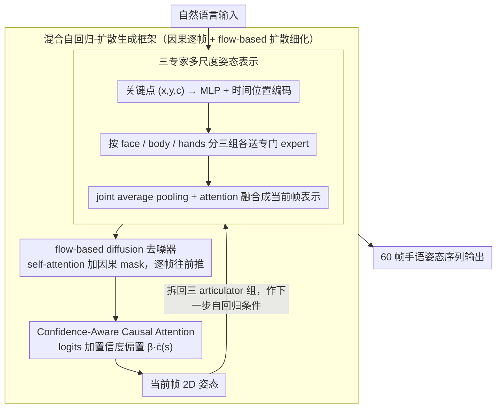

# Hybrid Autoregressive-Diffusion Model for Real-Time Sign Language Production

**会议**: ACL2026  
**arXiv**: [2507.09105](https://arxiv.org/abs/2507.09105)  
**代码**: 未在缓存中找到  
**领域**: 人体理解 / 手语生成 / 动作生成  
**关键词**: Sign Language Production, autoregressive diffusion, HybridSign, confidence-aware attention, low latency  

## 一句话总结
这篇论文提出 HybridSign，把自回归逐帧生成和 flow-based diffusion 细化结合起来，并加入三专家多尺度姿态表示与 confidence-aware causal attention，在 PHOENIX14T 和 How2Sign 上取得更好的手语生成质量-延迟折中。

## 研究背景与动机
**领域现状**：Sign Language Production (SLP) 要从语言输入生成连续手语姿态，必须同时建模身体、双手、面部和时间动态。传统自回归模型擅长保留时间因果性，扩散模型则擅长生成高质量姿态。

**现有痛点**：自回归方法推理快，但每一步都依赖前一步预测，容易出现 exposure bias 和误差累积；扩散方法通过迭代去噪提高质量，但采样慢，交互式手语系统很难等完整序列生成后再显示。

**核心矛盾**：实际应用需要低延迟地先输出第一帧并持续生成，同时又要保留扩散模型的局部姿态质量。单纯自回归和单纯扩散都无法同时满足质量、时间一致性和响应速度。

**本文目标**：构建一个低延迟 SLP 模型，在 60 帧协议下显著降低 time-to-first-frame，同时保持或提升 BLEU/ROUGE、WER、DTW、FID 等质量指标。

**切入角度**：作者不是把扩散模型作为整段离线生成器，而是把 flow-based diffusion 融入自回归因果框架，使每一帧可以连续生成并被细化。

**核心 idea**：用自回归路径负责因果帧生成，用 flow-based diffusion 负责质量细化，再用 face/body/hands 三专家和置信度注意力解决手语中细粒度 articulator 和 noisy 2D pose 的问题。

## 方法详解
HybridSign 的方法可以概括为“逐帧因果生成 + 局部扩散细化 + 多尺度姿态专家”。它特别强调低延迟：论文中的 real-time 指的是快速输出第一帧并持续生成，而不是瞬时完成整段视频合成。

### 整体框架

输入是一句自然语言，输出是 60 帧左右的 2D 手语姿态序列。模型先通过 Multi-Scale Pose Representation 模块分别生成面部、身体和手部 articulators，再融合成完整姿态帧。生成的帧会被拆解回三个 articulator 组，作为下一时间步的自回归条件。

在每个时间步内部，三个 expert 可以并行运行；时间步之间保留因果依赖。作者采用 self-forcing 策略：训练和推理时都把模型自己的上一帧预测作为下一步输入，而不是训练时喂 ground truth，从而减轻训练/推理分布不一致。

### 关键设计

**1. 混合自回归-扩散生成框架：让系统先快速吐出首帧，再逐帧细化质量**

纯扩散模式质量高但首帧慢，纯自回归模式快但质量掉，HybridSign 的做法是把二者缝在一条因果路径上。具体而言，它在 diffusion denoiser 的 self-attention 里加一道 causal mask，让位置 $i$ 只能关注 $j \le i$ 的当前或历史 token，于是去噪过程本身也变成因果的、可以逐帧往前推；同时用 flow-based diffusion 学习从噪声到目标姿态的连续变换，替代传统 DDPM 那种多步采样，把每帧的细化成本压下来。

这样自回归路径负责把帧一帧一帧地往外吐、保证低首帧延迟和时间连续性，diffusion 则在每一帧内部做质量细化——既不像纯扩散那样要等整段去噪完才出第一帧，也不像纯自回归那样牺牲局部姿态质量。

**2. 三专家多尺度姿态表示：按 face/body/hands 分尺度建模，再融合成全身姿态**

手语不是全身均匀运动：面部的非手势信号、身体姿态和双手轨迹各有各的尺度，硬塞进一个网络容易互相干扰。模型先把每个关键点的 $(x,y,c)$ 过 MLP 和时间位置编码，再按 face / body / hands 分成三组各自送进专门的 expert；每个 expert 的输出做 joint average pooling 后，用 attention-based fusion 合成当前帧的融合表示。

之所以是"三"专家而不是把左右手也拆开成四专家，是因为双手在手语里是强耦合子系统——左右手的相对距离、对称/反对称、同步关系都很重要。把它们拆成两个独立 expert，反而会把这些关系重建的活全压到 fusion 阶段，消融里 4 专家明显不如 3 专家正印证了这点。

**3. Confidence-Aware Causal Attention：让注意力显式感知关键点可靠性**

输入是上游姿态估计器给的 2D pose，遮挡和低置信度点不可避免，错误关键点一旦被信任就会在后续帧里越传越歪。这个设计直接在 causal attention 的 logits 上加一个置信度偏置，相当于把 attention score 改成原始分数再加 $\beta \cdot \bar{c}(s)$，其中 $\bar{c}(s)$ 是第 $s$ 帧关键点置信度的均值、$\beta$ 是可学习标量。

于是高置信度的帧天然获得更高的注意力权重，低置信度的噪声帧被压低影响。代价几乎为零——置信度本就来自上游估计器，无需额外标注——却能明显抑制错误关键点的跨帧传播，消融里它相比普通 causal attention 把 DTW 从 5.50 拉到 3.89。

### 损失函数 / 训练策略

训练目标由三部分组成。Joint loss 用 L1 约束预测关节位置；Bone loss 约束骨骼方向和运动学一致性；Soft-DTW loss 对齐预测序列和真实序列，缓解长时序误差累积。总损失使用 inverse EMA 动态权重：对每个 loss 维护指数滑动平均，权重与该平均值加小常数后的倒数成比例，最终加权得到 $L_total$。

实验使用 PHOENIX14T 和 How2Sign。PHOENIX14T 包含 8,257 个句子级样本和 2,887 个德语词；How2Sign 是超过 80 小时的美国手语多模态数据。评价使用预训练 SLT 模型把生成姿态反译回文本，再计算 BLEU、ROUGE、WER，并用 DTW/FID 衡量运动质量和时间对齐。

## 实验关键数据

### 主实验

| 方法 | PHOENIX14T TEST B1 | B4 | ROUGE | WER | DTW | FID |
|------|--------------------|----|-------|-----|-----|-----|
| PT | 13.35 | 4.31 | 13.17 | 96.50 | 未报告 | 未报告 |
| G2P-DDM | 16.11 | 7.50 | 未报告 | 77.26 | 未报告 | 未报告 |
| GCDM | 22.03 | 7.91 | 23.20 | 81.94 | 11.10 | 49.22 |
| GEN-OBT | 23.08 | 8.01 | 23.49 | 81.78 | 未报告 | 未报告 |
| Sign-IDD | 24.80 | 9.08 | 26.58 | 76.66 | 6.20 | 47.19 |
| HybridSign | 25.77 | 10.03 | 27.97 | 75.02 | 4.96 | 45.50 |
| Ground Truth | 29.76 | 11.93 | 28.98 | 71.94 | 0.00 | 0.00 |

| 方法 | How2Sign TEST B1 | B4 | ROUGE | WER | DTW | FID |
|------|-------------------|----|-------|-----|-----|-----|
| PT | 14.05 | 4.12 | 8.42 | 96.47 | 10.18 | 54.57 |
| G2P-DDM | 19.48 | 5.12 | 12.21 | 89.58 | 7.97 | 49.83 |
| GCDM | 25.91 | 5.57 | 15.21 | 91.43 | 6.13 | 45.71 |
| GEN-OBT | 27.82 | 5.92 | 15.88 | 90.63 | 6.87 | 47.28 |
| Sign-IDD | 28.90 | 6.06 | 16.21 | 89.98 | 4.86 | 39.02 |
| HybridSign | 30.12 | 6.48 | 18.02 | 88.30 | 3.89 | 37.10 |
| Ground Truth | 34.01 | 8.03 | 21.87 | 81.94 | 0.00 | 0.00 |

HybridSign 在两套数据集上都给出最强的整体质量-效率折中。How2Sign test split 上，HybridSign 达到 B1/B4 为 30.12/6.48，DTW 为 3.89，FID 为 37.10。

### 消融实验

| 方法 | Latency (s) | Throughput (FPS) | 说明 |
|------|-------------|------------------|------|
| GCDM | 52.18 | 1.15 | 扩散式基线，首帧慢 |
| Sign-IDD | 40.31 | 1.49 | 扩散式基线 |
| G2P-DDM | 25.78 | 2.33 | 扩散式基线 |
| HybridSign | 5.90 | 10.17 | 首帧延迟最低、吞吐最高 |

| 生成模式 | B1 | B4 | DTW | Latency | Throughput | 结论 |
|------|----|----|-----|---------|------------|------|
| Diffusion Mode | 30.25 | 6.55 | 8.06 | 32.89 | 1.83 | 质量高但慢，DTW 差 |
| Autoregressive Mode | 26.15 | 5.40 | 4.49 | 5.53 | 10.85 | 快但质量下降 |
| Hybrid Mode | 30.12 | 6.48 | 3.89 | 5.90 | 10.17 | 兼顾质量、对齐和低延迟 |

| 模块/专家设置 | B1 | B4 | DTW | Latency | Throughput | 说明 |
|------|----|----|-----|---------|------------|------|
| RNN backbone | 23.47 | 5.02 | 6.89 | 4.72 | 9.71 | 快但质量低 |
| Causal Attention | 25.08 | 5.83 | 5.50 | 5.48 | 10.95 | 比 RNN 更好 |
| Confidence-Aware Causal Attention | 30.12 | 6.48 | 3.89 | 5.90 | 10.17 | 质量最好 |
| 1 expert whole pose | 22.33 | 5.14 | 7.02 | 7.69 | 7.80 | 缺少局部专门化 |
| 4 experts face/body/lh/rh | 29.17 | 6.03 | 5.72 | 7.73 | 7.76 | 左右手分开削弱双手耦合 |
| 3 experts face/body/hands | 30.12 | 6.48 | 3.89 | 5.90 | 10.17 | 最佳折中 |

### 关键发现

- HybridSign 的低延迟优势非常明显：60 帧协议下 time-to-first-frame 为 5.90s，而 GCDM 为 52.18s，Sign-IDD 为 40.31s。
- Soft-DTW 对时间对齐很关键。作者在讨论中指出，DTW 分数约降低 20%，帮助稳定长时自回归生成。
- 三专家优于四专家，说明更细拆分不一定更好。手语中的左右手是强耦合子系统，统一 hands expert 更能建模双手相对距离、对称/反对称和同步关系。

## 亮点与洞察
- **评价低延迟的定义更贴近交互**：论文强调 time-to-first-frame，而不是只报告整段离线生成时间。对真实手语交互系统来说，先开始输出比一次性生成完整视频更重要。
- **混合范式抓住了 AR 与 diffusion 的互补性**：自回归负责因果连续输出，flow-based diffusion 负责质量细化，避免了纯扩散慢和纯 AR 累积误差的两端问题。
- **三专家设计比“越细越好”更有洞察**：双手在手语中不是两个独立组件，而是一个强耦合系统。4 expert 拆成左右手反而让 fusion 阶段承担过多关系重建负担。
- **confidence-aware attention 是实用 trick**：2D pose 的关键点置信度本来就来自上游估计器，直接把它注入 causal attention 可以低成本提升鲁棒性。

## 局限与展望

- **依赖标注手语数据**：作者承认手语数据集规模和多样性仍有限，模型可能难以泛化到低资源手语、不同签名者风格或新的语法结构。
- **2D pose 表示有深度歧义**：当前方法为了跨 PHOENIX14T 和 How2Sign 保持一致，采用 2D 姿态。这会丢失深度信息，手靠近脸、双手遮挡或相似 2D 投影对应不同 3D 姿态时会更难。
- **细粒度非手势信号仍不足**：虽然模型有 face/body/hands 分解，但作者指出细微手指动作、眼神、口型等 non-manual signals 还没有充分建模。
- **边缘部署仍需优化**：5.90s 首帧延迟相对扩散基线已大幅降低，但在资源受限设备或真正实时视频 avatar 系统中，还需要进一步压缩和加速。

## 相关工作与启发
- **vs 自回归 SLP**：Saunders 等自回归方法能逐帧生成但容易误差累积；HybridSign 用 self-forcing 和 Soft-DTW 缓解训练/推理不一致和长序列漂移。
- **vs diffusion SLP**：G2P-DDM、GCDM、Sign-IDD 等扩散方法质量好但慢；HybridSign 保留 diffusion refinement，同时用因果结构降低首帧延迟。
- **vs 多阶段 Text2Sign pipeline**：早期 text-to-gloss、gloss-to-pose、pose-to-video 管线容易阶段间误差传播；本文直接围绕姿态序列生成优化质量和延迟。
- **对人体动作生成的启发**：多尺度专家 + 置信度注意力也适合人体全身动作、手势生成、舞蹈生成等任务，尤其适合上游 pose estimator 会输出置信度的场景。

## 评分
- 新颖性: ⭐⭐⭐⭐ 混合 AR-diffusion 用于低延迟 SLP 很有针对性，三专家和置信度注意力设计扎实。
- 实验充分度: ⭐⭐⭐⭐⭐ 覆盖两套数据集、质量指标、延迟吞吐和三类消融，证据比较完整。
- 写作质量: ⭐⭐⭐⭐ 方法链条清楚，低延迟定义解释充分；但部分 loss 描述沿用通用形式，细节还可更紧。
- 价值: ⭐⭐⭐⭐⭐ 对交互式手语生成和人体动作生成都有实际价值，尤其强调首帧延迟这一部署指标。

<!-- RELATED:START -->

## 相关论文

- [\[ICML 2026\] DiscoForcing: A Unified Framework for Real-Time Audio-Driven Character Control with Diffusion Forcing](../../ICML2026/human_understanding/discoforcing_a_unified_framework_for_real-time_audio-driven_character_control_wi.md)
- [\[CVPR 2026\] Sign Language Recognition in the Age of LLMs](../../CVPR2026/human_understanding/sign_language_recognition_llms.md)
- [\[ECCV 2024\] A Simple Baseline for Spoken Language to Sign Language Translation with 3D Avatars](../../ECCV2024/human_understanding/a_simple_baseline_for_spoken_language_to_sign_language_trans.md)
- [\[ECCV 2024\] Diffusion Model is a Good Pose Estimator from 3D RF-Vision](../../ECCV2024/human_understanding/diffusion_model_is_a_good_pose_estimator_from_3d_rf-vision.md)
- [\[CVPR 2026\] ReMoGen: Real-time Human Interaction-to-Reaction Generation via Modular Learning from Diverse Data](../../CVPR2026/human_understanding/remogen_real-time_human_interaction-to-reaction_generation_via_modular_learning_.md)

<!-- RELATED:END -->
