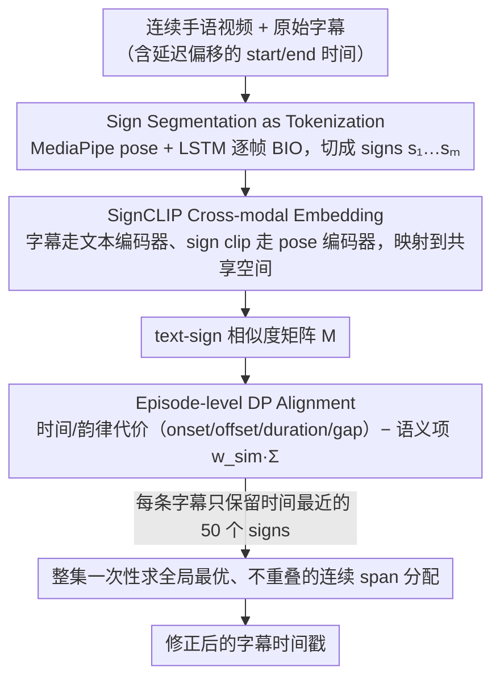

# Segment, Embed, and Align: A Universal Recipe for Aligning Subtitles to Signing

**会议**: ACL2026  
**arXiv**: [2512.08094](https://arxiv.org/abs/2512.08094)  
**代码**: https://github.com/J22Melody/SEA  
**领域**: 人体理解 / 手语处理 / 视频文本对齐  
**关键词**: 手语字幕对齐, SignCLIP, 动态规划, 跨语言迁移, subtitle alignment

## 一句话总结
SEA 将连续手语视频的字幕对齐拆成 sign segmentation、text-sign embedding 和 episode-level dynamic programming 三步，在 BOBSL、How2Sign、WMT-SLT SRF、SwissSLi 四个数据集上取得 SOTA F1@0.50，并能在 CPU 上高效处理长视频。

## 研究背景与动机
**领域现状**：手语翻译和手语语料建设都依赖高质量的 text-sign parallel data。许多 broadcast 或 online 手语视频有 spoken-language subtitles，但这些字幕通常按原始音频对齐，而手语翻译会存在非固定延迟，导致字幕时间戳和实际 signing 不匹配。

**现有痛点**：人工对齐非常昂贵。BOBSL 场景下，熟练手语专家对齐 1 小时连续视频大约需要 10 到 15 小时；WMT-SLT 22 报告的人工费用约为每小时 40 美元。已有 SAT/SAT+ 等方法依赖手工对齐数据和 end-to-end 训练，泛化到其他语言、数据源和低资源场景时不够灵活。

**核心矛盾**：高质量对齐需要理解 signing 的时序边界和语义内容，但每个手语/数据集都重新训练端到端 aligner 成本高、监督少、泛化弱。一个更通用的方法应能复用已有 segmentation / embedding 模型，并把对齐本身做成轻量全局优化。

**本文目标**：作者希望构建一个跨语言、跨数据源、几乎不需要直接 in-domain alignment supervision 的字幕到手语对齐框架，用于自动修正字幕时间戳并生成更好的 parallel sign-text 数据。

**切入角度**：SEA 把问题拆成 NLP 式 pipeline：先像 tokenization 一样把连续 signing 切成 sign units，再把 sign clip 和 subtitle text 放到同一 latent space，最后用动态规划在整集视频上做全局对齐。

**核心 idea**：用可替换的预训练 segmentation 和 SignCLIP embedding 模块提供边界与语义信号，再用 CPU-friendly 的 DP 目标函数统一时间、韵律和语义相似度。

## 方法详解
SEA 不是端到端训练一个字幕 aligner，而是 modular pipeline。它先识别哪些视频帧属于 signing 及其片段边界，再将每个 sign segment 和 subtitle unit 编码成向量，构造相似度矩阵，最后把每条字幕分配给一段连续 sign segments 并重写时间戳。

### 整体框架
输入是一段 continuous sign language episode 和原始字幕序列，每条字幕有 start/end time。输出是修正后的字幕时间戳。SEA 的第一步 segmentation 使用预训练手语分割模型产生 signs $s_1,\ldots,s_m$；第二步 embedding 使用 SignCLIP 把 sign clips 和 subtitles 映射到共享空间；第三步 alignment 对每条字幕 $t_i$ 选择连续 sign span $s_l,\ldots,s_r$，将字幕时间改为该 span 的边界。

### 关键设计

**1. Sign Segmentation as Tokenization：像分词一样把连续 signing 切成可对齐的单元**

对齐的第一步是知道"哪里能切"，SEA 借的是 Moryossef et al. 的自动手语分割模型——它基于 MediaPipe Holistic pose 加一个轻量 LSTM，对每帧输出 BIO 预测。这个模型只在约 73 小时的 DGS 标注数据上训练，但作者发现它能直接迁移到 BSL、ASL 和 DSGS，无需在每种手语上重训，这正是 SEA "通用 recipe" 主张的关键一环。

值得注意的是，这里并不追求语言学上完美的 sign boundary。实验显示，稍微 over-segmented 的 sub-sign units 反而足够——它们为后续 DP 提供了可用的切点和 pause 信息，而对齐本身并不在乎一个边界是不是恰好对应一个完整的语言学手势。

**2. SignCLIP Cross-modal Embedding：把字幕和手语片段拉到同一空间做语义匹配**

光有时间和 pause 只能告诉模型"哪里可能切"，却答不出"哪段 signing 对应这句字幕"，语义信号得靠跨模态 embedding 补上。SEA 默认用 SignCLIP-multilingual：字幕走 BERT-like text encoder，sign clip 的 MediaPipe pose 序列走 pose encoder，二者映射到共享 latent space。为了区分语言，文本 prompt 里嵌 ISO 639-3 代码，例如 BSL/English 用 `<en> <bfi>`、ASL/English 用 `<en> <ase>`、DSGS/German 用 `<de> <sgg>`。

由于这是可替换模块，作者还针对具体语言分别 fine-tune 出 SignCLIP-BSL、SignCLIP-ASL 和 SignCLIP-Suisse。消融里语言特定版本的提升相当明显——例如 BSL 上的 ISLR 从 0.5 跳到 43.0，BOBSL 对齐分也随之从 66.70 升到 72.78，说明语义信号越强、对齐越准。

**3. Episode-level Dynamic Programming Alignment：在整集视频上一次性求全局不重叠对齐**

最后一步把切点和语义统一进一个全局优化。对字幕 $t_i$ 和候选 sign span $s_l,\ldots,s_r$，代价由 onset distance、offset distance、duration difference 和 inter-sign gap 这些时间/韵律项构成；SEA 在此基础上再加一个语义项 $-w_{sim}\Sigma(i;l,r)$，其中 $\Sigma(i;l,r)=\sum_{j=l}^{r}M_{ij}$，$M_{ij}$ 是 text-sign similarity——相似度越高，代价越低。为保证 locality 和速度，每行只保留时间上最近的 50 个 signs，再用 DP 求全局最优。

相比 SAT 那类先在局部 20 秒窗口里预测、再用 DTW 事后解决重叠冲突的做法，episode-level DP 直接把"不重叠"当成全局约束来满足，既不会留下需要二次修补的冲突，又因为算法本身轻量、能在 CPU 上跑，更适合处理整集长视频。

### 损失函数 / 训练策略
SEA 的核心 alignment 本身不做梯度训练，而是动态规划优化加权代价函数。可训练部分来自外部预训练或可选 fine-tuning：segmentation 使用 E4s-1 checkpoint；BSL 场景尝试在 BSL Corpus 3.3 小时数据上微调 segmentation，并加入负采样；embedding 模块可在 BOBSL sign spottings（约 3.5M examples）、ASL isolated sign datasets（约 200K examples）和 Signsuisse（16,213 lexical items）上做 language-specific SignCLIP fine-tuning。

## 实验关键数据

### 主实验
主指标为 F1@0.50，即预测字幕 span 与人工对齐 span 的 IoU 至少为 0.50 才算正确。四个数据集分别覆盖 BSL/English、ASL/English 和 DSGS/German。

| 方法 | BOBSL Test | How2Sign Test | WMT-SLT SRF Test | SwissSLi Test |
|------|------------|---------------|------------------|---------------|
| Original alignment | 14.11 | 33.06 | 46.85 | 60.48 |
| Original+ fixed offset | 44.61 | 36.21 | 74.83 | 无 |
| SAT | 54.57 | 无 | 75.32 | 无 |
| SAT+ | 63.81 | 无 | 无 | 无 |
| Segment and Align | 49.58 | 36.17 | 76.83 | 84.19 |
| SEA + SignCLIP-multilingual | 50.68 | 37.51 | 76.43 | 85.57 |
| SEA + finetuned SignCLIP | 54.50 | 39.57 | 77.69 | 85.22 |
| SEA + SignCLIP-BSL + SAT+ subtitles | 65.81 | 无 | 无 | 无 |

### 消融实验
消融显示，segmentation 的“边界检测分数”不等同于 alignment 质量；embedding 的跨模态检索能力与最终对齐分数更一致。

| 配置 | 关键指标 | 说明 |
|------|----------|------|
| moryossef segmentation | BSLCP F1 31.13, BOBSL Align 66.24 | 分割指标一般，但对 alignment 最有用 |
| Renz segmentation a | BSLCP F1 47.71, BOBSL Align 57.98 | 分割更好但 alignment 更差，可能 false positives 多 |
| finetuned + negative sampling | BSLCP F1 52.09, BOBSL Align 63.61 | 分割 SOTA 但仍低于原始 segmentation 的对齐效果 |
| SignCLIP-multilingual on BSL | ISLR 0.5, BOBSL Align 66.70 | 语义信号很弱但仍可用 |
| SignCLIP-BSL | ISLR 43.0, BOBSL Align 72.78 | 语言特定 fine-tuning 明显提升 |
| CSLR2 pseudo glosses | BOBSL Align 68.80 | 硬 gloss 匹配不如软 embedding |
| CSLR2 human glosses oracle | BOBSL Align 78.75 | 上限说明更强语义表示仍有空间 |
| SignCLIP-ASL | ISLR 84.3, How2Sign Val Align 38.32 | ASL fine-tuning 也提升 alignment |

### 关键发现
- SEA 在所有 test set 上达到 SOTA：BOBSL 通过 SAT+ 初始化达到 65.81，How2Sign 为 39.57，WMT-SLT SRF 为 77.69，SwissSLi 最高为 85.57。
- 只用 segmentation 和时间/韵律 cost 已经能显著提升解释型数据集，例如 WMT-SLT SRF 从 Original+ 74.83 到 Segment and Align 76.83。
- 加入 embedding 在大多数数据集上进一步提升，尤其是 How2Sign 这类 studio signing 场景，pause 较少，语义信号更重要。
- 数据集 bias 仍重要。作者发现 DP 后加固定 1 秒 offset 在评测数据集上总是有用，因为标注者往往会在 signing 停止后保留额外时长。

## 亮点与洞察
- SEA 的强点是模块化。不同语言可以替换 segmentation 或 embedding 模块，而 alignment DP 不需要重写或重新训练。
- 论文很好地区分了 segmentation quality 与 downstream alignment utility。更像“语言学上正确”的 sign boundary 未必最适合字幕对齐，任务目标决定了中间表示的好坏。
- Soft similarity matrix 比 hard gloss matching 更稳。手语和口语文本之间存在 paraphrase、漏译和解释性翻译，硬词表匹配太脆弱。
- Global DP 是一个朴素但有效的选择。它把时间、duration、gap 和语义统一到一个目标里，也避免局部窗口方法之后再修补冲突。

## 局限与展望
- Embedding 和 alignment 可以互相迭代优化，但本文没有研究联合改进或闭环自训练。
- 对数据集特定 bias 和字幕质量仍敏感。当原始 subtitle timing 很差或出现无关 signing / 无关字幕时，SEA 可能继承错误 prior。
- 作者提到未来需要让算法能丢弃 irrelevant signing/subtitles，并在边界不清时合并 segments，这对段落级下游任务也有帮助。
- Human-in-the-loop 的 post-editing 和 evaluation 没有研究；实际语料建设中，半自动流程可能比完全自动更可靠。

## 相关工作与启发
- **vs SAT / SAT+**: SAT 类方法依赖人工对齐数据和 end-to-end 训练，BOBSL 上很强；SEA 更模块化，能跨语言和低资源数据集使用，并可在 SAT+ 输出上继续 refinement。
- **vs General video-text alignment**: HowTo100M / MIL-NCE 一类方法处理一般视频 narration alignment；SEA 面向手语的 signing pause、translation delay 和 sign-text 语义差异专门设计。
- **vs Gloss-based matching**: gloss 匹配可解释但刚性强，SEA 的 SignCLIP soft similarity 更能处理字幕和 signing 的非逐词对应。
- **启发**: 对其他弱对齐多模态语料，如讲座字幕-板书、医疗视频-caption、动作教学文本-视频，也可以采用“segment、embed、global align”的结构。

## 评分
- 新颖性: ⭐⭐⭐⭐☆ 方法组件都相对朴素，但组合成跨语言手语对齐 recipe 很实用。
- 实验充分度: ⭐⭐⭐⭐⭐ 覆盖 4 个数据集、3 种手语、主实验、定性结果和 segmentation/embedding 消融。
- 写作质量: ⭐⭐⭐⭐☆ 问题动机和 pipeline 清晰，表格信息充分；部分表格排版在 cache 中较难读。
- 价值: ⭐⭐⭐⭐⭐ 对大规模手语语料清洗、字幕后编辑和手语翻译数据构建价值很高。

<!-- RELATED:START -->

## 相关论文

- [\[AAAI 2026\] Facial-R1: Aligning Reasoning and Recognition for Facial Emotion Analysis](../../AAAI2026/human_understanding/facial-r1_aligning_reasoning_and_recognition_for_facial_emotion_analysis.md)
- [\[CVPR 2026\] TriLite: Efficient WSOL with Universal Visual Features and Tri-Region Disentanglement](../../CVPR2026/human_understanding/trilite_efficient_weakly_supervised_object_localization_with_universal_visual_fe.md)
- [\[CVPR 2026\] Natural Human Motion Recovery by Aligning High-Order Temporal Dynamics from Monocular Videos](../../CVPR2026/human_understanding/natural_human_motion_recovery_by_aligning_high-order_temporal_dynamics_from_mono.md)
- [\[CVPR 2026\] UniDex: A Robot Foundation Suite for Universal Dexterous Hand Control from Egocentric Human Videos](../../CVPR2026/human_understanding/unidex_a_robot_foundation_suite_for_universal_dexterous_hand_control_from_egocen.md)
- [\[CVPR 2026\] OpenFS: Multi-Hand-Capable Fingerspelling Recognition with Implicit Signing-Hand Detection and Frame-Wise Letter-Conditioned Synthesis](../../CVPR2026/human_understanding/openfs_multi-hand-capable_fingerspelling_recognition_with_implicit_signing-hand_.md)

<!-- RELATED:END -->
