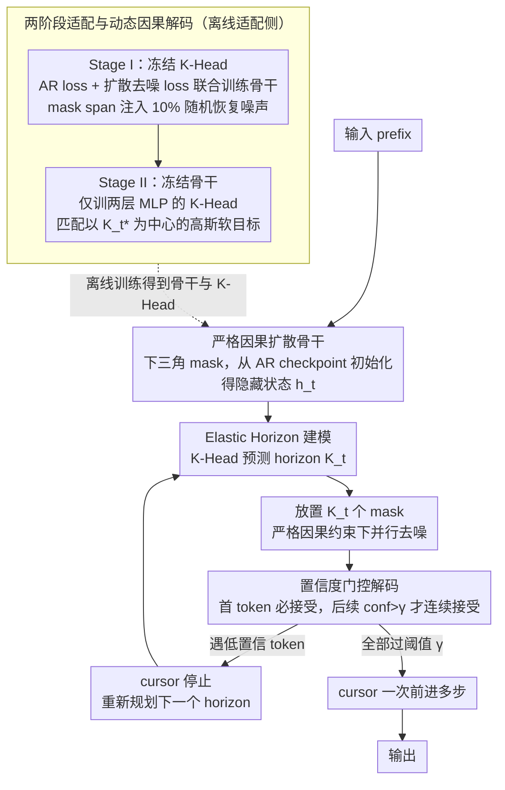

# From AR to Diffusion: Efficiently Adapting Large Language Models with Strictly Causal and Elastic Horizons

**会议**: ACL2026  
**arXiv**: [2605.27387](https://arxiv.org/abs/2605.27387)  
**代码**: https://huggingface.co/MYTH-Lab/FLUID  
**领域**: LLM生成 / 扩散语言模型 / 推理加速  
**关键词**: 扩散语言模型, 自回归适配, 因果注意力, 动态步长, 并行生成  

## 一句话总结
本文提出 FLUID，用严格因果注意力和熵感知 Elastic Horizon 把预训练自回归 LLM 高效适配为扩散式并行生成模型，在只用 2.7B 适配 tokens 的情况下取得接近强 AR 模型、优于现有扩散基线的推理和代码生成表现。

## 研究背景与动机
**领域现状**：主流 LLM 基于 autoregressive next-token prediction，每一步只能生成下一个 token，逻辑稳定、训练成熟，但长序列推理和部署延迟随长度线性增长。离散扩散语言模型尝试通过迭代去噪并行生成多个 token，以突破串行解码瓶颈。

**现有痛点**：标准 diffusion language model 多采用双向注意力，可以利用全局 noisy context，但这与 GPT / LLaMA 等预训练 AR backbone 的因果先验不匹配。结果是，想做高质量 diffusion LM 往往需要从头大规模预训练，成本很高。已有 block diffusion 用固定块折中，但固定块无法适应自然语言局部熵的变化。

**核心矛盾**：AR 模型的优势来自严格因果依赖，扩散模型的优势来自并行去噪；如果直接用双向扩散，就破坏 AR 先验；如果用固定块，又会在高熵推理片段过度冒进、在低熵模板片段过度保守。

**本文目标**：作者希望复用已有 AR checkpoint，把它低成本适配成可并行生成的扩散模型，同时保持因果一致性、推理能力和代码结构完整性。

**切入角度**：论文把问题拆成两个 mismatch：结构 mismatch 来自双向扩散和 AR 因果先验冲突；动态 mismatch 来自固定生成窗口和局部信息密度冲突。FLUID 分别用 Strictly Causal Alignment 和 Elastic Horizon 解决。

**核心 idea**：把扩散去噪限制在严格因果注意力下，并让模型根据隐藏状态预测当前可安全并行去噪的 horizon，而不是使用固定块大小。

## 方法详解
FLUID 的全名是 Flexible Unidirectional Inference Diffusion。它不是从零训练 diffusion LM，而是在已有 openPangu-Embedded-7B 这类 AR backbone 上做参数高效适配。整体上，它保留 AR 模型只能看历史的结构，同时在当前位置之后引入一段可变长度 mask span，让模型以扩散方式并行恢复这些 token。

### 整体框架
给定 prefix，FLUID 先用因果 Transformer 得到当前隐藏状态，再由 K-Head 预测一个 horizon $K_t$。模型在接下来 $K_t$ 个位置放置 mask，并在严格因果约束下对这些 mask 做并行去噪。预测完成后，当前下一个 token 总是被接受，后续 token 只有置信度超过阈值 $\gamma$ 才连续接受；一旦遇到低置信 token，cursor 停止前进并重新规划。这样，FLUID 在低熵片段可以一次走多步，在高熵推理片段自动退回更细粒度的生成。

### 关键设计

**1. Strictly Causal Diffusion Backbone：把扩散去噪关进严格因果注意力，才能从 AR checkpoint 平滑初始化**

标准 diffusion LM 用双向注意力，能看全局 noisy context，但这跟 GPT/LLaMA 的因果先验冲突——想要高质量往往得从头大规模预训练，成本极高。FLUID 在 Transformer 里注入下三角注意力 mask，位置 $i$ 只能访问 $j\le i$ 的 token，未来位置一律设为 $-\infty$；恢复 token $x_i$ 时只能依赖 noisy history $\mathbf{x}_{t,<i}$，不能偷看未来 noisy token。这样既保住了 AR 模型的演绎链不被 noisy future 破坏，又让模型可以直接从 GPT-style checkpoint 初始化，而不必重训。

**2. Elastic Horizon Modeling：让模型自己预测“这一步能安全并行多远”，而不是写死一个块大小**

自然语言信息密度不均匀：函数样板、简单算术里可以大胆一次走多步，复杂数学推理里就该缩短步长，固定 block 表达不了这种差异。FLUID 新增一个轻量 K-Head，把最终隐藏状态 $h_t$ 映射成 $k\in\{1,\ldots,K_{max}\}$ 上的分类分布。它的监督信号 oracle horizon $K_t^*$ 由未来 loss 序列和 competence boundary $\tau$ 共同决定——在平均 loss 仍小于 $\tau$ 的最大跨度内，模型被认为有能力安全并行恢复。于是同一个模型在 GSM8K 和 MMLU 上会自动采用不同的 stride。

**3. 两阶段适配与动态因果解码：先校准“能生成什么”，再学“该生成多远”**

直接同时训练 backbone 和 horizon planner 容易不稳定，FLUID 把它拆成两步。Stage I 冻结 K-Head，用 AR loss 与 diffusion denoising loss 联合训练 backbone，并在 mask span 里注入 10% stochastic restoration noise，提高对不完美中间状态的鲁棒性；Stage II 反过来冻结 backbone，只训练两层 MLP 的 K-Head，让它的预测分布匹配以 $K_t^*$ 为中心的 Gaussian soft target。推理时再加一道置信度门控：K-Head 给出计划，但实际接受 token 还要逐个过阈值 $\gamma$，把“能生成”和“该生成多远”彻底解耦，也避免一次错误规划连锁污染。

### 一个完整示例：一句生成里 horizon 怎么伸缩

设想模型正在写一段带推理的代码。开头是函数签名、import 这类低熵模板：K-Head 读当前隐藏状态，预测 $K_t$ 接近上限，于是一次在后面铺十几个 mask 并行去噪，置信度全部过 $\gamma$，cursor 一步跳过这十几个 token（这正是 GSM8K 上平均 stride 能扩到 13.1 的来源）。等写到核心数学推导，局部熵升高，K-Head 自动把 $K_t$ 压到 6 左右（MMLU 上平均 stride 6.5），并行恢复的几个 token 里只要有一个置信度低于 $\gamma$，cursor 就停在那里、丢弃后面、重新规划下一个 horizon。整段生成下来，模板段一次走多步、推理段退回细粒度，既拿到约 $2\times$ 的并行加速，又不让 noisy future 污染演绎链。

### 损失函数 / 训练策略
Stage I 的目标是混合 AR 与 diffusion：$\mathcal{L}_{Stage1}=\mathcal{L}_{AR}+\mathcal{L}_{Diff}$。其中 $\mathcal{L}_{AR}$ 维持 prefix 的 next-token 语言先验，$\mathcal{L}_{Diff}$ 在严格因果约束下恢复 mask span。训练时随机采样 $K\sim U[1,K_{max}]$，并对 mask span 注入 10% 噪声提高对不完美中间状态的鲁棒性。

Stage II 的目标是 horizon distribution matching：$\mathcal{L}_{Stage2}=D_{KL}(\mathcal{Q}\|P_\phi(\cdot|h_t))$。$\mathcal{Q}$ 是以 competence boundary 得到的 $K_t^*$ 为中心的 Gaussian soft target。实验中 $K_{max}=16$，$\tau=2.8$，Stage I 训练 32,000 iterations，Stage II 训练 2,000 steps；backbone 使用 Rank-16 LoRA，输入长度 1024，全局 batch size 80，学习率 $2\times10^{-4}$。

## 实验关键数据

### 主实验
| 模型 / 方法 | 类型 | 适配或训练 tokens | MMLU | IFEval | GSM8K | MATH500 | HumanEval | MBPP |
|-------------|------|------------------|------|--------|-------|---------|-----------|------|
| FLUID-7B | Diff | 2.7B | 67.8 | 57.7 | 91.9 | 61.8 | 60.4 | 53.6 |
| Qwen-2.5-7B | AR | 缓存未给精确训练量 | 缓存未摘出 | 缓存未摘出 | 91.6 | 缓存未摘出 | 缓存未摘出 | 缓存未摘出 |
| Dream-7B | Diff | 缓存未给精确训练量 | 缓存未摘出 | 缓存未摘出 | 81.0 | 缓存未摘出 | 缓存未摘出 | 缓存未摘出 |
| LLaDA-8B | Diff | 缓存未给精确训练量 | 缓存未摘出 | 缓存未摘出 | 78.6 | 缓存未摘出 | 缓存未摘出 | 缓存未摘出 |

### 消融实验
| 配置 | Causal | Elastic | GSM8K | MATH500 | HumanEval | 说明 |
|------|--------|---------|-------|---------|-----------|------|
| Baseline | ✗ | ✗ | 82.0 | 51.2 | 42.2 | 双向固定块基线 |
| Baseline + Elastic | ✗ | ✓ | 82.5 | 53.6 | 42.8 | 只动态 horizon，仍有 acausal future 干扰 |
| Baseline + Causal | ✓ | ✗ | 90.6 | 59.2 | 54.9 | 因果约束恢复推理链，但固定块仍会截断结构 |
| FLUID | ✓ | ✓ | 91.9 | 61.8 | 60.4 | 严格因果与动态 horizon 互补 |

### 关键发现
- FLUID 在 GSM8K 上达到 91.9，比 Dream-7B 高 10.9 点，比 LLaDA-8B 高 13.3 点，并接近 Qwen-2.5-7B 的 91.6。
- Elastic Horizon 对代码任务尤其关键。固定 $K=16$ 会造成 semantic fracture；完整 FLUID 在 HumanEval 上比 causal-only 固定块高 5.5 点。
- 随机恢复噪声比例以 10% 最好：GSM8K / MATH500 / HumanEval 分别为 91.9 / 61.8 / 60.4；0% 为 91.0 / 60.8 / 59.8，15% 为 91.1 / 61.5 / 60.0。
- competence boundary 以 $\tau=2.8$ 最好：GSM8K / MATH500 / HumanEval 为 91.9 / 61.8 / 60.4；更小会过于保守，更大容易过度扩张 horizon。
- 推理效率上，FLUID 相对标准扩散基线约有 $2\times$ speedup；在 MMLU 上平均 stride 为 6.5，却达到 18.82 tokens/s，高于固定 $K=16$ 的 17.52 tokens/s；在 GSM8K 上平均 stride 可扩到 13.1。
- 训练成本约 320 GPU-hours，其中 Stage I 占绝大部分；Stage II 只训练轻量 K-Head，额外开销可忽略。

## 亮点与洞察
- 论文最巧妙的是没有把“扩散要双向”当成必然前提，而是重新定义了因果扩散：并行恢复未来 span，但每个位置仍只能看历史。
- Elastic Horizon 把并行解码从固定工程超参变成模型预测问题。这比调一个 block size 更自然，也解释了为什么同一模型在 GSM8K 和 MMLU 上应采用不同 stride。
- 置信度门控让 horizon 预测不是硬承诺。K-Head 可以提出计划，但实际接受 token 时还要过置信度检查，降低了一次错误规划导致连锁污染的风险。
- 从工程角度看，2.7B 适配 tokens 和 320 GPU-hours 相对 diffusion LM 从头预训练很低，说明 AR-to-diffusion 适配是一条实际可走的路线。

## 局限与展望
- FLUID 的上限受源 AR backbone 限制。如果 openPangu 等源模型本身有幻觉或推理缺陷，严格因果扩散并不会自动修复这些能力缺口。
- 当前实验主要围绕通用 LLM、数学、代码与指令任务，专业领域如医学、法律和特定结构化生成还没有充分验证。
- MoE 架构、多模态 LLM 或更长上下文场景是否同样适配，目前缓存中的论文没有给出结论。
- Elastic Horizon 依赖 K-Head 与 competence boundary 的校准，未来可以研究更细粒度的不确定性估计、在线自适应阈值和与 KV cache / speculative decoding 的结合。

## 相关工作与启发
- **vs LLaDA / Dream**: 这些扩散语言模型展示了并行文本生成潜力，但通常依赖双向注意力和大规模预训练；FLUID 的重点是复用 AR checkpoint，并用严格因果机制避免未来噪声破坏推理。
- **vs Block Diffusion / semi-AR 方法**: 固定块方法在质量和速度之间折中，但 block size 无法适应局部熵；FLUID 用 K-Head 动态决定 horizon，并用置信度门控实际截断。
- **vs Fast-DLLM 类推理加速**: 训练自由加速更像 inference trick，FLUID 则改变适配目标和结构约束，代价更高但能系统改善推理、代码和语义质量。

## 评分
- 新颖性: ⭐⭐⭐⭐⭐ 严格因果扩散和 Elastic Horizon 的组合抓住了 AR-to-diffusion 适配的关键矛盾。
- 实验充分度: ⭐⭐⭐⭐☆ 覆盖通用、数学、代码、效率和多组消融，但专业领域和更大规模模型仍待验证。
- 写作质量: ⭐⭐⭐⭐☆ 结构 mismatch 与 entropy-horizon dilemma 讲得清楚，部分主表在缓存文本中不易读，数字抽取略费劲。
- 价值: ⭐⭐⭐⭐⭐ 对低成本并行 LLM 生成很有启发，尤其适合后续把 AR checkpoint 转成更低延迟生成器。

<!-- RELATED:START -->

## 相关论文

- [\[ACL 2026\] Multimodal Large Language Models for Multi-Subject In-Context Image Generation](multimodal_large_language_models_for_multi-subject_in-context_image_generation.md)
- [\[NeurIPS 2025\] Non-Markovian Discrete Diffusion with Causal Language Models](../../NeurIPS2025/image_generation/non-markovian_discrete_diffusion_with_causal_language_models.md)
- [\[ICML 2026\] Esoteric Language Models: A Family of Any-Order Diffusion LLMs](../../ICML2026/image_generation/esoteric_language_models_a_family_of_any-order_diffusion_llms.md)
- [\[NeurIPS 2025\] Scaling Diffusion Transformers Efficiently via μP](../../NeurIPS2025/image_generation/scaling_diffusion_transformers_efficiently_via_μp.md)
- [\[CVPR 2026\] Causal Motion Diffusion Models for Autoregressive Motion Generation](../../CVPR2026/image_generation/causal_motion_diffusion_models_for_autoregressive_motion_generation.md)

<!-- RELATED:END -->
