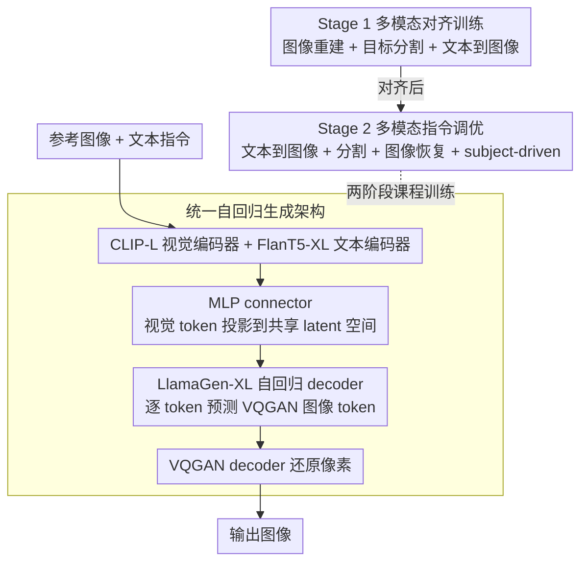

# MENTOR: Efficient Autoregressive Image Generation with Balanced Multimodal Control

**会议**: ACL2026  
**arXiv**: [2507.09574](https://arxiv.org/abs/2507.09574)  
**代码**: 项目页 https://haozhezhao.github.io/MENTOR.page（cache 未给出 GitHub 链接）  
**领域**: 多模态条件图像生成 / 自回归生成  
**关键词**: 自回归图像生成、多模态控制、两阶段训练、DreamBench++、生成效率

## 一句话总结
MENTOR 用统一自回归 decoder 和两阶段多模态训练，把参考图像与文本指令对齐到同一生成前缀中，在仅 3M 训练数据和 8 张 A100 约 1.5 天训练预算下，取得了较好的概念保持与 prompt following 平衡。

## 研究背景与动机
**领域现状**：文本到图像模型已经能生成高质量图像，但真实应用往往需要“文本 + 参考图像 + 多图上下文”的精细控制，例如保留主体身份、按文本改变场景、做图像恢复或分割。

**现有痛点**：很多多模态生成系统基于扩散模型和额外对齐模块，如 adapter、regression head 或专门 embedding。它们可以利用图像条件，但常出现模态失衡：模型过度复制参考图像而忽略文字，或遵循文字却丢掉主体细节；同时训练数据、模型规模和计算成本都很高。

**核心矛盾**：复杂多模态控制要求模型同时保留像素级视觉细节和语义级文本指令，但视觉与语言表示天然有 gap。若只做重建，模型可能复制输入；若只做文本到图像，又缺乏参考图像的身份约束。

**本文目标**：作者希望构建一个资源友好的自回归多模态生成框架，用较小模型和有限训练数据验证：不依赖复杂扩散控制模块，也能在概念保持和文本跟随之间取得稳定平衡。

**切入角度**：论文把图像离散成 VQGAN token，再让 transformer decoder 像语言模型一样逐 token 生成图像。多模态 encoder 将视觉和文本输入投影到同一 latent prefix，训练时用任务混合显式塑造对齐与模态平衡。

**核心 idea**：用“自回归统一 token 生成 + 阶段 1 对齐 + 阶段 2 指令平衡”替代重型扩散控制管线，在低资源设置下学习可控多模态图像生成。

## 方法详解
MENTOR 的方法可以理解为一个多模态条件的图像 token 语言模型。给定参考图像和文本指令后，CLIP 与 FlanT5 编码器先抽取视觉、语言特征；一个轻量 MLP connector 把视觉 token 投影到语言/生成模型使用的共享空间；随后 LlamaGen 初始化的自回归 decoder 根据这些前缀 token 逐步预测 VQGAN 图像 token，最后由 VQGAN decoder 还原图像。

### 整体框架
输入可以是图像、文本或它们的组合。多模态 encoder 产生条件序列 $H=(h_1,\dots,h_M)$，自回归 decoder 在 teacher forcing 下学习 $p(y_i|y_{<i},H)$，其中 $y$ 是离散图像 token 序列。训练分为两阶段：第一阶段强调像素和语义对齐；第二阶段通过多任务指令调优，让模型在参考图像和文本指令之间取得平衡。

### 关键设计

**1. 统一自回归生成架构：把多模态条件和图像输出压进同一个 next-token 目标**

扩散模型的随机采样和 cross-attention 控制不够直接，条件和输出的对应关系散在多个模块里。MENTOR 改走 token 路线：视觉用 CLIP-Large-Patch14、文本用 FlanT5-XL 抽特征，一个轻量 MLP connector 把视觉 token 投影到 decoder 能消费的共享 latent space；decoder 继承 LlamaGen-XL，按 VQGAN 词表像写句子一样逐 token 生成图像，最后 VQGAN decoder 还原像素。好处是条件与输出的对应被收进同一个 next-token objective，既便于低成本训练，也为后续 token-level RL 留好接口。

**2. Stage 1 多模态对齐训练：先逼模型真的看懂图像细节，而不是学会照抄**

只做图像重建很容易退化成 copy-paste，模型不一定理解对象语义。第一阶段因此混三类任务：图像重建强化像素保真，目标分割迫使模型关注空间结构和语义对象，文本到图像维持基础生成能力。分割是这里的关键——它要求模型把“看见的视觉细节”和“文本指定的对象”绑在一起，从源头上压住“只会复制参考图”的倾向。

**3. Stage 2 多模态指令调优：在概念保持和文本跟随之间找平衡，别被任一模态绑架**

第一阶段建立了对齐，但真实多模态控制还要求模型同时保住主体身份和执行文本指令。第二阶段保留 T2I 和分割，再加入图像恢复和 subject-driven generation：图像恢复要求模型从旋转、缩放、拼接、随机背景等扰动中复原原图，像一个“既要看图又要读文字”的正则项；subject-driven 任务则直接对应真实需求——保留主体身份的同时按文本改场景。两者一起把模型从“高级复制器”推向真正的可控生成。

### 损失函数 / 训练策略
训练目标是图像 token 的交叉熵损失：在 teacher forcing 下最大化每个输出 token 的条件概率。作者还使用 classifier-free guidance：训练时以概率 $p$ 将条件 $H$ 替换为无条件 embedding，推理时用 $\ell_g=\ell_u+(\ell_c-\ell_u)\times\lambda$ 调节条件强度。

实现上，Stage 1 冻结多模态 encoder，训练 projector 与 generator 1 个 epoch，global batch size 128，学习率 $5\times10^{-4}$；Stage 2 除 vision encoder 外微调整个模型 2 个 epoch，学习率 $1\times10^{-4}$。训练使用 8 张 80GB A100，总耗时约 1.5 天，其中 Stage 1 约 2.48M 数据、14 小时，Stage 2 约 1.3M 数据、20 小时。

## 实验关键数据

### 主实验
| 方法 | 训练数据 | 模型规模 | DreamBench++ CP | DreamBench++ PF | CP·PF | CP/PF |
|------|------|------|------|------|------|------|
| Lumina-mGPT | 10M | 7.00B | 0.91 | 0.25 | 0.23 | 3.63 |
| DreamEngine | 21M | 10.50B | 0.68 | 0.37 | 0.26 | 1.84 |
| IP-A ViT-G | 10M | 2.50B | 0.59 | 0.64 | 0.38 | 0.92 |
| Mentor | 3M | 2.31B | 0.56 | 0.84 | 0.47 | 0.66 |
| DreamBooth-L | - | 2.60B | 0.60 | 0.87 | 0.52 | 0.69 |

### 消融实验
| 配置 | CP | PF | CP·PF | 说明 |
|------|------|------|------|------|
| w/o Obj. Seg. in Stage 1 | 0.252 | 0.479 | 0.121 | 重建会退化为复制，缺少语义空间约束 |
| w/o Stage 1 Alignment | 0.179 | 0.673 | 0.120 | 概念保持严重崩溃 |
| w/o Image Recovery | 0.661 | 0.284 | 0.188 | 过度依赖视觉，文本跟随变差 |
| w/o Object Segmentation | 0.412 | 0.918 | 0.378 | prompt following 高，但视觉保真下降 |
| w/o Multimodal T2I Task | 0.407 | 0.910 | 0.370 | 视觉保持不足 |
| Mentor | 0.555 | 0.839 | 0.466 | 平衡最好 |

### 关键发现
- MENTOR 的优势不是单项 CP 或 PF 最高，而是 CP·PF 更均衡；Lumina-mGPT 的 CP 高达 0.91，但 PF 只有 0.25，说明它更像在复制参考图。
- 训练效率很突出：Mentor 只用 3M 数据、8 张 A100 约 1.5 天；论文对比提到 Kosmos-G 需要 256 张 GPU 训练 3 天。
- 图像重建指标上，Mentor 在 COCO / JourneyDB 的距离为 0.1008 / 0.0867，优于 DreamEngine 的 0.2065 / 0.2052 和 EMU2-Gen 的 0.3828 / 0.2869。
- 多图训练与 GRPO 都能继续提高：w. Multi-image 的 CP·PF 为 0.486，w. GRPO 提升到 0.527。

## 亮点与洞察
- 论文把“多模态控制”拆成了很清楚的两个阶段：先让模型真的看懂图像细节，再让它学会不被图像或文本任一方绑架。这个训练逻辑比简单堆数据更有解释性。
- CP·PF 和 CP/PF 的指标设计很贴合问题。很多生成模型单看概念保持会显得强，但 CP/PF 过高暴露了它们忽略文本指令的倾向。
- 自回归框架天然适合后续强化学习。论文用 GRPO 证明 token-level RL 可以直接改善多模态生成行为，这是扩散式控制方法不容易直接复用的路线。
- “分割 + 重建”的组合很有迁移价值。对视频生成、3D 生成或机器人视觉生成任务，也可以用一个结构化辅助任务防止模型只学到浅层复制。

## 局限与展望
- 作者明确承认本文目标不是刷新绝对画质 SOTA，而是验证低资源下的多模态平衡机制；当前生成质量受 LlamaGen/VQGAN 等 backbone 限制。
- 在文本到图像方面，模型仍存在空间推理、物体计数、精细人体渲染和风格化能力不足的问题。
- 安全、公平性和潜在滥用评估还不完整，尤其是多模态生成系统在人物、身份和版权内容上的风险需要进一步测试。
- 对具体任务达到强竞争力仍可能需要更强 encoder/generator 与专门数据；当前“通用框架”更像一个有效起点，而不是可直接替代大规模商用生成模型。

## 相关工作与启发
- **vs IP-Adapter / BLIP-Diffusion**: 这些方法通常给扩散模型加图像条件模块，Mentor 则把视觉条件直接变成 AR prefix，训练与推理更统一。
- **vs Kosmos-G / Emu2**: 它们强调大规模多模态模型和扩散或统一生成能力，Mentor 的重点是低资源下的模态平衡和可控生成。
- **vs Lumina-mGPT / Unified-IO2**: 这些 AR 模型概念保持强但容易视觉主导，Mentor 通过两阶段任务组合显式降低 CP/PF 失衡。
- **启发**: 做可控生成时，不应只追求“参考图像像不像”，还要把 prompt following 当成同等核心指标；否则模型可能只是更高级的复制器。

## 评分
- 新颖性: ⭐⭐⭐⭐☆ 自回归多模态生成不是全新范式，但两阶段任务设计和低资源平衡目标很有辨识度。
- 实验充分度: ⭐⭐⭐⭐☆ 主实验、消融、重建、多图、GRPO 和人评都有覆盖，但绝对画质与更多公开复杂任务仍可加强。
- 写作质量: ⭐⭐⭐⭐☆ 方法线索清楚，表格较多但能支撑结论；附录训练细节充分。
- 价值: ⭐⭐⭐⭐☆ 对资源受限团队构建多模态生成系统很有参考价值，也提供了分析模态失衡的实用评测范式。

<!-- RELATED:START -->

## 相关论文

- [\[ICLR 2026\] Locality-aware Parallel Decoding for Efficient Autoregressive Image Generation](../../ICLR2026/image_generation/locality-aware_parallel_decoding_for_efficient_autoregressive_image_generation.md)
- [\[CVPR 2026\] ConsistCompose: Unified Multimodal Layout Control for Image Composition](../../CVPR2026/image_generation/consistcompose_multimodal_layout_control.md)
- [\[ACL 2026\] Multimodal Large Language Models for Multi-Subject In-Context Image Generation](multimodal_large_language_models_for_multi-subject_in-context_image_generation.md)
- [\[ICLR 2026\] Autoregressive Image Generation with Randomized Parallel Decoding](../../ICLR2026/image_generation/autoregressive_image_generation_with_randomized_parallel_decoding.md)
- [\[ICLR 2026\] From Prediction to Perfection: Introducing Refinement to Autoregressive Image Generation](../../ICLR2026/image_generation/from_prediction_to_perfection_introducing_refinement_to_autoregressive_image_gen.md)

<!-- RELATED:END -->
