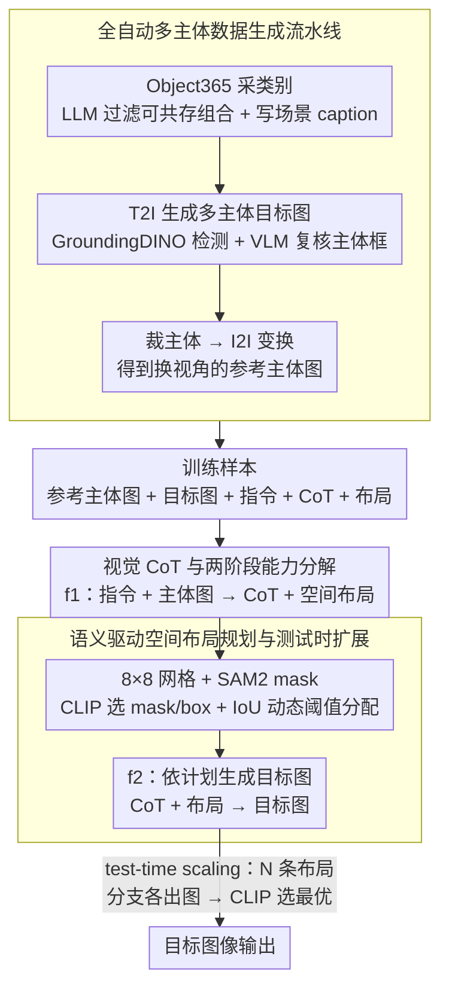

# Multimodal Large Language Models for Multi-Subject In-Context Image Generation

**会议**: ACL2026  
**arXiv**: [2604.07422](https://arxiv.org/abs/2604.07422)  
**代码**: 未公开  
**领域**: 多模态VLM / 个性化图像生成  
**关键词**: 多主体生成、视觉链式思考、空间布局规划、主体一致性、测试时扩展

## 一句话总结
这篇论文提出 MUSIC，把多模态大语言模型的视觉推理能力引入多主体 in-context 图像生成，通过自动合成训练数据、视觉 CoT 和语义驱动空间布局规划，显著缓解多个参考主体同时生成时的主体遗漏、身份混淆和语义漂移问题。

## 研究背景与动机
**领域现状**：文本到图像模型已经能根据自然语言生成较稳定的场景，个性化图像生成进一步允许用户给定一个或多个参考主体，再让模型把这些主体放入新的上下文中。早期方法常依赖每个主体的专门优化，后续的 IP-Adapter、BLIP-Diffusion、ELITE、MS-Diffusion、UNO 等方法开始走向零样本或多主体生成，核心目标都是同时保留参考主体身份并满足文本指令。

**现有痛点**：当参考主体数量增加时，问题会迅速变难。模型不仅要记住每个主体的视觉身份，还要理解它们之间的语义关系、空间关系和场景角色；如果只把多张参考图像作为条件塞给扩散模型，很容易出现某个主体消失、两个主体特征互相串染、文本指令被部分忽略，或者生成图只保住了局部外观但整体语义不对。

**核心矛盾**：多主体生成的难点不只是“条件更多”，而是条件之间存在组合推理。扩散式 subject-to-image 方法通常更擅长把视觉特征注入生成过程，却不擅长显式规划“哪个主体应该在哪里、与谁互动、哪些外观属于谁”。而 MLLM 擅长跨图像和文本的上下文推理，但如何让它真正服务于图像生成，仍需要结构化训练信号和可执行的中间计划。

**本文目标**：作者希望解决三个子问题。第一，如何在没有人工标注的情况下构造大规模多主体训练数据；第二，如何让模型在生成前先理解多个主体之间的关系，而不是直接拼条件；第三，如何在复杂场景中把语义关系落到二维空间布局上，减少身份纠缠和主体缺失。

**切入角度**：论文的关键观察是，多主体 in-context 生成更像一个“先读图、再想场景、再画图”的过程。既然 MLLM 已经具备一定视觉理解和语言推理能力，就可以把多主体生成拆成显式的视觉推理与空间规划，再把这些中间结果作为图像生成条件。

**核心 idea**：用 MLLM 先产生视觉 CoT 和语义空间布局计划，再依据计划生成目标图像，从而用可解释的中间推理替代黑盒式多主体条件融合。

## 方法详解
MUSIC 的整体思路可以概括为两层：先自动制造训练数据，再用这些数据训练一个能“看参考主体、写出计划、生成图像”的多模态生成模型。它不是只在现有 subject-driven 模型上增加一个适配器，而是把多主体生成显式建模为视觉推理任务。

### 整体框架
输入是一条用户指令和若干张参考主体图像，输出是一张包含这些主体并满足文本要求的目标图像。为了训练这个过程，作者先用基础模型自动构造数据：LLM 从 Object365 类别中选出语义相关的多个物体类别并写场景 caption，T2I 模型生成包含多个主体的目标图，开放词表检测器找出图中的主体框，VLM 校验检测结果，I2I 模型把裁剪出的主体变换成新的参考图像，SAM2 和 CLIP 再帮助生成空间布局描述。

训练阶段，每个样本包含参考主体图像集合、目标图像、用户指令、视觉 CoT 以及语义空间布局计划。MUSIC 以 SEED-X 为基础，用 LoRA 微调。模型先学习从“指令 + 主体图像”预测 CoT 和布局，再学习从“CoT + 布局”生成目标图像。推理时，模型也遵循这个流程：先生成一个或多个候选计划，再根据计划出图；如果启用 test-time scaling，则生成多条布局分支并用 CLIP 选择与文本最匹配的结果。

### 关键设计

**1. 全自动多主体数据生成流水线：没人工标注，也能造出带参考主体、目标图、指令、推理和布局的训练样本**

多主体个性化生成最大的拦路虎是缺少大规模训练集，手工标注一张图里多个主体的身份、关系、布局成本极高。作者干脆用一串基础模型把数据"长"出来：先从 Object365 随机采样候选类别，让 LLM 过滤出语义上能共存的组合并写出场景 caption；FLUX 这类 T2I 模型据此生成包含多个主体的目标图，GroundingDINO 检测主体框，VLM 复核检测框是否对得上，随后把主体裁出来送进 UNO-FLUX 风格的 I2I 模型做视角或外观变换。

这里有个容易被忽略的细节：参考主体图并不是直接从目标图裁出来的。如果直接裁，模型很可能学成"把参考块复制粘贴回去"。经过 I2I 变换后，参考图和目标图里的同一主体在视角、姿态上已经不同，模型被迫去学"同一主体换个场景仍然是它"的身份保持能力，这正是 in-context 生成想要的东西。

**2. 视觉 CoT 与两阶段能力分解：先让模型用文字想清楚"谁是谁、谁该在哪"，再动手画**

多主体生成翻车，往往不是画不出物体，而是模型没分清主体身份、把两个主体的特征串在一起、或漏掉某个主体。MUSIC 把生成显式拆成两步：第一步学映射 $f_1(T_{instr}, \{I_{subj_i}\}) \rightarrow (\hat{C}_{CoT}, \hat{L}_{spatial})$，即从指令和主体图先预测一段视觉 CoT（说明每个主体的角色、相互关系、空间安排）和一份空间布局；第二步学 $f_2(C_{CoT}, L_{spatial}) \rightarrow \hat{I}_{tgt}$，从计划生成目标图。训练时 CoT 由 VLM 基于带框和类别标签的目标图生成，总目标把推理/布局的交叉熵损失和图像生成表征损失加在一起，$L = w_1 L_1 + w_2 L_2$。

这一拆解的意义在于，它把多主体里隐含的组合关系外化成一段可读的文本中间状态，让 MLLM 的语言推理优势真正参与进来，而不是把图像特征当成低层条件硬塞给扩散模型。

**3. 语义驱动空间布局规划与测试时扩展：把"花在左、杯在桌、人居中"这种关系落到具体网格上，并用多候选计划做低成本搜索**

纯文本 CoT 还停留在抽象层面，说"人物在中间"却没法精确约束图像区域。MUSIC 把目标图划成 $8 \times 8$ 网格，用 SAM2 从检测框生成主体 mask，再用 CLIP 比较 mask 区域和 box 区域哪个更贴类别文本：$Sim_{mask} > Sim_{unmask}$ 就用 mask，否则退回 box。之后计算主体区域与每个 patch 的 IoU，用动态阈值 $\tau = \lambda \cdot \frac{1}{K}\sum_{i=1}^{K} IoU(b_i, p_i)$ 把类别分配到网格 patch 上，得到一份可供生成模块直接消费的空间提示。

推理阶段，这套布局规划顺势变成一种廉价的测试时搜索：MUSIC 一次生成 $N$ 个候选 CoT/布局分支，每个分支出一张图，再用 CLIP 挑文本相似度最高的那张。这等于把文本推理里"多条思路投票"的做法搬到了图像生成——多条空间计划候选再择优，正对应实验里 MUSIC* 相对 MUSIC 的稳定增益。

### 损失函数 / 训练策略
实现上，作者使用 Qwen-3 作为 LLM，Qwen-2.5-VL 作为 VLM，FLUX-1.0-DEV 作为 T2I 模型，UNO-FLUX-1.0-DEV 作为 I2I 模型，GroundingDINO 做开放词表检测，SAM2 做分割，CLIP ViT-L/14 做 mask 质量判断和候选结果筛选。

训练数据规模为 10,000 个自动生成样本，主体数范围最多到 12，检测框面积过滤阈值为目标图面积的 0.01，空间网格为 $8 \times 8$，动态 IoU 缩放因子 $\lambda=0.05$。MUSIC 从 SEED-X 初始化，用 LoRA 微调，LoRA rank 为 64，缩放系数 $\alpha=64$，训练 10 个 epoch，学习率 $1\times10^{-4}$，使用 8 张 A100。论文中两个损失权重固定为 $w_1=0.5$、$w_2=0.5$。

一个值得注意的训练技巧是“主体数递减增强”：作者会按 bounding box 大小排序，逐步移除较小主体直到只剩两个主体，并同步更新指令里的主体 ID。这相当于从同一复杂样本中免费得到不同主体数量的训练样本，使模型既见过简单场景，也见过拥挤场景。

## 实验关键数据

### 主实验
论文在两个评测集上验证 MUSIC。MSIC 是作者新整理的多主体 in-context 生成 benchmark，覆盖 1 到 12 个主体；DreamBench 用于单主体个性化生成。指标包括 DINO、CLIP-I 和 CLIP-T，分别近似衡量图像/主体保真、参考主体一致性和文本对齐度，数值越高越好。

| 数据集 | 指标 | 本文最好结果 | 最强对比方法 | 提升 |
|--------|------|--------------|--------------|------|
| MSIC | DINO | MUSIC*: 0.631 | UNO: 0.541 | +0.090 |
| MSIC | CLIP-I | MUSIC*: 0.822 | UNO: 0.721 | +0.101 |
| MSIC | CLIP-T | MUSIC*: 0.330 | OmniGen: 0.300 | +0.030 |
| DreamBench | DINO | MUSIC*: 0.768 | UNO: 0.760 | +0.008 |
| DreamBench | CLIP-I | MUSIC*: 0.840 | UNO: 0.835 | +0.005 |
| DreamBench | CLIP-T | MUSIC*: 0.321 | RealCustom++: 0.318 | +0.003 |

多主体 MSIC 是最能体现本文价值的设置。MUSIC 不启用 test-time scaling 时已经达到 DINO 0.622、CLIP-I 0.812、CLIP-T 0.322；启用 MUSIC* 后进一步到 0.631、0.822、0.330。相比此前最强的 UNO，主体一致性和图像保真都有大幅提升，说明显式推理和布局规划确实缓解了多主体数量增加后的退化。

| 方法 | MSIC DINO ↑ | MSIC CLIP-I ↑ | MSIC CLIP-T ↑ | 备注 |
|------|-------------|---------------|---------------|------|
| Subject Diffusion | 0.513 | 0.702 | 0.287 | 多主体扩展较弱 |
| MIP-Adapter | 0.497 | 0.715 | 0.288 | CLIP-I 尚可，但图像保真低 |
| MS-Diffusion | 0.532 | 0.714 | 0.290 | 引入布局但推理能力有限 |
| OmniGen | 0.525 | 0.714 | 0.300 | 文本对齐强于多数扩散基线 |
| UNO | 0.541 | 0.721 | 0.296 | 最强 subject-to-image 对比方法 |
| MUSIC | 0.622 | 0.812 | 0.322 | 明显超过所有基线 |
| MUSIC* | 0.631 | 0.822 | 0.330 | 测试时多布局分支继续提升 |

DreamBench 上的提升更小，但很重要：MUSIC 主要为多主体设计，却没有牺牲单主体能力。MUSIC* 的 DINO 0.768、CLIP-I 0.840、CLIP-T 0.321 基本超过或追平最强单主体个性化方法，说明两阶段推理不会只在复杂场景下有效。

| 方法 | DreamBench DINO ↑ | DreamBench CLIP-I ↑ | DreamBench CLIP-T ↑ | 备注 |
|------|-------------------|---------------------|---------------------|------|
| DreamBooth | 0.668 | 0.803 | 0.305 | 经典 per-subject 优化方法 |
| BLIP-Diffusion | 0.670 | 0.805 | 0.302 | 零样本个性化代表 |
| RealCustom++ | 0.702 | 0.794 | 0.318 | 文本对齐较强 |
| FLUX.1 IP-Adapter | 0.582 | 0.820 | 0.288 | 主体相似度高但整体指标不稳 |
| UNO | 0.760 | 0.835 | 0.304 | 很强的视觉 ICL 基线 |
| MUSIC | 0.761 | 0.837 | 0.317 | 单主体上仍有小幅优势 |
| MUSIC* | 0.768 | 0.840 | 0.321 | 三项指标均最高 |

### 消融实验
论文没有提供完整的逐模块去除消融，例如去掉 CoT、去掉空间布局或去掉复杂主体增强后的结果。因此这里能直接量化的主要是 test-time scaling 的增益，以及 MUSIC 相比最强 baseline 的整体收益。

| 配置 | 关键指标 | 说明 |
|------|---------|------|
| UNO on MSIC | DINO 0.541 / CLIP-I 0.721 / CLIP-T 0.296 | 最强多主体对比基线，缺少显式 MLLM 推理链 |
| MUSIC on MSIC | DINO 0.622 / CLIP-I 0.812 / CLIP-T 0.322 | 加入自动数据、视觉 CoT 和空间布局后的完整模型 |
| MUSIC* on MSIC | DINO 0.631 / CLIP-I 0.822 / CLIP-T 0.330 | 多候选布局 + CLIP 选择，较 MUSIC 再提升 0.009 / 0.010 / 0.008 |
| MUSIC on DreamBench | DINO 0.761 / CLIP-I 0.837 / CLIP-T 0.317 | 多主体训练没有损伤单主体能力 |
| MUSIC* on DreamBench | DINO 0.768 / CLIP-I 0.840 / CLIP-T 0.321 | 测试时扩展在单主体上也有小幅收益 |

### 关键发现
- 多主体场景中，MUSIC 的优势主要体现在 CLIP-I 和 DINO 上，说明它不只是更听文本，也更能保持多个参考主体的视觉身份。
- Test-time scaling 的收益稳定但幅度不夸张，MSIC 三个指标分别提升 0.009、0.010、0.008；这符合它作为候选布局搜索而非重新训练模型的定位。
- 单主体 DreamBench 上 MUSIC* 也达到最高分，说明复杂多主体数据和推理式训练没有把模型推向只适合拥挤场景的偏科状态。
- 论文最缺的一块是模块级消融。读者可以看到“完整 MUSIC 有效”，也能看到“多候选布局有效”，但无法定量判断视觉 CoT、语义网格、I2I 视角变换、主体数递减增强各自贡献多少。

## 亮点与洞察
- 把多主体生成定义成推理问题，而不只是条件注入问题，是这篇论文最核心的洞察。多主体失败往往不是画不出物体，而是模型没有先建立“主体-身份-空间-语义”的绑定关系。
- 自动数据流水线很实用。它用 LLM、T2I、OVD、VLM、I2I、SAM2 和 CLIP 串成一个闭环，绕开了多主体人工标注昂贵的问题，也让训练数据天然包含从参考主体到目标场景的变化。
- 语义驱动的 $8 \times 8$ 空间布局是一个可迁移设计。类似思想可以用于多对象编辑、视频场景规划、机器人视觉任务中的目标区域指定，甚至可以作为生成模型和下游检测/分割模型之间的中间协议。
- MUSIC* 的 test-time scaling 很像把 CoT sampling 用到图像生成里。文本推理中多条思路投票能提升结果，这里则是多条空间计划候选再选择，说明视觉生成也可以受益于显式“计划搜索”。
- 论文没有把 MLLM 当成普通 captioner，而是让它负责结构化中间状态。这一点比简单地用 VLM 生成更长 prompt 更有意义，因为空间布局和主体 ID 给生成模块提供了更可控的约束。

## 局限与展望
- 论文缺少模块级消融。没有单独报告去掉视觉 CoT、去掉空间布局、去掉 CLIP mask 选择、去掉主体数递减增强后的性能，因此很难精确判断哪个设计贡献最大。
- 训练数据全部来自自动合成流水线，虽然规模可扩展，但可能继承基础 T2I、OVD、VLM 和 I2I 模型的偏差。例如检测不到的小物体、VLM 错误校验、I2I 变换不自然，都会进入训练闭环。
- MSIC benchmark 来自合成数据人工整理，能评估受控多主体组合，但与真实用户照片、复杂人像、品牌商品、遮挡严重场景之间仍可能有域差距。
- 空间布局采用 $8 \times 8$ 网格，适合粗粒度规划，但对细长物体、局部交互、手持关系、复杂遮挡关系可能不够精细。未来可以尝试层级网格、实例 mask token 或可微布局表示。
- Test-time scaling 依赖 CLIP 选择候选结果，CLIP 更擅长全局文本图像匹配，不一定能发现细粒度主体身份错误。更理想的 verifier 应该同时检查文本、主体相似度、空间关系和缺失主体。
- 当前方法训练成本仍然不低，数据生成还依赖多个强基础模型和 8 张 A100 微调。若要实际部署，需要进一步研究更轻量的数据构造、LoRA 复用和候选计划数量控制。

## 相关工作与启发
- **vs DreamBooth / Textual Inversion**: 这些方法通过优化或学习专属 token 来保留单个主体身份，适合个体个性化，但扩展到多个主体时成本和组合复杂度都会上升。MUSIC 走的是 in-context 路线，不需要为每个主体重新优化，更适合用户临时给出多张参考图的场景。
- **vs IP-Adapter / BLIP-Diffusion / ELITE**: 这些零样本个性化方法通过额外图像编码器把参考图注入扩散模型，优势是简单直接，但中间没有显式的主体关系推理。MUSIC 的优势在于先用 MLLM 建立关系和布局，再把计划交给生成模块。
- **vs MS-Diffusion**: MS-Diffusion 已经关注多主体和布局指导，但它更偏扩散模型内部的条件控制。MUSIC 的差异是将空间布局从视觉 CoT 中推导出来，并让语义、主体 ID 和网格区域共同组成可读的规划信号。
- **vs UNO**: UNO 使用视觉 in-context learning 做灵活的多主体 subject-to-image，是本文最重要的强基线。MUSIC 在 UNO 容易随主体数量增长而退化的地方，引入 MLLM 推理和 test-time layout sampling，因此在 MSIC 上取得更大的主体一致性提升。
- **对后续工作的启发**: 多模态生成不一定要端到端黑盒生成，可以把任务拆成“理解输入、规划结构、执行生成、验证选择”。这个范式对多主体图像、长视频、3D 场景和可交互内容生成都很有借鉴价值。

## 评分
- 新颖性: ⭐⭐⭐⭐⭐ 首次明确把 MLLM 作为多主体 in-context 图像生成的推理与规划核心，问题定义和方法组合都比较新。
- 实验充分度: ⭐⭐⭐⭐☆ 主结果覆盖 MSIC 和 DreamBench，指标提升清晰，但缺少关键模块消融和真实照片场景分析。
- 写作质量: ⭐⭐⭐⭐☆ 方法链路讲得完整，数据构造细节充分；实验后半部分分析偏短，部分实现选择的理由还可以更展开。
- 价值: ⭐⭐⭐⭐⭐ 多主体个性化生成是很实际的需求，MUSIC 给出了可扩展数据、显式推理和空间规划三件套，后续复用空间很大。

<!-- RELATED:START -->

## 相关论文

- [\[CVPR 2026\] MICON-Bench: Benchmarking and Enhancing Multi-Image Context Image Generation in Unified Multimodal Models](../../CVPR2026/image_generation/micon-bench_benchmarking_and_enhancing_multi-image_context_image_generation_in_u.md)
- [\[CVPR 2026\] PSR: Scaling Multi-Subject Personalized Image Generation with Pairwise Subject-Consistency Rewards](../../CVPR2026/image_generation/psr_scaling_multi-subject_personalized_image_generation_with_pairwise_subject-co.md)
- [\[ACL 2026\] From AR to Diffusion: Efficiently Adapting Large Language Models with Strictly Causal and Elastic Horizons](from_ar_to_diffusion_efficiently_adapting_large_language_models_with_strictly_ca.md)
- [\[AAAI 2026\] Unleashing the Potential of Large Language Models for Text-to-Image Generation through Autoregressive Representation Alignment](../../AAAI2026/image_generation/unleashing_the_potential_of_large_language_models_for_text-to-image_generation_t.md)
- [\[ACL 2026\] MENTOR: Efficient Autoregressive Image Generation with Balanced Multimodal Control](mentor_efficient_multimodal-conditioned_tuning_for_autoregressive_vision_generat.md)

<!-- RELATED:END -->
