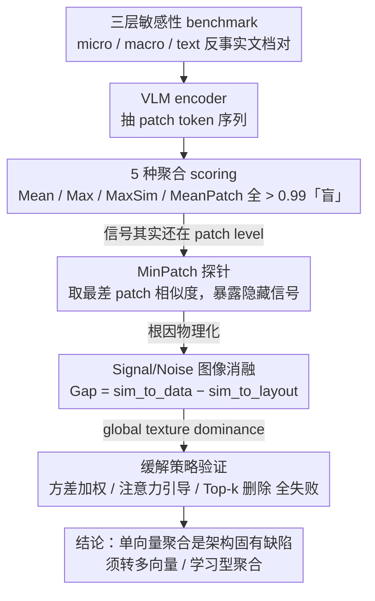

# A Picture is Worth a Thousand Words? An Empirical Study of Aggregation Strategies for Visual Financial Document Retrieval

**会议**: ACL 2026 Findings  
**arXiv**: [2605.14581](https://arxiv.org/abs/2605.14581)  
**代码**: 论文未在 abstract 中给出公开链接  
**领域**: 信息检索 / 视觉文档检索 / VLM 诊断  
**关键词**: visual RAG, 单向量聚合, ColPali, MinPatch 诊断, 金融文档

## 一句话总结
通过精心设计的金融文档诊断 benchmark（单数字扰动 + 文本掩码），实证证明「把 VLM 的 patch tokens 聚合成单向量」会让 $1.2M vs $7.2M 这种语义巨大差异坍缩成 cosine 相似度 > 0.99 的几乎相同向量，根因是「全局纹理主导」，多种缓解策略和 retrieval-tuned embedding 都救不回来。

## 研究背景与动机
**领域现状**：金融领域 RAG 主流是「OCR/PDF parse → 线性文本」，但表格被压扁后行列对齐丢失，检索精度下降。新一代 visual RAG（ColPali、VisRAG、DSE）把页面当图像、VLM 视觉编码器输出 patch tokens 来做检索。

**现有痛点**：ColPali 类**多向量**方案要保留几百 patch tokens，存储成本爆炸；DSE 类**单向量**方案把 patch tokens 聚合成一个向量，便宜但可能丢失关键 numeric/textual 信息。问题是：到底丢没丢、丢了什么、为什么丢——长期没有干净的诊断证据。

**核心矛盾**：金融文档与一般自然图像本质不同——关键语义被编码在稀疏的数字/实体上（单个数字改变就改变全文意义），但视觉信号上这些数字只是几个 pixel，背景版式（表格线、logo、headers）才是主导。聚合操作会按视觉显著性偏向背景，把稀疏 numeric 信号磨平。

**本文目标**：(1) 量化「单向量聚合在金融文档上信息丢失有多严重」；(2) 找出失败机制；(3) 验证简单缓解策略是否有效。

**切入角度**：把检索问题转成「sensitivity analysis」——构造原始 vs 改动单字段的反事实文档对，看 encoder 能否区分。如果能区分，说明 encoder 看到了；如果不能，进一步用 MinPatch（patch-level 最差相似度）探针看「signal 在哪一层被磨掉」。

**核心 idea**：「先用 MinPatch 证明 encoder patch level 是有信号的，再证明聚合把信号磨掉」，并通过 Signal/Noise 图像消融定位「global texture dominance」是根因。

## 方法详解

### 整体框架
本文是一篇诊断性实证研究，不提新模型，而是搭一套 benchmark + scoring 探针来揭示"VLM patch tokens 聚合成单向量"在金融文档检索上的失败模式及其根因。整条诊断链是逐层逼近的：先构造原始 vs 改动单字段的反事实文档对、跑多种 VLM encoder 抽 patch sequence，再用 5 种 scoring mechanism 测原始与反事实的相似度看聚合还能不能区分；当发现聚合"盲"掉后，用 MinPatch 探针证明信号其实还在 patch level，最后用 Signal/Noise 图像消融把根因物理化为可测量的视觉信号差，并验证几种简单缓解策略是否够用。输入是受控扰动的文档对，输出是一组把"失败发生在哪一层、为什么发生"钉死的证据。

### 关键设计

**1. 三层敏感性 benchmark：用受控扰动测聚合对金融关键信息的判别力**

金融文档的关键语义集中在稀疏的数字/实体上——单个数字改变就颠覆全文意义，而日常自然图像 benchmark 完全不覆盖这种细粒度差异，恰恰是单向量聚合最容易翻车的真空地带。本设计构造三类反事实对：micro-semantic 改单数字小幅（5.21→5.29、19.65%→19.54%、10,520→10,526），macro-semantic 改大幅（5.21→9.99、11.9→88.8、13,499→99,999），text sensitivity 用 Zeiler-Fergus 语义遮挡、把"Revenue increased by \$1.4 billion"与同位置用背景同色 [MASK] 覆盖对照。每类 100 对 × 2 数据集（FinQA、TAT-DQA）共 600 对诊断样本，专门把扰动限制在语义层而非视觉显著性层，从而干净地隔离出聚合的判别能力。

**2. MinPatch 探针：把 encoder 责任与聚合责任干净分离**

聚合失败时无法直接判断是 encoder 根本没看见差异、还是 encoder 看见了但聚合把它磨平，两类失败混在一起就无从下手。MinPatch 取空间对齐 patch 对 cos 相似度的最小值 $S_\text{min} = \min_i \cos(v_i^A, v_i^B)$，专门挖出 encoder 注意到的最大局部差异——它不是实用的 retrieval metric，而是一个"最坏情况 patch"诊断 probe。逻辑是：若 MinPatch 大幅下降（macro 到 0.51、text 到 0.09、LLaVA 上甚至负数）而 Mean/Max Pooling 仍 > 0.99，就说明 encoder 在 patch level 早已看到差异，责任完全落在聚合层；这比 MaxSim 等平均型 metric 更能逼出被聚合淹没的隐藏信号。

**3. Signal/Noise 图像消融：把根因物理化为 global texture dominance**

要证明"聚合在看背景而非数据"不能只停在语义解释，得有可测量的视觉证据。本设计造两个对照图：Signal 只留表格、背景纯色，Noise 擦掉表格、保留模板，再算 cos(reference, Signal) 与 cos(reference, Noise)，定义 $\text{Gap} = \text{sim\_to\_data} - \text{sim\_to\_layout}$。结果 Qwen2.5-VL-7B 在 FinQA 上 Gap = −0.22、Phi-3.5 为 −0.27，即聚合向量反而更像"只剩 layout"的图、更远离"只剩 data"的图，直接坐实聚合优先吸收背景纹理（表格线、logo）把稀疏数字像素淹没的 global texture dominance。这种"消融成 Signal/Noise 两端再算 Gap"的手法也可迁移到其他模态的视觉信息丢失诊断。

### 损失函数 / 训练策略
无训练，全是 inference 探针实验，所有相似度均用 cosine。两数据集为 FinQA（手动截屏）与 TAT-DQA（直接从 PDF 提取的多页财报）。

## 实验关键数据

### 主实验：单向量聚合 vs MinPatch 诊断（FinQA 上多个 encoder 的相似度，越接近 1.0 越「盲」）

| 测试 | Mean Pool | Max Pool | MaxSim | MeanPatch | **MinPatch** |
|------|-----------|----------|--------|-----------|---------------|
| Micro-semantic（5.21→5.29） | > 0.99 | > 0.99 | > 0.99 | > 0.99 | **0.71** |
| Macro-semantic（5.21→9.99） | > 0.99 | > 0.99 | > 0.99 | > 0.99 | **0.51** |
| Text sensitivity（[MASK] 替换） | > 0.99 | > 0.99 | > 0.99 | > 0.99 | **0.09**（Qwen2.5-VL-32B）/ **负**（LLaVA） |

关键证据：聚合后所有 5 种 mechanism 都 > 0.99「盲」掉了，**只有 MinPatch 把 hidden signal 暴露出来**——证明信号一直在 patch level，但聚合磨没了。

### Retrieval-tuned embedding 模型同样翻车

| Sensitivity | Qwen3-VL-Embedding-8B | GME-Qwen2-VL-7B-Instruct |
|-------------|------------------------|---------------------------|
| Micro-Semantic (FinQA) | 0.9992 | 0.9970 |
| Macro-Semantic (FinQA) | 0.9976 | 0.9906 |
| Text Sensitivity (FinQA) | 0.9799 | 0.9363 |
| Macro-Semantic (TAT-DQA) | 0.9997 | 0.9906 |

即使专门为 retrieval 训练过的 embedding 模型也无能为力——证明失败**不是 training objective 问题，是单向量表征架构的固有问题**。

### 缓解策略消融（FinQA 上 Macro-Semantic，越接近 1.0 越失败）

| Encoder | VarWgt | AttnGd | TopK-R | 结论 |
|---------|--------|--------|--------|------|
| Qwen2.5-VL-7B | 0.9997 | 0.9998 | 0.9998 | 全无效 |
| Qwen2.5-VL-32B | 0.9997 | 0.9998 | 0.9998 | 全无效 |
| LLaVA-v1.5 | 1.0000 | 0.9999 | 0.9999 | 全无效 |
| DeepEncoder | 0.9994 | 0.9995 | 0.9994 | 全无效 |

方差加权、注意力引导、Top-k patch 去除三种简单修复都救不回来，说明问题是**根本性**的。

### Sanity check：自然图 vs 金融文档（cat vs dog vs $1.2M vs $1.3M，越低越好）

| Model | Cat vs Dog | $1.2M vs $1.3M | Domain Gap |
|-------|-----------|-----------------|------------|
| Qwen3-VL-Embedding-8B | 0.1192 | 0.9992 | 0.88 |
| GME-Qwen2-VL-7B | 0.2165 | 0.9970 | 0.78 |
| Qwen2.5-VL-7B | 0.4038 | 0.9999 | 0.60 |
| Qwen2.5-VL-32B | 0.5117 | 0.9999 | 0.49 |

自然图像聚合后还能区分（0.12–0.51），金融文档完全坍缩（≈ 1.0），证明这是金融文档特有的失败模式。

### 关键发现
- **encoder 是好的、聚合是坏的**：MinPatch 0.51 vs Mean Pool 0.99 是该论文最有力的证据——把诊断责任精确归到聚合层。
- **Global texture dominance** 是机制层面解释：聚合优先吸收背景纹理（表格线、logo），把稀疏的数字像素信号淹没；Signal/Noise Gap 直接量化了这一点。
- **简单修复都没用**：方差加权、注意力引导、Top-k 删除都失败，说明「再用聚合的框架」就无解，必须改架构（多向量 / 学习型聚合）。
- **DeepSeek-DeepEncoder 反而更差**：MinPatch 上得分最高（最不敏感），因为 OCR-optimized encoder 倾向学「像素级不变性」，反而削弱了对单数字的敏感度——OCR 训练目标和金融检索目标存在冲突。
- **TAT-DQA 比 FinQA 更难**：多页 + 更密表格让 Gap 缩小到 < 0.05，意味着「连版式都难以区分」。

## 亮点与洞察
- **诊断性论文的范式样本**：不提新方法，而是用受控实验给一个广泛使用的架构（单向量 visual retrieval）下结论性的负面证据。MinPatch + Signal/Noise 这两个探针设计干净有力，方法论上可推广到其他模态退化分析（如音频、视频帧）。
- **「单数字改变 = 巨大语义差异」是一个被忽视的领域属性**：自然图像 benchmark 上的「检索不敏感性」掩盖了金融/法律/医学等数字密集领域的真正失败模式；提醒做 visual retrieval 的人**必须按领域评估**。
- **「retrieval-tuned ≠ retrieval-safe」**：以为换个 fine-tuned embedding 就解决，结果实测也跪——这种「行业默认假设的反驳」是高价值的负面结果。
- **结论指向架构变革**：作者明确建议未来工作转向「多向量 retrieval 或学习型聚合」，给后续研究指了方向。

## 局限与展望
- 数据集只有 FinQA 和 TAT-DQA，没有覆盖发票、资产负债表、手写笔记等更多金融文档类型。
- 没做完整 retrieval 评估（Recall@k、nDCG），只做了相似度对级别诊断，实际线上排序影响要补充。
- 缓解策略仅试了 3 个简单方案，没有探索学习型聚合（如 perceiver resampler、learned pooling tokens）的极限。
- 结论可能不能跨域：作者自己也承认（Appendix E），自然图像不存在 global texture dominance，故方法的诊断结论域限较强。
- 没有讨论分辨率/视觉 token 数量与失败程度的关系（更高分辨率是否能稀释 global texture？）

## 相关工作与启发
- **vs ColPali（多向量 late interaction）**: ColPali 保留所有 patch tokens，避免聚合失败，但存储/延迟成本高；本文论证 ColPali 路线（或学习型聚合）才是金融文档检索的正确方向。
- **vs DSE（单向量 dense embedding）**: DSE 就是被本文针对的对象——便宜但盲。本文给 DSE 类方案在金融场景敲响警钟。
- **vs DeepSeek-OCR**: DeepSeek-OCR 证明 patch tokens 能保留细粒度文本，但本文指出「保留 ≠ 聚合后还能用」，OCR 训练目标可能与检索目标冲突。
- **vs Lost in Embeddings (Li et al. 2025)**: 同样研究 VLM 信息丢失，但聚焦通用图像；本文聚焦金融文档，发现更尖锐的领域特定失败。
- **vs MorphMark / SWEET 等水印** 和 **vs Zeiler-Fergus 语义遮挡**: 本文借鉴 Zeiler-Fergus 的 occlusion 思路构造对照（创新地用「与背景同色 mask」而非黑色 patch），保证扰动只在语义层面而非视觉显著性层面。

## 评分
- 新颖性: ⭐⭐⭐⭐ 没有新模型，但 MinPatch 探针 + Signal/Noise 消融 + 跨架构 sanity check 的诊断方法论组合是新的、清晰的。
- 实验充分度: ⭐⭐⭐⭐ 5 种 encoder + 2 种 retrieval-tuned + 3 类 sensitivity + 3 种缓解策略 + 2 数据集 + sanity check，覆盖很全。
- 写作质量: ⭐⭐⭐⭐⭐ 诊断逻辑层层递进（aggregation 失败 → patch 有信号 → 根因 global texture → 缓解失败 → 架构必须换），论证非常严谨。
- 价值: ⭐⭐⭐⭐⭐ 对 visual RAG 部署在金融/法律等高精度领域有直接警示价值；负面结果干净有力。

<!-- RELATED:START -->

## 相关论文

- [\[ACL 2025\] Towards Storage-Efficient Visual Document Retrieval: An Empirical Study on Reducing Patch-Level Embeddings](../../ACL2025/information_retrieval/towards_storage-efficient_visual_document_retrieval_an_empirical_study_on_reduci.md)
- [\[ACL 2026\] Prune-then-Merge: Towards Efficient Multi-Vector Visual Document Retrieval](sculpting_the_vector_space_towards_efficient_multi-vector_visual_document_retrie.md)
- [\[ACL 2026\] Navigating Large-Scale Document Collections: MuDABench for Multi-Document Analytical QA](navigating_large-scale_document_collections_mudabench_for_multi-document_analyti.md)
- [\[ACL 2026\] How Large Language Models Balance Internal Knowledge with User and Document Assertions](how_large_language_models_balance_internal_knowledge_with_user_and_document_asse.md)
- [\[ACL 2026\] Is Agentic RAG Worth It? An Experimental Comparison of RAG Approaches](is_agentic_rag_worth_it_an_experimental_comparison_of_rag_approaches.md)

<!-- RELATED:END -->
