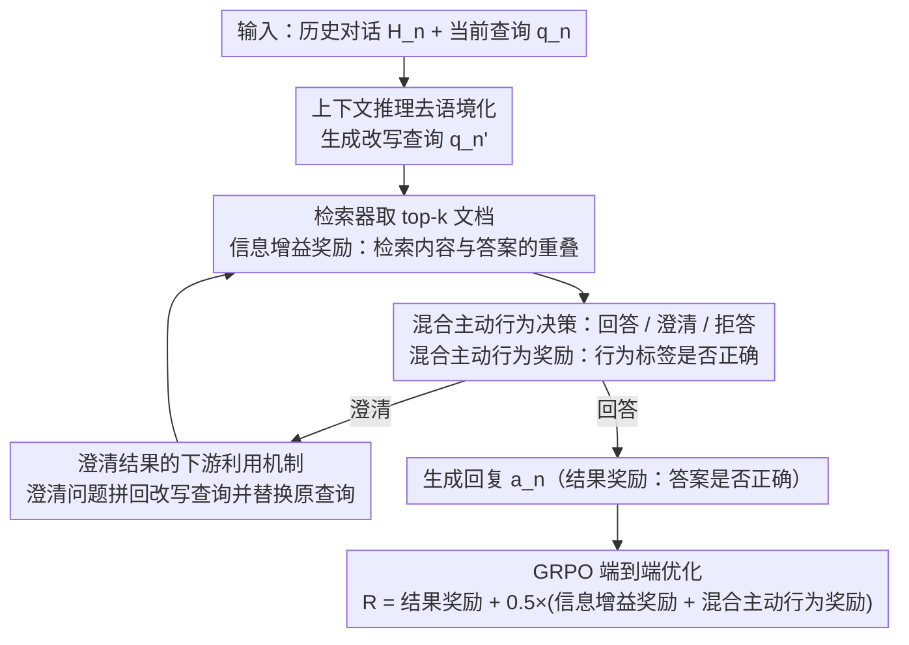

# Agentic Conversational Search with Contextualized Reasoning via Reinforcement Learning

**会议**: ACL 2026 Findings  
**arXiv**: [2601.13115](https://arxiv.org/abs/2601.13115)  
**代码**: 无  
**领域**: Conversational Search / LLM Agent  
**关键词**: 对话式搜索, 强化学习, 上下文推理, 混合主动行为, 信息增益奖励

## 一句话总结

提出ConvAgent，通过将RL训练奖励分解为结果奖励、信息增益奖励和混合主动行为奖励三个互补组件，训练对话式搜索智能体在多轮交互中交替进行搜索和推理。

## 研究背景与动机

**领域现状**：LLM正成为人机交互的主要界面，但在多轮对话式搜索中，用户意图随对话演进而变化，需要动态协调检索和生成。

**现有痛点**：(1) 传统方法采用静态的"改写→检索→生成"管道，各模块独立优化，无法联合优化；(2) 新兴的深度搜索agent（如Search-R1）虽能联合优化检索和生成，但仅针对单轮场景，缺乏多轮对话能力；(3) 现有方法忽略了混合主动行为（如在合适时机提出澄清问题）。

**核心矛盾**：多轮对话搜索同时需要上下文理解（去语境化）、搜索优化（检索质量）和行为决策（何时回答/澄清/拒绝），现有方法无法同时优化这三个维度。

**本文目标**：在单一智能体框架内通过上下文推理同时优化多个方面。

**切入角度**：将总奖励分解为三个互补组件，通过GRPO算法训练智能体在多轮中交替执行搜索和推理。

**核心 idea**：中间过程奖励（信息增益+混合主动行为）弥补了仅有结果奖励的稀疏监督不足，使模型能学到更策略性的搜索和交互行为。

## 方法详解

### 整体框架

ConvAgent 把多轮对话搜索建模成一个单智能体的交替"搜索-推理"过程：在第 $n$ 轮，模型接收历史对话 $\mathcal{H}_n$ 和当前查询 $q_n$，先做上下文推理把模糊指代去语境化（de-contextualization），再生成检索查询、调用检索器、分析返回文档，并决定本轮采取回答、澄清还是拒答中的哪种行为，最终产出回复。整条轨迹用 GRPO 端到端优化，而总奖励被拆成结果奖励、信息增益奖励、混合主动行为奖励三部分，用中间过程信号补上仅有最终答案时的稀疏监督。

### 关键设计

**1. 信息增益奖励：用检索结果与答案的重叠当作查询质量的代理信号**

仅靠最终答案是否正确来回传梯度，监督过于稀疏，模型很难学到"怎样改写才能检到对的证据"。信息增益奖励直接衡量本轮 top-$k$ 检索文档与 ground-truth 答案之间的信息重叠 $\mathcal{R}_{IG} = \mathcal{S}_{Info}(\{P_n\}_1^k, a_n^*)$，长答案用 F1-score、短答案用子串匹配准确率。这样每一轮检索质量都有即时反馈，模型即便没有人工标注的改写查询，也能学出更好的查询改写策略。

**2. 混合主动行为奖励：让模型学会在合适时机回答、澄清或拒绝**

对话里并非每轮都该直接作答——查询模糊时应该反问澄清，证据不足时应该拒答。该设计把行为决策建模成分类任务，检测生成序列里是否带出正确的行为标签（如 `<clarify>`、`<noanswer>`），正确给 $+1$、错误给 $-0.5$。这一项把"何时该问、何时该答"的策略性行为显式纳入优化目标，使 agent 的交互方式更贴近真实用户体验。

**3. 澄清结果的下游利用机制：把"问了"进一步变成"问得有用"**

如果澄清只在评测里看"有没有问"，就无法衡量澄清本身的价值。这里把模型生成的澄清问题 $q_n^c$ 作为扩展拼接进改写查询 $q_n'$ 用于检索，同时替换原始查询参与最终答案生成，让澄清真正作用到下游的检索与生成质量上，从而把澄清从一个孤立动作闭环成对任务有实际贡献的环节。

### 损失函数 / 训练策略

总奖励为 $\mathcal{R}(\tau) = \mathcal{R}_{outcome} + 0.5 \times (\mathcal{R}_{IG} + \mathcal{R}_{MIA})$，即在结果奖励基础上加权融合两个中间过程奖励。优化采用 GRPO（Group Relative Policy Optimization），无需额外的显式奖励模型和价值模型；论文也实验了 PPO 作为替代，发现 GRPO 更稳定且更简洁。

## 实验关键数据

### 主实验

| 方法 | TopiOCQA F1 | INSCIT F1 | QReCC F1 | CORAL F1 |
|------|------------|-----------|----------|----------|
| SFT-3b | 18.2 | 23.7 | 17.0 | 15.2 |
| Search-R1-3b | 26.1 | 5.8 | 5.9 | 3.9 |
| ConvAgent-3b | 25.2 | 23.5 | 24.1 | 22.4 |
| SFT-7b | 23.6 | 24.5 | 19.1 | 18.8 |
| Search-R1-7b | 37.0 | 9.1 | 8.6 | 3.8 |
| ConvAgent-7b | - | - | - | - |

### 消融实验

| 配置 | 关键指标 | 说明 |
|------|---------|------|
| 移除IG奖励 | F1下降 | 搜索优化信号对检索质量重要 |
| 移除MIA奖励 | 混合主动行为退化 | 行为适配对对话质量重要 |
| PPO vs GRPO | GRPO更稳定 | GRPO无需额外奖励模型更简洁 |

### 关键发现
- Search-R1在对话场景表现不稳定——在TopiOCQA上强但在其他三个数据集上崩溃，说明单轮agent不适应多轮
- ConvAgent在4个数据集上表现均衡，证明中间奖励的重要性
- 信息增益奖励有效改善了查询改写质量——即使不用ground-truth改写查询作为监督

## 亮点与洞察
- 奖励分解策略优雅地解决了RL训练中的稀疏奖励问题——不需要人工标注的中间步骤监督
- 信息增益奖励的设计巧妙——用检索结果与答案的重叠作为查询质量的代理信号
- 混合主动行为的引入使对话agent更接近真实用户体验——知道什么时候该问、什么时候该答

## 局限与展望
- 当前仅在3B和7B模型上验证，更大模型的效果待测试
- 混合主动行为仅包含三种类型，真实对话中的行为更丰富
- 用户模拟的质量可能影响训练效果
- 未来可扩展到多模态对话搜索和更复杂的交互模式

## 相关工作与启发
- **vs Search-R1**: 将单轮深度搜索扩展到多轮对话，通过历史条件化查询和中间奖励解决多轮挑战
- **vs ChatR1**: ChatR1依赖ground-truth改写查询作为训练信号，ConvAgent的IG奖励不需要
- **vs 传统对话搜索**: 将分离的改写/检索/生成模块统一为单一智能体，端到端RL优化

## 评分
- 新颖性: ⭐⭐⭐⭐ 奖励分解和混合主动行为的结合是新贡献
- 实验充分度: ⭐⭐⭐⭐ 4个数据集、多基线对比、消融分析
- 写作质量: ⭐⭐⭐⭐ 问题定义清晰，方法描述系统
- 价值: ⭐⭐⭐⭐ 对对话式AI助手的实用开发有指导意义

<!-- RELATED:START -->

## 相关论文

- [\[ACL 2026\] ChatR1: Reinforcement Learning for Conversational Reasoning and Retrieval Augmented Question Answering](chatr1_reinforcement_learning_for_conversational_reasoning_and_retrieval_augment.md)
- [\[ACL 2026\] Learning to Extract Rational Evidence via Reinforcement Learning for Retrieval-Augmented Generation](learning_to_extract_rational_evidence_via_reinforcement_learning_for_retrieval-a.md)
- [\[ACL 2026\] Multi-Faceted Self-Consistent Preference Alignment for Query Rewriting in Conversational Search](multi-faceted_self-consistent_preference_alignment_for_query_rewriting_in_conver.md)
- [\[ACL 2026\] Language-Coupled Reinforcement Learning for Multilingual Retrieval-Augmented Generation](language-coupled_reinforcement_learning_for_multilingual_retrieval-augmented_gen.md)
- [\[ICML 2026\] Graph-R1: Towards Agentic GraphRAG Framework via End-to-end Reinforcement Learning](../../ICML2026/information_retrieval/graph-r1_towards_agentic_graphrag_framework_via_end-to-end_reinforcement_learnin.md)

<!-- RELATED:END -->
