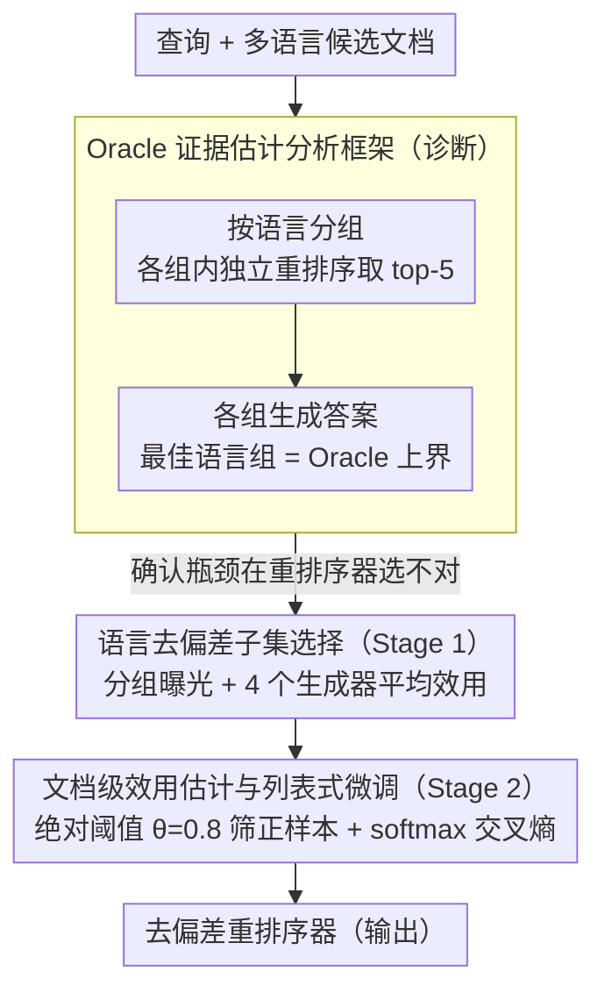

# All Languages Matter: Understanding and Mitigating Language Bias in Multilingual RAG

**会议**: ACL 2026  
**arXiv**: [2604.20199](https://arxiv.org/abs/2604.20199)  
**代码**: 无  
**领域**: 信息检索 / 多语言NLP  
**关键词**: 多语言RAG, 重排序偏差, 语言公平性, 证据选择, 跨语言检索

## 一句话总结
系统揭示多语言 RAG 系统在重排序阶段存在严重的语言偏差（偏好英语和查询语言），提出 LAURA 框架通过下游生成质量驱动的监督信号对齐重排序器，有效缓解偏差并提升生成性能。

## 研究背景与动机

**领域现状**：多语言 RAG 通过跨语言证据增强 LLM 的全球知识覆盖。真实世界中，很多知识只在特定语言中有记录（如地区政策、文化背景），因此理想的 mRAG 系统应该跨语言选择信息价值最大的文档。

**现有痛点**：当前 mRAG 系统在重排序阶段表现出明显的语言偏好偏差。以 BGE 重排序器为例，13 种语言平均下来，top-5 文档中超过 70% 来自英语和查询语言。这意味着即使候选池中已经有其他语言的高质量证据，也会被系统性地压低排名。

**核心矛盾**：问题的根源不是候选池中缺乏相关信息——Oracle 实验表明，仅从已检索的候选中选择正确文档就能提升 12.9-20 个百分点。真正的瓶颈是重排序器的语言偏好导致它无法识别非英语/非查询语言的关键证据。且重排序分数与下游生成质量的 Pearson 相关系数不到 0.2。

**本文目标**：(1) 量化和诊断 mRAG 中的语言偏差；(2) 设计一种方法使重排序器的文档选择与下游生成质量对齐，而非仅依赖语义相关性信号。

**切入角度**：提出 Oracle 证据估计方法——按语言分组独立重排序并生成答案，以最佳语言组的表现作为上界，从而精确量化偏差造成的性能损失。

**核心 idea**：用答案效用（answer utility）替代语义相关性作为重排序器的训练信号，消除语言先验的影响。

## 方法详解

### 整体框架
LAURA 的思路是先诊断、再对齐：先用 Oracle 证据估计量化重排序器的语言偏差有多严重，再把重排序器的训练信号从"语义相关性"换成"下游答案效用"。落地为一条两阶段数据构建管道加一次列表式微调——阶段一按语言分组做去偏差采样，保证各语言候选都有平等曝光；阶段二对保留文档逐个估计生成效用、按绝对阈值筛出真正有用的正样本；最后用 softmax 交叉熵损失微调重排序器，让它学会给"能帮生成对答案"的文档打高分，而不再被英语/查询语言的先验牵着走。

### 关键设计

**1. Oracle 证据估计分析框架：把"缺信息"和"选不对"两个病因彻底分开**

要治偏差，先得确认偏差到底来自哪里。该框架对每个查询把候选文档按语言分组，每组内独立重排序取 top-5 生成答案，以表现最好的语言组作为 Oracle 上界。对比 Oracle 分布与实际分布会发现：Oracle 证据其实分散在多种语言里，而不是集中在查询语言——仅从已检索候选中挑对文档就能带来 12.9~20 个百分点的提升。这就证明瓶颈不是候选池缺信息，而是重排序器跨语言能力不足、系统性地压低了非英语证据的排名。

**2. 语言去偏差子集选择（Stage 1）：用分组曝光阻止高资源语言主导候选池**

如果直接在全局 top-$k$ 上估计文档效用，已有的语言偏差会被进一步放大。Stage 1 因此先把检索文档按语言分组、每组内用重排序器取 top-5，保证各语言子集都有平等的曝光机会；再用 Qwen、Llama、DeepSeek 等 4 个生成器独立评估每个文档对生成的帮助，取平均作为效用分数。多模型平均既摊薄了单一模型的偏好，又避免了人工标注成本，让候选正样本集在跨语言上保持均衡。

**3. 文档级效用估计与列表式微调（Stage 2）：用绝对阈值筛正样本，杜绝隐性语言偏差**

Stage 2 对 Stage 1 保留的文档逐个评估生成效用，设一个绝对阈值 $\theta=0.8$ 过滤，只留下确实能帮模型答对的文档当正样本，再用 softmax 交叉熵损失做列表式微调、鼓励重排序器给正样本最高分。这里特意用绝对阈值而非相对排序——相对排序会把候选间的语言分布差异重新带回来，而绝对阈值让正样本的取舍完全锚定在答案质量上，从根上切断语言先验的回流。

### 损失函数 / 训练策略
列表式微调采用 softmax 交叉熵损失 $\mathcal{L} = -s(q, d_{pos}) + \log \sum_{d \in \mathcal{D}_q} \exp(s(q,d))$，把正样本得分相对全体候选拉高。负样本配置上，BGE 重排序器每个查询用 1 个负样本，Qwen 重排序器用 7 个；优化用 AdamW，学习率 $6 \times 10^{-6}$，训练 5 个 epoch。

## 实验关键数据

### 主实验

| 重排序器 | 设置 | Avg 3-gram Recall (Llama) | Avg 3-gram Recall (Qwen) |
|---------|------|--------------------------|--------------------------|
| BGE | 原始 | 48.9 | 46.7 |
| BGE | + LAURA | **49.9** | **47.7** |
| Qwen3 | 原始 | 47.1 | 44.9 |
| Qwen3 | + LAURA | **49.2** | **46.7** |
| - | Oracle 上界 | 63.6 | 61.3 |

### 消融实验

| 配置 | Llama 3-gram | Pearson 相关 | 说明 |
|------|-------------|-------------|------|
| BGE 原始 | 48.9 | 0.198 | 基线 |
| Self-Training | 48.9 | 0.188 | 伪标签会强化已有偏差 |
| mMARCO 微调 | 48.7 | 0.132 | 通用数据无法解决特定分布失配 |
| LAURA | 49.9 | 0.236 | 效用驱动有效提升 |

### 关键发现
- Oracle 与实际之间存在 ~15 个百分点的巨大差距，说明候选池中已有足够好的证据但被重排序器忽略
- LAURA 训练后 Qwen 重排序器的 Pearson 相关系数从 0.127 提升到 0.264（+108%），重排序分数与生成质量的对齐显著增强
- 训练后重排序器输出的语言分布更接近 Oracle 分布，JS 散度从 0.203 降至 0.090（BGE）
- 英语和查询语言的文档比例降低，其他语言获得更公平的排名机会

## 亮点与洞察
- Oracle 证据估计框架是一个优雅的诊断工具，将"缺信息"和"选不对"两个因素清晰分离。这个分析方法可以迁移到任何涉及多源信息选择的场景
- 用多模型平均生成质量作为文档效用信号，既减少了模型偏差，又避免了人工标注成本
- 重排序分数与生成质量的低相关性（<0.2）是一个重要发现，说明当前重排序器的"语义相关性"和"答案有用性"是两回事

## 局限与展望
- Oracle 上界仍是估计值而非真实上界，可能低估或高估实际可达性能
- 仅在 MKQA 数据集上验证，覆盖语言和领域有限
- LAURA 需要多个生成模型来估计效用，数据构建成本较高
- 未来可探索轻量级效用估计方法或直接用 RL 在线优化重排序器

## 相关工作与启发
- **vs 传统多语言检索**: 传统方法关注检索召回率，本文揭示重排序是真正的瓶颈
- **vs mMARCO 微调**: 通用排序数据无法解决 mRAG 的特定语言偏差问题
- **vs 翻译型 mRAG**: 翻译策略回避了多语言证据选择问题，本文直接优化选择机制

## 评分
- 新颖性: ⭐⭐⭐⭐ Oracle 分析框架和效用驱动对齐都是有意义的新贡献
- 实验充分度: ⭐⭐⭐⭐ 13种语言、多重排序器、多生成器、消融充分
- 写作质量: ⭐⭐⭐⭐⭐ 问题分析层层递进，诊断-治疗逻辑清晰
- 价值: ⭐⭐⭐⭐ 揭示了 mRAG 中被忽视的重排序偏差问题

<!-- RELATED:START -->

## 相关论文

- [\[ACL 2026\] Enhancing Multilingual RAG Systems with Debiased Language Preference-Guided Query Fusion](enhancing_multilingual_rag_systems_with_debiased_language_preference-guided_quer.md)
- [\[ACL 2026\] Language-Coupled Reinforcement Learning for Multilingual Retrieval-Augmented Generation](language-coupled_reinforcement_learning_for_multilingual_retrieval-augmented_gen.md)
- [\[ACL 2026\] VideoStir: Understanding Long Videos via Spatio-Temporally Structured and Intent-Aware RAG](videostir_understanding_long_videos_via_spatio-temporally_structured_and_intent-.md)
- [\[ACL 2025\] Investigating Language Preference of Multilingual RAG Systems](../../ACL2025/information_retrieval/investigating_language_preference_of_multilingual_rag_systems.md)
- [\[ACL 2026\] CORAL: Adaptive Retrieval Loop for Culturally-Aligned Multilingual RAG](coral_adaptive_retrieval_loop_for_culturally-aligned_multilingual_rag.md)

<!-- RELATED:END -->
