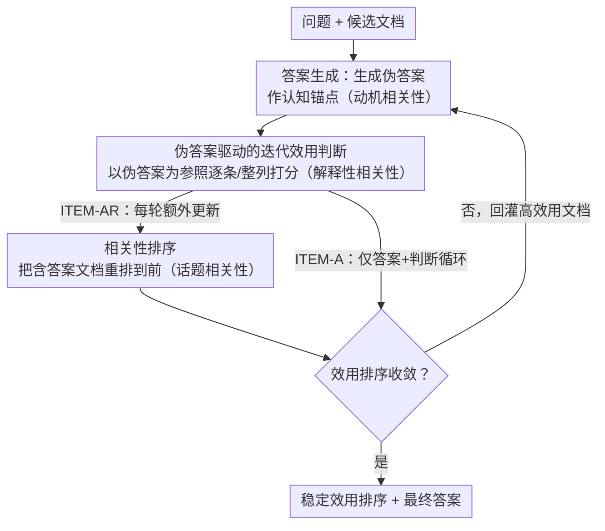

# An Iterative Utility Judgment Framework Inspired by Philosophical Relevance via LLMs

**会议**: ACL 2026 Findings  
**arXiv**: [2406.11290](https://arxiv.org/abs/2406.11290)  
**代码**: [GitHub](https://github.com/Trustworthy-Information-Access/ITEM)  
**领域**: Information Retrieval / RAG  
**关键词**: 效用判断, 哲学相关性理论, 迭代框架, RAG优化, LLM推理

## 一句话总结

受Schutz哲学相关性理论启发，提出ITEM迭代效用判断框架，通过让RAG中的三个组件（相关性排序、效用判断、答案生成）动态交互增强，在检索、效用判断和QA任务上均优于基线。

## 研究背景与动机

**领域现状**：在RAG场景中，LLM的输入带宽有限，需要优先提供高效用（而非仅高相关性）的检索结果。相关性衡量"是否关于这个话题"，效用衡量"是否有助于回答问题"。

**现有痛点**：(1) 现有RAG方法主要优化话题相关性，忽略了效用这一更高标准；(2) Zhang等人虽提出了LLM效用判断，但仅进行了初步探索；(3) RAG的三个组件（检索、判断、生成）通常独立优化，缺乏联合增强。

**核心矛盾**：话题相关的文档不一定有效用——一篇讨论相同话题但不含具体答案的文档是相关但无用的。现有方法难以区分两者。

**本文目标**：通过RAG三组件的迭代交互来提升LLM的效用判断能力。

**切入角度**：将RAG映射到Schutz的哲学"相关性系统"——话题相关性、解释性相关性（效用）和动机相关性（答案）对应三个认知层次，三者可以相互增强。

**核心 idea**：RAG的三个组件反映了LLM在问答中的三个认知层次（aboutness → value → answer），通过迭代让它们相互增强。

## 方法详解

### 整体框架

ITEM 把 RAG 里本来各自为政的检索、效用判断、答案生成三件事拧成一个迭代闭环。输入是一个问题加一组候选文档，每一轮 LLM 先生成一个伪答案当作认知锚点，再拿这个伪答案去重新判断文档的效用（必要时连相关性排序一起更新），然后用更新后的判断重新生成伪答案，如此往复直到收敛，输出稳定的效用排序与最终答案。框架有两个变体：ITEM-A 只在「答案生成 + 效用判断」两个组件间循环，ITEM-AR 额外把相关性排序也拉进每一轮，让信号在三个组件间流转。

### 关键设计

**1. 伪答案驱动的迭代效用判断：用上一轮的答案当锚点，逐轮逼近真效用**

单次效用判断的麻烦在于，LLM 还没读出问题真正要什么就被迫给文档打分，很容易被表面话题相关性带偏。ITEM 的做法是先让 LLM 凭已有文档生成一个伪答案，把「这个问题大概想要什么样的内容」显式写出来，再以此为参照对每篇文档做效用判断（pointwise 逐条打分或 listwise 整列重排），最后用筛选后的高效用文档重新生成伪答案。伪答案一轮比一轮准，效用判断也随之水涨船高——本质是让模型在多轮里逐步积累对问题与文档的理解，而不是一锤定音。

**2. Schutz 相关性系统到 RAG 的映射：为什么三组件迭代会相互增强**

迭代为什么有效并非拍脑袋，而是借了 Schutz 的哲学相关性理论作支撑。Schutz 把人的认知拆成三层相关性：话题相关性（注意力聚焦到某个对象）、解释性相关性（理解这个对象的价值）、动机相关性（基于理解去行动）。这三层恰好对应 RAG 的相关性排序 → 效用判断 → 答案生成。理论预测这三层会彼此强化——理解得越深，注意力聚焦得越准，行动也越到位——这正是 ITEM 让三组件循环互喂的理论依据：答案帮判断、判断帮排序、排序又喂回更好的答案。

**3. ITEM-A 与 ITEM-AR 的策略分化：按任务复杂度选组件数与轮数**

并非所有任务都需要把三个组件全拉进来。ITEM-A 只迭代答案与判断，组件少但可以多轮深挖；ITEM-AR 每轮多带一个相关性排序，单轮信息更丰富但更重。作者发现两者各有适用面：候选列表复杂、非事实型的困难任务（如 WebAP、GTI-NQ）需要 ITEM-AR 的更多组件 + 更多迭代才压得住噪声；而简单事实型 QA 用 ITEM-A 的轻量循环、靠更多轮次反而最优。这一分化把「迭代该投多少资源」变成了可按任务调的旋钮。

### 一个完整示例

以一道事实型问题为例：初始检索给出 5 篇话题相关文档，但其中只有 2 篇真正含答案线索。第 1 轮，LLM 基于全部 5 篇生成一个粗糙伪答案；第 2 轮，用这个伪答案重新判断效用，把另外 3 篇「相关但不含答案」的文档降权，再用剩下的高效用文档生成更准的伪答案；若用 ITEM-AR，则此轮还会顺手把含答案的文档重排到前面。几轮后效用排序稳定、伪答案收敛，输出即为最终答案——整个过程无需训练，靠 prompt 设计在每轮切换「生成 / 判断 / 排序」任务即可。

### 损失函数 / 训练策略

ITEM 完全基于 LLM 的 in-context learning，不引入任何训练，每一轮要做什么任务（答案生成、效用判断还是相关性排序）全由 prompt 控制。

## 实验关键数据

### 主实验

| 任务 | 数据集 | ITEM提升 | 说明 |
|------|--------|---------|------|
| 检索排序 | TREC DL | 优于基线 | 效用判断反过来提升排序 |
| 效用判断 | GTI-NQ | 优于基线 | 迭代显著改善判断质量 |
| QA | NQ | 优于基线 | 高效用文档带来更好答案 |
| 非事实型检索 | WebAP | 优于基线 | 困难任务收益更大 |

### 消融实验

| 配置 | 关键指标 | 说明 |
|------|---------|------|
| 1轮 vs 多轮 | 多轮更好 | 迭代确实有效 |
| ITEM-A vs ITEM-AR | 取决于任务 | 困难任务需要ITEM-AR |
| vs 长推理模式 | 性能可比，成本低得多 | 迭代比一次性长推理更高效 |

### 关键发现
- 困难任务（如WebAP非事实型答案检索）和复杂候选列表（如GTI-NQ）中，更多组件+更多迭代最有效
- ITEM达到了与长推理模式可比的性能，但计算成本低得多
- 简单事实型QA任务中，更少组件+更多迭代反而最好

## 亮点与洞察
- 哲学理论到工程方法的创造性映射——Schutz的相关性系统为RAG优化提供了新视角
- 发现了任务复杂度与最优迭代策略之间的关系
- 无需训练即可提升RAG质量，实用性强

## 局限与展望
- 迭代增加了推理成本（多次LLM调用），延迟可能不可接受
- 伪答案的质量可能限制迭代收益的上限
- 仅在英文数据集上测试
- 未来可结合微调检索器进一步提升

## 相关工作与启发
- **vs 单次效用判断**: 迭代框架通过多轮认知积累显著提升判断质量
- **vs 多轮检索RAG**: 不改变检索本身，而是在已检索结果上迭代改善效用判断
- **vs 长推理/思维链**: 以更低成本达到可比效果

## 评分
- 新颖性: ⭐⭐⭐⭐ 哲学理论映射到RAG的创新视角
- 实验充分度: ⭐⭐⭐⭐ 4个数据集、多任务评估
- 写作质量: ⭐⭐⭐⭐ 理论框架清晰，实验组织好
- 价值: ⭐⭐⭐⭐ 对RAG优化有实用指导意义

<!-- RELATED:START -->

## 相关论文

- [\[ACL 2025\] SGIC: A Self-Guided Iterative Calibration Framework for RAG](../../ACL2025/information_retrieval/sgic_a_self-guided_iterative_calibration_framework_for_rag.md)
- [\[ACL 2026\] Bayesian Active Learning with Gaussian Processes Guided by LLM Relevance Scoring](bayesian_active_learning_with_gaussian_processes_guided_by_llm_relevance_scoring.md)
- [\[NeurIPS 2025\] SymRTLO: Enhancing RTL Code Optimization with LLMs and Neuron-Inspired Symbolic Reasoning](../../NeurIPS2025/information_retrieval/symrtlo_enhancing_rtl_code_optimization_with_llms_and_neuron-inspired_symbolic_r.md)
- [\[ACL 2026\] Utility-Oriented Visual Evidence Selection for Multimodal Retrieval-Augmented Generation](utility-oriented_visual_evidence_selection_for_multimodal_retrieval-augmented_ge.md)
- [\[ACL 2026\] From Relevance to Authority: Authority-aware Generative Retrieval in Web Search Engines](from_relevance_to_authority_authority-aware_generative_retrieval_in_web_search_e.md)

<!-- RELATED:END -->
