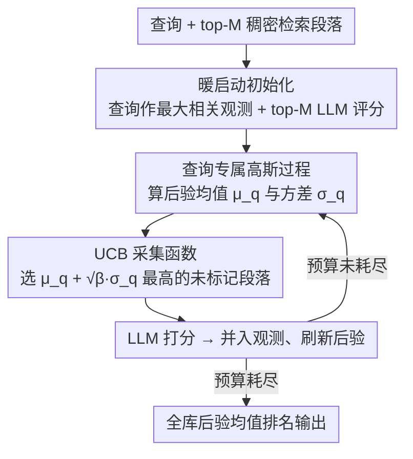

# Bayesian Active Learning with Gaussian Processes Guided by LLM Relevance Scoring

**会议**: ACL 2026 Findings  
**arXiv**: [2604.17906](https://arxiv.org/abs/2604.17906)  
**代码**: [GitHub](https://github.com/junieberry/BAGEL)  
**领域**: Information Retrieval  
**关键词**: 段落检索, 高斯过程, 主动学习, LLM重排序, 贝叶斯优化

## 一句话总结

提出 BAGEL，一个基于高斯过程（GP）的贝叶斯主动学习框架，在有限 LLM 预算下通过探索-利用平衡策略传播稀疏 LLM 相关性信号，实现全局嵌入空间的段落检索，显著超越传统 LLM 重排序方法。

## 研究背景与动机

**领域现状**: LLM 具有出色的零样本相关性建模能力，但高计算成本使段落检索成为一个预算受限的全局优化问题。主流方法采用 LLM 重排序范式：先用稠密检索器获取 top-K 候选，再用 LLM 重排序。

**现有痛点**: (1) 相关段落往往分布在语义空间的多个不同簇中，稠密检索器仅检索查询嵌入附近的邻域，无法发现远处的相关簇；(2) 现有方法无法将已评分段落的相关性信号传播到未见段落，忽视了嵌入空间的语义结构。

**核心矛盾**: 需要在有限的 LLM 推理预算下探索整个嵌入空间，但传统方法被动依赖一阶段检索器，无法进行全局探索。

**本文目标**: 利用 GP 的核函数相关性传播和不确定性估计能力，主动导航嵌入空间以发现多模态相关性分布。

**切入角度**: 将段落检索建模为贝叶斯优化问题，GP 提供预测均值和不确定性，采集函数平衡探索与利用。

**核心 idea**: GP 天然适合此任务——核函数传播相关性信号，后验方差引导主动学习探索不确定区域。

## 方法详解

### 整体框架

BAGEL 把「预算受限下的段落检索」重新建模成一个贝叶斯优化问题：在嵌入空间上学一个查询专属的相关性函数，用尽可能少的 LLM 评分把整个空间的相关段落都找出来。流程分两阶段——暖启动阶段把查询本身当作最高相关性观测、再加上 top-M 稠密检索段落的 LLM 评分，凑出初始观测集；主动学习阶段则反复用采集函数从未标记段落里挑一个最值得问的，交给 LLM 打分、更新高斯过程（GP）后验，预算耗尽后用收敛的后验均值对全库段落排名。整套机制让稀疏的 LLM 信号顺着嵌入空间的语义结构传播出去，从而发现稠密检索器够不着的远处相关簇。

### 关键设计

**1. 查询专属高斯过程：把相关性建成可传播、带不确定性的连续函数**

稠密检索器的死穴是只看查询邻域，相关段落一旦散落在语义空间的多个簇里就抓不全，而且已评分段落的信号无法外溢到未见段落。BAGEL 用 GP 解决这两点：以段落嵌入 $\mathbf{x}_p$ 为输入、LLM 相关性评分为输出，GP 给出后验预测均值 $\mu_q(\mathbf{x}_{p_*})$ 与方差 $\sigma_q^2(\mathbf{x}_{p_*})$，前者是相关性估计、后者是不确定性。其中 RBF 这类稳态核天然假设嵌入空间里相近的段落相关性也相近，于是少数已评分点的信号能顺着核函数平滑地传到周围未评分段落，等于用一次 LLM 调用照亮了一片邻域。

**2. UCB 采集函数引导的主动探索：用不确定性把预算花在刀刃上**

有了均值和方差，下一步问谁就成了探索-利用的权衡。纯利用（只问当前预测最相关的）会困在查询附近的局部最优、漏掉远处的簇；纯探索（只问最不确定的）又白白浪费宝贵的 LLM 预算。BAGEL 用 UCB 采集函数 $a^{\text{UCB}}(\mathbf{x}) = \mu_q(\mathbf{x}) + \sqrt{\beta}\,\sigma_q(\mathbf{x})$ 把两者捏在一起，每步选得分最高的未标记段落去打分，$\beta$ 调节偏探索还是偏利用。消融显示这种带不确定性项的采集函数是关键——正是 $\sigma_q$ 项驱动模型去试探远离查询的高不确定区域，才捞得到多模态分布里的远处相关簇。

**3. 暖启动初始化：用查询自身破解冷启动**

GP 在没有任何观测时后验等同先验、采集函数无从下手，这就是冷启动困境。BAGEL 的巧法是把查询嵌入 $\mathbf{x}_q$ 直接当作一个相关性拉满的「虚拟段落」观测，再配上 top-M 稠密检索段落的 LLM 评分，一起构成初始观测集 $\mathcal{D}_q^{(0)}$。查询本身天然是对自己最相关的东西，这个强正信号给 GP 一个可靠的锚点，让后续主动学习一开局就有方向，消融里它对初期性能的提升尤其明显。

### 一个完整示例

给定一条查询和一个大段落库、LLM 预算设为 50 次：先把查询嵌入作为最大相关性观测、加上 top-M 稠密段落的 LLM 评分初始化 GP；随后进入循环——GP 算出每个未标记段落的 $\mu_q$ 与 $\sigma_q$，UCB 挑出一个兼具高预测相关性或高不确定性的段落送 LLM 打分，把新评分并入观测、刷新后验，如此重复约 50 步；其间 GP 的核函数不断把这些评分外推到邻近段落，逐渐照亮散落各处的相关簇。预算用完后，直接用最终后验均值给全库段落排名输出——由于支持任意时间预测，也可在任意中途迭代后随时出一份排名。

### 损失函数 / 训练策略

无需训练。GP 超参数（核长度尺度 $\ell$、噪声 $\alpha$）按标准方式设定，LLM 评分支持 Expected Relevance (ER) 与 Peak Relevance (PR) 两种方式，且因 GP 可在任意迭代后对全部段落出排名，框架天然支持任意时间预测、适配不同预算约束。

## 实验关键数据

### 主实验（LLM 预算 = 50/查询）

| 数据集 | 指标 | BM25 | Dense Retr. | LLM Point. | BAGEL (Qwen3) | BAGEL (GPT-4o) |
|--------|------|------|-------------|-----------|---------------|----------------|
| Covid | N@50 | 42.8 | 48.7 | 52.9 | **61.4** | **62.1** |
| Robust04 | N@50 | 34.9 | 33.2 | 38.2 | **44.4** | **48.7** |
| TravelDest | N@10 | 21.1 | 22.3 | 45.8 | 49.8 | **57.0** |
| NFCorpus | N@50 | 27.7 | 29.0 | 32.7 | 32.8 | **35.9** |

### 消融实验

| 配置 | 发现 |
|------|------|
| RBF vs Linear vs Matérn 核 | RBF 和 Matérn 表现最优，Linear 较差 |
| UCB vs EI vs PI 采集函数 | 不确定性相关的采集函数（UCB）关键 |
| 有/无暖启动 | 暖启动显著提升初期性能 |

### 关键发现

- BAGEL 在所有四个数据集上均超越 LLM 重排序基线（相同 LLM 预算）
- TravelDest 数据集上 NDCG@50 从 29.3 提升至 41.6（+42%）
- 稳态核（RBF、Matérn）有效捕捉多模态相关性结构
- 不确定性引导的探索对发现远离查询的相关簇至关重要

## 亮点与洞察

- 将段落检索优雅地转化为贝叶斯优化问题，GP 天然契合此场景
- 解决了现有方法无法传播相关性信号和探索远处簇的两大限制
- 支持任意时间预测，适应不同预算约束
- 暖启动 + 查询作为最大相关性观测的设计简洁有效

## 局限与展望

- GP 的 $O(n^3)$ 计算复杂度限制了大规模观测集
- 假设嵌入空间中语义相近的段落具有相似相关性，可能不总成立
- 仅在英文检索上评估
- 未来可探索稀疏 GP 或神经核函数以提升可扩展性

## 相关工作与启发

- LLM 重排序（Zhuang et al., 2024; Sun et al., 2023）：主流但受限于一阶段候选集
- 贝叶斯优化/GP：经典方法在新场景（检索）中的创新应用
- 主动学习用于文档标注：但通常用于分类而非排序
- GP 在信息检索中的应用是一个值得深入探索的方向

## 评分

- 新颖性: ⭐⭐⭐⭐⭐ GP + 主动学习用于段落检索，视角独特
- 实验充分度: ⭐⭐⭐⭐ 四个数据集、两个 LLM、核/采集函数消融
- 写作质量: ⭐⭐⭐⭐ 图示直观，GP 与检索的联系阐述清晰
- 价值: ⭐⭐⭐⭐ 在预算受限场景下显著提升检索效果

<!-- RELATED:START -->

## 相关论文

- [\[ACL 2026\] An Iterative Utility Judgment Framework Inspired by Philosophical Relevance via LLMs](an_iterative_utility_judgment_framework_inspired_by_philosophical_relevance_via_.md)
- [\[ICLR 2026\] Fine-tuning with RAG for Improving LLM Learning of New Skills](../../ICLR2026/information_retrieval/fine-tuning_with_rag_for_improving_llm_learning_of_new_skills.md)
- [\[ACL 2026\] End-to-End Optimization of LLM-Driven Multi-Agent Search Systems via Heterogeneous-Group-Based Reinforcement Learning](end-to-end_optimization_of_llm-driven_multi-agent_search_systems_via_heterogeneo.md)
- [\[ACL 2026\] Learning to Extract Rational Evidence via Reinforcement Learning for Retrieval-Augmented Generation](learning_to_extract_rational_evidence_via_reinforcement_learning_for_retrieval-a.md)
- [\[ACL 2026\] From Relevance to Authority: Authority-aware Generative Retrieval in Web Search Engines](from_relevance_to_authority_authority-aware_generative_retrieval_in_web_search_e.md)

<!-- RELATED:END -->
