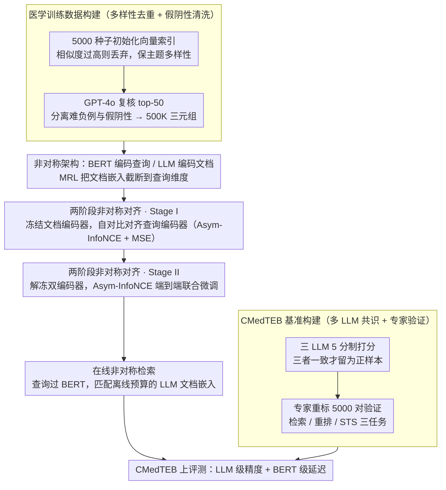

# Benchmarking and Enabling Efficient Chinese Medical Retrieval via Asymmetric Encoders

**会议**: ACL 2026  
**arXiv**: [2604.10937](https://arxiv.org/abs/2604.10937)  
**代码**: [GitHub](https://github.com/PhilipGAQ/CARE)  
**领域**: 医学图像  
**关键词**: 医学文本检索, 非对称编码器, 中文医学基准, 嵌入模型, RAG

## 一句话总结
提出 CMedTEB（中文医学文本嵌入基准）和 CARE（非对称检索框架），前者通过多 LLM 投票+专家验证构建高质量的中文医学检索/重排/STS 基准，后者用轻量 BERT 编码查询+大型 LLM 编码文档的非对称架构，通过两阶段渐进对齐策略实现 LLM 级检索精度+BERT 级在线延迟。

## 研究背景与动机

**领域现状**：文本嵌入模型是 NLP 的基础设施，在 RAG 系统中尤为重要。近年来 LLM-based 嵌入模型（如 Qwen3-Embedding、NV-Embed）在通用基准上表现优异，但中文医学文本嵌入领域关注不足。

**现有痛点**：(1) **基准质量差**：现有中文医学检索基准（CmedqaRetrieval、MedicalRetrieval）存在严重的假阴性问题——医学领域的"主题密集性"导致大量语义相关但未标注的文档被错标为不相关（平均每个查询有 9-19 个假阴性）；(2) **效率-精度矛盾**：LLM-based 嵌入模型精度高但延迟大，在实时医学问答等延迟敏感场景不可用；BERT-style 模型延迟低但精度不够。

**核心矛盾**：高精度要求大模型但实时场景要求低延迟——精度和效率之间存在看似不可调和的 trade-off。

**本文目标**：(1) 构建高质量的中文医学嵌入基准；(2) 设计一个打破精度-延迟 trade-off 的检索框架。

**切入角度**：在检索中，查询编码是在线的（需要低延迟），文档编码可以离线预计算（可以用大模型）。利用这种天然的非对称性，用不同大小的模型分别编码查询和文档。

**核心 idea**：用轻量 BERT 编码在线查询 + LLM 编码离线文档，通过两阶段渐进对齐（先冻结文档编码器对齐查询编码器，再联合微调）弥合异构编码器间的语义鸿沟。

## 方法详解

### 整体框架
本文同时交付一个基准和一个框架。CMedTEB 基准用一条多 LLM 共识标注流水线，把原始医学问答语料整理成检索、重排、STS 三类带可靠正负标签的评测集；CARE 框架则把"查询在线、文档离线"这一检索固有的不对称性显式利用起来——查询交给轻量 BERT（0.3B）实时编码，文档交给大型 LLM 离线预计算嵌入，中间靠两阶段渐进对齐弥合两个异构编码器的表示鸿沟。训练 CARE 之前先要造好高质量的医学训练数据：通过多样性感知去重和假阴性清洗产出 500K 三元组；由于查询编码器（BERT）与文档编码器（LLM）原生维度不一致，文档编码器先用 MRL（Matryoshka 表示学习）把嵌入截断到与查询编码器对齐的维度，再进入两阶段对齐。从输入查询到返回结果，在线侧只需跑一次 BERT 前向，文档侧的 LLM 嵌入早已建好索引，从而拿到 LLM 级精度与 BERT 级延迟。

### 关键设计

**1. CMedTEB 基准构建：多 LLM 共识 + 专家验证**

医学领域的"主题密集性"会让大量语义相关却未标注的文档被错判为不相关——现有基准平均每个查询藏着 9–19 个假阴性，单模型标注（如 CMIRB 只用 ChatGPT）根本压不住噪声。本文改用 DeepSeek-V3、Doubao-1.5-Pro、GPT-4o 三个 LLM 对每个查询-文档对做 5 分制打分，只有三者一致同意才保留为正样本，靠多数派交叉抵消单模型偏差。为验证这套自动标注的可信度，专家独立重标了 5000 对，与流水线一致率达 93.3%，Fleiss' Kappa = 0.731 落在"实质一致"区间，从而把检索/重排/STS 三个任务的金标准建立在可复核的基础上。

**2. 医学训练数据构建：多样性感知去重 + 假阴性清洗**

标准难负例挖掘在医学领域会反噬——挖出来的"负例"大量其实是未标注的正例。本文先用 5000 个种子样本初始化向量索引，新候选若与已有样本相似度过高就丢弃，保证训练集的主题多样性；再用 GPT-4o 复核 top-50 检索结果，把真正的难负例和混进来的假阴性分开。两道筛子之后产出 500K 高质量三元组，既覆盖足够广的医学子主题，又不会把正例当负例喂给模型，直接对症医学语料的假阴性顽疾。

**3. 两阶段非对称对齐：先建空间映射，再优化检索边界**

直接联合训练一大一小两个异构编码器容易不稳定收敛，于是拆成渐进的两步。Stage I 冻结大型文档编码器，只对齐查询编码器，关键是"自对比"策略——同一段文本在两个编码器里的嵌入互为正样本，损失由 Asym-InfoNCE（软排序对齐）加 MSE（硬结构对齐）组成，前者拉近相对排序、后者约束绝对结构，这一步全程用无标签数据就能把查询空间映射到文档空间。Stage II 再解冻两个编码器，用真实查询-文档对的 Asym-InfoNCE 端到端联合微调，把检索决策边界打磨到位。先无监督建基础、后有监督调性能，正是这套异构对齐稳定起效的关键。

## 实验关键数据

### 主实验（CMedTEB 综合评分）

| 模型 | 参数(Q/D) | Retrieval nDCG@10 | Rerank MAP@10 | STS Pearson | Avg |
|------|----------|-------------------|---------------|-------------|-----|
| bge-large-zh-v1.5 | 326M/326M | 50.32 | 67.55 | 78.95 | 73.04 |
| Conan-v1 | 326M/326M | 52.75 | 69.31 | 81.49 | 76.44 |
| gte-Qwen2-1.5B | 1.78B/1.78B | 55.39 | 72.35 | 85.50 | 77.61 |
| **CARE-0.3B-4B** | **305M/4.02B** | **55.91** | **72.84** | **88.53** | **78.13** |
| **CARE-0.3B-8B** | **305M/8.19B** | **56.75** | **73.67** | 87.07 | **78.94** |

### 消融实验（非对称 vs 对称 vs 其他高效方法）

| 方法 | 类型 | Retrieval | Rerank | Avg |
|------|------|-----------|--------|-----|
| KALE | 非对称 | 42.67 | 67.42 | 55.05 |
| ScalingNote | 非对称 | 34.81 | 64.17 | 49.49 |
| **CARE-0.3B-4B** | **非对称** | **55.91** | **72.84** | **64.38** |
| Med-Emb-8B (对称) | 对称 | 56.42 | 74.84 | 65.63 |

### 关键发现
- **CARE 打破了精度-延迟 trade-off**：CARE-0.3B-8B 在精度上落后全对称 8B 模型仅 0.6%，但在线推理参数量少 27 倍
- **CMedTEB 显著难于现有基准**：通用模型在 CMedQA 上平均 85.15，但在 CMedTEB 新任务上仅 57.85
- **两阶段训练显著优于其他非对称方法**：CARE 比 KALE 高 9.33pp，比 ScalingNote 高 14.89pp
- **文档编码器扩大时，性能持续提升且不增加在线成本**：4B→8B 平均分提升 0.81
- **现有基准假阴性问题严重**：LLM 标注的假阴性被人工验证确认率 92%

## 亮点与洞察
- **非对称架构利用了检索任务的天然不对称性**是核心洞察——查询在线、文档离线这个事实被巧妙利用。这个思路可以迁移到任何查询-文档匹配场景
- **自对比对齐**（同一文本在两个编码器的表示互为正样本）是一个优雅的无监督方案，不需要额外标注就能建立跨模型的空间映射
- **CMedTEB 的构建方法论**（多 LLM 共识 + 专家验证 + 假阴性分析）为领域特定基准构建提供了可复用的范式

## 局限与展望
- 文档编码器需要离线预计算，对文档更新频繁的场景（如实时新闻检索）不太适用
- Stage I 的 MRL（Matryoshka 表示学习）将高维 LLM 嵌入截断到 768 维，可能丢失信息
- CMedTEB 仅覆盖中文，跨语言医学检索未考虑
- 仅在医学领域验证，是否能推广到法律、金融等其他专业领域有待确认
- 可以探索在线蒸馏或渐进式知识迁移来进一步缩小查询编码器

## 相关工作与启发
- **vs KALE/ScalingNote**: 这些方法也做非对称检索但对齐策略简单（层剪枝或直接训练），本文的两阶段渐进对齐显著更有效
- **vs 对称 LLM 嵌入**: 如 Qwen3-Embedding 在精度上领先但延迟 10x+，CARE 几乎追平精度同时保持 BERT 级延迟
- **vs CMIRB 基准**: CMIRB 用单一 LLM 标注且只做检索，CMedTEB 多 LLM 共识+三任务覆盖更全面

## 评分
- 新颖性: ⭐⭐⭐⭐ 非对称架构不新但两阶段自对比对齐策略新颖
- 实验充分度: ⭐⭐⭐⭐⭐ 基准+模型+消融+效率分析全面，基准构建有专家验证
- 写作质量: ⭐⭐⭐⭐ 结构清晰，图表有效传达核心信息
- 价值: ⭐⭐⭐⭐⭐ 基准+模型+代码+数据全面开源，对中文医学 NLP 有直接推动

<!-- RELATED:START -->

## 相关论文

- [\[ACL 2026\] ChunQiuTR: Time-Keyed Temporal Retrieval in Classical Chinese Annals](chunqiutr_time-keyed_temporal_retrieval_in_classical_chinese_annals.md)
- [\[ICLR 2026\] Efficient Discriminative Joint Encoders for Large Scale Vision-Language Re-ranking](../../ICLR2026/information_retrieval/efficient_discriminative_joint_encoders_for_large_scale_vision-language_rerankin.md)
- [\[ACL 2026\] AuthorityBench: Benchmarking LLM Authority Perception for Reliable Retrieval-Augmented Generation](authoritybench_benchmarking_llm_authority_perception_for_reliable_retrieval-augm.md)
- [\[ACL 2026\] Prune-then-Merge: Towards Efficient Multi-Vector Visual Document Retrieval](sculpting_the_vector_space_towards_efficient_multi-vector_visual_document_retrie.md)
- [\[AAAI 2026\] ComLQ: Benchmarking Complex Logical Queries in Information Retrieval](../../AAAI2026/information_retrieval/comlq_benchmarking_complex_logical_queries_in_information_retrieval.md)

<!-- RELATED:END -->
